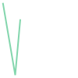
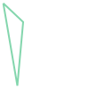
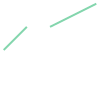
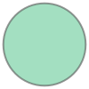

# Representing geodata in vector format

## `shapely`

- `shapely` is used for geometric objects like `Point`, `LineString`, etc.
- basedon `GEOS` C++ library
- used by, eg. `geopandas`

# Create Point Geometries


```python
from shapely import Point

point = Point(2.2, 4.2)
point3D = Point(9.26, -2.456, 0.57)
point
```


    

    


## String representations


```python
print(point3D)
```

    POINT Z (9.26 -2.456 0.57)


```python
point3D
```


    

    


__WKT charachter string__


```python
point.wkt
```


    'POINT (2.2 4.2)'


## Accessing Coordinates


```python
point.coords
```


    <shapely.coords.CoordinateSequence at 0x7fa4a064bda0>


```python
list(point.coords)
```


    [(2.2, 4.2)]


```python
point.x, point.y
```


    (2.2, 4.2)


```python
point.geom_type
```


    'Point'


```python
point3D.z
```


    0.57


# Create LineStrings


```python
from shapely import LineString

point1 = Point(2.2, 4.2)
point2 = Point(7.2, -25.1)
point3 = Point(9.26, -2.456)

line = LineString([point1, point2, point3])
line
```


    

    


```python
line.wkt
```


    'LINESTRING (2.2 4.2, 7.2 -25.1, 9.26 -2.456)'


```python
line.reverse().wkt
```


    'LINESTRING (9.26 -2.456, 7.2 -25.1, 2.2 4.2)'


```python
list(line.coords)
```


    [(2.2, 4.2), (7.2, -25.1), (9.26, -2.456)]


```python
line.xy
```


    (array('d', [2.2, 7.2, 9.26]), array('d', [4.2, -25.1, -2.456]))


```python
line.xy[0]
```


    array('d', [2.2, 7.2, 9.26])


```python
print(list(line.xy[0]))
```

    [2.2, 7.2, 9.26]


```python
print(f"{line.length=:.2f}")
```

    line.length=52.46


```python
print(line.centroid)
```

    POINT (6.229961354035622 -11.892411157572392)


# Create Polygon Geometries


```python
from shapely import Polygon

poly = Polygon([point1, point2, point3])
poly
```


    

    


Coordinates have parentheses because they may have "holes". The one here is the `exterior` of the polygon.


```python
poly.wkt
```


    'POLYGON ((2.2 4.2, 7.2 -25.1, 9.26 -2.456, 2.2 4.2))'


```python
poly.exterior
```


    

    


## Polygon with holes


```python
exterior = [(-180,90), (-180, -90), (180, -90), (180, 90)]
holes_coordinates = [[(-170, 80), (-170, -80), (170, -80), (170, 80)]]

poly_without_hole = Polygon(shell=exterior)
poly_without_hole
```


    

    


```python
poly_with_hole = Polygon(shell=exterior, holes=holes_coordinates)
poly_with_hole
```


    

    


```python
poly_with_hole.wkt
```


    'POLYGON ((-180 90, -180 -90, 180 -90, 180 90, -180 90), (-170 80, -170 -80, 170 -80, 170 80, -170 80))'


```python
print("Polygon centroid: ", poly.centroid)
print("Polygon Area: ", poly.area)
print("Polygon Bounding Box: ", poly.bounds)
print("Polygon Exterior: ", poly.exterior)
print("Polygon Exterior Length: ", poly.exterior.length)
```

    Polygon centroid:  POINT (6.22 -7.785333333333334)
    Polygon Area:  86.789
    Polygon Bounding Box:  (2.2, -25.1, 9.26, 4.2)
    Polygon Exterior:  LINEARRING (2.2 4.2, 7.2 -25.1, 9.26 -2.456, 2.2 4.2)
    Polygon Exterior Length:  62.16395199996553


Lengths and areas are based on lon/lat coordinate system for input. They can be converted to eg., meters.

Mininum and maximum bounding boxes. Useful to select geometries with only two coordinates.


```python
from shapely.geometry import box

min_x, min_y = -180, -90
max_x, max_y = 180, 90 
box_poly = box(minx=min_x, miny=min_y, maxx=max_x, maxy=max_y)
box_poly
```


    

    


```python
box_poly.wkt
```


    'POLYGON ((180 -90, 180 90, -180 90, -180 -90, 180 -90))'


# Multipoint, MultiLineString, MultiPolygon


```python
from shapely import MultiLineString, MultiPoint, MultiPolygon

multipoint = MultiPoint([Point(2, 2), Point(3, 3)])
multipoint
```


    

    


```python
multiline = MultiLineString(
    [LineString([(2, 2), (3, 3)]), LineString([(4, 3), (6, 4)])]
)
multiline
```


    

    


```python
multipoly = MultiPolygon(
    [Polygon([(0, 0), (0, 4), (4, 4)]), Polygon([(6, 6), (6, 12), (12, 12)])]
)
multipoly
```


    

    


```python
point = Point((0, 0))
point.buffer(1)
```


    

    


```python
import geopandas as gpd
data = gpd.read_file("data/wa_crs.gpkg")
data.head()
```


<div>
<style scoped>
    .dataframe tbody tr th:only-of-type {
        vertical-align: middle;
    }

    .dataframe tbody tr th {
        vertical-align: top;
    }

    .dataframe thead th {
        text-align: right;
    }
</style>
<table border="1" class="dataframe">
  <thead>
    <tr style="text-align: right;">
      <th></th>
      <th>FIPS</th>
      <th>TOT_POP</th>
      <th>area_km2</th>
      <th>density</th>
      <th>geometry</th>
    </tr>
  </thead>
  <tbody>
    <tr>
      <th>0</th>
      <td>53061053700</td>
      <td>2821</td>
      <td>3807.184608</td>
      <td>0.740967</td>
      <td>MULTIPOLYGON (((-13483919.86 6105180.541, -134...</td>
    </tr>
    <tr>
      <th>1</th>
      <td>53061053400</td>
      <td>4757</td>
      <td>293.698506</td>
      <td>16.196882</td>
      <td>MULTIPOLYGON (((-13595221.874 6140803.227, -13...</td>
    </tr>
    <tr>
      <th>2</th>
      <td>53061053506</td>
      <td>4987</td>
      <td>583.962356</td>
      <td>8.539934</td>
      <td>MULTIPOLYGON (((-13564549.124 6129594.689, -13...</td>
    </tr>
    <tr>
      <th>3</th>
      <td>53061053302</td>
      <td>4753</td>
      <td>201.313089</td>
      <td>23.609990</td>
      <td>MULTIPOLYGON (((-13609009.572 6156490.378, -13...</td>
    </tr>
    <tr>
      <th>4</th>
      <td>53061053301</td>
      <td>4542</td>
      <td>56.753758</td>
      <td>80.029943</td>
      <td>MULTIPOLYGON (((-13625918.78 6148350.23, -1362...</td>
    </tr>
  </tbody>
</table>
</div>


```python

```
