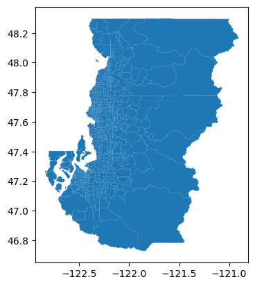
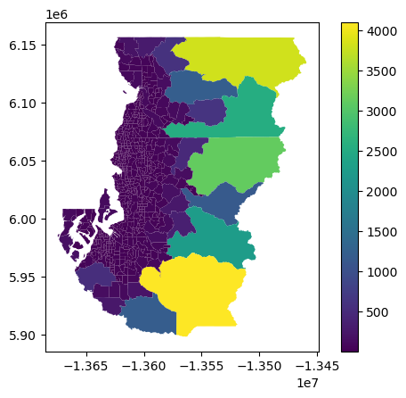
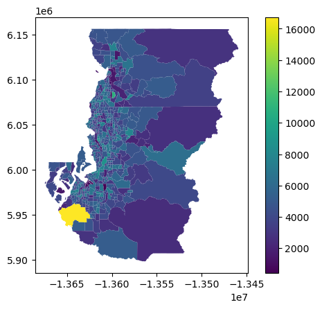
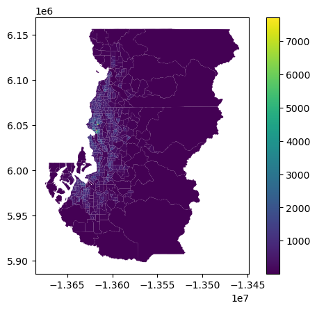
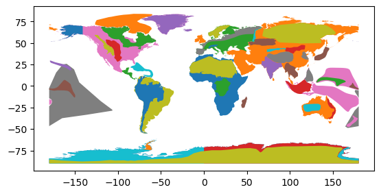
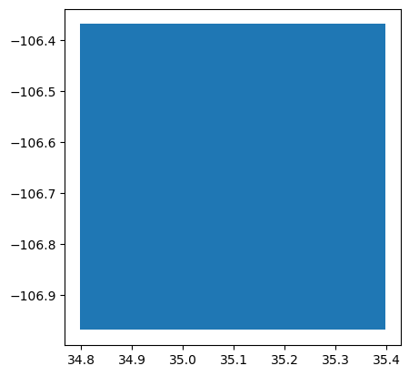

# Geopandas Data Structures

A `GeoDataFrame` is a pandas data frame with at least one dedicated column containing a `GeoSeries`.


```python
from pathlib import Path
data_folder = Path("..", "src", "source", "data")
print(data_folder)
```

    ../src/source/data


```python
fp = data_folder / "austin_pop_2019.gpkg"
print(fp)
```

    ../src/source/data/austin_pop_2019.gpkg


```python
import geopandas as gpd 
```


```python
import geodatasets
```


```python
geodatasets.data
```


        <div>
        <style>
/* CSS stylesheet for displaying geodatasets objects in Jupyter.*/
.xyz-wrap {
    --xyz-border-color: var(--jp-border-color2, #ddd);
    --xyz-font-color2: var(--jp-content-font-color2, rgba(128, 128, 128, 1));
    --xyz-background-color-white: var(--jp-layout-color1, white);
    --xyz-background-color: var(--jp-layout-color2, rgba(128, 128, 128, 0.1));
}

html[theme=dark] .xyz-wrap,
body.vscode-dark .xyz-wrap,
body.vscode-high-contrast .xyz-wrap {
    --xyz-border-color: #222;
    --xyz-font-color2: rgba(255, 255, 255, 0.54);
    --xyz-background-color-white: rgba(255, 255, 255, 1);
    --xyz-background-color: rgba(255, 255, 255, 0.05);

}

.xyz-header {
    padding-top: 6px;
    padding-bottom: 6px;
    margin-bottom: 4px;
    border-bottom: solid 1px var(--xyz-border-color);
}

.xyz-header>div {
    display: inline;
    margin-top: 0;
    margin-bottom: 0;
}

.xyz-obj,
.xyz-name {
    margin-left: 2px;
    margin-right: 10px;
}

.xyz-obj {
    color: var(--xyz-font-color2);
}

.xyz-attrs {
    grid-column: 1 / -1;
}

dl.xyz-attrs {
    padding: 0 5px 0 5px;
    margin: 0;
    display: grid;
    grid-template-columns: 135px auto;
    background-color: var(--xyz-background-color);
}

.xyz-attrs dt,
dd {
    padding: 0;
    margin: 0;
    float: left;
    padding-right: 10px;
    width: auto;
}

.xyz-attrs dt {
    font-weight: normal;
    grid-column: 1;
}

.xyz-attrs dd {
    grid-column: 2;
    white-space: pre-wrap;
    word-break: break-all;
}

.xyz-details ul>li>label>span {
    color: var(--xyz-font-color2);
    padding-left: 10px;
}

.xyz-inside {
    display: none;
}

.xyz-checkbox:checked~.xyz-inside {
    display: contents;
}

.xyz-collapsible li>input {
    display: none;
}

.xyz-collapsible>li>label {
    cursor: pointer;
}

.xyz-collapsible>li>label:hover {
    color: var(--xyz-font-color2);
}

ul.xyz-collapsible {
    list-style: none!important;
    padding-left: 20px!important;
}

.xyz-checkbox+label:before {
    content: '►';
    font-size: 11px;
}

.xyz-checkbox:checked+label:before {
    content: '▼';
}

.xyz-wrap {
    margin-bottom: 10px;
}
</style>
            <div class="xyz-wrap">
                <div class="xyz-header">
                    <div class="xyz-obj">geodatasets.Bunch</div>
                    <div class="xyz-name">5 items</div>
                </div>
                <div class="xyz-details">
                    <ul class="xyz-collapsible">

            <li class="xyz-child">
                <input type="checkbox" id="5bb4c50e-fea6-4e24-8688-2f9abde70eda" class="xyz-checkbox"/>
                <label for="5bb4c50e-fea6-4e24-8688-2f9abde70eda">geoda <span>geodatasets.Bunch</span></label>
                <div class="xyz-inside">

        <div>

            <div class="xyz-wrap">
                <div class="xyz-header">
                    <div class="xyz-obj">geodatasets.Bunch</div>
                    <div class="xyz-name">53 items</div>
                </div>
                <div class="xyz-details">
                    <ul class="xyz-collapsible">

            <li class="xyz-child">
                <input type="checkbox" id="68fc5fd5-fa0e-46d9-bea6-a15b41d2b73d" class="xyz-checkbox"/>
                <label for="68fc5fd5-fa0e-46d9-bea6-a15b41d2b73d">airbnb <span>geodatasets.Dataset</span></label>
                <div class="xyz-inside">

        <div>

            <div class="xyz-wrap">
                <div class="xyz-header">
                    <div class="xyz-obj">geodatasets.Dataset</div>
                    <div class="xyz-name">geoda.airbnb</div>
                </div>
                <div class="xyz-details">
                    <dl class="xyz-attrs">
                        <dt><span>url</span></dt><dd>https://geodacenter.github.io/data-and-lab//data/airbnb.zip</dd><dt><span>license</span></dt><dd>NA</dd><dt><span>attribution</span></dt><dd>Center for Spatial Data Science, University of Chicago</dd><dt><span>description</span></dt><dd>Airbnb rentals, socioeconomics, and crime in Chicago</dd><dt><span>geometry_type</span></dt><dd>Polygon</dd><dt><span>nrows</span></dt><dd>77</dd><dt><span>ncols</span></dt><dd>21</dd><dt><span>details</span></dt><dd>https://geodacenter.github.io/data-and-lab//airbnb/</dd><dt><span>hash</span></dt><dd>a2ab1e3f938226d287dd76cde18c00e2d3a260640dd826da7131827d9e76c824</dd><dt><span>filename</span></dt><dd>airbnb.zip</dd>
                    </dl>
                </div>
            </div>
        </div>

                </div>
            </li>

            <li class="xyz-child">
                <input type="checkbox" id="964ed5b5-60b7-42fc-a6cf-366744279b1b" class="xyz-checkbox"/>
                <label for="964ed5b5-60b7-42fc-a6cf-366744279b1b">atlanta <span>geodatasets.Dataset</span></label>
                <div class="xyz-inside">

        <div>

            <div class="xyz-wrap">
                <div class="xyz-header">
                    <div class="xyz-obj">geodatasets.Dataset</div>
                    <div class="xyz-name">geoda.atlanta</div>
                </div>
                <div class="xyz-details">
                    <dl class="xyz-attrs">
                        <dt><span>url</span></dt><dd>https://geodacenter.github.io/data-and-lab//data/atlanta_hom.zip</dd><dt><span>license</span></dt><dd>NA</dd><dt><span>attribution</span></dt><dd>Center for Spatial Data Science, University of Chicago</dd><dt><span>description</span></dt><dd>Atlanta, GA region homicide counts and rates</dd><dt><span>geometry_type</span></dt><dd>Polygon</dd><dt><span>nrows</span></dt><dd>90</dd><dt><span>ncols</span></dt><dd>24</dd><dt><span>details</span></dt><dd>https://geodacenter.github.io/data-and-lab//atlanta_old/</dd><dt><span>hash</span></dt><dd>a33a76e12168fe84361e60c88a9df4856730487305846c559715c89b1a2b5e09</dd><dt><span>filename</span></dt><dd>atlanta_hom.zip</dd><dt><span>members</span></dt><dd>['atlanta_hom/atl_hom.geojson']</dd>
                    </dl>
                </div>
            </div>
        </div>

                </div>
            </li>

            <li class="xyz-child">
                <input type="checkbox" id="f2c20993-7a03-49c4-9dea-93efdf1a76d5" class="xyz-checkbox"/>
                <label for="f2c20993-7a03-49c4-9dea-93efdf1a76d5">cars <span>geodatasets.Dataset</span></label>
                <div class="xyz-inside">

        <div>

            <div class="xyz-wrap">
                <div class="xyz-header">
                    <div class="xyz-obj">geodatasets.Dataset</div>
                    <div class="xyz-name">geoda.cars</div>
                </div>
                <div class="xyz-details">
                    <dl class="xyz-attrs">
                        <dt><span>url</span></dt><dd>https://geodacenter.github.io/data-and-lab//data/Abandoned_Vehicles_Map.csv</dd><dt><span>license</span></dt><dd>NA</dd><dt><span>attribution</span></dt><dd>Center for Spatial Data Science, University of Chicago</dd><dt><span>description</span></dt><dd>2011 abandoned vehicles in Chicago (311 complaints).</dd><dt><span>geometry_type</span></dt><dd>Point</dd><dt><span>nrows</span></dt><dd>137867</dd><dt><span>ncols</span></dt><dd>21</dd><dt><span>details</span></dt><dd>https://geodacenter.github.io/data-and-lab//1-source-and-description/</dd><dt><span>hash</span></dt><dd>6a0b23bc7eda2dcf1af02d43ccf506b24ca8d8c6dc2fe86a2a1cc051b03aae9e</dd><dt><span>filename</span></dt><dd>Abandoned_Vehicles_Map.csv</dd>
                    </dl>
                </div>
            </div>
        </div>

                </div>
            </li>

            <li class="xyz-child">
                <input type="checkbox" id="f0d512c4-54b9-4c0a-bcc9-d91dfc060cb4" class="xyz-checkbox"/>
                <label for="f0d512c4-54b9-4c0a-bcc9-d91dfc060cb4">charleston1 <span>geodatasets.Dataset</span></label>
                <div class="xyz-inside">

        <div>

            <div class="xyz-wrap">
                <div class="xyz-header">
                    <div class="xyz-obj">geodatasets.Dataset</div>
                    <div class="xyz-name">geoda.charleston1</div>
                </div>
                <div class="xyz-details">
                    <dl class="xyz-attrs">
                        <dt><span>url</span></dt><dd>https://geodacenter.github.io/data-and-lab//data/CharlestonMSA.zip</dd><dt><span>license</span></dt><dd>NA</dd><dt><span>attribution</span></dt><dd>Center for Spatial Data Science, University of Chicago</dd><dt><span>description</span></dt><dd>2000 Census Tract Data for Charleston, SC MSA and counties</dd><dt><span>geometry_type</span></dt><dd>Polygon</dd><dt><span>nrows</span></dt><dd>117</dd><dt><span>ncols</span></dt><dd>31</dd><dt><span>details</span></dt><dd>https://geodacenter.github.io/data-and-lab//charleston-1_old/</dd><dt><span>hash</span></dt><dd>4a4fa9c8dd4231ae0b2f12f24895b8336bcab0c28c48653a967cffe011f63a7c</dd><dt><span>filename</span></dt><dd>CharlestonMSA.zip</dd><dt><span>members</span></dt><dd>['CharlestonMSA/sc_final_census2.gpkg']</dd>
                    </dl>
                </div>
            </div>
        </div>

                </div>
            </li>

            <li class="xyz-child">
                <input type="checkbox" id="99744cfa-df16-4be9-b6e3-ac01daf3aada" class="xyz-checkbox"/>
                <label for="99744cfa-df16-4be9-b6e3-ac01daf3aada">charleston2 <span>geodatasets.Dataset</span></label>
                <div class="xyz-inside">

        <div>

            <div class="xyz-wrap">
                <div class="xyz-header">
                    <div class="xyz-obj">geodatasets.Dataset</div>
                    <div class="xyz-name">geoda.charleston2</div>
                </div>
                <div class="xyz-details">
                    <dl class="xyz-attrs">
                        <dt><span>url</span></dt><dd>https://geodacenter.github.io/data-and-lab//data/CharlestonMSA2.zip</dd><dt><span>license</span></dt><dd>NA</dd><dt><span>attribution</span></dt><dd>Center for Spatial Data Science, University of Chicago</dd><dt><span>description</span></dt><dd>1998 and 2001 Zip Code Business Patterns (Census Bureau) for Charleston, SC MSA</dd><dt><span>geometry_type</span></dt><dd>Polygon</dd><dt><span>nrows</span></dt><dd>42</dd><dt><span>ncols</span></dt><dd>60</dd><dt><span>details</span></dt><dd>https://geodacenter.github.io/data-and-lab//charleston2/</dd><dt><span>hash</span></dt><dd>056d5d6e236b5bd95f5aee26c77bbe7d61bd07db5aaf72866c2f545205c1d8d7</dd><dt><span>filename</span></dt><dd>CharlestonMSA2.zip</dd><dt><span>members</span></dt><dd>['CharlestonMSA2/CharlestonMSA2.gpkg']</dd>
                    </dl>
                </div>
            </div>
        </div>

                </div>
            </li>

            <li class="xyz-child">
                <input type="checkbox" id="f05cd4cc-6dcf-4485-845a-986b0222175f" class="xyz-checkbox"/>
                <label for="f05cd4cc-6dcf-4485-845a-986b0222175f">chicago_health <span>geodatasets.Dataset</span></label>
                <div class="xyz-inside">

        <div>

            <div class="xyz-wrap">
                <div class="xyz-header">
                    <div class="xyz-obj">geodatasets.Dataset</div>
                    <div class="xyz-name">geoda.chicago_health</div>
                </div>
                <div class="xyz-details">
                    <dl class="xyz-attrs">
                        <dt><span>url</span></dt><dd>https://geodacenter.github.io/data-and-lab//data/comarea.zip</dd><dt><span>license</span></dt><dd>NA</dd><dt><span>attribution</span></dt><dd>Center for Spatial Data Science, University of Chicago</dd><dt><span>description</span></dt><dd>Chicago Health + Socio-Economics</dd><dt><span>geometry_type</span></dt><dd>Polygon</dd><dt><span>nrows</span></dt><dd>77</dd><dt><span>ncols</span></dt><dd>87</dd><dt><span>details</span></dt><dd>https://geodacenter.github.io/data-and-lab//comarea_vars/</dd><dt><span>hash</span></dt><dd>4e872adb552786eae2fcd745524696e5e4cd33cc9a6c032471c0e75328871401</dd><dt><span>filename</span></dt><dd>comarea.zip</dd>
                    </dl>
                </div>
            </div>
        </div>

                </div>
            </li>

            <li class="xyz-child">
                <input type="checkbox" id="5f76cfee-57d1-4a0b-a1fc-1420da58ebe4" class="xyz-checkbox"/>
                <label for="5f76cfee-57d1-4a0b-a1fc-1420da58ebe4">chicago_commpop <span>geodatasets.Dataset</span></label>
                <div class="xyz-inside">

        <div>

            <div class="xyz-wrap">
                <div class="xyz-header">
                    <div class="xyz-obj">geodatasets.Dataset</div>
                    <div class="xyz-name">geoda.chicago_commpop</div>
                </div>
                <div class="xyz-details">
                    <dl class="xyz-attrs">
                        <dt><span>url</span></dt><dd>https://geodacenter.github.io/data-and-lab//data/chicago_commpop.zip</dd><dt><span>license</span></dt><dd>NA</dd><dt><span>attribution</span></dt><dd>Center for Spatial Data Science, University of Chicago</dd><dt><span>description</span></dt><dd>Chicago Community Area Population Percent Change for 2000 and 2010</dd><dt><span>geometry_type</span></dt><dd>Polygon</dd><dt><span>nrows</span></dt><dd>77</dd><dt><span>ncols</span></dt><dd>9</dd><dt><span>details</span></dt><dd>https://geodacenter.github.io/data-and-lab//commpop/</dd><dt><span>hash</span></dt><dd>1dbebb50c8ea47e2279ea819ef64ba793bdee2b88e4716bd6c6ec0e0d8e0e05b</dd><dt><span>filename</span></dt><dd>chicago_commpop.zip</dd><dt><span>members</span></dt><dd>['chicago_commpop/chicago_commpop.geojson']</dd>
                    </dl>
                </div>
            </div>
        </div>

                </div>
            </li>

            <li class="xyz-child">
                <input type="checkbox" id="3f5b9459-dfcf-49f4-9b85-8b38244724ad" class="xyz-checkbox"/>
                <label for="3f5b9459-dfcf-49f4-9b85-8b38244724ad">chile_labor <span>geodatasets.Dataset</span></label>
                <div class="xyz-inside">

        <div>

            <div class="xyz-wrap">
                <div class="xyz-header">
                    <div class="xyz-obj">geodatasets.Dataset</div>
                    <div class="xyz-name">geoda.chile_labor</div>
                </div>
                <div class="xyz-details">
                    <dl class="xyz-attrs">
                        <dt><span>url</span></dt><dd>https://geodacenter.github.io/data-and-lab//data/flma.zip</dd><dt><span>license</span></dt><dd>NA</dd><dt><span>attribution</span></dt><dd>Center for Spatial Data Science, University of Chicago</dd><dt><span>description</span></dt><dd>Labor Markets in Chile (1982-2002)</dd><dt><span>geometry_type</span></dt><dd>Polygon</dd><dt><span>nrows</span></dt><dd>64</dd><dt><span>ncols</span></dt><dd>140</dd><dt><span>details</span></dt><dd>https://geodacenter.github.io/data-and-lab//FLMA/</dd><dt><span>hash</span></dt><dd>4777072268d0127b3d0be774f51d0f66c15885e9d3c92bc72c641a72f220796c</dd><dt><span>filename</span></dt><dd>flma.zip</dd><dt><span>members</span></dt><dd>['flma/FLMA.geojson']</dd>
                    </dl>
                </div>
            </div>
        </div>

                </div>
            </li>

            <li class="xyz-child">
                <input type="checkbox" id="301acefa-a87a-4d4c-84d0-44765029c317" class="xyz-checkbox"/>
                <label for="301acefa-a87a-4d4c-84d0-44765029c317">cincinnati <span>geodatasets.Dataset</span></label>
                <div class="xyz-inside">

        <div>

            <div class="xyz-wrap">
                <div class="xyz-header">
                    <div class="xyz-obj">geodatasets.Dataset</div>
                    <div class="xyz-name">geoda.cincinnati</div>
                </div>
                <div class="xyz-details">
                    <dl class="xyz-attrs">
                        <dt><span>url</span></dt><dd>https://geodacenter.github.io/data-and-lab//data/walnuthills_updated.zip</dd><dt><span>license</span></dt><dd>NA</dd><dt><span>attribution</span></dt><dd>Center for Spatial Data Science, University of Chicago</dd><dt><span>description</span></dt><dd>2008 Cincinnati Crime + Socio-Demographics</dd><dt><span>geometry_type</span></dt><dd>Polygon</dd><dt><span>nrows</span></dt><dd>457</dd><dt><span>ncols</span></dt><dd>73</dd><dt><span>details</span></dt><dd>https://geodacenter.github.io/data-and-lab//walnut_hills/</dd><dt><span>hash</span></dt><dd>d6871dd688bd14cf4710a218d721d34f6574456f2a14d5c5cfe5a92054ee9763</dd><dt><span>filename</span></dt><dd>walnuthills_updated.zip</dd><dt><span>members</span></dt><dd>['walnuthills_updated']</dd>
                    </dl>
                </div>
            </div>
        </div>

                </div>
            </li>

            <li class="xyz-child">
                <input type="checkbox" id="13933a82-5505-4c0a-91bc-babc171a14d1" class="xyz-checkbox"/>
                <label for="13933a82-5505-4c0a-91bc-babc171a14d1">cleveland <span>geodatasets.Dataset</span></label>
                <div class="xyz-inside">

        <div>

            <div class="xyz-wrap">
                <div class="xyz-header">
                    <div class="xyz-obj">geodatasets.Dataset</div>
                    <div class="xyz-name">geoda.cleveland</div>
                </div>
                <div class="xyz-details">
                    <dl class="xyz-attrs">
                        <dt><span>url</span></dt><dd>https://geodacenter.github.io/data-and-lab//data/cleveland.zip</dd><dt><span>license</span></dt><dd>NA</dd><dt><span>attribution</span></dt><dd>Center for Spatial Data Science, University of Chicago</dd><dt><span>description</span></dt><dd>2015 sales prices of homes in Cleveland, OH.</dd><dt><span>geometry_type</span></dt><dd>Point</dd><dt><span>nrows</span></dt><dd>205</dd><dt><span>ncols</span></dt><dd>10</dd><dt><span>details</span></dt><dd>https://geodacenter.github.io/data-and-lab//clev_sls_154_core/</dd><dt><span>hash</span></dt><dd>49aeba03eb06bf9b0d9cddd6507eb4a226b7c7a7561145562885c5cddfaeaadf</dd><dt><span>filename</span></dt><dd>cleveland.zip</dd>
                    </dl>
                </div>
            </div>
        </div>

                </div>
            </li>

            <li class="xyz-child">
                <input type="checkbox" id="22fcff3d-08e1-4967-b860-b9bbe54fc85b" class="xyz-checkbox"/>
                <label for="22fcff3d-08e1-4967-b860-b9bbe54fc85b">grid100 <span>geodatasets.Dataset</span></label>
                <div class="xyz-inside">

        <div>

            <div class="xyz-wrap">
                <div class="xyz-header">
                    <div class="xyz-obj">geodatasets.Dataset</div>
                    <div class="xyz-name">geoda.grid100</div>
                </div>
                <div class="xyz-details">
                    <dl class="xyz-attrs">
                        <dt><span>url</span></dt><dd>https://geodacenter.github.io/data-and-lab//data/grid100.zip</dd><dt><span>license</span></dt><dd>NA</dd><dt><span>attribution</span></dt><dd>Center for Spatial Data Science, University of Chicago</dd><dt><span>description</span></dt><dd>Grid with simulated variables</dd><dt><span>geometry_type</span></dt><dd>Polygon</dd><dt><span>nrows</span></dt><dd>100</dd><dt><span>ncols</span></dt><dd>37</dd><dt><span>details</span></dt><dd>https://geodacenter.github.io/data-and-lab//grid100/</dd><dt><span>hash</span></dt><dd>5702ba39606044f71d53ae6a83758b81332bd3aa216b7b7b6e1c60dd0e72f476</dd><dt><span>filename</span></dt><dd>grid100.zip</dd><dt><span>members</span></dt><dd>['grid100/grid100s.gpkg']</dd>
                    </dl>
                </div>
            </div>
        </div>

                </div>
            </li>

            <li class="xyz-child">
                <input type="checkbox" id="b9f02850-2aff-471d-b5e9-90e5bc05dc14" class="xyz-checkbox"/>
                <label for="b9f02850-2aff-471d-b5e9-90e5bc05dc14">groceries <span>geodatasets.Dataset</span></label>
                <div class="xyz-inside">

        <div>

            <div class="xyz-wrap">
                <div class="xyz-header">
                    <div class="xyz-obj">geodatasets.Dataset</div>
                    <div class="xyz-name">geoda.groceries</div>
                </div>
                <div class="xyz-details">
                    <dl class="xyz-attrs">
                        <dt><span>url</span></dt><dd>https://geodacenter.github.io/data-and-lab//data/grocery.zip</dd><dt><span>license</span></dt><dd>NA</dd><dt><span>attribution</span></dt><dd>Center for Spatial Data Science, University of Chicago</dd><dt><span>description</span></dt><dd>2015 Chicago supermarkets</dd><dt><span>geometry_type</span></dt><dd>Point</dd><dt><span>nrows</span></dt><dd>148</dd><dt><span>ncols</span></dt><dd>8</dd><dt><span>details</span></dt><dd>https://geodacenter.github.io/data-and-lab//chicago_sup_vars/</dd><dt><span>hash</span></dt><dd>ead10e53b21efcaa29b798428b93ba2a1c0ba1b28f046265c1737712fa83f88a</dd><dt><span>filename</span></dt><dd>grocery.zip</dd><dt><span>members</span></dt><dd>['grocery/chicago_sup.shp', 'grocery/chicago_sup.dbf', 'grocery/chicago_sup.shx', 'grocery/chicago_sup.prj']</dd>
                    </dl>
                </div>
            </div>
        </div>

                </div>
            </li>

            <li class="xyz-child">
                <input type="checkbox" id="31922638-af8d-4cd5-8168-77cd155a7263" class="xyz-checkbox"/>
                <label for="31922638-af8d-4cd5-8168-77cd155a7263">guerry <span>geodatasets.Dataset</span></label>
                <div class="xyz-inside">

        <div>

            <div class="xyz-wrap">
                <div class="xyz-header">
                    <div class="xyz-obj">geodatasets.Dataset</div>
                    <div class="xyz-name">geoda.guerry</div>
                </div>
                <div class="xyz-details">
                    <dl class="xyz-attrs">
                        <dt><span>url</span></dt><dd>https://geodacenter.github.io/data-and-lab//data/guerry.zip</dd><dt><span>license</span></dt><dd>NA</dd><dt><span>attribution</span></dt><dd>Center for Spatial Data Science, University of Chicago</dd><dt><span>description</span></dt><dd>Mortal statistics of France (Guerry, 1833)</dd><dt><span>geometry_type</span></dt><dd>Polygon</dd><dt><span>nrows</span></dt><dd>85</dd><dt><span>ncols</span></dt><dd>24</dd><dt><span>details</span></dt><dd>https://geodacenter.github.io/data-and-lab//Guerry/</dd><dt><span>hash</span></dt><dd>80d2b355ad3340fcffa0a28e5cec0698af01067f8059b1a60388d200a653b3e8</dd><dt><span>filename</span></dt><dd>guerry.zip</dd><dt><span>members</span></dt><dd>['guerry/guerry.shp', 'guerry/guerry.dbf', 'guerry/guerry.shx', 'guerry/guerry.prj']</dd>
                    </dl>
                </div>
            </div>
        </div>

                </div>
            </li>

            <li class="xyz-child">
                <input type="checkbox" id="5773b0c5-2ba7-4b13-8c7b-8cd9b930ed96" class="xyz-checkbox"/>
                <label for="5773b0c5-2ba7-4b13-8c7b-8cd9b930ed96">health <span>geodatasets.Dataset</span></label>
                <div class="xyz-inside">

        <div>

            <div class="xyz-wrap">
                <div class="xyz-header">
                    <div class="xyz-obj">geodatasets.Dataset</div>
                    <div class="xyz-name">geoda.health</div>
                </div>
                <div class="xyz-details">
                    <dl class="xyz-attrs">
                        <dt><span>url</span></dt><dd>https://geodacenter.github.io/data-and-lab//data/income_diversity.zip</dd><dt><span>license</span></dt><dd>NA</dd><dt><span>attribution</span></dt><dd>Center for Spatial Data Science, University of Chicago</dd><dt><span>description</span></dt><dd>2000 Health, Income + Diversity</dd><dt><span>geometry_type</span></dt><dd>Polygon</dd><dt><span>nrows</span></dt><dd>3984</dd><dt><span>ncols</span></dt><dd>65</dd><dt><span>details</span></dt><dd>https://geodacenter.github.io/data-and-lab//co_income_diversity_variables/</dd><dt><span>hash</span></dt><dd>eafee1063040258bc080e7b501bdf1438d6e45ba208954d8c2e1a7562142d0a7</dd><dt><span>filename</span></dt><dd>income_diversity.zip</dd><dt><span>members</span></dt><dd>['income_diversity/income_diversity.shp', 'income_diversity/income_diversity.dbf', 'income_diversity/income_diversity.shx', 'income_diversity/income_diversity.prj']</dd>
                    </dl>
                </div>
            </div>
        </div>

                </div>
            </li>

            <li class="xyz-child">
                <input type="checkbox" id="7e5ca6ff-d322-4d61-80d7-3fe2893f90f8" class="xyz-checkbox"/>
                <label for="7e5ca6ff-d322-4d61-80d7-3fe2893f90f8">health_indicators <span>geodatasets.Dataset</span></label>
                <div class="xyz-inside">

        <div>

            <div class="xyz-wrap">
                <div class="xyz-header">
                    <div class="xyz-obj">geodatasets.Dataset</div>
                    <div class="xyz-name">geoda.health_indicators</div>
                </div>
                <div class="xyz-details">
                    <dl class="xyz-attrs">
                        <dt><span>url</span></dt><dd>https://geodacenter.github.io/data-and-lab//data/healthIndicators.zip</dd><dt><span>license</span></dt><dd>NA</dd><dt><span>attribution</span></dt><dd>Center for Spatial Data Science, University of Chicago</dd><dt><span>description</span></dt><dd>Chicago Health Indicators (2005-11)</dd><dt><span>geometry_type</span></dt><dd>Polygon</dd><dt><span>nrows</span></dt><dd>77</dd><dt><span>ncols</span></dt><dd>32</dd><dt><span>details</span></dt><dd>https://geodacenter.github.io/data-and-lab//healthindicators-variables/</dd><dt><span>hash</span></dt><dd>b43683245f8fc3b4ab69ffa75d2064920a1a91dc76b9dcc08e288765ba0c94f3</dd><dt><span>filename</span></dt><dd>healthIndicators.zip</dd>
                    </dl>
                </div>
            </div>
        </div>

                </div>
            </li>

            <li class="xyz-child">
                <input type="checkbox" id="bc21d707-d91e-45fc-aa39-b27a07d943e9" class="xyz-checkbox"/>
                <label for="bc21d707-d91e-45fc-aa39-b27a07d943e9">hickory1 <span>geodatasets.Dataset</span></label>
                <div class="xyz-inside">

        <div>

            <div class="xyz-wrap">
                <div class="xyz-header">
                    <div class="xyz-obj">geodatasets.Dataset</div>
                    <div class="xyz-name">geoda.hickory1</div>
                </div>
                <div class="xyz-details">
                    <dl class="xyz-attrs">
                        <dt><span>url</span></dt><dd>https://geodacenter.github.io/data-and-lab//data/HickoryMSA.zip</dd><dt><span>license</span></dt><dd>NA</dd><dt><span>attribution</span></dt><dd>Center for Spatial Data Science, University of Chicago</dd><dt><span>description</span></dt><dd>2000 Census Tract Data for Hickory, NC MSA and counties</dd><dt><span>geometry_type</span></dt><dd>Polygon</dd><dt><span>nrows</span></dt><dd>68</dd><dt><span>ncols</span></dt><dd>31</dd><dt><span>details</span></dt><dd>https://geodacenter.github.io/data-and-lab//hickory1/</dd><dt><span>hash</span></dt><dd>4c0804608d303e6e44d51966bb8927b1f5f9e060a9b91055a66478b9039d2b44</dd><dt><span>filename</span></dt><dd>HickoryMSA.zip</dd><dt><span>members</span></dt><dd>['HickoryMSA/nc_final_census2.geojson']</dd>
                    </dl>
                </div>
            </div>
        </div>

                </div>
            </li>

            <li class="xyz-child">
                <input type="checkbox" id="fc0ee77d-eb17-4752-9f6c-36ae140cbc45" class="xyz-checkbox"/>
                <label for="fc0ee77d-eb17-4752-9f6c-36ae140cbc45">hickory2 <span>geodatasets.Dataset</span></label>
                <div class="xyz-inside">

        <div>

            <div class="xyz-wrap">
                <div class="xyz-header">
                    <div class="xyz-obj">geodatasets.Dataset</div>
                    <div class="xyz-name">geoda.hickory2</div>
                </div>
                <div class="xyz-details">
                    <dl class="xyz-attrs">
                        <dt><span>url</span></dt><dd>https://geodacenter.github.io/data-and-lab//data/HickoryMSA2.zip</dd><dt><span>license</span></dt><dd>NA</dd><dt><span>attribution</span></dt><dd>Center for Spatial Data Science, University of Chicago</dd><dt><span>description</span></dt><dd>1998 and 2001 Zip Code Business Patterns (Census Bureau) for Hickory, NC MSA</dd><dt><span>geometry_type</span></dt><dd>Polygon</dd><dt><span>nrows</span></dt><dd>29</dd><dt><span>ncols</span></dt><dd>56</dd><dt><span>details</span></dt><dd>https://geodacenter.github.io/data-and-lab//hickory2/</dd><dt><span>hash</span></dt><dd>5e9498e1ff036297c3eea3cc42ac31501680a43b50c71b486799ef9021679d07</dd><dt><span>filename</span></dt><dd>HickoryMSA2.zip</dd><dt><span>members</span></dt><dd>['HickoryMSA2/HickoryMSA2.geojson']</dd>
                    </dl>
                </div>
            </div>
        </div>

                </div>
            </li>

            <li class="xyz-child">
                <input type="checkbox" id="8eee68b4-5365-4816-ad3c-4e8771622639" class="xyz-checkbox"/>
                <label for="8eee68b4-5365-4816-ad3c-4e8771622639">home_sales <span>geodatasets.Dataset</span></label>
                <div class="xyz-inside">

        <div>

            <div class="xyz-wrap">
                <div class="xyz-header">
                    <div class="xyz-obj">geodatasets.Dataset</div>
                    <div class="xyz-name">geoda.home_sales</div>
                </div>
                <div class="xyz-details">
                    <dl class="xyz-attrs">
                        <dt><span>url</span></dt><dd>https://geodacenter.github.io/data-and-lab//data/kingcounty.zip</dd><dt><span>license</span></dt><dd>NA</dd><dt><span>attribution</span></dt><dd>Center for Spatial Data Science, University of Chicago</dd><dt><span>description</span></dt><dd>2014-15 Home Sales in King County, WA</dd><dt><span>geometry_type</span></dt><dd>Point</dd><dt><span>nrows</span></dt><dd>21613</dd><dt><span>ncols</span></dt><dd>22</dd><dt><span>details</span></dt><dd>https://geodacenter.github.io/data-and-lab//KingCounty-HouseSales2015/</dd><dt><span>hash</span></dt><dd>b979f0eb2cef6ebd2c761d552821353f795635eb8db53a95f2815fc46e1f644c</dd><dt><span>filename</span></dt><dd>kingcounty.zip</dd><dt><span>members</span></dt><dd>['kingcounty/kc_house.shp', 'kingcounty/kc_house.dbf', 'kingcounty/kc_house.shx', 'kingcounty/kc_house.prj']</dd>
                    </dl>
                </div>
            </div>
        </div>

                </div>
            </li>

            <li class="xyz-child">
                <input type="checkbox" id="590ecb4e-7cc0-4328-8a1d-aae3a9c55df6" class="xyz-checkbox"/>
                <label for="590ecb4e-7cc0-4328-8a1d-aae3a9c55df6">houston <span>geodatasets.Dataset</span></label>
                <div class="xyz-inside">

        <div>

            <div class="xyz-wrap">
                <div class="xyz-header">
                    <div class="xyz-obj">geodatasets.Dataset</div>
                    <div class="xyz-name">geoda.houston</div>
                </div>
                <div class="xyz-details">
                    <dl class="xyz-attrs">
                        <dt><span>url</span></dt><dd>https://geodacenter.github.io/data-and-lab//data/houston_hom.zip</dd><dt><span>license</span></dt><dd>NA</dd><dt><span>attribution</span></dt><dd>Center for Spatial Data Science, University of Chicago</dd><dt><span>description</span></dt><dd>Houston, TX region homicide counts and rates</dd><dt><span>geometry_type</span></dt><dd>Polygon</dd><dt><span>nrows</span></dt><dd>52</dd><dt><span>ncols</span></dt><dd>24</dd><dt><span>details</span></dt><dd>https://geodacenter.github.io/data-and-lab//houston/</dd><dt><span>hash</span></dt><dd>d3167fd150a1369d9a32b892d3b2a8747043d3d382c3dd81e51f696b191d0d15</dd><dt><span>filename</span></dt><dd>houston_hom.zip</dd><dt><span>members</span></dt><dd>['houston_hom/hou_hom.geojson']</dd>
                    </dl>
                </div>
            </div>
        </div>

                </div>
            </li>

            <li class="xyz-child">
                <input type="checkbox" id="78633769-a1fe-460d-b739-75142c8057ef" class="xyz-checkbox"/>
                <label for="78633769-a1fe-460d-b739-75142c8057ef">juvenile <span>geodatasets.Dataset</span></label>
                <div class="xyz-inside">

        <div>

            <div class="xyz-wrap">
                <div class="xyz-header">
                    <div class="xyz-obj">geodatasets.Dataset</div>
                    <div class="xyz-name">geoda.juvenile</div>
                </div>
                <div class="xyz-details">
                    <dl class="xyz-attrs">
                        <dt><span>url</span></dt><dd>https://geodacenter.github.io/data-and-lab//data/juvenile.zip</dd><dt><span>license</span></dt><dd>NA</dd><dt><span>attribution</span></dt><dd>Center for Spatial Data Science, University of Chicago</dd><dt><span>description</span></dt><dd>Cardiff juvenile delinquent residences</dd><dt><span>geometry_type</span></dt><dd>Point</dd><dt><span>nrows</span></dt><dd>168</dd><dt><span>ncols</span></dt><dd>4</dd><dt><span>details</span></dt><dd>https://geodacenter.github.io/data-and-lab//juvenile/</dd><dt><span>hash</span></dt><dd>811cfcfa613578214d907bfbdd396c6e02261e5cda6d56b25a6f961148de961c</dd><dt><span>filename</span></dt><dd>juvenile.zip</dd><dt><span>members</span></dt><dd>['juvenile/juvenile.shp', 'juvenile/juvenile.shx', 'juvenile/juvenile.dbf']</dd>
                    </dl>
                </div>
            </div>
        </div>

                </div>
            </li>

            <li class="xyz-child">
                <input type="checkbox" id="261bd866-d869-4dbd-b9d0-0465942ac76f" class="xyz-checkbox"/>
                <label for="261bd866-d869-4dbd-b9d0-0465942ac76f">lansing1 <span>geodatasets.Dataset</span></label>
                <div class="xyz-inside">

        <div>

            <div class="xyz-wrap">
                <div class="xyz-header">
                    <div class="xyz-obj">geodatasets.Dataset</div>
                    <div class="xyz-name">geoda.lansing1</div>
                </div>
                <div class="xyz-details">
                    <dl class="xyz-attrs">
                        <dt><span>url</span></dt><dd>https://geodacenter.github.io/data-and-lab//data/LansingMSA.zip</dd><dt><span>license</span></dt><dd>NA</dd><dt><span>attribution</span></dt><dd>Center for Spatial Data Science, University of Chicago</dd><dt><span>description</span></dt><dd>2000 Census Tract Data for Lansing, MI MSA and counties</dd><dt><span>geometry_type</span></dt><dd>Polygon</dd><dt><span>nrows</span></dt><dd>117</dd><dt><span>ncols</span></dt><dd>31</dd><dt><span>details</span></dt><dd>https://geodacenter.github.io/data-and-lab//lansing1/</dd><dt><span>hash</span></dt><dd>724ce3d889fa50e7632d16200cf588d40168d49adaf5bca45049dc1b3758bde1</dd><dt><span>filename</span></dt><dd>LansingMSA.zip</dd><dt><span>members</span></dt><dd>['LansingMSA/mi_final_census2.geojson']</dd>
                    </dl>
                </div>
            </div>
        </div>

                </div>
            </li>

            <li class="xyz-child">
                <input type="checkbox" id="af6a774b-5652-4b70-b8fb-e4f5ac392cb4" class="xyz-checkbox"/>
                <label for="af6a774b-5652-4b70-b8fb-e4f5ac392cb4">lansing2 <span>geodatasets.Dataset</span></label>
                <div class="xyz-inside">

        <div>

            <div class="xyz-wrap">
                <div class="xyz-header">
                    <div class="xyz-obj">geodatasets.Dataset</div>
                    <div class="xyz-name">geoda.lansing2</div>
                </div>
                <div class="xyz-details">
                    <dl class="xyz-attrs">
                        <dt><span>url</span></dt><dd>https://geodacenter.github.io/data-and-lab//data/LansingMSA2.zip</dd><dt><span>license</span></dt><dd>NA</dd><dt><span>attribution</span></dt><dd>Center for Spatial Data Science, University of Chicago</dd><dt><span>description</span></dt><dd>1998 and 2001 Zip Code Business Patterns (Census Bureau) for Lansing, MI MSA</dd><dt><span>geometry_type</span></dt><dd>Polygon</dd><dt><span>nrows</span></dt><dd>46</dd><dt><span>ncols</span></dt><dd>56</dd><dt><span>details</span></dt><dd>https://geodacenter.github.io/data-and-lab//lansing2/</dd><dt><span>hash</span></dt><dd>7657c05d3bd6090c4d5914cfe5aaf01f694601c1e0c29bc3ecbe9bc523662303</dd><dt><span>filename</span></dt><dd>LansingMSA2.zip</dd><dt><span>members</span></dt><dd>['LansingMSA2/LansingMSA2.geojson']</dd>
                    </dl>
                </div>
            </div>
        </div>

                </div>
            </li>

            <li class="xyz-child">
                <input type="checkbox" id="429538a0-e8d6-447f-a1f5-9fbb8e4740ba" class="xyz-checkbox"/>
                <label for="429538a0-e8d6-447f-a1f5-9fbb8e4740ba">lasrosas <span>geodatasets.Dataset</span></label>
                <div class="xyz-inside">

        <div>

            <div class="xyz-wrap">
                <div class="xyz-header">
                    <div class="xyz-obj">geodatasets.Dataset</div>
                    <div class="xyz-name">geoda.lasrosas</div>
                </div>
                <div class="xyz-details">
                    <dl class="xyz-attrs">
                        <dt><span>url</span></dt><dd>https://geodacenter.github.io/data-and-lab//data/lasrosas.zip</dd><dt><span>license</span></dt><dd>NA</dd><dt><span>attribution</span></dt><dd>Center for Spatial Data Science, University of Chicago</dd><dt><span>description</span></dt><dd>Corn yield, fertilizer and field data for precision agriculture, Argentina, 1999</dd><dt><span>geometry_type</span></dt><dd>Polygon</dd><dt><span>nrows</span></dt><dd>1738</dd><dt><span>ncols</span></dt><dd>35</dd><dt><span>details</span></dt><dd>https://geodacenter.github.io/data-and-lab//lasrosas/</dd><dt><span>hash</span></dt><dd>038d0e82203f2875b50499dbd8498ca9c762ebd8003b2f2203ebc6acada8f8fd</dd><dt><span>filename</span></dt><dd>lasrosas.zip</dd><dt><span>members</span></dt><dd>['lasrosas/rosas1999.gpkg']</dd>
                    </dl>
                </div>
            </div>
        </div>

                </div>
            </li>

            <li class="xyz-child">
                <input type="checkbox" id="18819228-c0fb-466f-9a18-e3055051f3e1" class="xyz-checkbox"/>
                <label for="18819228-c0fb-466f-9a18-e3055051f3e1">liquor_stores <span>geodatasets.Dataset</span></label>
                <div class="xyz-inside">

        <div>

            <div class="xyz-wrap">
                <div class="xyz-header">
                    <div class="xyz-obj">geodatasets.Dataset</div>
                    <div class="xyz-name">geoda.liquor_stores</div>
                </div>
                <div class="xyz-details">
                    <dl class="xyz-attrs">
                        <dt><span>url</span></dt><dd>https://geodacenter.github.io/data-and-lab//data/liquor.zip</dd><dt><span>license</span></dt><dd>NA</dd><dt><span>attribution</span></dt><dd>Center for Spatial Data Science, University of Chicago</dd><dt><span>description</span></dt><dd>2015 Chicago Liquor Stores</dd><dt><span>geometry_type</span></dt><dd>Point</dd><dt><span>nrows</span></dt><dd>571</dd><dt><span>ncols</span></dt><dd>3</dd><dt><span>details</span></dt><dd>https://geodacenter.github.io/data-and-lab//liq_chicago/</dd><dt><span>hash</span></dt><dd>6a483a6a7066a000bc97bfe71596cf28834d3088fbc958455b903a0938b3b530</dd><dt><span>filename</span></dt><dd>liquor.zip</dd><dt><span>members</span></dt><dd>['liq_Chicago.shp', 'liq_Chicago.dbf', 'liq_Chicago.shx', 'liq_Chicago.prj']</dd>
                    </dl>
                </div>
            </div>
        </div>

                </div>
            </li>

            <li class="xyz-child">
                <input type="checkbox" id="d94e3440-d701-4975-8e22-556a514d59d1" class="xyz-checkbox"/>
                <label for="d94e3440-d701-4975-8e22-556a514d59d1">malaria <span>geodatasets.Dataset</span></label>
                <div class="xyz-inside">

        <div>

            <div class="xyz-wrap">
                <div class="xyz-header">
                    <div class="xyz-obj">geodatasets.Dataset</div>
                    <div class="xyz-name">geoda.malaria</div>
                </div>
                <div class="xyz-details">
                    <dl class="xyz-attrs">
                        <dt><span>url</span></dt><dd>https://geodacenter.github.io/data-and-lab//data/malariacolomb.zip</dd><dt><span>license</span></dt><dd>NA</dd><dt><span>attribution</span></dt><dd>Center for Spatial Data Science, University of Chicago</dd><dt><span>description</span></dt><dd>Malaria incidence and population (1973, 95, 93 censuses and projections until 2005)</dd><dt><span>geometry_type</span></dt><dd>Polygon</dd><dt><span>nrows</span></dt><dd>1068</dd><dt><span>ncols</span></dt><dd>51</dd><dt><span>details</span></dt><dd>https://geodacenter.github.io/data-and-lab//colomb_malaria/</dd><dt><span>hash</span></dt><dd>ca77477656829833a4e3e384b02439632fa28bb577610fe5aef9e0b094c41a95</dd><dt><span>filename</span></dt><dd>malariacolomb.zip</dd><dt><span>members</span></dt><dd>['malariacolomb/colmunic.gpkg']</dd>
                    </dl>
                </div>
            </div>
        </div>

                </div>
            </li>

            <li class="xyz-child">
                <input type="checkbox" id="bdc664df-3114-4e1b-925b-a4406ed540e2" class="xyz-checkbox"/>
                <label for="bdc664df-3114-4e1b-925b-a4406ed540e2">milwaukee1 <span>geodatasets.Dataset</span></label>
                <div class="xyz-inside">

        <div>

            <div class="xyz-wrap">
                <div class="xyz-header">
                    <div class="xyz-obj">geodatasets.Dataset</div>
                    <div class="xyz-name">geoda.milwaukee1</div>
                </div>
                <div class="xyz-details">
                    <dl class="xyz-attrs">
                        <dt><span>url</span></dt><dd>https://geodacenter.github.io/data-and-lab//data/MilwaukeeMSA.zip</dd><dt><span>license</span></dt><dd>NA</dd><dt><span>attribution</span></dt><dd>Center for Spatial Data Science, University of Chicago</dd><dt><span>description</span></dt><dd>2000 Census Tract Data for Milwaukee, WI MSA</dd><dt><span>geometry_type</span></dt><dd>Polygon</dd><dt><span>nrows</span></dt><dd>417</dd><dt><span>ncols</span></dt><dd>35</dd><dt><span>details</span></dt><dd>https://geodacenter.github.io/data-and-lab//milwaukee1/</dd><dt><span>hash</span></dt><dd>bf3c9617c872db26ea56f20e82a449f18bb04d8fb76a653a2d3842d465bc122c</dd><dt><span>filename</span></dt><dd>MilwaukeeMSA.zip</dd><dt><span>members</span></dt><dd>['MilwaukeeMSA/wi_final_census2_random4.gpkg']</dd>
                    </dl>
                </div>
            </div>
        </div>

                </div>
            </li>

            <li class="xyz-child">
                <input type="checkbox" id="da5cf80e-41f5-4ff4-9215-af5dd682d467" class="xyz-checkbox"/>
                <label for="da5cf80e-41f5-4ff4-9215-af5dd682d467">milwaukee2 <span>geodatasets.Dataset</span></label>
                <div class="xyz-inside">

        <div>

            <div class="xyz-wrap">
                <div class="xyz-header">
                    <div class="xyz-obj">geodatasets.Dataset</div>
                    <div class="xyz-name">geoda.milwaukee2</div>
                </div>
                <div class="xyz-details">
                    <dl class="xyz-attrs">
                        <dt><span>url</span></dt><dd>https://geodacenter.github.io/data-and-lab//data/MilwaukeeMSA2.zip</dd><dt><span>license</span></dt><dd>NA</dd><dt><span>attribution</span></dt><dd>Center for Spatial Data Science, University of Chicago</dd><dt><span>description</span></dt><dd>1998 and 2001 Zip Code Business Patterns (Census Bureau) for Milwaukee, WI MSA</dd><dt><span>geometry_type</span></dt><dd>Polygon</dd><dt><span>nrows</span></dt><dd>83</dd><dt><span>ncols</span></dt><dd>60</dd><dt><span>details</span></dt><dd>https://geodacenter.github.io/data-and-lab//milwaukee2/</dd><dt><span>hash</span></dt><dd>7f74212d63addb9ab84fac9447ee898498c8fafc284edcffe1f1ac79c2175d60</dd><dt><span>filename</span></dt><dd>MilwaukeeMSA2.zip</dd><dt><span>members</span></dt><dd>['MilwaukeeMSA2/MilwaukeeMSA2.gpkg']</dd>
                    </dl>
                </div>
            </div>
        </div>

                </div>
            </li>

            <li class="xyz-child">
                <input type="checkbox" id="51d6e315-28cb-44f1-bfc1-8c2a93b031dd" class="xyz-checkbox"/>
                <label for="51d6e315-28cb-44f1-bfc1-8c2a93b031dd">ncovr <span>geodatasets.Dataset</span></label>
                <div class="xyz-inside">

        <div>

            <div class="xyz-wrap">
                <div class="xyz-header">
                    <div class="xyz-obj">geodatasets.Dataset</div>
                    <div class="xyz-name">geoda.ncovr</div>
                </div>
                <div class="xyz-details">
                    <dl class="xyz-attrs">
                        <dt><span>url</span></dt><dd>https://geodacenter.github.io/data-and-lab//data/ncovr.zip</dd><dt><span>license</span></dt><dd>NA</dd><dt><span>attribution</span></dt><dd>Center for Spatial Data Science, University of Chicago</dd><dt><span>description</span></dt><dd>US county homicides 1960-1990</dd><dt><span>geometry_type</span></dt><dd>Polygon</dd><dt><span>nrows</span></dt><dd>3085</dd><dt><span>ncols</span></dt><dd>70</dd><dt><span>details</span></dt><dd>https://geodacenter.github.io/data-and-lab//ncovr/</dd><dt><span>hash</span></dt><dd>e8cb04e6da634c6cd21808bd8cfe4dad6e295b22e8d40cc628e666887719cfe9</dd><dt><span>filename</span></dt><dd>ncovr.zip</dd><dt><span>members</span></dt><dd>['ncovr/NAT.gpkg']</dd>
                    </dl>
                </div>
            </div>
        </div>

                </div>
            </li>

            <li class="xyz-child">
                <input type="checkbox" id="e3b3be2d-f47f-42cf-9217-3512620c39b1" class="xyz-checkbox"/>
                <label for="e3b3be2d-f47f-42cf-9217-3512620c39b1">natregimes <span>geodatasets.Dataset</span></label>
                <div class="xyz-inside">

        <div>

            <div class="xyz-wrap">
                <div class="xyz-header">
                    <div class="xyz-obj">geodatasets.Dataset</div>
                    <div class="xyz-name">geoda.natregimes</div>
                </div>
                <div class="xyz-details">
                    <dl class="xyz-attrs">
                        <dt><span>url</span></dt><dd>https://geodacenter.github.io/data-and-lab//data/natregimes.zip</dd><dt><span>license</span></dt><dd>NA</dd><dt><span>attribution</span></dt><dd>Center for Spatial Data Science, University of Chicago</dd><dt><span>description</span></dt><dd>NCOVR with regimes (book/PySAL)</dd><dt><span>geometry_type</span></dt><dd>Polygon</dd><dt><span>nrows</span></dt><dd>3085</dd><dt><span>ncols</span></dt><dd>74</dd><dt><span>details</span></dt><dd>https://geodacenter.github.io/data-and-lab//natregimes/</dd><dt><span>hash</span></dt><dd>431d0d95ffa000692da9319e6bd28701b1156f7b8e716d4bfcd1e09b6e357918</dd><dt><span>filename</span></dt><dd>natregimes.zip</dd>
                    </dl>
                </div>
            </div>
        </div>

                </div>
            </li>

            <li class="xyz-child">
                <input type="checkbox" id="389a5f1b-3cbe-41e2-ab3e-cf9798183c47" class="xyz-checkbox"/>
                <label for="389a5f1b-3cbe-41e2-ab3e-cf9798183c47">ndvi <span>geodatasets.Dataset</span></label>
                <div class="xyz-inside">

        <div>

            <div class="xyz-wrap">
                <div class="xyz-header">
                    <div class="xyz-obj">geodatasets.Dataset</div>
                    <div class="xyz-name">geoda.ndvi</div>
                </div>
                <div class="xyz-details">
                    <dl class="xyz-attrs">
                        <dt><span>url</span></dt><dd>https://geodacenter.github.io/data-and-lab//data/ndvi.zip</dd><dt><span>license</span></dt><dd>NA</dd><dt><span>attribution</span></dt><dd>Center for Spatial Data Science, University of Chicago</dd><dt><span>description</span></dt><dd>Normalized Difference Vegetation Index grid</dd><dt><span>geometry_type</span></dt><dd>Polygon</dd><dt><span>nrows</span></dt><dd>49</dd><dt><span>ncols</span></dt><dd>8</dd><dt><span>details</span></dt><dd>https://geodacenter.github.io/data-and-lab//ndvi/</dd><dt><span>hash</span></dt><dd>a89459e50a4495c24ead1d284930467ed10eb94829de16a693a9fa89dea2fe22</dd><dt><span>filename</span></dt><dd>ndvi.zip</dd><dt><span>members</span></dt><dd>['ndvi/ndvigrid.gpkg']</dd>
                    </dl>
                </div>
            </div>
        </div>

                </div>
            </li>

            <li class="xyz-child">
                <input type="checkbox" id="57cd3730-96d1-4e4d-a0cd-f87739c057d0" class="xyz-checkbox"/>
                <label for="57cd3730-96d1-4e4d-a0cd-f87739c057d0">nepal <span>geodatasets.Dataset</span></label>
                <div class="xyz-inside">

        <div>

            <div class="xyz-wrap">
                <div class="xyz-header">
                    <div class="xyz-obj">geodatasets.Dataset</div>
                    <div class="xyz-name">geoda.nepal</div>
                </div>
                <div class="xyz-details">
                    <dl class="xyz-attrs">
                        <dt><span>url</span></dt><dd>https://geodacenter.github.io/data-and-lab//data/nepal.zip</dd><dt><span>license</span></dt><dd>NA</dd><dt><span>attribution</span></dt><dd>Center for Spatial Data Science, University of Chicago</dd><dt><span>description</span></dt><dd>Health, poverty and education indicators for Nepal districts</dd><dt><span>geometry_type</span></dt><dd>Polygon</dd><dt><span>nrows</span></dt><dd>75</dd><dt><span>ncols</span></dt><dd>62</dd><dt><span>details</span></dt><dd>https://geodacenter.github.io/data-and-lab//nepal/</dd><dt><span>hash</span></dt><dd>d7916568fe49ff258d0f03ac115e68f64cdac572a9fd2b29de2d70554ac2b20d</dd><dt><span>filename</span></dt><dd>nepal.zip</dd>
                    </dl>
                </div>
            </div>
        </div>

                </div>
            </li>

            <li class="xyz-child">
                <input type="checkbox" id="dc4ef2e7-6941-4b7b-b7f6-a8333fd84194" class="xyz-checkbox"/>
                <label for="dc4ef2e7-6941-4b7b-b7f6-a8333fd84194">nyc <span>geodatasets.Dataset</span></label>
                <div class="xyz-inside">

        <div>

            <div class="xyz-wrap">
                <div class="xyz-header">
                    <div class="xyz-obj">geodatasets.Dataset</div>
                    <div class="xyz-name">geoda.nyc</div>
                </div>
                <div class="xyz-details">
                    <dl class="xyz-attrs">
                        <dt><span>url</span></dt><dd>https://geodacenter.github.io/data-and-lab///data/nyc.zip</dd><dt><span>license</span></dt><dd>NA</dd><dt><span>attribution</span></dt><dd>Center for Spatial Data Science, University of Chicago</dd><dt><span>description</span></dt><dd>Demographic and housing data for New York City subboroughs, 2002-09</dd><dt><span>geometry_type</span></dt><dd>Polygon</dd><dt><span>nrows</span></dt><dd>55</dd><dt><span>ncols</span></dt><dd>35</dd><dt><span>details</span></dt><dd>https://geodacenter.github.io/data-and-lab//nyc/</dd><dt><span>hash</span></dt><dd>a67dff2f9e6da9e11737e6be5a16e1bc33954e2c954332d68bcbf6ff7203702b</dd><dt><span>filename</span></dt><dd>nyc.zip</dd>
                    </dl>
                </div>
            </div>
        </div>

                </div>
            </li>

            <li class="xyz-child">
                <input type="checkbox" id="eaba76a3-aa81-4264-9789-be8786d0f983" class="xyz-checkbox"/>
                <label for="eaba76a3-aa81-4264-9789-be8786d0f983">nyc_earnings <span>geodatasets.Dataset</span></label>
                <div class="xyz-inside">

        <div>

            <div class="xyz-wrap">
                <div class="xyz-header">
                    <div class="xyz-obj">geodatasets.Dataset</div>
                    <div class="xyz-name">geoda.nyc_earnings</div>
                </div>
                <div class="xyz-details">
                    <dl class="xyz-attrs">
                        <dt><span>url</span></dt><dd>https://geodacenter.github.io/data-and-lab//data/lehd.zip</dd><dt><span>license</span></dt><dd>NA</dd><dt><span>attribution</span></dt><dd>Center for Spatial Data Science, University of Chicago</dd><dt><span>description</span></dt><dd>Block-level Earnings in NYC (2002-14)</dd><dt><span>geometry_type</span></dt><dd>Polygon</dd><dt><span>nrows</span></dt><dd>108487</dd><dt><span>ncols</span></dt><dd>71</dd><dt><span>details</span></dt><dd>https://geodacenter.github.io/data-and-lab//LEHD_Data/</dd><dt><span>hash</span></dt><dd>771fe11e59a16d4c15c6471d9a81df5e9c9bda5ef0a207e77d8ff21b2c16891b</dd><dt><span>filename</span></dt><dd>lehd.zip</dd>
                    </dl>
                </div>
            </div>
        </div>

                </div>
            </li>

            <li class="xyz-child">
                <input type="checkbox" id="69961fb2-9e90-41eb-9765-d564048456e5" class="xyz-checkbox"/>
                <label for="69961fb2-9e90-41eb-9765-d564048456e5">nyc_education <span>geodatasets.Dataset</span></label>
                <div class="xyz-inside">

        <div>

            <div class="xyz-wrap">
                <div class="xyz-header">
                    <div class="xyz-obj">geodatasets.Dataset</div>
                    <div class="xyz-name">geoda.nyc_education</div>
                </div>
                <div class="xyz-details">
                    <dl class="xyz-attrs">
                        <dt><span>url</span></dt><dd>https://geodacenter.github.io/data-and-lab//data/nyc_2000Census.zip</dd><dt><span>license</span></dt><dd>NA</dd><dt><span>attribution</span></dt><dd>Center for Spatial Data Science, University of Chicago</dd><dt><span>description</span></dt><dd>NYC Education (2000)</dd><dt><span>geometry_type</span></dt><dd>Polygon</dd><dt><span>nrows</span></dt><dd>2216</dd><dt><span>ncols</span></dt><dd>57</dd><dt><span>details</span></dt><dd>https://geodacenter.github.io/data-and-lab//NYC-Census-2000/</dd><dt><span>hash</span></dt><dd>ecdf342654415107911291a8076c1685bd2c8a08d8eaed3ce9c3e9401ef714f2</dd><dt><span>filename</span></dt><dd>nyc_2000Census.zip</dd>
                    </dl>
                </div>
            </div>
        </div>

                </div>
            </li>

            <li class="xyz-child">
                <input type="checkbox" id="d4f640e0-1512-4b08-8af8-2a095cd8ba91" class="xyz-checkbox"/>
                <label for="d4f640e0-1512-4b08-8af8-2a095cd8ba91">nyc_neighborhoods <span>geodatasets.Dataset</span></label>
                <div class="xyz-inside">

        <div>

            <div class="xyz-wrap">
                <div class="xyz-header">
                    <div class="xyz-obj">geodatasets.Dataset</div>
                    <div class="xyz-name">geoda.nyc_neighborhoods</div>
                </div>
                <div class="xyz-details">
                    <dl class="xyz-attrs">
                        <dt><span>url</span></dt><dd>https://geodacenter.github.io/data-and-lab//data/nycnhood_acs.zip</dd><dt><span>license</span></dt><dd>NA</dd><dt><span>attribution</span></dt><dd>Center for Spatial Data Science, University of Chicago</dd><dt><span>description</span></dt><dd>Demographics for New York City neighborhoods</dd><dt><span>geometry_type</span></dt><dd>Polygon</dd><dt><span>nrows</span></dt><dd>195</dd><dt><span>ncols</span></dt><dd>99</dd><dt><span>details</span></dt><dd>https://geodacenter.github.io/data-and-lab//NYC-Nhood-ACS-2008-12/</dd><dt><span>hash</span></dt><dd>aeb75fc5c95fae1088093827fca69928cee3ad27039441bb35c03013d2ee403f</dd><dt><span>filename</span></dt><dd>nycnhood_acs.zip</dd>
                    </dl>
                </div>
            </div>
        </div>

                </div>
            </li>

            <li class="xyz-child">
                <input type="checkbox" id="ca3b6e96-2132-4c70-9bd5-1c6ee1670812" class="xyz-checkbox"/>
                <label for="ca3b6e96-2132-4c70-9bd5-1c6ee1670812">orlando1 <span>geodatasets.Dataset</span></label>
                <div class="xyz-inside">

        <div>

            <div class="xyz-wrap">
                <div class="xyz-header">
                    <div class="xyz-obj">geodatasets.Dataset</div>
                    <div class="xyz-name">geoda.orlando1</div>
                </div>
                <div class="xyz-details">
                    <dl class="xyz-attrs">
                        <dt><span>url</span></dt><dd>https://geodacenter.github.io/data-and-lab//data/OrlandoMSA.zip</dd><dt><span>license</span></dt><dd>NA</dd><dt><span>attribution</span></dt><dd>Center for Spatial Data Science, University of Chicago</dd><dt><span>description</span></dt><dd>2000 Census Tract Data for Orlando, FL MSA and counties</dd><dt><span>geometry_type</span></dt><dd>Polygon</dd><dt><span>nrows</span></dt><dd>328</dd><dt><span>ncols</span></dt><dd>31</dd><dt><span>details</span></dt><dd>https://geodacenter.github.io/data-and-lab//orlando1/</dd><dt><span>hash</span></dt><dd>e98ea5b9ffaf3e421ed437f665c739d1e92d9908e2b121c75ac02ecf7de2e254</dd><dt><span>filename</span></dt><dd>OrlandoMSA.zip</dd><dt><span>members</span></dt><dd>['OrlandoMSA/orlando_final_census2.gpkg']</dd>
                    </dl>
                </div>
            </div>
        </div>

                </div>
            </li>

            <li class="xyz-child">
                <input type="checkbox" id="1a362f13-af56-4668-b4b4-e6df8f08b05d" class="xyz-checkbox"/>
                <label for="1a362f13-af56-4668-b4b4-e6df8f08b05d">orlando2 <span>geodatasets.Dataset</span></label>
                <div class="xyz-inside">

        <div>

            <div class="xyz-wrap">
                <div class="xyz-header">
                    <div class="xyz-obj">geodatasets.Dataset</div>
                    <div class="xyz-name">geoda.orlando2</div>
                </div>
                <div class="xyz-details">
                    <dl class="xyz-attrs">
                        <dt><span>url</span></dt><dd>https://geodacenter.github.io/data-and-lab//data/OrlandoMSA2.zip</dd><dt><span>license</span></dt><dd>NA</dd><dt><span>attribution</span></dt><dd>Center for Spatial Data Science, University of Chicago</dd><dt><span>description</span></dt><dd>1998 and 2001 Zip Code Business Patterns (Census Bureau) for Orlando, FL MSA</dd><dt><span>geometry_type</span></dt><dd>Polygon</dd><dt><span>nrows</span></dt><dd>94</dd><dt><span>ncols</span></dt><dd>60</dd><dt><span>details</span></dt><dd>https://geodacenter.github.io/data-and-lab//orlando2/</dd><dt><span>hash</span></dt><dd>4cd8c3469cb7edea5f0fb615026192e12b1d4b50c22b28345adf476bc85d0f03</dd><dt><span>filename</span></dt><dd>OrlandoMSA2.zip</dd><dt><span>members</span></dt><dd>['OrlandoMSA2/OrlandoMSA2.gpkg']</dd>
                    </dl>
                </div>
            </div>
        </div>

                </div>
            </li>

            <li class="xyz-child">
                <input type="checkbox" id="914320f2-859f-4e19-bcf4-17a46d6e1062" class="xyz-checkbox"/>
                <label for="914320f2-859f-4e19-bcf4-17a46d6e1062">oz9799 <span>geodatasets.Dataset</span></label>
                <div class="xyz-inside">

        <div>

            <div class="xyz-wrap">
                <div class="xyz-header">
                    <div class="xyz-obj">geodatasets.Dataset</div>
                    <div class="xyz-name">geoda.oz9799</div>
                </div>
                <div class="xyz-details">
                    <dl class="xyz-attrs">
                        <dt><span>url</span></dt><dd>https://geodacenter.github.io/data-and-lab//data/oz9799.zip</dd><dt><span>license</span></dt><dd>NA</dd><dt><span>attribution</span></dt><dd>Center for Spatial Data Science, University of Chicago</dd><dt><span>description</span></dt><dd>Monthly ozone data, 1997-99</dd><dt><span>geometry_type</span></dt><dd>Point</dd><dt><span>nrows</span></dt><dd>30</dd><dt><span>ncols</span></dt><dd>78</dd><dt><span>details</span></dt><dd>https://geodacenter.github.io/data-and-lab//oz96/</dd><dt><span>hash</span></dt><dd>1ecc7c46f5f42af6057dedc1b73f56b576cb9716d2c08d23cba98f639dfddb82</dd><dt><span>filename</span></dt><dd>oz9799.zip</dd><dt><span>members</span></dt><dd>['oz9799/oz9799.csv']</dd>
                    </dl>
                </div>
            </div>
        </div>

                </div>
            </li>

            <li class="xyz-child">
                <input type="checkbox" id="a2ce537a-f07a-40fc-b5c0-5dd968764419" class="xyz-checkbox"/>
                <label for="a2ce537a-f07a-40fc-b5c0-5dd968764419">phoenix_acs <span>geodatasets.Dataset</span></label>
                <div class="xyz-inside">

        <div>

            <div class="xyz-wrap">
                <div class="xyz-header">
                    <div class="xyz-obj">geodatasets.Dataset</div>
                    <div class="xyz-name">geoda.phoenix_acs</div>
                </div>
                <div class="xyz-details">
                    <dl class="xyz-attrs">
                        <dt><span>url</span></dt><dd>https://geodacenter.github.io/data-and-lab//data/phx2.zip</dd><dt><span>license</span></dt><dd>NA</dd><dt><span>attribution</span></dt><dd>Center for Spatial Data Science, University of Chicago</dd><dt><span>description</span></dt><dd>Phoenix American Community Survey Data (2010, 5-year averages)</dd><dt><span>geometry_type</span></dt><dd>Polygon</dd><dt><span>nrows</span></dt><dd>985</dd><dt><span>ncols</span></dt><dd>18</dd><dt><span>details</span></dt><dd>https://geodacenter.github.io/data-and-lab//phx/</dd><dt><span>hash</span></dt><dd>b2f6e196bacb6f3fe1fc909af482e7e75b83d1f8363fc73038286364c13334ee</dd><dt><span>filename</span></dt><dd>phx2.zip</dd><dt><span>members</span></dt><dd>['phx/phx.gpkg']</dd>
                    </dl>
                </div>
            </div>
        </div>

                </div>
            </li>

            <li class="xyz-child">
                <input type="checkbox" id="aff373a5-1c03-4d62-bc69-7363a95cf620" class="xyz-checkbox"/>
                <label for="aff373a5-1c03-4d62-bc69-7363a95cf620">police <span>geodatasets.Dataset</span></label>
                <div class="xyz-inside">

        <div>

            <div class="xyz-wrap">
                <div class="xyz-header">
                    <div class="xyz-obj">geodatasets.Dataset</div>
                    <div class="xyz-name">geoda.police</div>
                </div>
                <div class="xyz-details">
                    <dl class="xyz-attrs">
                        <dt><span>url</span></dt><dd>https://geodacenter.github.io/data-and-lab//data/police.zip</dd><dt><span>license</span></dt><dd>NA</dd><dt><span>attribution</span></dt><dd>Center for Spatial Data Science, University of Chicago</dd><dt><span>description</span></dt><dd>Police expenditures Mississippi counties</dd><dt><span>geometry_type</span></dt><dd>Polygon</dd><dt><span>nrows</span></dt><dd>82</dd><dt><span>ncols</span></dt><dd>22</dd><dt><span>details</span></dt><dd>https://geodacenter.github.io/data-and-lab//police/</dd><dt><span>hash</span></dt><dd>596270d62dea8207001da84883ac265591e5de053f981c7491e7b5c738e9e9ff</dd><dt><span>filename</span></dt><dd>police.zip</dd><dt><span>members</span></dt><dd>['police/police.gpkg']</dd>
                    </dl>
                </div>
            </div>
        </div>

                </div>
            </li>

            <li class="xyz-child">
                <input type="checkbox" id="6d74fc19-d5ce-4874-acfd-0466d2c1318f" class="xyz-checkbox"/>
                <label for="6d74fc19-d5ce-4874-acfd-0466d2c1318f">sacramento1 <span>geodatasets.Dataset</span></label>
                <div class="xyz-inside">

        <div>

            <div class="xyz-wrap">
                <div class="xyz-header">
                    <div class="xyz-obj">geodatasets.Dataset</div>
                    <div class="xyz-name">geoda.sacramento1</div>
                </div>
                <div class="xyz-details">
                    <dl class="xyz-attrs">
                        <dt><span>url</span></dt><dd>https://geodacenter.github.io/data-and-lab//data/sacramento.zip</dd><dt><span>license</span></dt><dd>NA</dd><dt><span>attribution</span></dt><dd>Center for Spatial Data Science, University of Chicago</dd><dt><span>description</span></dt><dd>2000 Census Tract Data for Sacramento MSA</dd><dt><span>geometry_type</span></dt><dd>Polygon</dd><dt><span>nrows</span></dt><dd>403</dd><dt><span>ncols</span></dt><dd>32</dd><dt><span>details</span></dt><dd>https://geodacenter.github.io/data-and-lab//sacramento1/</dd><dt><span>hash</span></dt><dd>72ddeb533cf2917dc1f458add7c6042b93c79b31316ae2d22f1c855a9da275f9</dd><dt><span>filename</span></dt><dd>sacramento.zip</dd><dt><span>members</span></dt><dd>['sacramento/sacramentot2.gpkg']</dd>
                    </dl>
                </div>
            </div>
        </div>

                </div>
            </li>

            <li class="xyz-child">
                <input type="checkbox" id="18a99943-9e3d-40cc-bf15-4ef85a07cf6a" class="xyz-checkbox"/>
                <label for="18a99943-9e3d-40cc-bf15-4ef85a07cf6a">sacramento2 <span>geodatasets.Dataset</span></label>
                <div class="xyz-inside">

        <div>

            <div class="xyz-wrap">
                <div class="xyz-header">
                    <div class="xyz-obj">geodatasets.Dataset</div>
                    <div class="xyz-name">geoda.sacramento2</div>
                </div>
                <div class="xyz-details">
                    <dl class="xyz-attrs">
                        <dt><span>url</span></dt><dd>https://geodacenter.github.io/data-and-lab//data/SacramentoMSA2.zip</dd><dt><span>license</span></dt><dd>NA</dd><dt><span>attribution</span></dt><dd>Center for Spatial Data Science, University of Chicago</dd><dt><span>description</span></dt><dd>1998 and 2001 Zip Code Business Patterns (Census Bureau) for Sacramento MSA</dd><dt><span>geometry_type</span></dt><dd>Polygon</dd><dt><span>nrows</span></dt><dd>125</dd><dt><span>ncols</span></dt><dd>59</dd><dt><span>details</span></dt><dd>https://geodacenter.github.io/data-and-lab//sacramento2/</dd><dt><span>hash</span></dt><dd>3f6899efd371804ea8bfaf3cdfd3ed4753ea4d009fed38a57c5bbf442ab9468b</dd><dt><span>filename</span></dt><dd>SacramentoMSA2.zip</dd><dt><span>members</span></dt><dd>['SacramentoMSA2/SacramentoMSA2.gpkg']</dd>
                    </dl>
                </div>
            </div>
        </div>

                </div>
            </li>

            <li class="xyz-child">
                <input type="checkbox" id="e3b1342c-c81e-4c8b-9f7e-c5730996c51b" class="xyz-checkbox"/>
                <label for="e3b1342c-c81e-4c8b-9f7e-c5730996c51b">savannah1 <span>geodatasets.Dataset</span></label>
                <div class="xyz-inside">

        <div>

            <div class="xyz-wrap">
                <div class="xyz-header">
                    <div class="xyz-obj">geodatasets.Dataset</div>
                    <div class="xyz-name">geoda.savannah1</div>
                </div>
                <div class="xyz-details">
                    <dl class="xyz-attrs">
                        <dt><span>url</span></dt><dd>https://geodacenter.github.io/data-and-lab//data/SavannahMSA.zip</dd><dt><span>license</span></dt><dd>NA</dd><dt><span>attribution</span></dt><dd>Center for Spatial Data Science, University of Chicago</dd><dt><span>description</span></dt><dd>2000 Census Tract Data for Savannah, GA MSA and counties</dd><dt><span>geometry_type</span></dt><dd>Polygon</dd><dt><span>nrows</span></dt><dd>77</dd><dt><span>ncols</span></dt><dd>31</dd><dt><span>details</span></dt><dd>https://geodacenter.github.io/data-and-lab//savannah1/</dd><dt><span>hash</span></dt><dd>df48c228776d2122c38935b2ebbf4cbb90c0bacc68df01161e653aab960e4208</dd><dt><span>filename</span></dt><dd>SavannahMSA.zip</dd><dt><span>members</span></dt><dd>['SavannahMSA/ga_final_census2.gpkg']</dd>
                    </dl>
                </div>
            </div>
        </div>

                </div>
            </li>

            <li class="xyz-child">
                <input type="checkbox" id="cebb26b9-a879-4a21-946a-bb2e3e436a30" class="xyz-checkbox"/>
                <label for="cebb26b9-a879-4a21-946a-bb2e3e436a30">savannah2 <span>geodatasets.Dataset</span></label>
                <div class="xyz-inside">

        <div>

            <div class="xyz-wrap">
                <div class="xyz-header">
                    <div class="xyz-obj">geodatasets.Dataset</div>
                    <div class="xyz-name">geoda.savannah2</div>
                </div>
                <div class="xyz-details">
                    <dl class="xyz-attrs">
                        <dt><span>url</span></dt><dd>https://geodacenter.github.io/data-and-lab//data/SavannahMSA2.zip</dd><dt><span>license</span></dt><dd>NA</dd><dt><span>attribution</span></dt><dd>Center for Spatial Data Science, University of Chicago</dd><dt><span>description</span></dt><dd>1998 and 2001 Zip Code Business Patterns (Census Bureau) for Savannah, GA MSA</dd><dt><span>geometry_type</span></dt><dd>Polygon</dd><dt><span>nrows</span></dt><dd>24</dd><dt><span>ncols</span></dt><dd>60</dd><dt><span>details</span></dt><dd>https://geodacenter.github.io/data-and-lab//savannah2/</dd><dt><span>hash</span></dt><dd>5b22b84a8665434cb91e800a039337f028b888082b8ef7a26d77eb6cc9aea8c1</dd><dt><span>filename</span></dt><dd>SavannahMSA2.zip</dd><dt><span>members</span></dt><dd>['SavannahMSA2/SavannahMSA2.gpkg']</dd>
                    </dl>
                </div>
            </div>
        </div>

                </div>
            </li>

            <li class="xyz-child">
                <input type="checkbox" id="2f0bc75b-de21-45ff-9e56-4d6d9c7aa487" class="xyz-checkbox"/>
                <label for="2f0bc75b-de21-45ff-9e56-4d6d9c7aa487">seattle1 <span>geodatasets.Dataset</span></label>
                <div class="xyz-inside">

        <div>

            <div class="xyz-wrap">
                <div class="xyz-header">
                    <div class="xyz-obj">geodatasets.Dataset</div>
                    <div class="xyz-name">geoda.seattle1</div>
                </div>
                <div class="xyz-details">
                    <dl class="xyz-attrs">
                        <dt><span>url</span></dt><dd>https://geodacenter.github.io/data-and-lab//data/SeattleMSA.zip</dd><dt><span>license</span></dt><dd>NA</dd><dt><span>attribution</span></dt><dd>Center for Spatial Data Science, University of Chicago</dd><dt><span>description</span></dt><dd>2000 Census Tract Data for Seattle, WA MSA and counties</dd><dt><span>geometry_type</span></dt><dd>Polygon</dd><dt><span>nrows</span></dt><dd>664</dd><dt><span>ncols</span></dt><dd>31</dd><dt><span>details</span></dt><dd>https://geodacenter.github.io/data-and-lab//seattle1/</dd><dt><span>hash</span></dt><dd>46fb75a30f0e7963e6108bdb19af4d7db4c72c3d5a020025cafa528c96e09daa</dd><dt><span>filename</span></dt><dd>SeattleMSA.zip</dd><dt><span>members</span></dt><dd>['SeattleMSA/wa_final_census2.gpkg']</dd>
                    </dl>
                </div>
            </div>
        </div>

                </div>
            </li>

            <li class="xyz-child">
                <input type="checkbox" id="21b4dcae-bf55-43a9-aabc-e7c6a9588456" class="xyz-checkbox"/>
                <label for="21b4dcae-bf55-43a9-aabc-e7c6a9588456">seattle2 <span>geodatasets.Dataset</span></label>
                <div class="xyz-inside">

        <div>

            <div class="xyz-wrap">
                <div class="xyz-header">
                    <div class="xyz-obj">geodatasets.Dataset</div>
                    <div class="xyz-name">geoda.seattle2</div>
                </div>
                <div class="xyz-details">
                    <dl class="xyz-attrs">
                        <dt><span>url</span></dt><dd>https://geodacenter.github.io/data-and-lab//data/SeattleMSA2.zip</dd><dt><span>license</span></dt><dd>NA</dd><dt><span>attribution</span></dt><dd>Center for Spatial Data Science, University of Chicago</dd><dt><span>description</span></dt><dd>1998 and 2001 Zip Code Business Patterns (Census Bureau) for Seattle, WA MSA</dd><dt><span>geometry_type</span></dt><dd>Polygon</dd><dt><span>nrows</span></dt><dd>145</dd><dt><span>ncols</span></dt><dd>60</dd><dt><span>details</span></dt><dd>https://geodacenter.github.io/data-and-lab//seattle2/</dd><dt><span>hash</span></dt><dd>3dac2fa5b8c8dfa9dd5273a85de7281e06e18ab4f197925607f815f4e44e4d0c</dd><dt><span>filename</span></dt><dd>SeattleMSA2.zip</dd><dt><span>members</span></dt><dd>['SeattleMSA2/SeattleMSA2.gpkg']</dd>
                    </dl>
                </div>
            </div>
        </div>

                </div>
            </li>

            <li class="xyz-child">
                <input type="checkbox" id="01d1e482-8912-47ef-9145-c9df72d24e59" class="xyz-checkbox"/>
                <label for="01d1e482-8912-47ef-9145-c9df72d24e59">sids <span>geodatasets.Dataset</span></label>
                <div class="xyz-inside">

        <div>

            <div class="xyz-wrap">
                <div class="xyz-header">
                    <div class="xyz-obj">geodatasets.Dataset</div>
                    <div class="xyz-name">geoda.sids</div>
                </div>
                <div class="xyz-details">
                    <dl class="xyz-attrs">
                        <dt><span>url</span></dt><dd>https://geodacenter.github.io/data-and-lab//data/sids.zip</dd><dt><span>license</span></dt><dd>NA</dd><dt><span>attribution</span></dt><dd>Center for Spatial Data Science, University of Chicago</dd><dt><span>description</span></dt><dd>North Carolina county SIDS death counts</dd><dt><span>geometry_type</span></dt><dd>Polygon</dd><dt><span>nrows</span></dt><dd>100</dd><dt><span>ncols</span></dt><dd>15</dd><dt><span>details</span></dt><dd>https://geodacenter.github.io/data-and-lab//sids/</dd><dt><span>hash</span></dt><dd>e2f7b210b9a57839423fd170e47c02cf7a2602a480a1036bb0324e1112a4eaab</dd><dt><span>filename</span></dt><dd>sids.zip</dd><dt><span>members</span></dt><dd>['sids/sids.gpkg']</dd>
                    </dl>
                </div>
            </div>
        </div>

                </div>
            </li>

            <li class="xyz-child">
                <input type="checkbox" id="5136679d-5885-4d52-b808-dab09d6ddfa9" class="xyz-checkbox"/>
                <label for="5136679d-5885-4d52-b808-dab09d6ddfa9">sids2 <span>geodatasets.Dataset</span></label>
                <div class="xyz-inside">

        <div>

            <div class="xyz-wrap">
                <div class="xyz-header">
                    <div class="xyz-obj">geodatasets.Dataset</div>
                    <div class="xyz-name">geoda.sids2</div>
                </div>
                <div class="xyz-details">
                    <dl class="xyz-attrs">
                        <dt><span>url</span></dt><dd>https://geodacenter.github.io/data-and-lab//data/sids2.zip</dd><dt><span>license</span></dt><dd>NA</dd><dt><span>attribution</span></dt><dd>Center for Spatial Data Science, University of Chicago</dd><dt><span>description</span></dt><dd>North Carolina county SIDS death counts and rates</dd><dt><span>geometry_type</span></dt><dd>Polygon</dd><dt><span>nrows</span></dt><dd>100</dd><dt><span>ncols</span></dt><dd>19</dd><dt><span>details</span></dt><dd>https://geodacenter.github.io/data-and-lab//sids2/</dd><dt><span>hash</span></dt><dd>b5875ffbdb261e6fa75dc4580d67111ef1434203f2d6a5d63ffac16db3a14bd0</dd><dt><span>filename</span></dt><dd>sids2.zip</dd><dt><span>members</span></dt><dd>['sids2/sids2.gpkg']</dd>
                    </dl>
                </div>
            </div>
        </div>

                </div>
            </li>

            <li class="xyz-child">
                <input type="checkbox" id="03dbecc4-79b3-4ab8-b396-6d3b2a359ef6" class="xyz-checkbox"/>
                <label for="03dbecc4-79b3-4ab8-b396-6d3b2a359ef6">south <span>geodatasets.Dataset</span></label>
                <div class="xyz-inside">

        <div>

            <div class="xyz-wrap">
                <div class="xyz-header">
                    <div class="xyz-obj">geodatasets.Dataset</div>
                    <div class="xyz-name">geoda.south</div>
                </div>
                <div class="xyz-details">
                    <dl class="xyz-attrs">
                        <dt><span>url</span></dt><dd>https://geodacenter.github.io/data-and-lab//data/south.zip</dd><dt><span>license</span></dt><dd>NA</dd><dt><span>attribution</span></dt><dd>Center for Spatial Data Science, University of Chicago</dd><dt><span>description</span></dt><dd>US Southern county homicides 1960-1990</dd><dt><span>geometry_type</span></dt><dd>Polygon</dd><dt><span>nrows</span></dt><dd>1412</dd><dt><span>ncols</span></dt><dd>70</dd><dt><span>details</span></dt><dd>https://geodacenter.github.io/data-and-lab//south/</dd><dt><span>hash</span></dt><dd>8f151d99c643b187aad37cfb5c3212353e1bc82804a4399a63de369490e56a7a</dd><dt><span>filename</span></dt><dd>south.zip</dd><dt><span>members</span></dt><dd>['south/south.gpkg']</dd>
                    </dl>
                </div>
            </div>
        </div>

                </div>
            </li>

            <li class="xyz-child">
                <input type="checkbox" id="a1785a10-13ee-4adb-aea0-5e0c62ed4f12" class="xyz-checkbox"/>
                <label for="a1785a10-13ee-4adb-aea0-5e0c62ed4f12">spirals <span>geodatasets.Dataset</span></label>
                <div class="xyz-inside">

        <div>

            <div class="xyz-wrap">
                <div class="xyz-header">
                    <div class="xyz-obj">geodatasets.Dataset</div>
                    <div class="xyz-name">geoda.spirals</div>
                </div>
                <div class="xyz-details">
                    <dl class="xyz-attrs">
                        <dt><span>url</span></dt><dd>https://geodacenter.github.io/data-and-lab//data/spirals.csv</dd><dt><span>license</span></dt><dd>NA</dd><dt><span>attribution</span></dt><dd>Center for Spatial Data Science, University of Chicago</dd><dt><span>description</span></dt><dd>Synthetic spiral points</dd><dt><span>geometry_type</span></dt><dd>Point</dd><dt><span>nrows</span></dt><dd>300</dd><dt><span>ncols</span></dt><dd>2</dd><dt><span>details</span></dt><dd>https://geodacenter.github.io/data-and-lab//spirals/</dd><dt><span>hash</span></dt><dd>3203b0a6db37c1207b0f1727c980814f541ce0a222597475f9c91540b1d372f1</dd><dt><span>filename</span></dt><dd>spirals.csv</dd>
                    </dl>
                </div>
            </div>
        </div>

                </div>
            </li>

            <li class="xyz-child">
                <input type="checkbox" id="aad878ec-9758-40aa-8974-4f3f58e66798" class="xyz-checkbox"/>
                <label for="aad878ec-9758-40aa-8974-4f3f58e66798">stlouis <span>geodatasets.Dataset</span></label>
                <div class="xyz-inside">

        <div>

            <div class="xyz-wrap">
                <div class="xyz-header">
                    <div class="xyz-obj">geodatasets.Dataset</div>
                    <div class="xyz-name">geoda.stlouis</div>
                </div>
                <div class="xyz-details">
                    <dl class="xyz-attrs">
                        <dt><span>url</span></dt><dd>https://geodacenter.github.io/data-and-lab//data/stlouis.zip</dd><dt><span>license</span></dt><dd>NA</dd><dt><span>attribution</span></dt><dd>Center for Spatial Data Science, University of Chicago</dd><dt><span>description</span></dt><dd>St Louis region county homicide counts and rates</dd><dt><span>geometry_type</span></dt><dd>Polygon</dd><dt><span>nrows</span></dt><dd>78</dd><dt><span>ncols</span></dt><dd>24</dd><dt><span>details</span></dt><dd>https://geodacenter.github.io/data-and-lab//stlouis/</dd><dt><span>hash</span></dt><dd>181a17a12e9a2b2bfc9013f399e149da935e0d5cb95c3595128f67898c4365f3</dd><dt><span>filename</span></dt><dd>stlouis.zip</dd>
                    </dl>
                </div>
            </div>
        </div>

                </div>
            </li>

            <li class="xyz-child">
                <input type="checkbox" id="23df05bf-87f7-414a-bc65-4c33b2913338" class="xyz-checkbox"/>
                <label for="23df05bf-87f7-414a-bc65-4c33b2913338">tampa1 <span>geodatasets.Dataset</span></label>
                <div class="xyz-inside">

        <div>

            <div class="xyz-wrap">
                <div class="xyz-header">
                    <div class="xyz-obj">geodatasets.Dataset</div>
                    <div class="xyz-name">geoda.tampa1</div>
                </div>
                <div class="xyz-details">
                    <dl class="xyz-attrs">
                        <dt><span>url</span></dt><dd>https://geodacenter.github.io/data-and-lab//data/TampaMSA.zip</dd><dt><span>license</span></dt><dd>NA</dd><dt><span>attribution</span></dt><dd>Center for Spatial Data Science, University of Chicago</dd><dt><span>description</span></dt><dd>2000 Census Tract Data for Tampa, FL MSA and counties</dd><dt><span>geometry_type</span></dt><dd>Polygon</dd><dt><span>nrows</span></dt><dd>547</dd><dt><span>ncols</span></dt><dd>31</dd><dt><span>details</span></dt><dd>https://geodacenter.github.io/data-and-lab//tampa1/</dd><dt><span>hash</span></dt><dd>9a7ea0746138f62aa589e8377edafea48a7b1be0cdca2b38798ba21665bfb463</dd><dt><span>filename</span></dt><dd>TampaMSA.zip</dd><dt><span>members</span></dt><dd>['TampaMSA/tampa_final_census2.gpkg']</dd>
                    </dl>
                </div>
            </div>
        </div>

                </div>
            </li>

            <li class="xyz-child">
                <input type="checkbox" id="c381b962-19d4-4a8b-b432-bb1123ac6cd3" class="xyz-checkbox"/>
                <label for="c381b962-19d4-4a8b-b432-bb1123ac6cd3">us_sdoh <span>geodatasets.Dataset</span></label>
                <div class="xyz-inside">

        <div>

            <div class="xyz-wrap">
                <div class="xyz-header">
                    <div class="xyz-obj">geodatasets.Dataset</div>
                    <div class="xyz-name">geoda.us_sdoh</div>
                </div>
                <div class="xyz-details">
                    <dl class="xyz-attrs">
                        <dt><span>url</span></dt><dd>https://geodacenter.github.io/data-and-lab//data/us-sdoh-2014.zip</dd><dt><span>license</span></dt><dd>NA</dd><dt><span>attribution</span></dt><dd>Center for Spatial Data Science, University of Chicago</dd><dt><span>description</span></dt><dd>2014 US Social Determinants of Health Data</dd><dt><span>geometry_type</span></dt><dd>Polygon</dd><dt><span>nrows</span></dt><dd>71901</dd><dt><span>ncols</span></dt><dd>26</dd><dt><span>details</span></dt><dd>https://geodacenter.github.io/data-and-lab//us-sdoh/</dd><dt><span>hash</span></dt><dd>076701725c4b67248f79c8b8a40e74f9ad9e194d3237e1858b3d20176a6562a5</dd><dt><span>filename</span></dt><dd>us-sdoh-2014.zip</dd><dt><span>members</span></dt><dd>['us-sdoh-2014/us-sdoh-2014.shp', 'us-sdoh-2014/us-sdoh-2014.dbf', 'us-sdoh-2014/us-sdoh-2014.shx', 'us-sdoh-2014/us-sdoh-2014.prj']</dd>
                    </dl>
                </div>
            </div>
        </div>

                </div>
            </li>

                    </ul>
                </div>
            </div>
        </div>

                </div>
            </li>

            <li class="xyz-child">
                <input type="checkbox" id="2252aef9-a126-489a-a597-6ef1a9dae84c" class="xyz-checkbox"/>
                <label for="2252aef9-a126-489a-a597-6ef1a9dae84c">ny <span>geodatasets.Bunch</span></label>
                <div class="xyz-inside">

        <div>

            <div class="xyz-wrap">
                <div class="xyz-header">
                    <div class="xyz-obj">geodatasets.Bunch</div>
                    <div class="xyz-name">1 items</div>
                </div>
                <div class="xyz-details">
                    <ul class="xyz-collapsible">

            <li class="xyz-child">
                <input type="checkbox" id="616f35bf-7018-4a3d-b606-884c76061f5c" class="xyz-checkbox"/>
                <label for="616f35bf-7018-4a3d-b606-884c76061f5c">bb <span>geodatasets.Dataset</span></label>
                <div class="xyz-inside">

        <div>

            <div class="xyz-wrap">
                <div class="xyz-header">
                    <div class="xyz-obj">geodatasets.Dataset</div>
                    <div class="xyz-name">ny.bb</div>
                </div>
                <div class="xyz-details">
                    <dl class="xyz-attrs">
                        <dt><span>url</span></dt><dd>https://www.nyc.gov/assets/planning/download/zip/data-maps/open-data/nybb_16a.zip</dd><dt><span>license</span></dt><dd>NA</dd><dt><span>attribution</span></dt><dd>Department of City Planning (DCP)</dd><dt><span>description</span></dt><dd>The borough boundaries of New York City clipped to the shoreline at mean high tide for 2016.</dd><dt><span>geometry_type</span></dt><dd>Polygon</dd><dt><span>details</span></dt><dd>https://data.cityofnewyork.us/City-Government/Borough-Boundaries/tqmj-j8zm</dd><dt><span>nrows</span></dt><dd>5</dd><dt><span>ncols</span></dt><dd>5</dd><dt><span>hash</span></dt><dd>a303be17630990455eb079777a6b31980549e9096d66d41ce0110761a7e2f92a</dd><dt><span>filename</span></dt><dd>nybb_16a.zip</dd><dt><span>members</span></dt><dd>['nybb_16a/nybb.shp', 'nybb_16a/nybb.shx', 'nybb_16a/nybb.dbf', 'nybb_16a/nybb.prj']</dd>
                    </dl>
                </div>
            </div>
        </div>

                </div>
            </li>

                    </ul>
                </div>
            </div>
        </div>

                </div>
            </li>

            <li class="xyz-child">
                <input type="checkbox" id="ee922d76-1b92-4894-9710-f52711b6b785" class="xyz-checkbox"/>
                <label for="ee922d76-1b92-4894-9710-f52711b6b785">eea <span>geodatasets.Bunch</span></label>
                <div class="xyz-inside">

        <div>

            <div class="xyz-wrap">
                <div class="xyz-header">
                    <div class="xyz-obj">geodatasets.Bunch</div>
                    <div class="xyz-name">1 items</div>
                </div>
                <div class="xyz-details">
                    <ul class="xyz-collapsible">

            <li class="xyz-child">
                <input type="checkbox" id="2f78716d-460b-42d6-a6fc-061184dd3b89" class="xyz-checkbox"/>
                <label for="2f78716d-460b-42d6-a6fc-061184dd3b89">large_rivers <span>geodatasets.Dataset</span></label>
                <div class="xyz-inside">

        <div>

            <div class="xyz-wrap">
                <div class="xyz-header">
                    <div class="xyz-obj">geodatasets.Dataset</div>
                    <div class="xyz-name">eea.large_rivers</div>
                </div>
                <div class="xyz-details">
                    <dl class="xyz-attrs">
                        <dt><span>url</span></dt><dd>https://www.eea.europa.eu/data-and-maps/data/wise-large-rivers-and-large-lakes/zipped-shapefile-with-wise-large-rivers-vector-line/zipped-shapefile-with-wise-large-rivers-vector-line/at_download/file</dd><dt><span>license</span></dt><dd>ODC-by</dd><dt><span>attribution</span></dt><dd>European Environmental Agency</dd><dt><span>description</span></dt><dd>Large rivers in Europe that have a catchment area large than 50,000 km2.</dd><dt><span>geometry_type</span></dt><dd>LineString</dd><dt><span>details</span></dt><dd>https://www.eea.europa.eu/data-and-maps/data/wise-large-rivers-and-large-lakes</dd><dt><span>nrows</span></dt><dd>20</dd><dt><span>ncols</span></dt><dd>3</dd><dt><span>hash</span></dt><dd>97b37b781cba30c2292122ba2bdfe2e156a791cefbdfedf611c8473facc6be50</dd><dt><span>filename</span></dt><dd>wise_large_rivers.zip</dd>
                    </dl>
                </div>
            </div>
        </div>

                </div>
            </li>

                    </ul>
                </div>
            </div>
        </div>

                </div>
            </li>

            <li class="xyz-child">
                <input type="checkbox" id="a4b7bf98-b81c-41c2-a131-c65c21ed35bc" class="xyz-checkbox"/>
                <label for="a4b7bf98-b81c-41c2-a131-c65c21ed35bc">abs <span>geodatasets.Bunch</span></label>
                <div class="xyz-inside">

        <div>

            <div class="xyz-wrap">
                <div class="xyz-header">
                    <div class="xyz-obj">geodatasets.Bunch</div>
                    <div class="xyz-name">2 items</div>
                </div>
                <div class="xyz-details">
                    <ul class="xyz-collapsible">

            <li class="xyz-child">
                <input type="checkbox" id="038b4bda-b6c2-4719-ac9c-435f3d447175" class="xyz-checkbox"/>
                <label for="038b4bda-b6c2-4719-ac9c-435f3d447175">australia <span>geodatasets.Dataset</span></label>
                <div class="xyz-inside">

        <div>

            <div class="xyz-wrap">
                <div class="xyz-header">
                    <div class="xyz-obj">geodatasets.Dataset</div>
                    <div class="xyz-name">abs.australia</div>
                </div>
                <div class="xyz-details">
                    <dl class="xyz-attrs">
                        <dt><span>url</span></dt><dd>https://www.abs.gov.au/statistics/standards/australian-statistical-geography-standard-asgs-edition-3/jul2021-jun2026/access-and-downloads/digital-boundary-files/AUS_2021_AUST_SHP_GDA2020.zip</dd><dt><span>license</span></dt><dd>CC BY 4.0</dd><dt><span>attribution</span></dt><dd>Australian Bureau of Statistics (ABS)</dd><dt><span>description</span></dt><dd>Australia land polygon including Norfolk Island, the Territory of Christmas Island, and the Territory of Cocos (Keeling) Islands.</dd><dt><span>geometry_type</span></dt><dd>Polygon</dd><dt><span>nrows</span></dt><dd>2</dd><dt><span>ncols</span></dt><dd>7</dd><dt><span>details</span></dt><dd>https://www.abs.gov.au/statistics/standards/australian-statistical-geography-standard-asgs-edition-3/jul2021-jun2026/access-and-downloads/digital-boundary-files</dd><dt><span>hash</span></dt><dd>086752a6b0b3978247be201f02e02cd4e3c4f36d4f4ca74802e6831083b67129</dd><dt><span>filename</span></dt><dd>AUS_2021_AUST_SHP_GDA2020.zip</dd>
                    </dl>
                </div>
            </div>
        </div>

                </div>
            </li>

            <li class="xyz-child">
                <input type="checkbox" id="2bdb9fd4-7597-449b-8772-34d99c770e7a" class="xyz-checkbox"/>
                <label for="2bdb9fd4-7597-449b-8772-34d99c770e7a">australia_states_territories <span>geodatasets.Dataset</span></label>
                <div class="xyz-inside">

        <div>

            <div class="xyz-wrap">
                <div class="xyz-header">
                    <div class="xyz-obj">geodatasets.Dataset</div>
                    <div class="xyz-name">abs.australia_states_territories</div>
                </div>
                <div class="xyz-details">
                    <dl class="xyz-attrs">
                        <dt><span>url</span></dt><dd>https://www.abs.gov.au/statistics/standards/australian-statistical-geography-standard-asgs-edition-3/jul2021-jun2026/access-and-downloads/digital-boundary-files/STE_2021_AUST_SHP_GDA2020.zip</dd><dt><span>license</span></dt><dd>CC BY 4.0</dd><dt><span>attribution</span></dt><dd>Australian Bureau of Statistics (ABS)</dd><dt><span>description</span></dt><dd>Australian state and territory boundaries.</dd><dt><span>geometry_type</span></dt><dd>Polygon</dd><dt><span>nrows</span></dt><dd>10</dd><dt><span>ncols</span></dt><dd>9</dd><dt><span>details</span></dt><dd>https://www.abs.gov.au/statistics/standards/australian-statistical-geography-standard-asgs-edition-3/jul2021-jun2026/access-and-downloads/digital-boundary-files</dd><dt><span>hash</span></dt><dd>d9b7f735de6085b37414faf011f796dda3c7f768c55e9dce01f96e790f399a21</dd><dt><span>filename</span></dt><dd>STE_2021_AUST_SHP_GDA2020.zip</dd>
                    </dl>
                </div>
            </div>
        </div>

                </div>
            </li>

                    </ul>
                </div>
            </div>
        </div>

                </div>
            </li>

            <li class="xyz-child">
                <input type="checkbox" id="4657ecaf-05b6-4798-a85f-8b4f04476764" class="xyz-checkbox"/>
                <label for="4657ecaf-05b6-4798-a85f-8b4f04476764">naturalearth <span>geodatasets.Bunch</span></label>
                <div class="xyz-inside">

        <div>

            <div class="xyz-wrap">
                <div class="xyz-header">
                    <div class="xyz-obj">geodatasets.Bunch</div>
                    <div class="xyz-name">1 items</div>
                </div>
                <div class="xyz-details">
                    <ul class="xyz-collapsible">

            <li class="xyz-child">
                <input type="checkbox" id="bbf48a9f-23c5-4700-ab9a-b29afd99ed64" class="xyz-checkbox"/>
                <label for="bbf48a9f-23c5-4700-ab9a-b29afd99ed64">land <span>geodatasets.Dataset</span></label>
                <div class="xyz-inside">

        <div>

            <div class="xyz-wrap">
                <div class="xyz-header">
                    <div class="xyz-obj">geodatasets.Dataset</div>
                    <div class="xyz-name">naturalearth.land</div>
                </div>
                <div class="xyz-details">
                    <dl class="xyz-attrs">
                        <dt><span>url</span></dt><dd>https://naciscdn.org/naturalearth/110m/physical/ne_110m_land.zip</dd><dt><span>license</span></dt><dd>CC0</dd><dt><span>attribution</span></dt><dd>Natural Earth</dd><dt><span>description</span></dt><dd>Land polygons including major islands in a 1:110m resolution.</dd><dt><span>geometry_type</span></dt><dd>Polygon</dd><dt><span>details</span></dt><dd>https://www.naturalearthdata.com/downloads/110m-physical-vectors/110m-land/</dd><dt><span>nrows</span></dt><dd>127</dd><dt><span>ncols</span></dt><dd>4</dd><dt><span>hash</span></dt><dd>1926c621afd6ac67c3f36639bb1236134a48d82226dc675d3e3df53d02d2a3de</dd><dt><span>filename</span></dt><dd>ne_110m_land.zip</dd>
                    </dl>
                </div>
            </div>
        </div>

                </div>
            </li>

                    </ul>
                </div>
            </div>
        </div>

                </div>
            </li>

                    </ul>
                </div>
            </div>
        </div>


```python
geodatasets.data.geoda
```


        <div>
        <style>
/* CSS stylesheet for displaying geodatasets objects in Jupyter.*/
.xyz-wrap {
    --xyz-border-color: var(--jp-border-color2, #ddd);
    --xyz-font-color2: var(--jp-content-font-color2, rgba(128, 128, 128, 1));
    --xyz-background-color-white: var(--jp-layout-color1, white);
    --xyz-background-color: var(--jp-layout-color2, rgba(128, 128, 128, 0.1));
}

html[theme=dark] .xyz-wrap,
body.vscode-dark .xyz-wrap,
body.vscode-high-contrast .xyz-wrap {
    --xyz-border-color: #222;
    --xyz-font-color2: rgba(255, 255, 255, 0.54);
    --xyz-background-color-white: rgba(255, 255, 255, 1);
    --xyz-background-color: rgba(255, 255, 255, 0.05);

}

.xyz-header {
    padding-top: 6px;
    padding-bottom: 6px;
    margin-bottom: 4px;
    border-bottom: solid 1px var(--xyz-border-color);
}

.xyz-header>div {
    display: inline;
    margin-top: 0;
    margin-bottom: 0;
}

.xyz-obj,
.xyz-name {
    margin-left: 2px;
    margin-right: 10px;
}

.xyz-obj {
    color: var(--xyz-font-color2);
}

.xyz-attrs {
    grid-column: 1 / -1;
}

dl.xyz-attrs {
    padding: 0 5px 0 5px;
    margin: 0;
    display: grid;
    grid-template-columns: 135px auto;
    background-color: var(--xyz-background-color);
}

.xyz-attrs dt,
dd {
    padding: 0;
    margin: 0;
    float: left;
    padding-right: 10px;
    width: auto;
}

.xyz-attrs dt {
    font-weight: normal;
    grid-column: 1;
}

.xyz-attrs dd {
    grid-column: 2;
    white-space: pre-wrap;
    word-break: break-all;
}

.xyz-details ul>li>label>span {
    color: var(--xyz-font-color2);
    padding-left: 10px;
}

.xyz-inside {
    display: none;
}

.xyz-checkbox:checked~.xyz-inside {
    display: contents;
}

.xyz-collapsible li>input {
    display: none;
}

.xyz-collapsible>li>label {
    cursor: pointer;
}

.xyz-collapsible>li>label:hover {
    color: var(--xyz-font-color2);
}

ul.xyz-collapsible {
    list-style: none!important;
    padding-left: 20px!important;
}

.xyz-checkbox+label:before {
    content: '►';
    font-size: 11px;
}

.xyz-checkbox:checked+label:before {
    content: '▼';
}

.xyz-wrap {
    margin-bottom: 10px;
}
</style>
            <div class="xyz-wrap">
                <div class="xyz-header">
                    <div class="xyz-obj">geodatasets.Bunch</div>
                    <div class="xyz-name">53 items</div>
                </div>
                <div class="xyz-details">
                    <ul class="xyz-collapsible">

            <li class="xyz-child">
                <input type="checkbox" id="6417dba0-c999-4def-9996-3498396f9abb" class="xyz-checkbox"/>
                <label for="6417dba0-c999-4def-9996-3498396f9abb">airbnb <span>geodatasets.Dataset</span></label>
                <div class="xyz-inside">

        <div>

            <div class="xyz-wrap">
                <div class="xyz-header">
                    <div class="xyz-obj">geodatasets.Dataset</div>
                    <div class="xyz-name">geoda.airbnb</div>
                </div>
                <div class="xyz-details">
                    <dl class="xyz-attrs">
                        <dt><span>url</span></dt><dd>https://geodacenter.github.io/data-and-lab//data/airbnb.zip</dd><dt><span>license</span></dt><dd>NA</dd><dt><span>attribution</span></dt><dd>Center for Spatial Data Science, University of Chicago</dd><dt><span>description</span></dt><dd>Airbnb rentals, socioeconomics, and crime in Chicago</dd><dt><span>geometry_type</span></dt><dd>Polygon</dd><dt><span>nrows</span></dt><dd>77</dd><dt><span>ncols</span></dt><dd>21</dd><dt><span>details</span></dt><dd>https://geodacenter.github.io/data-and-lab//airbnb/</dd><dt><span>hash</span></dt><dd>a2ab1e3f938226d287dd76cde18c00e2d3a260640dd826da7131827d9e76c824</dd><dt><span>filename</span></dt><dd>airbnb.zip</dd>
                    </dl>
                </div>
            </div>
        </div>

                </div>
            </li>

            <li class="xyz-child">
                <input type="checkbox" id="e9da0fe8-191c-4f2e-8319-07ceea9a087d" class="xyz-checkbox"/>
                <label for="e9da0fe8-191c-4f2e-8319-07ceea9a087d">atlanta <span>geodatasets.Dataset</span></label>
                <div class="xyz-inside">

        <div>

            <div class="xyz-wrap">
                <div class="xyz-header">
                    <div class="xyz-obj">geodatasets.Dataset</div>
                    <div class="xyz-name">geoda.atlanta</div>
                </div>
                <div class="xyz-details">
                    <dl class="xyz-attrs">
                        <dt><span>url</span></dt><dd>https://geodacenter.github.io/data-and-lab//data/atlanta_hom.zip</dd><dt><span>license</span></dt><dd>NA</dd><dt><span>attribution</span></dt><dd>Center for Spatial Data Science, University of Chicago</dd><dt><span>description</span></dt><dd>Atlanta, GA region homicide counts and rates</dd><dt><span>geometry_type</span></dt><dd>Polygon</dd><dt><span>nrows</span></dt><dd>90</dd><dt><span>ncols</span></dt><dd>24</dd><dt><span>details</span></dt><dd>https://geodacenter.github.io/data-and-lab//atlanta_old/</dd><dt><span>hash</span></dt><dd>a33a76e12168fe84361e60c88a9df4856730487305846c559715c89b1a2b5e09</dd><dt><span>filename</span></dt><dd>atlanta_hom.zip</dd><dt><span>members</span></dt><dd>['atlanta_hom/atl_hom.geojson']</dd>
                    </dl>
                </div>
            </div>
        </div>

                </div>
            </li>

            <li class="xyz-child">
                <input type="checkbox" id="654fc360-5576-477d-9f6c-ae8d3b3b7851" class="xyz-checkbox"/>
                <label for="654fc360-5576-477d-9f6c-ae8d3b3b7851">cars <span>geodatasets.Dataset</span></label>
                <div class="xyz-inside">

        <div>

            <div class="xyz-wrap">
                <div class="xyz-header">
                    <div class="xyz-obj">geodatasets.Dataset</div>
                    <div class="xyz-name">geoda.cars</div>
                </div>
                <div class="xyz-details">
                    <dl class="xyz-attrs">
                        <dt><span>url</span></dt><dd>https://geodacenter.github.io/data-and-lab//data/Abandoned_Vehicles_Map.csv</dd><dt><span>license</span></dt><dd>NA</dd><dt><span>attribution</span></dt><dd>Center for Spatial Data Science, University of Chicago</dd><dt><span>description</span></dt><dd>2011 abandoned vehicles in Chicago (311 complaints).</dd><dt><span>geometry_type</span></dt><dd>Point</dd><dt><span>nrows</span></dt><dd>137867</dd><dt><span>ncols</span></dt><dd>21</dd><dt><span>details</span></dt><dd>https://geodacenter.github.io/data-and-lab//1-source-and-description/</dd><dt><span>hash</span></dt><dd>6a0b23bc7eda2dcf1af02d43ccf506b24ca8d8c6dc2fe86a2a1cc051b03aae9e</dd><dt><span>filename</span></dt><dd>Abandoned_Vehicles_Map.csv</dd>
                    </dl>
                </div>
            </div>
        </div>

                </div>
            </li>

            <li class="xyz-child">
                <input type="checkbox" id="ff122594-2f3b-4de3-970d-574113672875" class="xyz-checkbox"/>
                <label for="ff122594-2f3b-4de3-970d-574113672875">charleston1 <span>geodatasets.Dataset</span></label>
                <div class="xyz-inside">

        <div>

            <div class="xyz-wrap">
                <div class="xyz-header">
                    <div class="xyz-obj">geodatasets.Dataset</div>
                    <div class="xyz-name">geoda.charleston1</div>
                </div>
                <div class="xyz-details">
                    <dl class="xyz-attrs">
                        <dt><span>url</span></dt><dd>https://geodacenter.github.io/data-and-lab//data/CharlestonMSA.zip</dd><dt><span>license</span></dt><dd>NA</dd><dt><span>attribution</span></dt><dd>Center for Spatial Data Science, University of Chicago</dd><dt><span>description</span></dt><dd>2000 Census Tract Data for Charleston, SC MSA and counties</dd><dt><span>geometry_type</span></dt><dd>Polygon</dd><dt><span>nrows</span></dt><dd>117</dd><dt><span>ncols</span></dt><dd>31</dd><dt><span>details</span></dt><dd>https://geodacenter.github.io/data-and-lab//charleston-1_old/</dd><dt><span>hash</span></dt><dd>4a4fa9c8dd4231ae0b2f12f24895b8336bcab0c28c48653a967cffe011f63a7c</dd><dt><span>filename</span></dt><dd>CharlestonMSA.zip</dd><dt><span>members</span></dt><dd>['CharlestonMSA/sc_final_census2.gpkg']</dd>
                    </dl>
                </div>
            </div>
        </div>

                </div>
            </li>

            <li class="xyz-child">
                <input type="checkbox" id="7ebe97ed-e9ef-48f4-8c67-096be2cca897" class="xyz-checkbox"/>
                <label for="7ebe97ed-e9ef-48f4-8c67-096be2cca897">charleston2 <span>geodatasets.Dataset</span></label>
                <div class="xyz-inside">

        <div>

            <div class="xyz-wrap">
                <div class="xyz-header">
                    <div class="xyz-obj">geodatasets.Dataset</div>
                    <div class="xyz-name">geoda.charleston2</div>
                </div>
                <div class="xyz-details">
                    <dl class="xyz-attrs">
                        <dt><span>url</span></dt><dd>https://geodacenter.github.io/data-and-lab//data/CharlestonMSA2.zip</dd><dt><span>license</span></dt><dd>NA</dd><dt><span>attribution</span></dt><dd>Center for Spatial Data Science, University of Chicago</dd><dt><span>description</span></dt><dd>1998 and 2001 Zip Code Business Patterns (Census Bureau) for Charleston, SC MSA</dd><dt><span>geometry_type</span></dt><dd>Polygon</dd><dt><span>nrows</span></dt><dd>42</dd><dt><span>ncols</span></dt><dd>60</dd><dt><span>details</span></dt><dd>https://geodacenter.github.io/data-and-lab//charleston2/</dd><dt><span>hash</span></dt><dd>056d5d6e236b5bd95f5aee26c77bbe7d61bd07db5aaf72866c2f545205c1d8d7</dd><dt><span>filename</span></dt><dd>CharlestonMSA2.zip</dd><dt><span>members</span></dt><dd>['CharlestonMSA2/CharlestonMSA2.gpkg']</dd>
                    </dl>
                </div>
            </div>
        </div>

                </div>
            </li>

            <li class="xyz-child">
                <input type="checkbox" id="3b9f24f4-15ba-4b07-9a39-5177bf4e5301" class="xyz-checkbox"/>
                <label for="3b9f24f4-15ba-4b07-9a39-5177bf4e5301">chicago_health <span>geodatasets.Dataset</span></label>
                <div class="xyz-inside">

        <div>

            <div class="xyz-wrap">
                <div class="xyz-header">
                    <div class="xyz-obj">geodatasets.Dataset</div>
                    <div class="xyz-name">geoda.chicago_health</div>
                </div>
                <div class="xyz-details">
                    <dl class="xyz-attrs">
                        <dt><span>url</span></dt><dd>https://geodacenter.github.io/data-and-lab//data/comarea.zip</dd><dt><span>license</span></dt><dd>NA</dd><dt><span>attribution</span></dt><dd>Center for Spatial Data Science, University of Chicago</dd><dt><span>description</span></dt><dd>Chicago Health + Socio-Economics</dd><dt><span>geometry_type</span></dt><dd>Polygon</dd><dt><span>nrows</span></dt><dd>77</dd><dt><span>ncols</span></dt><dd>87</dd><dt><span>details</span></dt><dd>https://geodacenter.github.io/data-and-lab//comarea_vars/</dd><dt><span>hash</span></dt><dd>4e872adb552786eae2fcd745524696e5e4cd33cc9a6c032471c0e75328871401</dd><dt><span>filename</span></dt><dd>comarea.zip</dd>
                    </dl>
                </div>
            </div>
        </div>

                </div>
            </li>

            <li class="xyz-child">
                <input type="checkbox" id="dc66edb2-ba6c-4034-9336-29c1297e77b1" class="xyz-checkbox"/>
                <label for="dc66edb2-ba6c-4034-9336-29c1297e77b1">chicago_commpop <span>geodatasets.Dataset</span></label>
                <div class="xyz-inside">

        <div>

            <div class="xyz-wrap">
                <div class="xyz-header">
                    <div class="xyz-obj">geodatasets.Dataset</div>
                    <div class="xyz-name">geoda.chicago_commpop</div>
                </div>
                <div class="xyz-details">
                    <dl class="xyz-attrs">
                        <dt><span>url</span></dt><dd>https://geodacenter.github.io/data-and-lab//data/chicago_commpop.zip</dd><dt><span>license</span></dt><dd>NA</dd><dt><span>attribution</span></dt><dd>Center for Spatial Data Science, University of Chicago</dd><dt><span>description</span></dt><dd>Chicago Community Area Population Percent Change for 2000 and 2010</dd><dt><span>geometry_type</span></dt><dd>Polygon</dd><dt><span>nrows</span></dt><dd>77</dd><dt><span>ncols</span></dt><dd>9</dd><dt><span>details</span></dt><dd>https://geodacenter.github.io/data-and-lab//commpop/</dd><dt><span>hash</span></dt><dd>1dbebb50c8ea47e2279ea819ef64ba793bdee2b88e4716bd6c6ec0e0d8e0e05b</dd><dt><span>filename</span></dt><dd>chicago_commpop.zip</dd><dt><span>members</span></dt><dd>['chicago_commpop/chicago_commpop.geojson']</dd>
                    </dl>
                </div>
            </div>
        </div>

                </div>
            </li>

            <li class="xyz-child">
                <input type="checkbox" id="f87eb531-a326-4369-9769-cc424fee7b2f" class="xyz-checkbox"/>
                <label for="f87eb531-a326-4369-9769-cc424fee7b2f">chile_labor <span>geodatasets.Dataset</span></label>
                <div class="xyz-inside">

        <div>

            <div class="xyz-wrap">
                <div class="xyz-header">
                    <div class="xyz-obj">geodatasets.Dataset</div>
                    <div class="xyz-name">geoda.chile_labor</div>
                </div>
                <div class="xyz-details">
                    <dl class="xyz-attrs">
                        <dt><span>url</span></dt><dd>https://geodacenter.github.io/data-and-lab//data/flma.zip</dd><dt><span>license</span></dt><dd>NA</dd><dt><span>attribution</span></dt><dd>Center for Spatial Data Science, University of Chicago</dd><dt><span>description</span></dt><dd>Labor Markets in Chile (1982-2002)</dd><dt><span>geometry_type</span></dt><dd>Polygon</dd><dt><span>nrows</span></dt><dd>64</dd><dt><span>ncols</span></dt><dd>140</dd><dt><span>details</span></dt><dd>https://geodacenter.github.io/data-and-lab//FLMA/</dd><dt><span>hash</span></dt><dd>4777072268d0127b3d0be774f51d0f66c15885e9d3c92bc72c641a72f220796c</dd><dt><span>filename</span></dt><dd>flma.zip</dd><dt><span>members</span></dt><dd>['flma/FLMA.geojson']</dd>
                    </dl>
                </div>
            </div>
        </div>

                </div>
            </li>

            <li class="xyz-child">
                <input type="checkbox" id="535eaa25-d6d0-45f4-b26b-a9ad3d9a72b0" class="xyz-checkbox"/>
                <label for="535eaa25-d6d0-45f4-b26b-a9ad3d9a72b0">cincinnati <span>geodatasets.Dataset</span></label>
                <div class="xyz-inside">

        <div>

            <div class="xyz-wrap">
                <div class="xyz-header">
                    <div class="xyz-obj">geodatasets.Dataset</div>
                    <div class="xyz-name">geoda.cincinnati</div>
                </div>
                <div class="xyz-details">
                    <dl class="xyz-attrs">
                        <dt><span>url</span></dt><dd>https://geodacenter.github.io/data-and-lab//data/walnuthills_updated.zip</dd><dt><span>license</span></dt><dd>NA</dd><dt><span>attribution</span></dt><dd>Center for Spatial Data Science, University of Chicago</dd><dt><span>description</span></dt><dd>2008 Cincinnati Crime + Socio-Demographics</dd><dt><span>geometry_type</span></dt><dd>Polygon</dd><dt><span>nrows</span></dt><dd>457</dd><dt><span>ncols</span></dt><dd>73</dd><dt><span>details</span></dt><dd>https://geodacenter.github.io/data-and-lab//walnut_hills/</dd><dt><span>hash</span></dt><dd>d6871dd688bd14cf4710a218d721d34f6574456f2a14d5c5cfe5a92054ee9763</dd><dt><span>filename</span></dt><dd>walnuthills_updated.zip</dd><dt><span>members</span></dt><dd>['walnuthills_updated']</dd>
                    </dl>
                </div>
            </div>
        </div>

                </div>
            </li>

            <li class="xyz-child">
                <input type="checkbox" id="ad06ff43-b736-447e-ac2d-5e3d87311f06" class="xyz-checkbox"/>
                <label for="ad06ff43-b736-447e-ac2d-5e3d87311f06">cleveland <span>geodatasets.Dataset</span></label>
                <div class="xyz-inside">

        <div>

            <div class="xyz-wrap">
                <div class="xyz-header">
                    <div class="xyz-obj">geodatasets.Dataset</div>
                    <div class="xyz-name">geoda.cleveland</div>
                </div>
                <div class="xyz-details">
                    <dl class="xyz-attrs">
                        <dt><span>url</span></dt><dd>https://geodacenter.github.io/data-and-lab//data/cleveland.zip</dd><dt><span>license</span></dt><dd>NA</dd><dt><span>attribution</span></dt><dd>Center for Spatial Data Science, University of Chicago</dd><dt><span>description</span></dt><dd>2015 sales prices of homes in Cleveland, OH.</dd><dt><span>geometry_type</span></dt><dd>Point</dd><dt><span>nrows</span></dt><dd>205</dd><dt><span>ncols</span></dt><dd>10</dd><dt><span>details</span></dt><dd>https://geodacenter.github.io/data-and-lab//clev_sls_154_core/</dd><dt><span>hash</span></dt><dd>49aeba03eb06bf9b0d9cddd6507eb4a226b7c7a7561145562885c5cddfaeaadf</dd><dt><span>filename</span></dt><dd>cleveland.zip</dd>
                    </dl>
                </div>
            </div>
        </div>

                </div>
            </li>

            <li class="xyz-child">
                <input type="checkbox" id="96c29148-261a-4bac-9252-b31095475542" class="xyz-checkbox"/>
                <label for="96c29148-261a-4bac-9252-b31095475542">grid100 <span>geodatasets.Dataset</span></label>
                <div class="xyz-inside">

        <div>

            <div class="xyz-wrap">
                <div class="xyz-header">
                    <div class="xyz-obj">geodatasets.Dataset</div>
                    <div class="xyz-name">geoda.grid100</div>
                </div>
                <div class="xyz-details">
                    <dl class="xyz-attrs">
                        <dt><span>url</span></dt><dd>https://geodacenter.github.io/data-and-lab//data/grid100.zip</dd><dt><span>license</span></dt><dd>NA</dd><dt><span>attribution</span></dt><dd>Center for Spatial Data Science, University of Chicago</dd><dt><span>description</span></dt><dd>Grid with simulated variables</dd><dt><span>geometry_type</span></dt><dd>Polygon</dd><dt><span>nrows</span></dt><dd>100</dd><dt><span>ncols</span></dt><dd>37</dd><dt><span>details</span></dt><dd>https://geodacenter.github.io/data-and-lab//grid100/</dd><dt><span>hash</span></dt><dd>5702ba39606044f71d53ae6a83758b81332bd3aa216b7b7b6e1c60dd0e72f476</dd><dt><span>filename</span></dt><dd>grid100.zip</dd><dt><span>members</span></dt><dd>['grid100/grid100s.gpkg']</dd>
                    </dl>
                </div>
            </div>
        </div>

                </div>
            </li>

            <li class="xyz-child">
                <input type="checkbox" id="a4458506-512b-4fe3-a077-fce885ca83be" class="xyz-checkbox"/>
                <label for="a4458506-512b-4fe3-a077-fce885ca83be">groceries <span>geodatasets.Dataset</span></label>
                <div class="xyz-inside">

        <div>

            <div class="xyz-wrap">
                <div class="xyz-header">
                    <div class="xyz-obj">geodatasets.Dataset</div>
                    <div class="xyz-name">geoda.groceries</div>
                </div>
                <div class="xyz-details">
                    <dl class="xyz-attrs">
                        <dt><span>url</span></dt><dd>https://geodacenter.github.io/data-and-lab//data/grocery.zip</dd><dt><span>license</span></dt><dd>NA</dd><dt><span>attribution</span></dt><dd>Center for Spatial Data Science, University of Chicago</dd><dt><span>description</span></dt><dd>2015 Chicago supermarkets</dd><dt><span>geometry_type</span></dt><dd>Point</dd><dt><span>nrows</span></dt><dd>148</dd><dt><span>ncols</span></dt><dd>8</dd><dt><span>details</span></dt><dd>https://geodacenter.github.io/data-and-lab//chicago_sup_vars/</dd><dt><span>hash</span></dt><dd>ead10e53b21efcaa29b798428b93ba2a1c0ba1b28f046265c1737712fa83f88a</dd><dt><span>filename</span></dt><dd>grocery.zip</dd><dt><span>members</span></dt><dd>['grocery/chicago_sup.shp', 'grocery/chicago_sup.dbf', 'grocery/chicago_sup.shx', 'grocery/chicago_sup.prj']</dd>
                    </dl>
                </div>
            </div>
        </div>

                </div>
            </li>

            <li class="xyz-child">
                <input type="checkbox" id="6ef1ea3e-510d-4053-b2c4-c6b96cc68a5e" class="xyz-checkbox"/>
                <label for="6ef1ea3e-510d-4053-b2c4-c6b96cc68a5e">guerry <span>geodatasets.Dataset</span></label>
                <div class="xyz-inside">

        <div>

            <div class="xyz-wrap">
                <div class="xyz-header">
                    <div class="xyz-obj">geodatasets.Dataset</div>
                    <div class="xyz-name">geoda.guerry</div>
                </div>
                <div class="xyz-details">
                    <dl class="xyz-attrs">
                        <dt><span>url</span></dt><dd>https://geodacenter.github.io/data-and-lab//data/guerry.zip</dd><dt><span>license</span></dt><dd>NA</dd><dt><span>attribution</span></dt><dd>Center for Spatial Data Science, University of Chicago</dd><dt><span>description</span></dt><dd>Mortal statistics of France (Guerry, 1833)</dd><dt><span>geometry_type</span></dt><dd>Polygon</dd><dt><span>nrows</span></dt><dd>85</dd><dt><span>ncols</span></dt><dd>24</dd><dt><span>details</span></dt><dd>https://geodacenter.github.io/data-and-lab//Guerry/</dd><dt><span>hash</span></dt><dd>80d2b355ad3340fcffa0a28e5cec0698af01067f8059b1a60388d200a653b3e8</dd><dt><span>filename</span></dt><dd>guerry.zip</dd><dt><span>members</span></dt><dd>['guerry/guerry.shp', 'guerry/guerry.dbf', 'guerry/guerry.shx', 'guerry/guerry.prj']</dd>
                    </dl>
                </div>
            </div>
        </div>

                </div>
            </li>

            <li class="xyz-child">
                <input type="checkbox" id="f04cabfc-2c53-4305-a30c-053160d1a53a" class="xyz-checkbox"/>
                <label for="f04cabfc-2c53-4305-a30c-053160d1a53a">health <span>geodatasets.Dataset</span></label>
                <div class="xyz-inside">

        <div>

            <div class="xyz-wrap">
                <div class="xyz-header">
                    <div class="xyz-obj">geodatasets.Dataset</div>
                    <div class="xyz-name">geoda.health</div>
                </div>
                <div class="xyz-details">
                    <dl class="xyz-attrs">
                        <dt><span>url</span></dt><dd>https://geodacenter.github.io/data-and-lab//data/income_diversity.zip</dd><dt><span>license</span></dt><dd>NA</dd><dt><span>attribution</span></dt><dd>Center for Spatial Data Science, University of Chicago</dd><dt><span>description</span></dt><dd>2000 Health, Income + Diversity</dd><dt><span>geometry_type</span></dt><dd>Polygon</dd><dt><span>nrows</span></dt><dd>3984</dd><dt><span>ncols</span></dt><dd>65</dd><dt><span>details</span></dt><dd>https://geodacenter.github.io/data-and-lab//co_income_diversity_variables/</dd><dt><span>hash</span></dt><dd>eafee1063040258bc080e7b501bdf1438d6e45ba208954d8c2e1a7562142d0a7</dd><dt><span>filename</span></dt><dd>income_diversity.zip</dd><dt><span>members</span></dt><dd>['income_diversity/income_diversity.shp', 'income_diversity/income_diversity.dbf', 'income_diversity/income_diversity.shx', 'income_diversity/income_diversity.prj']</dd>
                    </dl>
                </div>
            </div>
        </div>

                </div>
            </li>

            <li class="xyz-child">
                <input type="checkbox" id="bd4eb3a0-2295-4ee0-b983-1b36156b2ff4" class="xyz-checkbox"/>
                <label for="bd4eb3a0-2295-4ee0-b983-1b36156b2ff4">health_indicators <span>geodatasets.Dataset</span></label>
                <div class="xyz-inside">

        <div>

            <div class="xyz-wrap">
                <div class="xyz-header">
                    <div class="xyz-obj">geodatasets.Dataset</div>
                    <div class="xyz-name">geoda.health_indicators</div>
                </div>
                <div class="xyz-details">
                    <dl class="xyz-attrs">
                        <dt><span>url</span></dt><dd>https://geodacenter.github.io/data-and-lab//data/healthIndicators.zip</dd><dt><span>license</span></dt><dd>NA</dd><dt><span>attribution</span></dt><dd>Center for Spatial Data Science, University of Chicago</dd><dt><span>description</span></dt><dd>Chicago Health Indicators (2005-11)</dd><dt><span>geometry_type</span></dt><dd>Polygon</dd><dt><span>nrows</span></dt><dd>77</dd><dt><span>ncols</span></dt><dd>32</dd><dt><span>details</span></dt><dd>https://geodacenter.github.io/data-and-lab//healthindicators-variables/</dd><dt><span>hash</span></dt><dd>b43683245f8fc3b4ab69ffa75d2064920a1a91dc76b9dcc08e288765ba0c94f3</dd><dt><span>filename</span></dt><dd>healthIndicators.zip</dd>
                    </dl>
                </div>
            </div>
        </div>

                </div>
            </li>

            <li class="xyz-child">
                <input type="checkbox" id="df5d1eeb-e3e7-49a3-aa46-807ba9ef315d" class="xyz-checkbox"/>
                <label for="df5d1eeb-e3e7-49a3-aa46-807ba9ef315d">hickory1 <span>geodatasets.Dataset</span></label>
                <div class="xyz-inside">

        <div>

            <div class="xyz-wrap">
                <div class="xyz-header">
                    <div class="xyz-obj">geodatasets.Dataset</div>
                    <div class="xyz-name">geoda.hickory1</div>
                </div>
                <div class="xyz-details">
                    <dl class="xyz-attrs">
                        <dt><span>url</span></dt><dd>https://geodacenter.github.io/data-and-lab//data/HickoryMSA.zip</dd><dt><span>license</span></dt><dd>NA</dd><dt><span>attribution</span></dt><dd>Center for Spatial Data Science, University of Chicago</dd><dt><span>description</span></dt><dd>2000 Census Tract Data for Hickory, NC MSA and counties</dd><dt><span>geometry_type</span></dt><dd>Polygon</dd><dt><span>nrows</span></dt><dd>68</dd><dt><span>ncols</span></dt><dd>31</dd><dt><span>details</span></dt><dd>https://geodacenter.github.io/data-and-lab//hickory1/</dd><dt><span>hash</span></dt><dd>4c0804608d303e6e44d51966bb8927b1f5f9e060a9b91055a66478b9039d2b44</dd><dt><span>filename</span></dt><dd>HickoryMSA.zip</dd><dt><span>members</span></dt><dd>['HickoryMSA/nc_final_census2.geojson']</dd>
                    </dl>
                </div>
            </div>
        </div>

                </div>
            </li>

            <li class="xyz-child">
                <input type="checkbox" id="85bd06f5-8aaa-42ac-83d4-61c03ce0d5ab" class="xyz-checkbox"/>
                <label for="85bd06f5-8aaa-42ac-83d4-61c03ce0d5ab">hickory2 <span>geodatasets.Dataset</span></label>
                <div class="xyz-inside">

        <div>

            <div class="xyz-wrap">
                <div class="xyz-header">
                    <div class="xyz-obj">geodatasets.Dataset</div>
                    <div class="xyz-name">geoda.hickory2</div>
                </div>
                <div class="xyz-details">
                    <dl class="xyz-attrs">
                        <dt><span>url</span></dt><dd>https://geodacenter.github.io/data-and-lab//data/HickoryMSA2.zip</dd><dt><span>license</span></dt><dd>NA</dd><dt><span>attribution</span></dt><dd>Center for Spatial Data Science, University of Chicago</dd><dt><span>description</span></dt><dd>1998 and 2001 Zip Code Business Patterns (Census Bureau) for Hickory, NC MSA</dd><dt><span>geometry_type</span></dt><dd>Polygon</dd><dt><span>nrows</span></dt><dd>29</dd><dt><span>ncols</span></dt><dd>56</dd><dt><span>details</span></dt><dd>https://geodacenter.github.io/data-and-lab//hickory2/</dd><dt><span>hash</span></dt><dd>5e9498e1ff036297c3eea3cc42ac31501680a43b50c71b486799ef9021679d07</dd><dt><span>filename</span></dt><dd>HickoryMSA2.zip</dd><dt><span>members</span></dt><dd>['HickoryMSA2/HickoryMSA2.geojson']</dd>
                    </dl>
                </div>
            </div>
        </div>

                </div>
            </li>

            <li class="xyz-child">
                <input type="checkbox" id="61bcc7c8-f2f9-4737-ad33-561638486be3" class="xyz-checkbox"/>
                <label for="61bcc7c8-f2f9-4737-ad33-561638486be3">home_sales <span>geodatasets.Dataset</span></label>
                <div class="xyz-inside">

        <div>

            <div class="xyz-wrap">
                <div class="xyz-header">
                    <div class="xyz-obj">geodatasets.Dataset</div>
                    <div class="xyz-name">geoda.home_sales</div>
                </div>
                <div class="xyz-details">
                    <dl class="xyz-attrs">
                        <dt><span>url</span></dt><dd>https://geodacenter.github.io/data-and-lab//data/kingcounty.zip</dd><dt><span>license</span></dt><dd>NA</dd><dt><span>attribution</span></dt><dd>Center for Spatial Data Science, University of Chicago</dd><dt><span>description</span></dt><dd>2014-15 Home Sales in King County, WA</dd><dt><span>geometry_type</span></dt><dd>Point</dd><dt><span>nrows</span></dt><dd>21613</dd><dt><span>ncols</span></dt><dd>22</dd><dt><span>details</span></dt><dd>https://geodacenter.github.io/data-and-lab//KingCounty-HouseSales2015/</dd><dt><span>hash</span></dt><dd>b979f0eb2cef6ebd2c761d552821353f795635eb8db53a95f2815fc46e1f644c</dd><dt><span>filename</span></dt><dd>kingcounty.zip</dd><dt><span>members</span></dt><dd>['kingcounty/kc_house.shp', 'kingcounty/kc_house.dbf', 'kingcounty/kc_house.shx', 'kingcounty/kc_house.prj']</dd>
                    </dl>
                </div>
            </div>
        </div>

                </div>
            </li>

            <li class="xyz-child">
                <input type="checkbox" id="bc68ebf0-0be8-480b-ac9f-0c4140d844ff" class="xyz-checkbox"/>
                <label for="bc68ebf0-0be8-480b-ac9f-0c4140d844ff">houston <span>geodatasets.Dataset</span></label>
                <div class="xyz-inside">

        <div>

            <div class="xyz-wrap">
                <div class="xyz-header">
                    <div class="xyz-obj">geodatasets.Dataset</div>
                    <div class="xyz-name">geoda.houston</div>
                </div>
                <div class="xyz-details">
                    <dl class="xyz-attrs">
                        <dt><span>url</span></dt><dd>https://geodacenter.github.io/data-and-lab//data/houston_hom.zip</dd><dt><span>license</span></dt><dd>NA</dd><dt><span>attribution</span></dt><dd>Center for Spatial Data Science, University of Chicago</dd><dt><span>description</span></dt><dd>Houston, TX region homicide counts and rates</dd><dt><span>geometry_type</span></dt><dd>Polygon</dd><dt><span>nrows</span></dt><dd>52</dd><dt><span>ncols</span></dt><dd>24</dd><dt><span>details</span></dt><dd>https://geodacenter.github.io/data-and-lab//houston/</dd><dt><span>hash</span></dt><dd>d3167fd150a1369d9a32b892d3b2a8747043d3d382c3dd81e51f696b191d0d15</dd><dt><span>filename</span></dt><dd>houston_hom.zip</dd><dt><span>members</span></dt><dd>['houston_hom/hou_hom.geojson']</dd>
                    </dl>
                </div>
            </div>
        </div>

                </div>
            </li>

            <li class="xyz-child">
                <input type="checkbox" id="8983db2d-28d5-40ef-bec7-cf7459c65225" class="xyz-checkbox"/>
                <label for="8983db2d-28d5-40ef-bec7-cf7459c65225">juvenile <span>geodatasets.Dataset</span></label>
                <div class="xyz-inside">

        <div>

            <div class="xyz-wrap">
                <div class="xyz-header">
                    <div class="xyz-obj">geodatasets.Dataset</div>
                    <div class="xyz-name">geoda.juvenile</div>
                </div>
                <div class="xyz-details">
                    <dl class="xyz-attrs">
                        <dt><span>url</span></dt><dd>https://geodacenter.github.io/data-and-lab//data/juvenile.zip</dd><dt><span>license</span></dt><dd>NA</dd><dt><span>attribution</span></dt><dd>Center for Spatial Data Science, University of Chicago</dd><dt><span>description</span></dt><dd>Cardiff juvenile delinquent residences</dd><dt><span>geometry_type</span></dt><dd>Point</dd><dt><span>nrows</span></dt><dd>168</dd><dt><span>ncols</span></dt><dd>4</dd><dt><span>details</span></dt><dd>https://geodacenter.github.io/data-and-lab//juvenile/</dd><dt><span>hash</span></dt><dd>811cfcfa613578214d907bfbdd396c6e02261e5cda6d56b25a6f961148de961c</dd><dt><span>filename</span></dt><dd>juvenile.zip</dd><dt><span>members</span></dt><dd>['juvenile/juvenile.shp', 'juvenile/juvenile.shx', 'juvenile/juvenile.dbf']</dd>
                    </dl>
                </div>
            </div>
        </div>

                </div>
            </li>

            <li class="xyz-child">
                <input type="checkbox" id="fb8908ca-8620-4b54-b70e-4acbf6f9ef49" class="xyz-checkbox"/>
                <label for="fb8908ca-8620-4b54-b70e-4acbf6f9ef49">lansing1 <span>geodatasets.Dataset</span></label>
                <div class="xyz-inside">

        <div>

            <div class="xyz-wrap">
                <div class="xyz-header">
                    <div class="xyz-obj">geodatasets.Dataset</div>
                    <div class="xyz-name">geoda.lansing1</div>
                </div>
                <div class="xyz-details">
                    <dl class="xyz-attrs">
                        <dt><span>url</span></dt><dd>https://geodacenter.github.io/data-and-lab//data/LansingMSA.zip</dd><dt><span>license</span></dt><dd>NA</dd><dt><span>attribution</span></dt><dd>Center for Spatial Data Science, University of Chicago</dd><dt><span>description</span></dt><dd>2000 Census Tract Data for Lansing, MI MSA and counties</dd><dt><span>geometry_type</span></dt><dd>Polygon</dd><dt><span>nrows</span></dt><dd>117</dd><dt><span>ncols</span></dt><dd>31</dd><dt><span>details</span></dt><dd>https://geodacenter.github.io/data-and-lab//lansing1/</dd><dt><span>hash</span></dt><dd>724ce3d889fa50e7632d16200cf588d40168d49adaf5bca45049dc1b3758bde1</dd><dt><span>filename</span></dt><dd>LansingMSA.zip</dd><dt><span>members</span></dt><dd>['LansingMSA/mi_final_census2.geojson']</dd>
                    </dl>
                </div>
            </div>
        </div>

                </div>
            </li>

            <li class="xyz-child">
                <input type="checkbox" id="1cb65ac0-d12d-4a39-be0f-59c15a5913ba" class="xyz-checkbox"/>
                <label for="1cb65ac0-d12d-4a39-be0f-59c15a5913ba">lansing2 <span>geodatasets.Dataset</span></label>
                <div class="xyz-inside">

        <div>

            <div class="xyz-wrap">
                <div class="xyz-header">
                    <div class="xyz-obj">geodatasets.Dataset</div>
                    <div class="xyz-name">geoda.lansing2</div>
                </div>
                <div class="xyz-details">
                    <dl class="xyz-attrs">
                        <dt><span>url</span></dt><dd>https://geodacenter.github.io/data-and-lab//data/LansingMSA2.zip</dd><dt><span>license</span></dt><dd>NA</dd><dt><span>attribution</span></dt><dd>Center for Spatial Data Science, University of Chicago</dd><dt><span>description</span></dt><dd>1998 and 2001 Zip Code Business Patterns (Census Bureau) for Lansing, MI MSA</dd><dt><span>geometry_type</span></dt><dd>Polygon</dd><dt><span>nrows</span></dt><dd>46</dd><dt><span>ncols</span></dt><dd>56</dd><dt><span>details</span></dt><dd>https://geodacenter.github.io/data-and-lab//lansing2/</dd><dt><span>hash</span></dt><dd>7657c05d3bd6090c4d5914cfe5aaf01f694601c1e0c29bc3ecbe9bc523662303</dd><dt><span>filename</span></dt><dd>LansingMSA2.zip</dd><dt><span>members</span></dt><dd>['LansingMSA2/LansingMSA2.geojson']</dd>
                    </dl>
                </div>
            </div>
        </div>

                </div>
            </li>

            <li class="xyz-child">
                <input type="checkbox" id="464e42fa-96df-4eb0-9431-dbe17e29616b" class="xyz-checkbox"/>
                <label for="464e42fa-96df-4eb0-9431-dbe17e29616b">lasrosas <span>geodatasets.Dataset</span></label>
                <div class="xyz-inside">

        <div>

            <div class="xyz-wrap">
                <div class="xyz-header">
                    <div class="xyz-obj">geodatasets.Dataset</div>
                    <div class="xyz-name">geoda.lasrosas</div>
                </div>
                <div class="xyz-details">
                    <dl class="xyz-attrs">
                        <dt><span>url</span></dt><dd>https://geodacenter.github.io/data-and-lab//data/lasrosas.zip</dd><dt><span>license</span></dt><dd>NA</dd><dt><span>attribution</span></dt><dd>Center for Spatial Data Science, University of Chicago</dd><dt><span>description</span></dt><dd>Corn yield, fertilizer and field data for precision agriculture, Argentina, 1999</dd><dt><span>geometry_type</span></dt><dd>Polygon</dd><dt><span>nrows</span></dt><dd>1738</dd><dt><span>ncols</span></dt><dd>35</dd><dt><span>details</span></dt><dd>https://geodacenter.github.io/data-and-lab//lasrosas/</dd><dt><span>hash</span></dt><dd>038d0e82203f2875b50499dbd8498ca9c762ebd8003b2f2203ebc6acada8f8fd</dd><dt><span>filename</span></dt><dd>lasrosas.zip</dd><dt><span>members</span></dt><dd>['lasrosas/rosas1999.gpkg']</dd>
                    </dl>
                </div>
            </div>
        </div>

                </div>
            </li>

            <li class="xyz-child">
                <input type="checkbox" id="d636505e-78ef-4612-b1a7-cfc72c34c335" class="xyz-checkbox"/>
                <label for="d636505e-78ef-4612-b1a7-cfc72c34c335">liquor_stores <span>geodatasets.Dataset</span></label>
                <div class="xyz-inside">

        <div>

            <div class="xyz-wrap">
                <div class="xyz-header">
                    <div class="xyz-obj">geodatasets.Dataset</div>
                    <div class="xyz-name">geoda.liquor_stores</div>
                </div>
                <div class="xyz-details">
                    <dl class="xyz-attrs">
                        <dt><span>url</span></dt><dd>https://geodacenter.github.io/data-and-lab//data/liquor.zip</dd><dt><span>license</span></dt><dd>NA</dd><dt><span>attribution</span></dt><dd>Center for Spatial Data Science, University of Chicago</dd><dt><span>description</span></dt><dd>2015 Chicago Liquor Stores</dd><dt><span>geometry_type</span></dt><dd>Point</dd><dt><span>nrows</span></dt><dd>571</dd><dt><span>ncols</span></dt><dd>3</dd><dt><span>details</span></dt><dd>https://geodacenter.github.io/data-and-lab//liq_chicago/</dd><dt><span>hash</span></dt><dd>6a483a6a7066a000bc97bfe71596cf28834d3088fbc958455b903a0938b3b530</dd><dt><span>filename</span></dt><dd>liquor.zip</dd><dt><span>members</span></dt><dd>['liq_Chicago.shp', 'liq_Chicago.dbf', 'liq_Chicago.shx', 'liq_Chicago.prj']</dd>
                    </dl>
                </div>
            </div>
        </div>

                </div>
            </li>

            <li class="xyz-child">
                <input type="checkbox" id="8dc8471b-153e-4284-9058-2646f77304e7" class="xyz-checkbox"/>
                <label for="8dc8471b-153e-4284-9058-2646f77304e7">malaria <span>geodatasets.Dataset</span></label>
                <div class="xyz-inside">

        <div>

            <div class="xyz-wrap">
                <div class="xyz-header">
                    <div class="xyz-obj">geodatasets.Dataset</div>
                    <div class="xyz-name">geoda.malaria</div>
                </div>
                <div class="xyz-details">
                    <dl class="xyz-attrs">
                        <dt><span>url</span></dt><dd>https://geodacenter.github.io/data-and-lab//data/malariacolomb.zip</dd><dt><span>license</span></dt><dd>NA</dd><dt><span>attribution</span></dt><dd>Center for Spatial Data Science, University of Chicago</dd><dt><span>description</span></dt><dd>Malaria incidence and population (1973, 95, 93 censuses and projections until 2005)</dd><dt><span>geometry_type</span></dt><dd>Polygon</dd><dt><span>nrows</span></dt><dd>1068</dd><dt><span>ncols</span></dt><dd>51</dd><dt><span>details</span></dt><dd>https://geodacenter.github.io/data-and-lab//colomb_malaria/</dd><dt><span>hash</span></dt><dd>ca77477656829833a4e3e384b02439632fa28bb577610fe5aef9e0b094c41a95</dd><dt><span>filename</span></dt><dd>malariacolomb.zip</dd><dt><span>members</span></dt><dd>['malariacolomb/colmunic.gpkg']</dd>
                    </dl>
                </div>
            </div>
        </div>

                </div>
            </li>

            <li class="xyz-child">
                <input type="checkbox" id="1da0f2f5-bd41-425a-8a51-fcc546d3ad6e" class="xyz-checkbox"/>
                <label for="1da0f2f5-bd41-425a-8a51-fcc546d3ad6e">milwaukee1 <span>geodatasets.Dataset</span></label>
                <div class="xyz-inside">

        <div>

            <div class="xyz-wrap">
                <div class="xyz-header">
                    <div class="xyz-obj">geodatasets.Dataset</div>
                    <div class="xyz-name">geoda.milwaukee1</div>
                </div>
                <div class="xyz-details">
                    <dl class="xyz-attrs">
                        <dt><span>url</span></dt><dd>https://geodacenter.github.io/data-and-lab//data/MilwaukeeMSA.zip</dd><dt><span>license</span></dt><dd>NA</dd><dt><span>attribution</span></dt><dd>Center for Spatial Data Science, University of Chicago</dd><dt><span>description</span></dt><dd>2000 Census Tract Data for Milwaukee, WI MSA</dd><dt><span>geometry_type</span></dt><dd>Polygon</dd><dt><span>nrows</span></dt><dd>417</dd><dt><span>ncols</span></dt><dd>35</dd><dt><span>details</span></dt><dd>https://geodacenter.github.io/data-and-lab//milwaukee1/</dd><dt><span>hash</span></dt><dd>bf3c9617c872db26ea56f20e82a449f18bb04d8fb76a653a2d3842d465bc122c</dd><dt><span>filename</span></dt><dd>MilwaukeeMSA.zip</dd><dt><span>members</span></dt><dd>['MilwaukeeMSA/wi_final_census2_random4.gpkg']</dd>
                    </dl>
                </div>
            </div>
        </div>

                </div>
            </li>

            <li class="xyz-child">
                <input type="checkbox" id="284870d9-37c6-4ceb-b695-e2e095c32611" class="xyz-checkbox"/>
                <label for="284870d9-37c6-4ceb-b695-e2e095c32611">milwaukee2 <span>geodatasets.Dataset</span></label>
                <div class="xyz-inside">

        <div>

            <div class="xyz-wrap">
                <div class="xyz-header">
                    <div class="xyz-obj">geodatasets.Dataset</div>
                    <div class="xyz-name">geoda.milwaukee2</div>
                </div>
                <div class="xyz-details">
                    <dl class="xyz-attrs">
                        <dt><span>url</span></dt><dd>https://geodacenter.github.io/data-and-lab//data/MilwaukeeMSA2.zip</dd><dt><span>license</span></dt><dd>NA</dd><dt><span>attribution</span></dt><dd>Center for Spatial Data Science, University of Chicago</dd><dt><span>description</span></dt><dd>1998 and 2001 Zip Code Business Patterns (Census Bureau) for Milwaukee, WI MSA</dd><dt><span>geometry_type</span></dt><dd>Polygon</dd><dt><span>nrows</span></dt><dd>83</dd><dt><span>ncols</span></dt><dd>60</dd><dt><span>details</span></dt><dd>https://geodacenter.github.io/data-and-lab//milwaukee2/</dd><dt><span>hash</span></dt><dd>7f74212d63addb9ab84fac9447ee898498c8fafc284edcffe1f1ac79c2175d60</dd><dt><span>filename</span></dt><dd>MilwaukeeMSA2.zip</dd><dt><span>members</span></dt><dd>['MilwaukeeMSA2/MilwaukeeMSA2.gpkg']</dd>
                    </dl>
                </div>
            </div>
        </div>

                </div>
            </li>

            <li class="xyz-child">
                <input type="checkbox" id="b7220699-97d4-47fe-a045-5f83c5e43c38" class="xyz-checkbox"/>
                <label for="b7220699-97d4-47fe-a045-5f83c5e43c38">ncovr <span>geodatasets.Dataset</span></label>
                <div class="xyz-inside">

        <div>

            <div class="xyz-wrap">
                <div class="xyz-header">
                    <div class="xyz-obj">geodatasets.Dataset</div>
                    <div class="xyz-name">geoda.ncovr</div>
                </div>
                <div class="xyz-details">
                    <dl class="xyz-attrs">
                        <dt><span>url</span></dt><dd>https://geodacenter.github.io/data-and-lab//data/ncovr.zip</dd><dt><span>license</span></dt><dd>NA</dd><dt><span>attribution</span></dt><dd>Center for Spatial Data Science, University of Chicago</dd><dt><span>description</span></dt><dd>US county homicides 1960-1990</dd><dt><span>geometry_type</span></dt><dd>Polygon</dd><dt><span>nrows</span></dt><dd>3085</dd><dt><span>ncols</span></dt><dd>70</dd><dt><span>details</span></dt><dd>https://geodacenter.github.io/data-and-lab//ncovr/</dd><dt><span>hash</span></dt><dd>e8cb04e6da634c6cd21808bd8cfe4dad6e295b22e8d40cc628e666887719cfe9</dd><dt><span>filename</span></dt><dd>ncovr.zip</dd><dt><span>members</span></dt><dd>['ncovr/NAT.gpkg']</dd>
                    </dl>
                </div>
            </div>
        </div>

                </div>
            </li>

            <li class="xyz-child">
                <input type="checkbox" id="279f20e0-a21e-4f2c-9bac-90d29a25770c" class="xyz-checkbox"/>
                <label for="279f20e0-a21e-4f2c-9bac-90d29a25770c">natregimes <span>geodatasets.Dataset</span></label>
                <div class="xyz-inside">

        <div>

            <div class="xyz-wrap">
                <div class="xyz-header">
                    <div class="xyz-obj">geodatasets.Dataset</div>
                    <div class="xyz-name">geoda.natregimes</div>
                </div>
                <div class="xyz-details">
                    <dl class="xyz-attrs">
                        <dt><span>url</span></dt><dd>https://geodacenter.github.io/data-and-lab//data/natregimes.zip</dd><dt><span>license</span></dt><dd>NA</dd><dt><span>attribution</span></dt><dd>Center for Spatial Data Science, University of Chicago</dd><dt><span>description</span></dt><dd>NCOVR with regimes (book/PySAL)</dd><dt><span>geometry_type</span></dt><dd>Polygon</dd><dt><span>nrows</span></dt><dd>3085</dd><dt><span>ncols</span></dt><dd>74</dd><dt><span>details</span></dt><dd>https://geodacenter.github.io/data-and-lab//natregimes/</dd><dt><span>hash</span></dt><dd>431d0d95ffa000692da9319e6bd28701b1156f7b8e716d4bfcd1e09b6e357918</dd><dt><span>filename</span></dt><dd>natregimes.zip</dd>
                    </dl>
                </div>
            </div>
        </div>

                </div>
            </li>

            <li class="xyz-child">
                <input type="checkbox" id="f3edbd43-2fad-4164-a5d5-b5bf9975da66" class="xyz-checkbox"/>
                <label for="f3edbd43-2fad-4164-a5d5-b5bf9975da66">ndvi <span>geodatasets.Dataset</span></label>
                <div class="xyz-inside">

        <div>

            <div class="xyz-wrap">
                <div class="xyz-header">
                    <div class="xyz-obj">geodatasets.Dataset</div>
                    <div class="xyz-name">geoda.ndvi</div>
                </div>
                <div class="xyz-details">
                    <dl class="xyz-attrs">
                        <dt><span>url</span></dt><dd>https://geodacenter.github.io/data-and-lab//data/ndvi.zip</dd><dt><span>license</span></dt><dd>NA</dd><dt><span>attribution</span></dt><dd>Center for Spatial Data Science, University of Chicago</dd><dt><span>description</span></dt><dd>Normalized Difference Vegetation Index grid</dd><dt><span>geometry_type</span></dt><dd>Polygon</dd><dt><span>nrows</span></dt><dd>49</dd><dt><span>ncols</span></dt><dd>8</dd><dt><span>details</span></dt><dd>https://geodacenter.github.io/data-and-lab//ndvi/</dd><dt><span>hash</span></dt><dd>a89459e50a4495c24ead1d284930467ed10eb94829de16a693a9fa89dea2fe22</dd><dt><span>filename</span></dt><dd>ndvi.zip</dd><dt><span>members</span></dt><dd>['ndvi/ndvigrid.gpkg']</dd>
                    </dl>
                </div>
            </div>
        </div>

                </div>
            </li>

            <li class="xyz-child">
                <input type="checkbox" id="47fc84db-963e-4415-94df-4749c829e15e" class="xyz-checkbox"/>
                <label for="47fc84db-963e-4415-94df-4749c829e15e">nepal <span>geodatasets.Dataset</span></label>
                <div class="xyz-inside">

        <div>

            <div class="xyz-wrap">
                <div class="xyz-header">
                    <div class="xyz-obj">geodatasets.Dataset</div>
                    <div class="xyz-name">geoda.nepal</div>
                </div>
                <div class="xyz-details">
                    <dl class="xyz-attrs">
                        <dt><span>url</span></dt><dd>https://geodacenter.github.io/data-and-lab//data/nepal.zip</dd><dt><span>license</span></dt><dd>NA</dd><dt><span>attribution</span></dt><dd>Center for Spatial Data Science, University of Chicago</dd><dt><span>description</span></dt><dd>Health, poverty and education indicators for Nepal districts</dd><dt><span>geometry_type</span></dt><dd>Polygon</dd><dt><span>nrows</span></dt><dd>75</dd><dt><span>ncols</span></dt><dd>62</dd><dt><span>details</span></dt><dd>https://geodacenter.github.io/data-and-lab//nepal/</dd><dt><span>hash</span></dt><dd>d7916568fe49ff258d0f03ac115e68f64cdac572a9fd2b29de2d70554ac2b20d</dd><dt><span>filename</span></dt><dd>nepal.zip</dd>
                    </dl>
                </div>
            </div>
        </div>

                </div>
            </li>

            <li class="xyz-child">
                <input type="checkbox" id="b67daaa2-2a1d-42c9-98f1-f9a821d104f0" class="xyz-checkbox"/>
                <label for="b67daaa2-2a1d-42c9-98f1-f9a821d104f0">nyc <span>geodatasets.Dataset</span></label>
                <div class="xyz-inside">

        <div>

            <div class="xyz-wrap">
                <div class="xyz-header">
                    <div class="xyz-obj">geodatasets.Dataset</div>
                    <div class="xyz-name">geoda.nyc</div>
                </div>
                <div class="xyz-details">
                    <dl class="xyz-attrs">
                        <dt><span>url</span></dt><dd>https://geodacenter.github.io/data-and-lab///data/nyc.zip</dd><dt><span>license</span></dt><dd>NA</dd><dt><span>attribution</span></dt><dd>Center for Spatial Data Science, University of Chicago</dd><dt><span>description</span></dt><dd>Demographic and housing data for New York City subboroughs, 2002-09</dd><dt><span>geometry_type</span></dt><dd>Polygon</dd><dt><span>nrows</span></dt><dd>55</dd><dt><span>ncols</span></dt><dd>35</dd><dt><span>details</span></dt><dd>https://geodacenter.github.io/data-and-lab//nyc/</dd><dt><span>hash</span></dt><dd>a67dff2f9e6da9e11737e6be5a16e1bc33954e2c954332d68bcbf6ff7203702b</dd><dt><span>filename</span></dt><dd>nyc.zip</dd>
                    </dl>
                </div>
            </div>
        </div>

                </div>
            </li>

            <li class="xyz-child">
                <input type="checkbox" id="cf52ecb6-4d1b-4c8e-8948-38f3a0a474f9" class="xyz-checkbox"/>
                <label for="cf52ecb6-4d1b-4c8e-8948-38f3a0a474f9">nyc_earnings <span>geodatasets.Dataset</span></label>
                <div class="xyz-inside">

        <div>

            <div class="xyz-wrap">
                <div class="xyz-header">
                    <div class="xyz-obj">geodatasets.Dataset</div>
                    <div class="xyz-name">geoda.nyc_earnings</div>
                </div>
                <div class="xyz-details">
                    <dl class="xyz-attrs">
                        <dt><span>url</span></dt><dd>https://geodacenter.github.io/data-and-lab//data/lehd.zip</dd><dt><span>license</span></dt><dd>NA</dd><dt><span>attribution</span></dt><dd>Center for Spatial Data Science, University of Chicago</dd><dt><span>description</span></dt><dd>Block-level Earnings in NYC (2002-14)</dd><dt><span>geometry_type</span></dt><dd>Polygon</dd><dt><span>nrows</span></dt><dd>108487</dd><dt><span>ncols</span></dt><dd>71</dd><dt><span>details</span></dt><dd>https://geodacenter.github.io/data-and-lab//LEHD_Data/</dd><dt><span>hash</span></dt><dd>771fe11e59a16d4c15c6471d9a81df5e9c9bda5ef0a207e77d8ff21b2c16891b</dd><dt><span>filename</span></dt><dd>lehd.zip</dd>
                    </dl>
                </div>
            </div>
        </div>

                </div>
            </li>

            <li class="xyz-child">
                <input type="checkbox" id="5f0904e2-dd27-4722-89f4-9768df416a81" class="xyz-checkbox"/>
                <label for="5f0904e2-dd27-4722-89f4-9768df416a81">nyc_education <span>geodatasets.Dataset</span></label>
                <div class="xyz-inside">

        <div>

            <div class="xyz-wrap">
                <div class="xyz-header">
                    <div class="xyz-obj">geodatasets.Dataset</div>
                    <div class="xyz-name">geoda.nyc_education</div>
                </div>
                <div class="xyz-details">
                    <dl class="xyz-attrs">
                        <dt><span>url</span></dt><dd>https://geodacenter.github.io/data-and-lab//data/nyc_2000Census.zip</dd><dt><span>license</span></dt><dd>NA</dd><dt><span>attribution</span></dt><dd>Center for Spatial Data Science, University of Chicago</dd><dt><span>description</span></dt><dd>NYC Education (2000)</dd><dt><span>geometry_type</span></dt><dd>Polygon</dd><dt><span>nrows</span></dt><dd>2216</dd><dt><span>ncols</span></dt><dd>57</dd><dt><span>details</span></dt><dd>https://geodacenter.github.io/data-and-lab//NYC-Census-2000/</dd><dt><span>hash</span></dt><dd>ecdf342654415107911291a8076c1685bd2c8a08d8eaed3ce9c3e9401ef714f2</dd><dt><span>filename</span></dt><dd>nyc_2000Census.zip</dd>
                    </dl>
                </div>
            </div>
        </div>

                </div>
            </li>

            <li class="xyz-child">
                <input type="checkbox" id="f17fe860-f66e-44e1-9e18-a4b211fc45a8" class="xyz-checkbox"/>
                <label for="f17fe860-f66e-44e1-9e18-a4b211fc45a8">nyc_neighborhoods <span>geodatasets.Dataset</span></label>
                <div class="xyz-inside">

        <div>

            <div class="xyz-wrap">
                <div class="xyz-header">
                    <div class="xyz-obj">geodatasets.Dataset</div>
                    <div class="xyz-name">geoda.nyc_neighborhoods</div>
                </div>
                <div class="xyz-details">
                    <dl class="xyz-attrs">
                        <dt><span>url</span></dt><dd>https://geodacenter.github.io/data-and-lab//data/nycnhood_acs.zip</dd><dt><span>license</span></dt><dd>NA</dd><dt><span>attribution</span></dt><dd>Center for Spatial Data Science, University of Chicago</dd><dt><span>description</span></dt><dd>Demographics for New York City neighborhoods</dd><dt><span>geometry_type</span></dt><dd>Polygon</dd><dt><span>nrows</span></dt><dd>195</dd><dt><span>ncols</span></dt><dd>99</dd><dt><span>details</span></dt><dd>https://geodacenter.github.io/data-and-lab//NYC-Nhood-ACS-2008-12/</dd><dt><span>hash</span></dt><dd>aeb75fc5c95fae1088093827fca69928cee3ad27039441bb35c03013d2ee403f</dd><dt><span>filename</span></dt><dd>nycnhood_acs.zip</dd>
                    </dl>
                </div>
            </div>
        </div>

                </div>
            </li>

            <li class="xyz-child">
                <input type="checkbox" id="1c5674f5-5cff-4615-981a-0dd6a95497d4" class="xyz-checkbox"/>
                <label for="1c5674f5-5cff-4615-981a-0dd6a95497d4">orlando1 <span>geodatasets.Dataset</span></label>
                <div class="xyz-inside">

        <div>

            <div class="xyz-wrap">
                <div class="xyz-header">
                    <div class="xyz-obj">geodatasets.Dataset</div>
                    <div class="xyz-name">geoda.orlando1</div>
                </div>
                <div class="xyz-details">
                    <dl class="xyz-attrs">
                        <dt><span>url</span></dt><dd>https://geodacenter.github.io/data-and-lab//data/OrlandoMSA.zip</dd><dt><span>license</span></dt><dd>NA</dd><dt><span>attribution</span></dt><dd>Center for Spatial Data Science, University of Chicago</dd><dt><span>description</span></dt><dd>2000 Census Tract Data for Orlando, FL MSA and counties</dd><dt><span>geometry_type</span></dt><dd>Polygon</dd><dt><span>nrows</span></dt><dd>328</dd><dt><span>ncols</span></dt><dd>31</dd><dt><span>details</span></dt><dd>https://geodacenter.github.io/data-and-lab//orlando1/</dd><dt><span>hash</span></dt><dd>e98ea5b9ffaf3e421ed437f665c739d1e92d9908e2b121c75ac02ecf7de2e254</dd><dt><span>filename</span></dt><dd>OrlandoMSA.zip</dd><dt><span>members</span></dt><dd>['OrlandoMSA/orlando_final_census2.gpkg']</dd>
                    </dl>
                </div>
            </div>
        </div>

                </div>
            </li>

            <li class="xyz-child">
                <input type="checkbox" id="9c0e66ed-e239-45ac-b40f-12c2b949f960" class="xyz-checkbox"/>
                <label for="9c0e66ed-e239-45ac-b40f-12c2b949f960">orlando2 <span>geodatasets.Dataset</span></label>
                <div class="xyz-inside">

        <div>

            <div class="xyz-wrap">
                <div class="xyz-header">
                    <div class="xyz-obj">geodatasets.Dataset</div>
                    <div class="xyz-name">geoda.orlando2</div>
                </div>
                <div class="xyz-details">
                    <dl class="xyz-attrs">
                        <dt><span>url</span></dt><dd>https://geodacenter.github.io/data-and-lab//data/OrlandoMSA2.zip</dd><dt><span>license</span></dt><dd>NA</dd><dt><span>attribution</span></dt><dd>Center for Spatial Data Science, University of Chicago</dd><dt><span>description</span></dt><dd>1998 and 2001 Zip Code Business Patterns (Census Bureau) for Orlando, FL MSA</dd><dt><span>geometry_type</span></dt><dd>Polygon</dd><dt><span>nrows</span></dt><dd>94</dd><dt><span>ncols</span></dt><dd>60</dd><dt><span>details</span></dt><dd>https://geodacenter.github.io/data-and-lab//orlando2/</dd><dt><span>hash</span></dt><dd>4cd8c3469cb7edea5f0fb615026192e12b1d4b50c22b28345adf476bc85d0f03</dd><dt><span>filename</span></dt><dd>OrlandoMSA2.zip</dd><dt><span>members</span></dt><dd>['OrlandoMSA2/OrlandoMSA2.gpkg']</dd>
                    </dl>
                </div>
            </div>
        </div>

                </div>
            </li>

            <li class="xyz-child">
                <input type="checkbox" id="02dcc1f3-341c-4590-953b-6a1d79e51878" class="xyz-checkbox"/>
                <label for="02dcc1f3-341c-4590-953b-6a1d79e51878">oz9799 <span>geodatasets.Dataset</span></label>
                <div class="xyz-inside">

        <div>

            <div class="xyz-wrap">
                <div class="xyz-header">
                    <div class="xyz-obj">geodatasets.Dataset</div>
                    <div class="xyz-name">geoda.oz9799</div>
                </div>
                <div class="xyz-details">
                    <dl class="xyz-attrs">
                        <dt><span>url</span></dt><dd>https://geodacenter.github.io/data-and-lab//data/oz9799.zip</dd><dt><span>license</span></dt><dd>NA</dd><dt><span>attribution</span></dt><dd>Center for Spatial Data Science, University of Chicago</dd><dt><span>description</span></dt><dd>Monthly ozone data, 1997-99</dd><dt><span>geometry_type</span></dt><dd>Point</dd><dt><span>nrows</span></dt><dd>30</dd><dt><span>ncols</span></dt><dd>78</dd><dt><span>details</span></dt><dd>https://geodacenter.github.io/data-and-lab//oz96/</dd><dt><span>hash</span></dt><dd>1ecc7c46f5f42af6057dedc1b73f56b576cb9716d2c08d23cba98f639dfddb82</dd><dt><span>filename</span></dt><dd>oz9799.zip</dd><dt><span>members</span></dt><dd>['oz9799/oz9799.csv']</dd>
                    </dl>
                </div>
            </div>
        </div>

                </div>
            </li>

            <li class="xyz-child">
                <input type="checkbox" id="2c13d7ea-9034-46a3-bc1f-3d2e4d15c1de" class="xyz-checkbox"/>
                <label for="2c13d7ea-9034-46a3-bc1f-3d2e4d15c1de">phoenix_acs <span>geodatasets.Dataset</span></label>
                <div class="xyz-inside">

        <div>

            <div class="xyz-wrap">
                <div class="xyz-header">
                    <div class="xyz-obj">geodatasets.Dataset</div>
                    <div class="xyz-name">geoda.phoenix_acs</div>
                </div>
                <div class="xyz-details">
                    <dl class="xyz-attrs">
                        <dt><span>url</span></dt><dd>https://geodacenter.github.io/data-and-lab//data/phx2.zip</dd><dt><span>license</span></dt><dd>NA</dd><dt><span>attribution</span></dt><dd>Center for Spatial Data Science, University of Chicago</dd><dt><span>description</span></dt><dd>Phoenix American Community Survey Data (2010, 5-year averages)</dd><dt><span>geometry_type</span></dt><dd>Polygon</dd><dt><span>nrows</span></dt><dd>985</dd><dt><span>ncols</span></dt><dd>18</dd><dt><span>details</span></dt><dd>https://geodacenter.github.io/data-and-lab//phx/</dd><dt><span>hash</span></dt><dd>b2f6e196bacb6f3fe1fc909af482e7e75b83d1f8363fc73038286364c13334ee</dd><dt><span>filename</span></dt><dd>phx2.zip</dd><dt><span>members</span></dt><dd>['phx/phx.gpkg']</dd>
                    </dl>
                </div>
            </div>
        </div>

                </div>
            </li>

            <li class="xyz-child">
                <input type="checkbox" id="b3818e7a-427d-4b4a-b880-ed80be55f9ca" class="xyz-checkbox"/>
                <label for="b3818e7a-427d-4b4a-b880-ed80be55f9ca">police <span>geodatasets.Dataset</span></label>
                <div class="xyz-inside">

        <div>

            <div class="xyz-wrap">
                <div class="xyz-header">
                    <div class="xyz-obj">geodatasets.Dataset</div>
                    <div class="xyz-name">geoda.police</div>
                </div>
                <div class="xyz-details">
                    <dl class="xyz-attrs">
                        <dt><span>url</span></dt><dd>https://geodacenter.github.io/data-and-lab//data/police.zip</dd><dt><span>license</span></dt><dd>NA</dd><dt><span>attribution</span></dt><dd>Center for Spatial Data Science, University of Chicago</dd><dt><span>description</span></dt><dd>Police expenditures Mississippi counties</dd><dt><span>geometry_type</span></dt><dd>Polygon</dd><dt><span>nrows</span></dt><dd>82</dd><dt><span>ncols</span></dt><dd>22</dd><dt><span>details</span></dt><dd>https://geodacenter.github.io/data-and-lab//police/</dd><dt><span>hash</span></dt><dd>596270d62dea8207001da84883ac265591e5de053f981c7491e7b5c738e9e9ff</dd><dt><span>filename</span></dt><dd>police.zip</dd><dt><span>members</span></dt><dd>['police/police.gpkg']</dd>
                    </dl>
                </div>
            </div>
        </div>

                </div>
            </li>

            <li class="xyz-child">
                <input type="checkbox" id="ba4bf676-46da-4436-b1d5-f7c701ec1fc8" class="xyz-checkbox"/>
                <label for="ba4bf676-46da-4436-b1d5-f7c701ec1fc8">sacramento1 <span>geodatasets.Dataset</span></label>
                <div class="xyz-inside">

        <div>

            <div class="xyz-wrap">
                <div class="xyz-header">
                    <div class="xyz-obj">geodatasets.Dataset</div>
                    <div class="xyz-name">geoda.sacramento1</div>
                </div>
                <div class="xyz-details">
                    <dl class="xyz-attrs">
                        <dt><span>url</span></dt><dd>https://geodacenter.github.io/data-and-lab//data/sacramento.zip</dd><dt><span>license</span></dt><dd>NA</dd><dt><span>attribution</span></dt><dd>Center for Spatial Data Science, University of Chicago</dd><dt><span>description</span></dt><dd>2000 Census Tract Data for Sacramento MSA</dd><dt><span>geometry_type</span></dt><dd>Polygon</dd><dt><span>nrows</span></dt><dd>403</dd><dt><span>ncols</span></dt><dd>32</dd><dt><span>details</span></dt><dd>https://geodacenter.github.io/data-and-lab//sacramento1/</dd><dt><span>hash</span></dt><dd>72ddeb533cf2917dc1f458add7c6042b93c79b31316ae2d22f1c855a9da275f9</dd><dt><span>filename</span></dt><dd>sacramento.zip</dd><dt><span>members</span></dt><dd>['sacramento/sacramentot2.gpkg']</dd>
                    </dl>
                </div>
            </div>
        </div>

                </div>
            </li>

            <li class="xyz-child">
                <input type="checkbox" id="716c5fba-a79f-4feb-8808-6ff7989b138b" class="xyz-checkbox"/>
                <label for="716c5fba-a79f-4feb-8808-6ff7989b138b">sacramento2 <span>geodatasets.Dataset</span></label>
                <div class="xyz-inside">

        <div>

            <div class="xyz-wrap">
                <div class="xyz-header">
                    <div class="xyz-obj">geodatasets.Dataset</div>
                    <div class="xyz-name">geoda.sacramento2</div>
                </div>
                <div class="xyz-details">
                    <dl class="xyz-attrs">
                        <dt><span>url</span></dt><dd>https://geodacenter.github.io/data-and-lab//data/SacramentoMSA2.zip</dd><dt><span>license</span></dt><dd>NA</dd><dt><span>attribution</span></dt><dd>Center for Spatial Data Science, University of Chicago</dd><dt><span>description</span></dt><dd>1998 and 2001 Zip Code Business Patterns (Census Bureau) for Sacramento MSA</dd><dt><span>geometry_type</span></dt><dd>Polygon</dd><dt><span>nrows</span></dt><dd>125</dd><dt><span>ncols</span></dt><dd>59</dd><dt><span>details</span></dt><dd>https://geodacenter.github.io/data-and-lab//sacramento2/</dd><dt><span>hash</span></dt><dd>3f6899efd371804ea8bfaf3cdfd3ed4753ea4d009fed38a57c5bbf442ab9468b</dd><dt><span>filename</span></dt><dd>SacramentoMSA2.zip</dd><dt><span>members</span></dt><dd>['SacramentoMSA2/SacramentoMSA2.gpkg']</dd>
                    </dl>
                </div>
            </div>
        </div>

                </div>
            </li>

            <li class="xyz-child">
                <input type="checkbox" id="6982a354-eb55-49ec-b0d4-c30e34d289e1" class="xyz-checkbox"/>
                <label for="6982a354-eb55-49ec-b0d4-c30e34d289e1">savannah1 <span>geodatasets.Dataset</span></label>
                <div class="xyz-inside">

        <div>

            <div class="xyz-wrap">
                <div class="xyz-header">
                    <div class="xyz-obj">geodatasets.Dataset</div>
                    <div class="xyz-name">geoda.savannah1</div>
                </div>
                <div class="xyz-details">
                    <dl class="xyz-attrs">
                        <dt><span>url</span></dt><dd>https://geodacenter.github.io/data-and-lab//data/SavannahMSA.zip</dd><dt><span>license</span></dt><dd>NA</dd><dt><span>attribution</span></dt><dd>Center for Spatial Data Science, University of Chicago</dd><dt><span>description</span></dt><dd>2000 Census Tract Data for Savannah, GA MSA and counties</dd><dt><span>geometry_type</span></dt><dd>Polygon</dd><dt><span>nrows</span></dt><dd>77</dd><dt><span>ncols</span></dt><dd>31</dd><dt><span>details</span></dt><dd>https://geodacenter.github.io/data-and-lab//savannah1/</dd><dt><span>hash</span></dt><dd>df48c228776d2122c38935b2ebbf4cbb90c0bacc68df01161e653aab960e4208</dd><dt><span>filename</span></dt><dd>SavannahMSA.zip</dd><dt><span>members</span></dt><dd>['SavannahMSA/ga_final_census2.gpkg']</dd>
                    </dl>
                </div>
            </div>
        </div>

                </div>
            </li>

            <li class="xyz-child">
                <input type="checkbox" id="9e1b44d2-971c-46b4-a86a-3a94b8ff359a" class="xyz-checkbox"/>
                <label for="9e1b44d2-971c-46b4-a86a-3a94b8ff359a">savannah2 <span>geodatasets.Dataset</span></label>
                <div class="xyz-inside">

        <div>

            <div class="xyz-wrap">
                <div class="xyz-header">
                    <div class="xyz-obj">geodatasets.Dataset</div>
                    <div class="xyz-name">geoda.savannah2</div>
                </div>
                <div class="xyz-details">
                    <dl class="xyz-attrs">
                        <dt><span>url</span></dt><dd>https://geodacenter.github.io/data-and-lab//data/SavannahMSA2.zip</dd><dt><span>license</span></dt><dd>NA</dd><dt><span>attribution</span></dt><dd>Center for Spatial Data Science, University of Chicago</dd><dt><span>description</span></dt><dd>1998 and 2001 Zip Code Business Patterns (Census Bureau) for Savannah, GA MSA</dd><dt><span>geometry_type</span></dt><dd>Polygon</dd><dt><span>nrows</span></dt><dd>24</dd><dt><span>ncols</span></dt><dd>60</dd><dt><span>details</span></dt><dd>https://geodacenter.github.io/data-and-lab//savannah2/</dd><dt><span>hash</span></dt><dd>5b22b84a8665434cb91e800a039337f028b888082b8ef7a26d77eb6cc9aea8c1</dd><dt><span>filename</span></dt><dd>SavannahMSA2.zip</dd><dt><span>members</span></dt><dd>['SavannahMSA2/SavannahMSA2.gpkg']</dd>
                    </dl>
                </div>
            </div>
        </div>

                </div>
            </li>

            <li class="xyz-child">
                <input type="checkbox" id="62017433-6a77-44f6-b4b3-797fe413b001" class="xyz-checkbox"/>
                <label for="62017433-6a77-44f6-b4b3-797fe413b001">seattle1 <span>geodatasets.Dataset</span></label>
                <div class="xyz-inside">

        <div>

            <div class="xyz-wrap">
                <div class="xyz-header">
                    <div class="xyz-obj">geodatasets.Dataset</div>
                    <div class="xyz-name">geoda.seattle1</div>
                </div>
                <div class="xyz-details">
                    <dl class="xyz-attrs">
                        <dt><span>url</span></dt><dd>https://geodacenter.github.io/data-and-lab//data/SeattleMSA.zip</dd><dt><span>license</span></dt><dd>NA</dd><dt><span>attribution</span></dt><dd>Center for Spatial Data Science, University of Chicago</dd><dt><span>description</span></dt><dd>2000 Census Tract Data for Seattle, WA MSA and counties</dd><dt><span>geometry_type</span></dt><dd>Polygon</dd><dt><span>nrows</span></dt><dd>664</dd><dt><span>ncols</span></dt><dd>31</dd><dt><span>details</span></dt><dd>https://geodacenter.github.io/data-and-lab//seattle1/</dd><dt><span>hash</span></dt><dd>46fb75a30f0e7963e6108bdb19af4d7db4c72c3d5a020025cafa528c96e09daa</dd><dt><span>filename</span></dt><dd>SeattleMSA.zip</dd><dt><span>members</span></dt><dd>['SeattleMSA/wa_final_census2.gpkg']</dd>
                    </dl>
                </div>
            </div>
        </div>

                </div>
            </li>

            <li class="xyz-child">
                <input type="checkbox" id="55ee8bd6-b571-4d08-83fb-8882e74208e4" class="xyz-checkbox"/>
                <label for="55ee8bd6-b571-4d08-83fb-8882e74208e4">seattle2 <span>geodatasets.Dataset</span></label>
                <div class="xyz-inside">

        <div>

            <div class="xyz-wrap">
                <div class="xyz-header">
                    <div class="xyz-obj">geodatasets.Dataset</div>
                    <div class="xyz-name">geoda.seattle2</div>
                </div>
                <div class="xyz-details">
                    <dl class="xyz-attrs">
                        <dt><span>url</span></dt><dd>https://geodacenter.github.io/data-and-lab//data/SeattleMSA2.zip</dd><dt><span>license</span></dt><dd>NA</dd><dt><span>attribution</span></dt><dd>Center for Spatial Data Science, University of Chicago</dd><dt><span>description</span></dt><dd>1998 and 2001 Zip Code Business Patterns (Census Bureau) for Seattle, WA MSA</dd><dt><span>geometry_type</span></dt><dd>Polygon</dd><dt><span>nrows</span></dt><dd>145</dd><dt><span>ncols</span></dt><dd>60</dd><dt><span>details</span></dt><dd>https://geodacenter.github.io/data-and-lab//seattle2/</dd><dt><span>hash</span></dt><dd>3dac2fa5b8c8dfa9dd5273a85de7281e06e18ab4f197925607f815f4e44e4d0c</dd><dt><span>filename</span></dt><dd>SeattleMSA2.zip</dd><dt><span>members</span></dt><dd>['SeattleMSA2/SeattleMSA2.gpkg']</dd>
                    </dl>
                </div>
            </div>
        </div>

                </div>
            </li>

            <li class="xyz-child">
                <input type="checkbox" id="f6339dc1-d5ae-4e21-a2f0-78e711f8a05f" class="xyz-checkbox"/>
                <label for="f6339dc1-d5ae-4e21-a2f0-78e711f8a05f">sids <span>geodatasets.Dataset</span></label>
                <div class="xyz-inside">

        <div>

            <div class="xyz-wrap">
                <div class="xyz-header">
                    <div class="xyz-obj">geodatasets.Dataset</div>
                    <div class="xyz-name">geoda.sids</div>
                </div>
                <div class="xyz-details">
                    <dl class="xyz-attrs">
                        <dt><span>url</span></dt><dd>https://geodacenter.github.io/data-and-lab//data/sids.zip</dd><dt><span>license</span></dt><dd>NA</dd><dt><span>attribution</span></dt><dd>Center for Spatial Data Science, University of Chicago</dd><dt><span>description</span></dt><dd>North Carolina county SIDS death counts</dd><dt><span>geometry_type</span></dt><dd>Polygon</dd><dt><span>nrows</span></dt><dd>100</dd><dt><span>ncols</span></dt><dd>15</dd><dt><span>details</span></dt><dd>https://geodacenter.github.io/data-and-lab//sids/</dd><dt><span>hash</span></dt><dd>e2f7b210b9a57839423fd170e47c02cf7a2602a480a1036bb0324e1112a4eaab</dd><dt><span>filename</span></dt><dd>sids.zip</dd><dt><span>members</span></dt><dd>['sids/sids.gpkg']</dd>
                    </dl>
                </div>
            </div>
        </div>

                </div>
            </li>

            <li class="xyz-child">
                <input type="checkbox" id="ee0bf5d5-b727-464a-b5e9-1ce3633019bf" class="xyz-checkbox"/>
                <label for="ee0bf5d5-b727-464a-b5e9-1ce3633019bf">sids2 <span>geodatasets.Dataset</span></label>
                <div class="xyz-inside">

        <div>

            <div class="xyz-wrap">
                <div class="xyz-header">
                    <div class="xyz-obj">geodatasets.Dataset</div>
                    <div class="xyz-name">geoda.sids2</div>
                </div>
                <div class="xyz-details">
                    <dl class="xyz-attrs">
                        <dt><span>url</span></dt><dd>https://geodacenter.github.io/data-and-lab//data/sids2.zip</dd><dt><span>license</span></dt><dd>NA</dd><dt><span>attribution</span></dt><dd>Center for Spatial Data Science, University of Chicago</dd><dt><span>description</span></dt><dd>North Carolina county SIDS death counts and rates</dd><dt><span>geometry_type</span></dt><dd>Polygon</dd><dt><span>nrows</span></dt><dd>100</dd><dt><span>ncols</span></dt><dd>19</dd><dt><span>details</span></dt><dd>https://geodacenter.github.io/data-and-lab//sids2/</dd><dt><span>hash</span></dt><dd>b5875ffbdb261e6fa75dc4580d67111ef1434203f2d6a5d63ffac16db3a14bd0</dd><dt><span>filename</span></dt><dd>sids2.zip</dd><dt><span>members</span></dt><dd>['sids2/sids2.gpkg']</dd>
                    </dl>
                </div>
            </div>
        </div>

                </div>
            </li>

            <li class="xyz-child">
                <input type="checkbox" id="8233ed7d-adf0-4fbe-9361-6b5ebb7911df" class="xyz-checkbox"/>
                <label for="8233ed7d-adf0-4fbe-9361-6b5ebb7911df">south <span>geodatasets.Dataset</span></label>
                <div class="xyz-inside">

        <div>

            <div class="xyz-wrap">
                <div class="xyz-header">
                    <div class="xyz-obj">geodatasets.Dataset</div>
                    <div class="xyz-name">geoda.south</div>
                </div>
                <div class="xyz-details">
                    <dl class="xyz-attrs">
                        <dt><span>url</span></dt><dd>https://geodacenter.github.io/data-and-lab//data/south.zip</dd><dt><span>license</span></dt><dd>NA</dd><dt><span>attribution</span></dt><dd>Center for Spatial Data Science, University of Chicago</dd><dt><span>description</span></dt><dd>US Southern county homicides 1960-1990</dd><dt><span>geometry_type</span></dt><dd>Polygon</dd><dt><span>nrows</span></dt><dd>1412</dd><dt><span>ncols</span></dt><dd>70</dd><dt><span>details</span></dt><dd>https://geodacenter.github.io/data-and-lab//south/</dd><dt><span>hash</span></dt><dd>8f151d99c643b187aad37cfb5c3212353e1bc82804a4399a63de369490e56a7a</dd><dt><span>filename</span></dt><dd>south.zip</dd><dt><span>members</span></dt><dd>['south/south.gpkg']</dd>
                    </dl>
                </div>
            </div>
        </div>

                </div>
            </li>

            <li class="xyz-child">
                <input type="checkbox" id="05061b6e-269e-43eb-a6d5-dbadfff1339e" class="xyz-checkbox"/>
                <label for="05061b6e-269e-43eb-a6d5-dbadfff1339e">spirals <span>geodatasets.Dataset</span></label>
                <div class="xyz-inside">

        <div>

            <div class="xyz-wrap">
                <div class="xyz-header">
                    <div class="xyz-obj">geodatasets.Dataset</div>
                    <div class="xyz-name">geoda.spirals</div>
                </div>
                <div class="xyz-details">
                    <dl class="xyz-attrs">
                        <dt><span>url</span></dt><dd>https://geodacenter.github.io/data-and-lab//data/spirals.csv</dd><dt><span>license</span></dt><dd>NA</dd><dt><span>attribution</span></dt><dd>Center for Spatial Data Science, University of Chicago</dd><dt><span>description</span></dt><dd>Synthetic spiral points</dd><dt><span>geometry_type</span></dt><dd>Point</dd><dt><span>nrows</span></dt><dd>300</dd><dt><span>ncols</span></dt><dd>2</dd><dt><span>details</span></dt><dd>https://geodacenter.github.io/data-and-lab//spirals/</dd><dt><span>hash</span></dt><dd>3203b0a6db37c1207b0f1727c980814f541ce0a222597475f9c91540b1d372f1</dd><dt><span>filename</span></dt><dd>spirals.csv</dd>
                    </dl>
                </div>
            </div>
        </div>

                </div>
            </li>

            <li class="xyz-child">
                <input type="checkbox" id="d5319752-375a-4134-81b3-238d2417f52d" class="xyz-checkbox"/>
                <label for="d5319752-375a-4134-81b3-238d2417f52d">stlouis <span>geodatasets.Dataset</span></label>
                <div class="xyz-inside">

        <div>

            <div class="xyz-wrap">
                <div class="xyz-header">
                    <div class="xyz-obj">geodatasets.Dataset</div>
                    <div class="xyz-name">geoda.stlouis</div>
                </div>
                <div class="xyz-details">
                    <dl class="xyz-attrs">
                        <dt><span>url</span></dt><dd>https://geodacenter.github.io/data-and-lab//data/stlouis.zip</dd><dt><span>license</span></dt><dd>NA</dd><dt><span>attribution</span></dt><dd>Center for Spatial Data Science, University of Chicago</dd><dt><span>description</span></dt><dd>St Louis region county homicide counts and rates</dd><dt><span>geometry_type</span></dt><dd>Polygon</dd><dt><span>nrows</span></dt><dd>78</dd><dt><span>ncols</span></dt><dd>24</dd><dt><span>details</span></dt><dd>https://geodacenter.github.io/data-and-lab//stlouis/</dd><dt><span>hash</span></dt><dd>181a17a12e9a2b2bfc9013f399e149da935e0d5cb95c3595128f67898c4365f3</dd><dt><span>filename</span></dt><dd>stlouis.zip</dd>
                    </dl>
                </div>
            </div>
        </div>

                </div>
            </li>

            <li class="xyz-child">
                <input type="checkbox" id="4864ce27-f6eb-4c04-acdb-8dbcd8793e53" class="xyz-checkbox"/>
                <label for="4864ce27-f6eb-4c04-acdb-8dbcd8793e53">tampa1 <span>geodatasets.Dataset</span></label>
                <div class="xyz-inside">

        <div>

            <div class="xyz-wrap">
                <div class="xyz-header">
                    <div class="xyz-obj">geodatasets.Dataset</div>
                    <div class="xyz-name">geoda.tampa1</div>
                </div>
                <div class="xyz-details">
                    <dl class="xyz-attrs">
                        <dt><span>url</span></dt><dd>https://geodacenter.github.io/data-and-lab//data/TampaMSA.zip</dd><dt><span>license</span></dt><dd>NA</dd><dt><span>attribution</span></dt><dd>Center for Spatial Data Science, University of Chicago</dd><dt><span>description</span></dt><dd>2000 Census Tract Data for Tampa, FL MSA and counties</dd><dt><span>geometry_type</span></dt><dd>Polygon</dd><dt><span>nrows</span></dt><dd>547</dd><dt><span>ncols</span></dt><dd>31</dd><dt><span>details</span></dt><dd>https://geodacenter.github.io/data-and-lab//tampa1/</dd><dt><span>hash</span></dt><dd>9a7ea0746138f62aa589e8377edafea48a7b1be0cdca2b38798ba21665bfb463</dd><dt><span>filename</span></dt><dd>TampaMSA.zip</dd><dt><span>members</span></dt><dd>['TampaMSA/tampa_final_census2.gpkg']</dd>
                    </dl>
                </div>
            </div>
        </div>

                </div>
            </li>

            <li class="xyz-child">
                <input type="checkbox" id="b5c468de-35f5-4c87-95ec-8c96eff12f3d" class="xyz-checkbox"/>
                <label for="b5c468de-35f5-4c87-95ec-8c96eff12f3d">us_sdoh <span>geodatasets.Dataset</span></label>
                <div class="xyz-inside">

        <div>

            <div class="xyz-wrap">
                <div class="xyz-header">
                    <div class="xyz-obj">geodatasets.Dataset</div>
                    <div class="xyz-name">geoda.us_sdoh</div>
                </div>
                <div class="xyz-details">
                    <dl class="xyz-attrs">
                        <dt><span>url</span></dt><dd>https://geodacenter.github.io/data-and-lab//data/us-sdoh-2014.zip</dd><dt><span>license</span></dt><dd>NA</dd><dt><span>attribution</span></dt><dd>Center for Spatial Data Science, University of Chicago</dd><dt><span>description</span></dt><dd>2014 US Social Determinants of Health Data</dd><dt><span>geometry_type</span></dt><dd>Polygon</dd><dt><span>nrows</span></dt><dd>71901</dd><dt><span>ncols</span></dt><dd>26</dd><dt><span>details</span></dt><dd>https://geodacenter.github.io/data-and-lab//us-sdoh/</dd><dt><span>hash</span></dt><dd>076701725c4b67248f79c8b8a40e74f9ad9e194d3237e1858b3d20176a6562a5</dd><dt><span>filename</span></dt><dd>us-sdoh-2014.zip</dd><dt><span>members</span></dt><dd>['us-sdoh-2014/us-sdoh-2014.shp', 'us-sdoh-2014/us-sdoh-2014.dbf', 'us-sdoh-2014/us-sdoh-2014.shx', 'us-sdoh-2014/us-sdoh-2014.prj']</dd>
                    </dl>
                </div>
            </div>
        </div>

                </div>
            </li>

                    </ul>
                </div>
            </div>
        </div>


```python
geodatasets.data.geoda.seattle1
```


        <div>
        <style>
/* CSS stylesheet for displaying geodatasets objects in Jupyter.*/
.xyz-wrap {
    --xyz-border-color: var(--jp-border-color2, #ddd);
    --xyz-font-color2: var(--jp-content-font-color2, rgba(128, 128, 128, 1));
    --xyz-background-color-white: var(--jp-layout-color1, white);
    --xyz-background-color: var(--jp-layout-color2, rgba(128, 128, 128, 0.1));
}

html[theme=dark] .xyz-wrap,
body.vscode-dark .xyz-wrap,
body.vscode-high-contrast .xyz-wrap {
    --xyz-border-color: #222;
    --xyz-font-color2: rgba(255, 255, 255, 0.54);
    --xyz-background-color-white: rgba(255, 255, 255, 1);
    --xyz-background-color: rgba(255, 255, 255, 0.05);

}

.xyz-header {
    padding-top: 6px;
    padding-bottom: 6px;
    margin-bottom: 4px;
    border-bottom: solid 1px var(--xyz-border-color);
}

.xyz-header>div {
    display: inline;
    margin-top: 0;
    margin-bottom: 0;
}

.xyz-obj,
.xyz-name {
    margin-left: 2px;
    margin-right: 10px;
}

.xyz-obj {
    color: var(--xyz-font-color2);
}

.xyz-attrs {
    grid-column: 1 / -1;
}

dl.xyz-attrs {
    padding: 0 5px 0 5px;
    margin: 0;
    display: grid;
    grid-template-columns: 135px auto;
    background-color: var(--xyz-background-color);
}

.xyz-attrs dt,
dd {
    padding: 0;
    margin: 0;
    float: left;
    padding-right: 10px;
    width: auto;
}

.xyz-attrs dt {
    font-weight: normal;
    grid-column: 1;
}

.xyz-attrs dd {
    grid-column: 2;
    white-space: pre-wrap;
    word-break: break-all;
}

.xyz-details ul>li>label>span {
    color: var(--xyz-font-color2);
    padding-left: 10px;
}

.xyz-inside {
    display: none;
}

.xyz-checkbox:checked~.xyz-inside {
    display: contents;
}

.xyz-collapsible li>input {
    display: none;
}

.xyz-collapsible>li>label {
    cursor: pointer;
}

.xyz-collapsible>li>label:hover {
    color: var(--xyz-font-color2);
}

ul.xyz-collapsible {
    list-style: none!important;
    padding-left: 20px!important;
}

.xyz-checkbox+label:before {
    content: '►';
    font-size: 11px;
}

.xyz-checkbox:checked+label:before {
    content: '▼';
}

.xyz-wrap {
    margin-bottom: 10px;
}
</style>
            <div class="xyz-wrap">
                <div class="xyz-header">
                    <div class="xyz-obj">geodatasets.Dataset</div>
                    <div class="xyz-name">geoda.seattle1</div>
                </div>
                <div class="xyz-details">
                    <dl class="xyz-attrs">
                        <dt><span>url</span></dt><dd>https://geodacenter.github.io/data-and-lab//data/SeattleMSA.zip</dd><dt><span>license</span></dt><dd>NA</dd><dt><span>attribution</span></dt><dd>Center for Spatial Data Science, University of Chicago</dd><dt><span>description</span></dt><dd>2000 Census Tract Data for Seattle, WA MSA and counties</dd><dt><span>geometry_type</span></dt><dd>Polygon</dd><dt><span>nrows</span></dt><dd>664</dd><dt><span>ncols</span></dt><dd>31</dd><dt><span>details</span></dt><dd>https://geodacenter.github.io/data-and-lab//seattle1/</dd><dt><span>hash</span></dt><dd>46fb75a30f0e7963e6108bdb19af4d7db4c72c3d5a020025cafa528c96e09daa</dd><dt><span>filename</span></dt><dd>SeattleMSA.zip</dd><dt><span>members</span></dt><dd>['SeattleMSA/wa_final_census2.gpkg']</dd>
                    </dl>
                </div>
            </div>
        </div>


```python
geodatasets.get_url("geoda seattle1")
```


    'https://geodacenter.github.io/data-and-lab//data/SeattleMSA.zip'


```python
geodatasets.get_path("geoda seattle1")
```


    '/home/biscotty/.cache/geodatasets/SeattleMSA.zip.unzip/SeattleMSA/wa_final_census2.gpkg'


```python
geodatasets.data.geoda.seattle1.path
```


    '/home/biscotty/.cache/geodatasets/SeattleMSA.zip.unzip/SeattleMSA/wa_final_census2.gpkg'


```python
test = gpd.read_file(geodatasets.data.geoda.seattle1.path)
```


```python
data = gpd.read_file("data/wa_pop.gpkg")
```


```python
type(data)
```


    geopandas.geodataframe.GeoDataFrame


```python
data.head()
```


<div>
<style scoped>
    .dataframe tbody tr th:only-of-type {
        vertical-align: middle;
    }

    .dataframe tbody tr th {
        vertical-align: top;
    }

    .dataframe thead th {
        text-align: right;
    }
</style>
<table border="1" class="dataframe">
  <thead>
    <tr style="text-align: right;">
      <th></th>
      <th>FIPS</th>
      <th>MSA</th>
      <th>TOT_POP</th>
      <th>POP_16</th>
      <th>POP_65</th>
      <th>WHITE_</th>
      <th>BLACK_</th>
      <th>ASIAN_</th>
      <th>HISP_</th>
      <th>MULTI_RA</th>
      <th>...</th>
      <th>EMP_FEM</th>
      <th>OCC_MAN</th>
      <th>OCC_OFF1</th>
      <th>OCC_INFO</th>
      <th>HH_INC</th>
      <th>POV_POP</th>
      <th>POV_TOT</th>
      <th>HSG_VAL</th>
      <th>POLYID</th>
      <th>geometry</th>
    </tr>
  </thead>
  <tbody>
    <tr>
      <th>0</th>
      <td>53061053700</td>
      <td>Seattle</td>
      <td>2821</td>
      <td>663</td>
      <td>421</td>
      <td>2652</td>
      <td>0</td>
      <td>3</td>
      <td>22</td>
      <td>54</td>
      <td>...</td>
      <td>578</td>
      <td>188</td>
      <td>79</td>
      <td>6</td>
      <td>35052</td>
      <td>2815</td>
      <td>318</td>
      <td>128000</td>
      <td>0</td>
      <td>POLYGON ((-121.12811 47.98994, -121.12831 47.9...</td>
    </tr>
    <tr>
      <th>1</th>
      <td>53061053400</td>
      <td>Seattle</td>
      <td>4757</td>
      <td>1086</td>
      <td>388</td>
      <td>4393</td>
      <td>5</td>
      <td>51</td>
      <td>34</td>
      <td>75</td>
      <td>...</td>
      <td>1039</td>
      <td>360</td>
      <td>416</td>
      <td>47</td>
      <td>59375</td>
      <td>4757</td>
      <td>162</td>
      <td>212100</td>
      <td>1</td>
      <td>POLYGON ((-122.12796 48.20366, -122.12806 48.2...</td>
    </tr>
    <tr>
      <th>2</th>
      <td>53061053506</td>
      <td>Seattle</td>
      <td>4987</td>
      <td>1278</td>
      <td>412</td>
      <td>4778</td>
      <td>19</td>
      <td>6</td>
      <td>126</td>
      <td>22</td>
      <td>...</td>
      <td>1103</td>
      <td>318</td>
      <td>500</td>
      <td>51</td>
      <td>56000</td>
      <td>4894</td>
      <td>532</td>
      <td>179900</td>
      <td>2</td>
      <td>POLYGON ((-121.85242 48.13651, -121.85337 48.1...</td>
    </tr>
    <tr>
      <th>3</th>
      <td>53061053302</td>
      <td>Seattle</td>
      <td>4753</td>
      <td>1211</td>
      <td>427</td>
      <td>4450</td>
      <td>33</td>
      <td>69</td>
      <td>19</td>
      <td>11</td>
      <td>...</td>
      <td>978</td>
      <td>264</td>
      <td>360</td>
      <td>13</td>
      <td>59018</td>
      <td>4679</td>
      <td>302</td>
      <td>193000</td>
      <td>3</td>
      <td>POLYGON ((-122.25181 48.29749, -122.25136 48.2...</td>
    </tr>
    <tr>
      <th>4</th>
      <td>53061053301</td>
      <td>Seattle</td>
      <td>4542</td>
      <td>1424</td>
      <td>658</td>
      <td>3963</td>
      <td>29</td>
      <td>58</td>
      <td>244</td>
      <td>197</td>
      <td>...</td>
      <td>848</td>
      <td>119</td>
      <td>355</td>
      <td>0</td>
      <td>46332</td>
      <td>4527</td>
      <td>494</td>
      <td>161800</td>
      <td>4</td>
      <td>POLYGON ((-122.40371 48.24882, -122.40438 48.2...</td>
    </tr>
  </tbody>
</table>
<p>5 rows × 31 columns</p>
</div>


```python
data.columns
```


    Index(['FIPS', 'MSA', 'TOT_POP', 'POP_16', 'POP_65', 'WHITE_', 'BLACK_',
           'ASIAN_', 'HISP_', 'MULTI_RA', 'MALES', 'FEMALES', 'MALE1664',
           'FEM1664', 'EMPL16', 'EMP_AWAY', 'EMP_HOME', 'EMP_29', 'EMP_30',
           'EMP16_2', 'EMP_MALE', 'EMP_FEM', 'OCC_MAN', 'OCC_OFF1', 'OCC_INFO',
           'HH_INC', 'POV_POP', 'POV_TOT', 'HSG_VAL', 'POLYID', 'geometry'],
          dtype='object')


```python
wa_pop = data[["FIPS", "TOT_POP", "geometry"]]
wa_pop.head()
```


<div>
<style scoped>
    .dataframe tbody tr th:only-of-type {
        vertical-align: middle;
    }

    .dataframe tbody tr th {
        vertical-align: top;
    }

    .dataframe thead th {
        text-align: right;
    }
</style>
<table border="1" class="dataframe">
  <thead>
    <tr style="text-align: right;">
      <th></th>
      <th>FIPS</th>
      <th>TOT_POP</th>
      <th>geometry</th>
    </tr>
  </thead>
  <tbody>
    <tr>
      <th>0</th>
      <td>53061053700</td>
      <td>2821</td>
      <td>POLYGON ((-121.12811 47.98994, -121.12831 47.9...</td>
    </tr>
    <tr>
      <th>1</th>
      <td>53061053400</td>
      <td>4757</td>
      <td>POLYGON ((-122.12796 48.20366, -122.12806 48.2...</td>
    </tr>
    <tr>
      <th>2</th>
      <td>53061053506</td>
      <td>4987</td>
      <td>POLYGON ((-121.85242 48.13651, -121.85337 48.1...</td>
    </tr>
    <tr>
      <th>3</th>
      <td>53061053302</td>
      <td>4753</td>
      <td>POLYGON ((-122.25181 48.29749, -122.25136 48.2...</td>
    </tr>
    <tr>
      <th>4</th>
      <td>53061053301</td>
      <td>4542</td>
      <td>POLYGON ((-122.40371 48.24882, -122.40438 48.2...</td>
    </tr>
  </tbody>
</table>
</div>


```python
wa_pop.plot()
```


    <Axes: >


    

    


```python
wa_pop.shape
```


    (664, 3)


```python
wa_pop['FIPS'].nunique()
```


    664


```python
wa_pop['TOT_POP'].sum()
```


    3043878


```python
wa_pop.geometry.head()
```


    0    POLYGON ((-121.12811 47.98994, -121.12831 47.9...
    1    POLYGON ((-122.12796 48.20366, -122.12806 48.2...
    2    POLYGON ((-121.85242 48.13651, -121.85337 48.1...
    3    POLYGON ((-122.25181 48.29749, -122.25136 48.2...
    4    POLYGON ((-122.40371 48.24882, -122.40438 48.2...
    Name: geometry, dtype: geometry


```python
type(wa_pop.geometry)
```


    geopandas.geoseries.GeoSeries


```python
wa_pop.geometry.crs
```


    <Geographic 2D CRS: EPSG:4326>
    Name: WGS 84
    Axis Info [ellipsoidal]:
    - Lat[north]: Geodetic latitude (degree)
    - Lon[east]: Geodetic longitude (degree)
    Area of Use:
    - name: World.
    - bounds: (-180.0, -90.0, 180.0, 90.0)
    Datum: World Geodetic System 1984 ensemble
    - Ellipsoid: WGS 84
    - Prime Meridian: Greenwich


```python
wa_pop.geometry.area
```

    /tmp/ipykernel_121911/3823664665.py:1: UserWarning: Geometry is in a geographic CRS. Results from 'area' are likely incorrect. Use 'GeoSeries.to_crs()' to re-project geometries to a projected CRS before this operation.
    
      wa_pop.geometry.area


    0      0.204844
    1      0.015780
    2      0.031409
    3      0.010817
    4      0.003049
             ...   
    659    0.006414
    660    0.005870
    661    0.007715
    662    0.065874
    663    0.014370
    Length: 664, dtype: float64


```python
wa_crs = wa_pop.to_crs('epsg:3857')
```


```python
wa_crs.geometry.area.sum()/1e06
```


    34052.424793951584


```python
wa_crs["area_km2"] = wa_crs.geometry.area / 1e6
```


```python
wa_crs.head()
```


<div>
<style scoped>
    .dataframe tbody tr th:only-of-type {
        vertical-align: middle;
    }

    .dataframe tbody tr th {
        vertical-align: top;
    }

    .dataframe thead th {
        text-align: right;
    }
</style>
<table border="1" class="dataframe">
  <thead>
    <tr style="text-align: right;">
      <th></th>
      <th>FIPS</th>
      <th>TOT_POP</th>
      <th>geometry</th>
      <th>area_km2</th>
    </tr>
  </thead>
  <tbody>
    <tr>
      <th>0</th>
      <td>53061053700</td>
      <td>2821</td>
      <td>POLYGON ((-13483919.86 6105180.541, -13483942....</td>
      <td>3807.184608</td>
    </tr>
    <tr>
      <th>1</th>
      <td>53061053400</td>
      <td>4757</td>
      <td>POLYGON ((-13595221.874 6140803.227, -13595233...</td>
      <td>293.698506</td>
    </tr>
    <tr>
      <th>2</th>
      <td>53061053506</td>
      <td>4987</td>
      <td>POLYGON ((-13564549.124 6129594.689, -13564655...</td>
      <td>583.962356</td>
    </tr>
    <tr>
      <th>3</th>
      <td>53061053302</td>
      <td>4753</td>
      <td>POLYGON ((-13609009.572 6156490.378, -13608958...</td>
      <td>201.313089</td>
    </tr>
    <tr>
      <th>4</th>
      <td>53061053301</td>
      <td>4542</td>
      <td>POLYGON ((-13625918.78 6148350.23, -13625993.5...</td>
      <td>56.753758</td>
    </tr>
  </tbody>
</table>
</div>


```python
wa_crs.plot(column="area_km2", legend=True);
```


    

    


```python
wa_crs.plot(column="TOT_POP", legend=True);
```


    

    


```python
wa_crs["density"] = wa_crs["TOT_POP"] / wa_crs["area_km2"]
wa_crs.plot(column="density", legend=True)
```


    <Axes: >


    

    


```python
print(f"Average population density: {round(wa_crs["density"].mean())} pop/km2")
```

    Average population density: 715 pop/km2


```python
print(f"Max population density: {round(wa_crs["density"].max())} pop/km2")
```

    Max population density: 7723 pop/km2


```python
wa_crs[wa_crs["density"] == wa_crs["density"].max()]
```


<div>
<style scoped>
    .dataframe tbody tr th:only-of-type {
        vertical-align: middle;
    }

    .dataframe tbody tr th {
        vertical-align: top;
    }

    .dataframe thead th {
        text-align: right;
    }
</style>
<table border="1" class="dataframe">
  <thead>
    <tr style="text-align: right;">
      <th></th>
      <th>FIPS</th>
      <th>TOT_POP</th>
      <th>geometry</th>
      <th>area_km2</th>
      <th>density</th>
    </tr>
  </thead>
  <tbody>
    <tr>
      <th>288</th>
      <td>53033007400</td>
      <td>9047</td>
      <td>POLYGON ((-13617567.146 6044712.399, -13617554...</td>
      <td>1.171364</td>
      <td>7723.4715</td>
    </tr>
  </tbody>
</table>
</div>


```python
wa_crs.to_file("data/wa_crs.gpkg")
```


```python
import pyogrio
len(pyogrio.list_drivers())
```


    78


```python
from zipfile import ZipFile

fh = "data/110m_physical.zip"

with ZipFile(fh) as f: 
    print(f.namelist())
```

    ['ne_110m_geography_regions_polys.README.html', 'ne_110m_geography_regions_polys.VERSION.txt', 'ne_110m_geography_regions_polys.cpg', 'ne_110m_geography_regions_polys.dbf', 'ne_110m_geography_regions_polys.prj', 'ne_110m_geography_regions_polys.shp', 'ne_110m_geography_regions_polys.shx']


```python
data = gpd.read_file("data/ne_110m_geography_regions_polys.shp")
data.head()
```


<div>
<style scoped>
    .dataframe tbody tr th:only-of-type {
        vertical-align: middle;
    }

    .dataframe tbody tr th {
        vertical-align: top;
    }

    .dataframe thead th {
        text-align: right;
    }
</style>
<table border="1" class="dataframe">
  <thead>
    <tr style="text-align: right;">
      <th></th>
      <th>FEATURECLA</th>
      <th>NAME</th>
      <th>NAMEALT</th>
      <th>REGION</th>
      <th>SUBREGION</th>
      <th>MIN_LABEL</th>
      <th>MAX_LABEL</th>
      <th>SCALERANK</th>
      <th>LABEL</th>
      <th>WIKIDATAID</th>
      <th>...</th>
      <th>NAME_TR</th>
      <th>NAME_VI</th>
      <th>NAME_ZH</th>
      <th>NE_ID</th>
      <th>NAME_FA</th>
      <th>NAME_HE</th>
      <th>NAME_UK</th>
      <th>NAME_UR</th>
      <th>NAME_ZHT</th>
      <th>geometry</th>
    </tr>
  </thead>
  <tbody>
    <tr>
      <th>0</th>
      <td>Continent</td>
      <td>SOUTH AMERICA</td>
      <td>None</td>
      <td>South America</td>
      <td>None</td>
      <td>0.0</td>
      <td>4.0</td>
      <td>0</td>
      <td>SOUTH AMERICA</td>
      <td>Q18</td>
      <td>...</td>
      <td>Güney Amerika</td>
      <td>Nam Mỹ</td>
      <td>南美洲</td>
      <td>1159104361</td>
      <td>آمریکای جنوبی</td>
      <td>אמריקה הדרומית</td>
      <td>Південна Америка</td>
      <td>جنوبی امریکا</td>
      <td>南美洲</td>
      <td>MULTIPOLYGON (((-67.96526 10.47523, -67.9314 1...</td>
    </tr>
    <tr>
      <th>1</th>
      <td>Continent</td>
      <td>AUSTRALIA</td>
      <td>None</td>
      <td>Oceania</td>
      <td>Australasia</td>
      <td>0.0</td>
      <td>3.0</td>
      <td>0</td>
      <td>AUSTRALIA</td>
      <td>Q3960</td>
      <td>...</td>
      <td>Avustralya</td>
      <td>Châu Úc</td>
      <td>澳大利亞洲</td>
      <td>1159104363</td>
      <td>استرالیا</td>
      <td>אוסטרליה</td>
      <td>Австралія</td>
      <td>براعظم آسٹریلیا</td>
      <td>澳大利亞洲</td>
      <td>MULTIPOLYGON (((116.21709 -34.86582, 115.98672...</td>
    </tr>
    <tr>
      <th>2</th>
      <td>Continent</td>
      <td>AFRICA</td>
      <td>None</td>
      <td>Africa</td>
      <td>None</td>
      <td>0.0</td>
      <td>4.0</td>
      <td>0</td>
      <td>AFRICA</td>
      <td>Q15</td>
      <td>...</td>
      <td>Afrika</td>
      <td>châu Phi</td>
      <td>非洲</td>
      <td>1159104365</td>
      <td>آفریقا</td>
      <td>אפריקה</td>
      <td>Африка</td>
      <td>افریقا</td>
      <td>非洲</td>
      <td>MULTIPOLYGON (((10.64051 36.89741, 10.64092 36...</td>
    </tr>
    <tr>
      <th>3</th>
      <td>Continent</td>
      <td>ANTARCTICA</td>
      <td>None</td>
      <td>Antarctica</td>
      <td>None</td>
      <td>0.0</td>
      <td>4.0</td>
      <td>0</td>
      <td>None</td>
      <td>Q51</td>
      <td>...</td>
      <td>Antarktika</td>
      <td>Châu Nam Cực</td>
      <td>南極洲</td>
      <td>1159104367</td>
      <td>جنوبگان</td>
      <td>אנטארקטיקה</td>
      <td>Антарктида</td>
      <td>انٹارکٹکا</td>
      <td>南極洲</td>
      <td>MULTIPOLYGON (((-60.82007 -68.77842, -60.89404...</td>
    </tr>
    <tr>
      <th>4</th>
      <td>Continent</td>
      <td>ASIA</td>
      <td>None</td>
      <td>Asia</td>
      <td>None</td>
      <td>0.0</td>
      <td>4.0</td>
      <td>0</td>
      <td>ASIA</td>
      <td>Q48</td>
      <td>...</td>
      <td>Asya</td>
      <td>châu Á</td>
      <td>亞洲</td>
      <td>1159104597</td>
      <td>آسیا</td>
      <td>אסיה</td>
      <td>Азія</td>
      <td>ایشیا</td>
      <td>亞洲</td>
      <td>MULTIPOLYGON (((-180 68.98345, -179.99995 68.9...</td>
    </tr>
  </tbody>
</table>
<p>5 rows × 38 columns</p>
</div>


```python
data.columns
```


    Index(['FEATURECLA', 'NAME', 'NAMEALT', 'REGION', 'SUBREGION', 'MIN_LABEL',
           'MAX_LABEL', 'SCALERANK', 'LABEL', 'WIKIDATAID', 'NAME_AR', 'NAME_BN',
           'NAME_DE', 'NAME_EN', 'NAME_ES', 'NAME_FR', 'NAME_EL', 'NAME_HI',
           'NAME_HU', 'NAME_ID', 'NAME_IT', 'NAME_JA', 'NAME_KO', 'NAME_NL',
           'NAME_PL', 'NAME_PT', 'NAME_RU', 'NAME_SV', 'NAME_TR', 'NAME_VI',
           'NAME_ZH', 'NE_ID', 'NAME_FA', 'NAME_HE', 'NAME_UK', 'NAME_UR',
           'NAME_ZHT', 'geometry'],
          dtype='object')


```python
data.shape
```


    (60, 38)


```python
data.plot("NAME");
```


    

    


```python
data.crs
```


    <Geographic 2D CRS: EPSG:4326>
    Name: WGS 84
    Axis Info [ellipsoidal]:
    - Lat[north]: Geodetic latitude (degree)
    - Lon[east]: Geodetic longitude (degree)
    Area of Use:
    - name: World.
    - bounds: (-180.0, -90.0, 180.0, 90.0)
    Datum: World Geodetic System 1984 ensemble
    - Ellipsoid: WGS 84
    - Prime Meridian: Greenwich


# Create a GeoDataFrame from scratch


```python
from shapely import Polygon

center = (35.097798, -106.669057)
ofs = 0.3
coords = [
    (center[0]-ofs, center[1] - ofs),
    (center[0]+ofs, center[1] - ofs),
    (center[0]+ofs, center[1] + ofs),
    (center[0]-ofs, center[1] + ofs),
]
poly = Polygon(coords)
```


```python
newdata = gpd.GeoDataFrame(geometry=[poly])
newdata
```


<div>
<style scoped>
    .dataframe tbody tr th:only-of-type {
        vertical-align: middle;
    }

    .dataframe tbody tr th {
        vertical-align: top;
    }

    .dataframe thead th {
        text-align: right;
    }
</style>
<table border="1" class="dataframe">
  <thead>
    <tr style="text-align: right;">
      <th></th>
      <th>geometry</th>
    </tr>
  </thead>
  <tbody>
    <tr>
      <th>0</th>
      <td>POLYGON ((34.798 -106.969, 35.398 -106.969, 35...</td>
    </tr>
  </tbody>
</table>
</div>


```python
newdata.plot()
```


    <Axes: >


    

    


```python
gdf_data = {
    "geometry": [poly], 
    "name": "Old Town", 
    "city": "Albuquerque", 
    "year": 2024,
}
new_data_extended = gpd.GeoDataFrame(gdf_data)
new_data_extended
```


<div>
<style scoped>
    .dataframe tbody tr th:only-of-type {
        vertical-align: middle;
    }

    .dataframe tbody tr th {
        vertical-align: top;
    }

    .dataframe thead th {
        text-align: right;
    }
</style>
<table border="1" class="dataframe">
  <thead>
    <tr style="text-align: right;">
      <th></th>
      <th>geometry</th>
      <th>name</th>
      <th>city</th>
      <th>year</th>
    </tr>
  </thead>
  <tbody>
    <tr>
      <th>0</th>
      <td>POLYGON ((34.798 -106.969, 35.398 -106.969, 35...</td>
      <td>Old Town</td>
      <td>Albuquerque</td>
      <td>2024</td>
    </tr>
  </tbody>
</table>
</div>


```python

```
