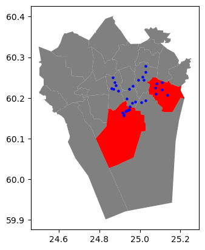
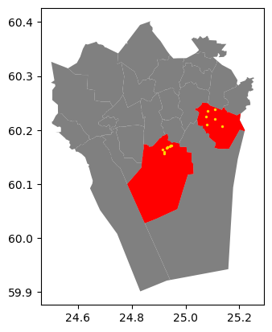
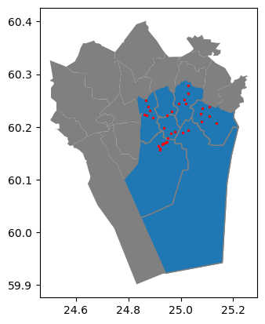

# Spatial Relations


__Basic spatial predicates__

    .intersects()
    .within()
    .contains()
    .overlaps()
    .touches()
    .covers()
    .covered_by()
    .equals()
    .disjoint()
    .crosses()


```python
from shapely import Point, Polygon

point1 = Point(24.952242, 60.1696017)
point2 = Point(24.976567, 60.1612500)

coordinates = [
    (24.950899, 60.169158),
    (24.953492, 60.169158),
    (24.953510, 60.170104),
    (24.950958, 60.169990),
]
polygon = Polygon(coordinates)
```


```python
print(f"{point1}\n{point2}\n{polygon}")
```

    POINT (24.952242 60.1696017)
    POINT (24.976567 60.16125)
    POLYGON ((24.950899 60.169158, 24.953492 60.169158, 24.95351 60.170104, 24.950958 60.16999, 24.950899 60.169158))


```python
point1.within(polygon)
```


    True


```python
point2.within(polygon)
```


    False


```python
from shapely import LineString, MultiLineString

line_a = LineString([(0,0), (1,1)])
line_b = LineString([(1,1), (0,2)]) 
```


```python
line_a.intersects(line_b)
```


    True


```python
line_a.touches(line_b)
```


    True


```python
multiline = MultiLineString([line_a, line_b])
multiline
```


    

    


# Spatial queries in geopandas


```python
import geopandas as gpd 

points = gpd.read_file("data/ch6/Helsinki/addresses.shp")
districts = gpd.read_file("data/ch6/Helsinki/Major_districts.gpkg")

print(points.head())
```

                                                 address  ...                   geometry
    0  Ruoholahti, 14, Itämerenkatu, Ruoholahti, Läns...  ...   POINT (24.91556 60.1632)
    1  Kamppi, 1, Kampinkuja, Kamppi, Eteläinen suurp...  ...  POINT (24.93166 60.16905)
    2  Bangkok9, 8, Kaivokatu, Keskusta, Kluuvi, Etel...  ...  POINT (24.94168 60.16996)
    3  Hermannin rantatie, Verkkosaari, Kalasatama, S...  ...  POINT (24.97865 60.19005)
    4  9, Tyynenmerenkatu, Jätkäsaari, Länsisatama, E...  ...  POINT (24.92151 60.15662)
    
    [5 rows x 4 columns]


```python
points.shape
```


    (34, 4)


```python
selection = districts.loc[districts["Name"].isin(["Itäinen", "Eteläinen"])]
print(selection.head())
```

             Name Description                                           geometry
    10  Eteläinen              POLYGON Z ((24.78277 60.09997 0, 24.81973 60.1...
    19    Itäinen              POLYGON Z ((25.03517 60.23627 0, 25.03585 60.2...


```python
base = districts.plot(facecolor="gray")
selection.plot(ax=base, facecolor="red")
points.plot(ax=base, color="blue", markersize=5);
```


    

    


```python
selected_points = points.sjoin(selection.geometry.to_frame(), 
                              predicate="within")
```


```python
ax = districts.plot(facecolor="gray")
ax = selection.plot(ax=ax, facecolor="red")
ax = selected_points.plot(ax=ax, color="gold", markersize=2)
```


    

    


Which districts contain at least one point?


```python
districts_with_points = districts.sjoin(
    points.geometry.to_frame(), 
    predicate="contains"
)
ax = districts.plot(facecolor="gray")
ax = districts_with_points.plot(ax=ax, edgecolor="gray")
ax = points.plot(ax=ax, color="red", markersize=2)
```


    

    


```python
districts.sindex.valid_query_predicates
```


    {None,
     'contains',
     'contains_properly',
     'covered_by',
     'covers',
     'crosses',
     'dwithin',
     'intersects',
     'overlaps',
     'touches',
     'within'}


How many addresses in each district?


```python
disctricts_with_points.columns.values
```


    array(['Name', 'Description', 'geometry', 'index_right'], dtype=object)


```python
grouped = disctricts_with_points.groupby("Name")
```


```python
grouped.index_right.count()
```


    Name
    Eteläinen     9
    Itäinen       6
    Kaakkoinen    2
    Keskinen      4
    Koillinen     5
    Läntinen      6
    Pohjoinen     2
    Name: index_right, dtype: int64


```python

```
