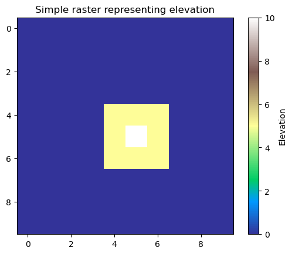

# GeoData in Raster Format


```python
%matplotlib inline
import numpy as np 
import matplotlib.pyplot as plt
```

>Raster libraries

- `xarray`: multidimensional raster data with coordinates and attributes
- `rioxarray`: methods to conduct GIS-related operations with raster data (e.g. reading/writing, reprojecting, clipping, resampling)
- `xarray-spatial`: methods for analysing raster data (e.g. focal/zonal operations, surface analysis, path finding)
- `rasterio`: core library for working with GIS raster data


## Create a simple raster layer


```python
raster_layer = np.zeros((10,10))
```


```python
raster_layer[4:7, 4:7] = 5
raster_layer[5,5] = 10
raster_layer
```


    array([[ 0.,  0.,  0.,  0.,  0.,  0.,  0.,  0.,  0.,  0.],
           [ 0.,  0.,  0.,  0.,  0.,  0.,  0.,  0.,  0.,  0.],
           [ 0.,  0.,  0.,  0.,  0.,  0.,  0.,  0.,  0.,  0.],
           [ 0.,  0.,  0.,  0.,  0.,  0.,  0.,  0.,  0.,  0.],
           [ 0.,  0.,  0.,  0.,  5.,  5.,  5.,  0.,  0.,  0.],
           [ 0.,  0.,  0.,  0.,  5., 10.,  5.,  0.,  0.,  0.],
           [ 0.,  0.,  0.,  0.,  5.,  5.,  5.,  0.,  0.,  0.],
           [ 0.,  0.,  0.,  0.,  0.,  0.,  0.,  0.,  0.,  0.],
           [ 0.,  0.,  0.,  0.,  0.,  0.,  0.,  0.,  0.,  0.],
           [ 0.,  0.,  0.,  0.,  0.,  0.,  0.,  0.,  0.,  0.]])


```python
plt.imshow(raster_layer, cmap='terrain')
plt.colorbar(label="Elevation")
plt.title("Simple raster representing elevation");
```


    

    


```python

```
