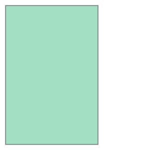
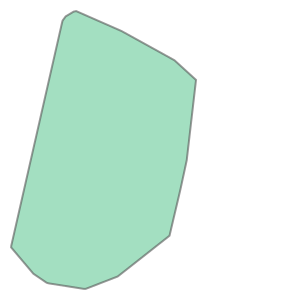

# Manipulating Geometries

Used for combining geometries.

- Centroids
- Combining geometries (Union)
- Creating bounding boxes
- Convex and concave hulls
- Simplify
- Creating Buffers
- Dissolving and merging
- Multiple geometries/Active geometry


```python
import geopandas as gpd 

data = gpd.read_file("data/ch6/Austin/austin_pop_density_2019.gpkg")
data.head()
```


<div>
<style scoped>
    .dataframe tbody tr th:only-of-type {
        vertical-align: middle;
    }

    .dataframe tbody tr th {
        vertical-align: top;
    }

    .dataframe thead th {
        text-align: right;
    }
</style>
<table border="1" class="dataframe">
  <thead>
    <tr style="text-align: right;">
      <th></th>
      <th>pop2019</th>
      <th>tract</th>
      <th>area_km2</th>
      <th>pop_density_km2</th>
      <th>geometry</th>
    </tr>
  </thead>
  <tbody>
    <tr>
      <th>0</th>
      <td>6070.0</td>
      <td>002422</td>
      <td>4.029772</td>
      <td>1506.288778</td>
      <td>MULTIPOLYGON (((615643.488 3338728.496, 615645...</td>
    </tr>
    <tr>
      <th>1</th>
      <td>2203.0</td>
      <td>001751</td>
      <td>1.532030</td>
      <td>1437.961394</td>
      <td>MULTIPOLYGON (((618576.586 3359381.053, 618614...</td>
    </tr>
    <tr>
      <th>2</th>
      <td>7419.0</td>
      <td>002411</td>
      <td>3.960344</td>
      <td>1873.322161</td>
      <td>MULTIPOLYGON (((619200.163 3341784.654, 619270...</td>
    </tr>
    <tr>
      <th>3</th>
      <td>4229.0</td>
      <td>000401</td>
      <td>2.181762</td>
      <td>1938.341859</td>
      <td>MULTIPOLYGON (((621623.757 3350508.165, 621656...</td>
    </tr>
    <tr>
      <th>4</th>
      <td>4589.0</td>
      <td>002313</td>
      <td>2.431208</td>
      <td>1887.538658</td>
      <td>MULTIPOLYGON (((621630.247 3345130.744, 621717...</td>
    </tr>
  </tbody>
</table>
</div>


```python
type(data["geometry"].values[0])
```


    shapely.geometry.multipolygon.MultiPolygon


```python
data["geometry"].head()
```


    0    MULTIPOLYGON (((615643.488 3338728.496, 615645...
    1    MULTIPOLYGON (((618576.586 3359381.053, 618614...
    2    MULTIPOLYGON (((619200.163 3341784.654, 619270...
    3    MULTIPOLYGON (((621623.757 3350508.165, 621656...
    4    MULTIPOLYGON (((621630.247 3345130.744, 621717...
    Name: geometry, dtype: geometry


```python
type(data["geometry"])
```


    geopandas.geoseries.GeoSeries


```python
%matplotlib inline 
import matplotlib.pyplot as plt 

data.plot(facecolor="none", linewidth=0.2)

plt.axis("off")
plt.show()
```


    

    


# Centroid


```python
data.crs.name
```


    'WGS 84 / UTM zone 14N'


```python
data["geometry"].centroid.head()
```


    0     POINT (616990.19 3339736.002)
    1    POINT (619378.303 3359650.002)
    2    POINT (620418.753 3342194.171)
    3    POINT (622613.506 3351414.386)
    4    POINT (622605.359 3343869.554)
    dtype: geometry


```python
data.centroid.plot(markersize=1)
plt.axis("off")
plt.show()
```


    

    


# Union


```python
data.union_all()
```


    

    


```python
dissolved = data.dissolve(method="coverage")
dissolved.head()
```


<div>
<style scoped>
    .dataframe tbody tr th:only-of-type {
        vertical-align: middle;
    }

    .dataframe tbody tr th {
        vertical-align: top;
    }

    .dataframe thead th {
        text-align: right;
    }
</style>
<table border="1" class="dataframe">
  <thead>
    <tr style="text-align: right;">
      <th></th>
      <th>geometry</th>
      <th>pop2019</th>
      <th>tract</th>
      <th>area_km2</th>
      <th>pop_density_km2</th>
    </tr>
  </thead>
  <tbody>
    <tr>
      <th>0</th>
      <td>MULTIPOLYGON (((618353.957 3340531.11, 618350....</td>
      <td>6070.0</td>
      <td>002422</td>
      <td>4.029772</td>
      <td>1506.288778</td>
    </tr>
  </tbody>
</table>
</div>


```python
dissolved.geometry[0]
```


    

    


```python
dissolved = data.dissolve(method="coverage")
dissolved.head()
```


<div>
<style scoped>
    .dataframe tbody tr th:only-of-type {
        vertical-align: middle;
    }

    .dataframe tbody tr th {
        vertical-align: top;
    }

    .dataframe thead th {
        text-align: right;
    }
</style>
<table border="1" class="dataframe">
  <thead>
    <tr style="text-align: right;">
      <th></th>
      <th>geometry</th>
      <th>pop2019</th>
      <th>tract</th>
      <th>area_km2</th>
      <th>pop_density_km2</th>
    </tr>
  </thead>
  <tbody>
    <tr>
      <th>0</th>
      <td>MULTIPOLYGON (((618353.957 3340531.11, 618350....</td>
      <td>6070.0</td>
      <td>002422</td>
      <td>4.029772</td>
      <td>1506.288778</td>
    </tr>
  </tbody>
</table>
</div>


```python
dissolved.geometry[0]
```


    

    


# Bounding Polygon

Options:
- axis-aligned envelope
- minimum rotated rectangle
- minimum bounding circle

This extracts the minimum axis-aligned bounding rectangle:


```python
data.envelope.head()
```


    0    POLYGON ((615643.488 3337909.895, 618358.033 3...
    1    POLYGON ((618529.497 3358797, 620192.632 33587...
    2    POLYGON ((619198.456 3340875.421, 621733.88 33...
    3    POLYGON ((621599.087 3350329.32, 623714.365 33...
    4    POLYGON ((621630.247 3343015.679, 624133.189 3...
    dtype: geometry


To get the bounding rectangle for the entire area:


```python
data.union_all().envelope
```


    

    


```python
data.total_bounds
```


    array([ 608125.39429998, 3337909.89499998,  629828.38850021,
           3370513.68260002])


```python
data.bounds.head()
```


<div>
<style scoped>
    .dataframe tbody tr th:only-of-type {
        vertical-align: middle;
    }

    .dataframe tbody tr th {
        vertical-align: top;
    }

    .dataframe thead th {
        text-align: right;
    }
</style>
<table border="1" class="dataframe">
  <thead>
    <tr style="text-align: right;">
      <th></th>
      <th>minx</th>
      <th>miny</th>
      <th>maxx</th>
      <th>maxy</th>
    </tr>
  </thead>
  <tbody>
    <tr>
      <th>0</th>
      <td>615643.4875</td>
      <td>3.337910e+06</td>
      <td>618358.0327</td>
      <td>3.341257e+06</td>
    </tr>
    <tr>
      <th>1</th>
      <td>618529.4971</td>
      <td>3.358797e+06</td>
      <td>620192.6319</td>
      <td>3.360614e+06</td>
    </tr>
    <tr>
      <th>2</th>
      <td>619198.4560</td>
      <td>3.340875e+06</td>
      <td>621733.8796</td>
      <td>3.343443e+06</td>
    </tr>
    <tr>
      <th>3</th>
      <td>621599.0866</td>
      <td>3.350329e+06</td>
      <td>623714.3655</td>
      <td>3.352436e+06</td>
    </tr>
    <tr>
      <th>4</th>
      <td>621630.2470</td>
      <td>3.343016e+06</td>
      <td>624133.1887</td>
      <td>3.345131e+06</td>
    </tr>
  </tbody>
</table>
</div>


_Minimum rotated rectangle_ and _minimum bounding circle_


```python
data.dissolve().minimum_rotated_rectangle().geometry[0]
```


    

    


```python
data.dissolve().minimum_bounding_circle().geometry[0]
```


    

    


# Convex and concave hull

- the corresponding method must be called on the entire set
- convex uses union, concave uses dissolve
- concave hulls has a hyperparameter for level of detail


```python
data.convex_hull.head()
```


    0    POLYGON ((616870.883 3337909.895, 616852.964 3...
    1    POLYGON ((619496.705 3358797, 618962.703 33590...
    2    POLYGON ((619848.5 3340875.421, 619811.394 334...
    3    POLYGON ((622145.426 3350329.32, 622132.429 33...
    4    POLYGON ((623931.77 3343015.679, 622426.307 33...
    dtype: geometry


```python
data.union_all().convex_hull
```


    

    


```python
data.concave_hull().head()
```


    0    POLYGON ((616686.447 3341251.083, 616689.559 3...
    1    POLYGON ((619414.904 3360602.695, 619418.528 3...
    2    POLYGON ((620165.029 3343417.634, 620177.845 3...
    3    POLYGON ((622361.001 3352408.88, 622364.565 33...
    4    POLYGON ((621654.405 3344983.596, 621630.247 3...
    dtype: geometry


```python
concave_hull = data.dissolve().concave_hull()
concave_hull.plot();
```


    

    


Varying ratios for the hull


```python
gdf_union = data.dissolve()

concave_hull_a = gdf_union.concave_hull(ratio=0.05)
concave_hull_b = gdf_union.concave_hull(ratio=0.2)
concave_hull_c = gdf_union.concave_hull(ratio=0.4) 
```


```python
fig, (ax1, ax2, ax3) = plt.subplots(ncols=3)

zipped = zip([ax1, ax2, ax3], 
             [concave_hull_a, concave_hull_b, concave_hull_c])
for ax, hull in zipped:
    hull.plot(ax=ax)
    ax.axis("off")

ax1.set_title(f"Ratio 0.05")
ax2.set_title(f"Ratio 0.2")
ax3.set_title(f"Ratio 0.4");
```


    

    


# Simplifying geometries

Takes a `tolerance` parameter in meters for projected crs and decimal degrees if lat/lon coordinates are used.


```python
data.simplify(tolerance=1000).head()
```


    0    POLYGON ((615643.488 3338728.496, 616689.559 3...
    1    POLYGON ((619496.705 3358797, 619418.528 33606...
    2    POLYGON ((619200.163 3341784.654, 620177.845 3...
    3    POLYGON ((621623.757 3350508.165, 622387.916 3...
    4    POLYGON ((621630.247 3345130.744, 624133.189 3...
    dtype: geometry


```python
data.union_all().simplify(tolerance=1000)
```


    

    


# Buffer

`distance` parameter in meters/decimal degress depending on crs

1 km for each polygon


```python
data.buffer(1000).plot(edgecolor="white")
plt.axis("off")
plt.show()
```


    

    


Buffer the entire area


```python
data.union_all().buffer(1000)
```


    

    


# Dissolve and Merge

- `dissolve` requires a designated column and an aggregation function


```python
data["dense"] = 0
data.loc[data["pop_density_km2"] > data["pop_density_km2"].mean(), "dense"] = 1
```


```python
data.dense.value_counts()
```


    dense
    0    86
    1    44
    Name: count, dtype: int64


```python
dissolved = data[["pop2019", "area_km2", "dense", "geometry"]].dissolve(
    by="dense", aggfunc="sum"
)
dissolved
```


<div>
<style scoped>
    .dataframe tbody tr th:only-of-type {
        vertical-align: middle;
    }

    .dataframe tbody tr th {
        vertical-align: top;
    }

    .dataframe thead th {
        text-align: right;
    }
</style>
<table border="1" class="dataframe">
  <thead>
    <tr style="text-align: right;">
      <th></th>
      <th>geometry</th>
      <th>pop2019</th>
      <th>area_km2</th>
    </tr>
    <tr>
      <th>dense</th>
      <th></th>
      <th></th>
      <th></th>
    </tr>
  </thead>
  <tbody>
    <tr>
      <th>0</th>
      <td>MULTIPOLYGON (((614108.23 3339640.551, 614288....</td>
      <td>368992.0</td>
      <td>231.131494</td>
    </tr>
    <tr>
      <th>1</th>
      <td>MULTIPOLYGON (((612263.531 3338931.8, 612265.2...</td>
      <td>242943.0</td>
      <td>71.234570</td>
    </tr>
  </tbody>
</table>
</div>


```python
dissolved = dissolved.reset_index()
dissolved
```


<div>
<style scoped>
    .dataframe tbody tr th:only-of-type {
        vertical-align: middle;
    }

    .dataframe tbody tr th {
        vertical-align: top;
    }

    .dataframe thead th {
        text-align: right;
    }
</style>
<table border="1" class="dataframe">
  <thead>
    <tr style="text-align: right;">
      <th></th>
      <th>dense</th>
      <th>geometry</th>
      <th>pop2019</th>
      <th>area_km2</th>
    </tr>
  </thead>
  <tbody>
    <tr>
      <th>0</th>
      <td>0</td>
      <td>MULTIPOLYGON (((614108.23 3339640.551, 614288....</td>
      <td>368992.0</td>
      <td>231.131494</td>
    </tr>
    <tr>
      <th>1</th>
      <td>1</td>
      <td>MULTIPOLYGON (((612263.531 3338931.8, 612265.2...</td>
      <td>242943.0</td>
      <td>71.234570</td>
    </tr>
  </tbody>
</table>
</div>


```python
dissolved.plot(column="dense")
plt.axis("off")
plt.show()
```


    

    


# Multiple geometries in the GeoDataFrame

Option 1 is to simply replace the geometry column


```python
option_1 = data.copy()
option_1["geometry"].head(2)
```


    0    MULTIPOLYGON (((615643.488 3338728.496, 615645...
    1    MULTIPOLYGON (((618576.586 3359381.053, 618614...
    Name: geometry, dtype: geometry


```python
option_1["geometry"] = option_1.centroid
print(option_1.head(2))
```

       pop2019   tract  ...                        geometry  dense
    0   6070.0  002422  ...   POINT (616990.19 3339736.002)      0
    1   2203.0  001751  ...  POINT (619378.303 3359650.002)      0
    
    [2 rows x 6 columns]


Option 2 is to create a new column and call `set_geometry()`


```python
option_2 = data.copy()
option_2["centroid"] = data.centroid
option_2.head(2)
```


<div>
<style scoped>
    .dataframe tbody tr th:only-of-type {
        vertical-align: middle;
    }

    .dataframe tbody tr th {
        vertical-align: top;
    }

    .dataframe thead th {
        text-align: right;
    }
</style>
<table border="1" class="dataframe">
  <thead>
    <tr style="text-align: right;">
      <th></th>
      <th>pop2019</th>
      <th>tract</th>
      <th>area_km2</th>
      <th>pop_density_km2</th>
      <th>geometry</th>
      <th>dense</th>
      <th>centroid</th>
    </tr>
  </thead>
  <tbody>
    <tr>
      <th>0</th>
      <td>6070.0</td>
      <td>002422</td>
      <td>4.029772</td>
      <td>1506.288778</td>
      <td>MULTIPOLYGON (((615643.488 3338728.496, 615645...</td>
      <td>0</td>
      <td>POINT (616990.19 3339736.002)</td>
    </tr>
    <tr>
      <th>1</th>
      <td>2203.0</td>
      <td>001751</td>
      <td>1.532030</td>
      <td>1437.961394</td>
      <td>MULTIPOLYGON (((618576.586 3359381.053, 618614...</td>
      <td>0</td>
      <td>POINT (619378.303 3359650.002)</td>
    </tr>
  </tbody>
</table>
</div>


```python
option_2 = option_2.set_geometry("centroid")
option_2.head(2)
```


<div>
<style scoped>
    .dataframe tbody tr th:only-of-type {
        vertical-align: middle;
    }

    .dataframe tbody tr th {
        vertical-align: top;
    }

    .dataframe thead th {
        text-align: right;
    }
</style>
<table border="1" class="dataframe">
  <thead>
    <tr style="text-align: right;">
      <th></th>
      <th>pop2019</th>
      <th>tract</th>
      <th>area_km2</th>
      <th>pop_density_km2</th>
      <th>geometry</th>
      <th>dense</th>
      <th>centroid</th>
    </tr>
  </thead>
  <tbody>
    <tr>
      <th>0</th>
      <td>6070.0</td>
      <td>002422</td>
      <td>4.029772</td>
      <td>1506.288778</td>
      <td>MULTIPOLYGON (((615643.488 3338728.496, 615645...</td>
      <td>0</td>
      <td>POINT (616990.19 3339736.002)</td>
    </tr>
    <tr>
      <th>1</th>
      <td>2203.0</td>
      <td>001751</td>
      <td>1.532030</td>
      <td>1437.961394</td>
      <td>MULTIPOLYGON (((618576.586 3359381.053, 618614...</td>
      <td>0</td>
      <td>POINT (619378.303 3359650.002)</td>
    </tr>
  </tbody>
</table>
</div>


```python
option_2.geometry.name
```


    'centroid'


```python
option_2.plot();
```


    

    


```python

```
