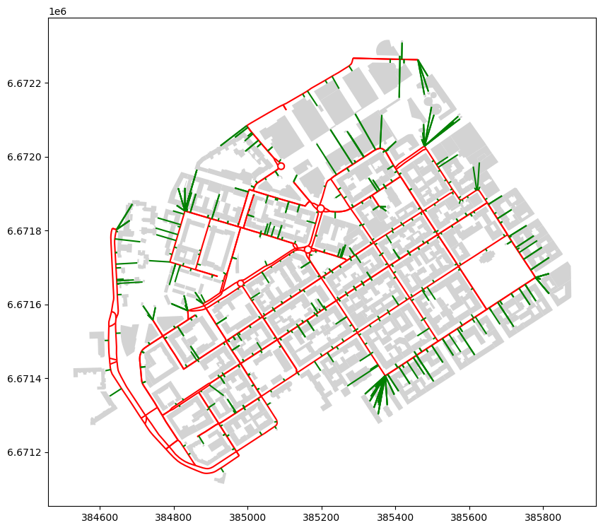

# Nearest neighbor analysis

- Nearest neighbors
- Nearest within a radius
- K-Nearest Neighbors

Using
- `.sjoin_nearest()`

# Point to Point Nearest Neighbor

Search for the closest public transporation stop for each building.

- uses a spatial index `STRTree`, an implementation of `R-tree`
- implemented in `shapely` and used under the hood

1. Import and visualize data
2. Match/convert CRS
3. Use `.sjoin_nearest()` to find closest stop
4. Check for duplicates (more than one closest) and handle accordingly
5. Consider adding a search radius
6. Optionally draw lines between buildings and nearest stops
7. Visualize and compute statistics


```python
%matplotlib inline
import geopandas as gpd 
import matplotlib.pyplot as plt 

stops = gpd.read_file("data/ch6/Helsinki/pt_stops_helsinki.gpkg")
building_points = gpd.read_file("data/ch6/Helsinki/building_points_helsinki.zip")

print(f"Number of stops: {len(stops)}")
print(stops[:2])
```

    Number of stops: 8377
         stop_name  stop_lat  stop_lon  stop_id                   geometry
    0  Ritarihuone  60.16946  24.95667  1010102  POINT (24.95667 60.16946)
    1   Kirkkokatu  60.17127  24.95657  1010103  POINT (24.95657 60.17127)


```python
print(f"Number of buildings: {len(building_points)}")
print(building_points[:2])
```

    Number of buildings: 158731
              name                   geometry
    0         None  POINT (24.85584 60.20727)
    1  Uimastadion  POINT (24.93045 60.18882)


```python
fig, (ax1, ax2) = plt.subplots(nrows=1, ncols=2, figsize=(15,10))

building_points.plot(ax=ax1, markersize=0.2, alpha=0.5)
ax1.set_title("Buildings")
stops.plot(ax=ax2, markersize=0.2, alpha=0.5, color="red")
ax2.set_title("Stops");
```


    

    


```python
stops = stops.to_crs(3067)
building_points = building_points.to_crs(3067)
print(stops[:2])
```

         stop_name  stop_lat  stop_lon  stop_id                        geometry
    0  Ritarihuone  60.16946  24.95667  1010102  POINT (386623.301 6672037.884)
    1   Kirkkokatu  60.17127  24.95657  1010103  POINT (386623.991 6672239.572)


```python
%time
closest = building_points.sjoin_nearest(stops, distance_col="distance")
print(closest[:5])
```

    CPU times: user 2 μs, sys: 0 ns, total: 2 μs
    Wall time: 3.58 μs
                 name                        geometry  index_right  \
    0            None    POINT (381166.6 6676424.438)         1131   
    1     Uimastadion  POINT (385236.565 6674238.472)          467   
    2            None  POINT (386317.478 6672100.648)           61   
    3  Hartwall Arena   POINT (385225.109 6676120.56)          532   
    4           Talli  POINT (385079.733 6676989.745)          496   
    
              stop_name  stop_lat  stop_lon  stop_id    distance  
    0        Muusantori  60.20749  24.85745  1304138   92.679893  
    1  Auroran sairaala  60.19145  24.92554  1171122  400.243370  
    2      Senaatintori  60.16901  24.95046  1020450  109.819633  
    3         Veturitie  60.20661  24.92968  1174112  104.632434  
    4           Posti 1  60.21345  24.91755  1172143  472.248282  


```python
closest.shape
```


    (159818, 8)


```python
%time
closest_limited = building_points.sjoin_nearest(
    stops, max_distance=100, distance_col="distance"
)
print(closest_limited[:5])
print(closest_limited.shape)
```

    CPU times: user 2 μs, sys: 0 ns, total: 2 μs
    Wall time: 3.34 μs
        name                        geometry  index_right            stop_name  \
    0   None    POINT (381166.6 6676424.438)         1131           Muusantori   
    10  None  POINT (384645.078 6669763.917)          592  Hernesaaren laituri   
    12  None  POINT (384782.782 6669707.017)          595  Hernesaaren laituri   
    13  None   POINT (384714.47 6669710.887)          592  Hernesaaren laituri   
    16  None  POINT (385040.806 6670639.517)          596      Hernesaarenkatu   
    
         stop_lat   stop_lon  stop_id   distance  
    0   60.207490  24.857450  1304138  92.679893  
    10  60.148287  24.923281  1204101  57.786201  
    12  60.148680  24.924240  1204108  79.844881  
    13  60.148287  24.923281  1204101  32.640335  
    16  60.156110  24.930370  1204109  87.888087  
    (40128, 8)


```python
closest = closest.merge(
    stops[[stops.active_geometry_name]], 
    left_on="index_right", 
    right_index=True
)
```


```python
print(closest[:5])
print(closest.columns)
```

                 name                      geometry_x  index_right  \
    0            None    POINT (381166.6 6676424.438)         1131   
    1     Uimastadion  POINT (385236.565 6674238.472)          467   
    2            None  POINT (386317.478 6672100.648)           61   
    3  Hartwall Arena   POINT (385225.109 6676120.56)          532   
    4           Talli  POINT (385079.733 6676989.745)          496   
    
              stop_name  stop_lat  stop_lon  stop_id    distance  \
    0        Muusantori  60.20749  24.85745  1304138   92.679893   
    1  Auroran sairaala  60.19145  24.92554  1171122  400.243370   
    2      Senaatintori  60.16901  24.95046  1020450  109.819633   
    3         Veturitie  60.20661  24.92968  1174112  104.632434   
    4           Posti 1  60.21345  24.91755  1172143  472.248282   
    
                           geometry_y  
    0   POINT (381256.66 6676446.317)  
    1  POINT (384973.331 6674539.973)  
    2   POINT (386277.25 6671998.462)  
    3  POINT (385255.784 6676220.595)  
    4  POINT (384607.679 6677003.267)  
    Index(['name', 'geometry_x', 'index_right', 'stop_name', 'stop_lat',
           'stop_lon', 'stop_id', 'distance', 'geometry_y'],
          dtype='object')


> Create LineStrings
>
> `linestrings` requires an array, "geometry" contains POINTs, so must convert.


```python
from shapely import linestrings

closest["geometry"] = linestrings(
    closest.geometry_x.get_coordinates().to_numpy(),
    closest.geometry_y.get_coordinates().to_numpy(),
)
```


```python
closest = closest.set_geometry("geometry")
print(closest[:5])
```

                 name                      geometry_x  index_right  \
    0            None    POINT (381166.6 6676424.438)         1131   
    1     Uimastadion  POINT (385236.565 6674238.472)          467   
    2            None  POINT (386317.478 6672100.648)           61   
    3  Hartwall Arena   POINT (385225.109 6676120.56)          532   
    4           Talli  POINT (385079.733 6676989.745)          496   
    
              stop_name  stop_lat  stop_lon  stop_id    distance  \
    0        Muusantori  60.20749  24.85745  1304138   92.679893   
    1  Auroran sairaala  60.19145  24.92554  1171122  400.243370   
    2      Senaatintori  60.16901  24.95046  1020450  109.819633   
    3         Veturitie  60.20661  24.92968  1174112  104.632434   
    4           Posti 1  60.21345  24.91755  1172143  472.248282   
    
                           geometry_y  \
    0   POINT (381256.66 6676446.317)   
    1  POINT (384973.331 6674539.973)   
    2   POINT (386277.25 6671998.462)   
    3  POINT (385255.784 6676220.595)   
    4  POINT (384607.679 6677003.267)   
    
                                                geometry  
    0  LINESTRING (381166.6 381256.66, 6676424.438 66...  
    1  LINESTRING (385236.565 384973.331, 6674238.472...  
    2  LINESTRING (386317.478 386277.25, 6672100.648 ...  
    3  LINESTRING (385225.109 385255.784, 6676120.56 ...  
    4  LINESTRING (385079.733 384607.679, 6676989.745...  


```python
print(closest.columns)
```

    Index(['name', 'geometry_x', 'index_right', 'stop_name', 'stop_lat',
           'stop_lon', 'stop_id', 'distance', 'geometry_y', 'geometry'],
          dtype='object')


```python
ax = closest.plot(lw=0.5, figsize=(10, 10))
ax = building_points.plot(ax=ax, color="red", markersize=2)
ax = stops.plot(ax=ax, color="black", markersize=8.5, marker="s")
# Zoom to specific area
ax.set_xlim(382000, 384100)
ax.set_ylim(6676000, 6678000);
```


    

    


>[!warning] connections do not render


```python
closest["geometry"][:5]
```


    0    LINESTRING (381166.6 381256.66, 6676424.438 66...
    1    LINESTRING (385236.565 384973.331, 6674238.472...
    2    LINESTRING (386317.478 386277.25, 6672100.648 ...
    3    LINESTRING (385225.109 385255.784, 6676120.56 ...
    4    LINESTRING (385079.733 384607.679, 6676989.745...
    Name: geometry, dtype: geometry


```python
closest["distance"].describe()
```


    count    159818.000000
    mean        229.029606
    std         292.348698
    min           0.743490
    25%          99.771301
    50%         163.805853
    75%         260.461391
    max        7698.270635
    Name: distance, dtype: float64


```python
closest.iloc[2].geometry == closest.iloc[1].geometry
```


    False


## Nearest with Polygon and LineString

> Closest urban park to each building in Kamppi neighborhood


```python
buildings = gpd.read_file("data/ch6/Helsinki/Kamppi_buildings.gpkg")
parks = gpd.read_file("data/ch6/Helsinki/Kamppi_parks.gpkg")
roads = gpd.read_file("data/ch6/Helsinki/Kamppi_roads.gpkg")
print(buildings[:5])
print(buildings.shape)
```

             osmid building                   name  \
    0  11711721042      yes  Nice Bike Pyörähuolto   
    1      8035238   public            Lasipalatsi   
    2      8042297      yes     Radisson Blu Royal   
    3     14797170   school                   None   
    4     14797171      yes                   None   
    
                                                geometry  
    0                     POINT (384966.661 6671503.786)  
    1  POLYGON ((385459.65 6672184.469, 385456.356 66...  
    2  POLYGON ((385104.154 6671916.693, 385101.584 6...  
    3  POLYGON ((384815.326 6671762.71, 384815.792 66...  
    4  POLYGON ((384797.759 6671853.253, 384798.253 6...  
    (455, 4)


```python
ax = buildings.plot(color="lightgray", figsize=(10, 10))
ax = parks.plot(ax=ax, color="lightgreen")
ax = roads.plot(ax=ax, color="red");
```


    

    


```python
nearest_parks = buildings.sjoin_nearest(
    parks, distance_col="distance"
)
print(nearest_parks[:5], nearest_parks[-5:])
print(nearest_parks.shape)
print(nearest_parks.columns)
```

        osmid_left building              name_left  \
    0  11711721042      yes  Nice Bike Pyörähuolto   
    1      8035238   public            Lasipalatsi   
    2      8042297      yes     Radisson Blu Royal   
    3     14797170   school                   None   
    4     14797171      yes                   None   
    
                                                geometry  index_right  \
    0                     POINT (384966.661 6671503.786)           12   
    1  POLYGON ((385459.65 6672184.469, 385456.356 66...            1   
    2  POLYGON ((385104.154 6671916.693, 385101.584 6...            8   
    3  POLYGON ((384815.326 6671762.71, 384815.792 66...            5   
    4  POLYGON ((384797.759 6671853.253, 384798.253 6...            5   
    
       osmid_right leisure                name_right    distance  
    0   1227991181    park  Kaartin lasaretin puisto  100.208527  
    1      8042613    park            Simonpuistikko   16.284929  
    2     37390082    park                      None   40.039501  
    3     26999855    park                      None    0.000000  
    4     26999855    park                      None   14.873403        osmid_left    building name_left  \
    450     8092998         yes      None   
    451     8280536  apartments      None   
    452     8525159       civic      None   
    453     8525161       civic      None   
    454     8535506       civic      None   
    
                                                  geometry  index_right  \
    450  POLYGON ((384747.465 6671811.996, 384744.27 66...            5   
    451  POLYGON ((384839.007 6671934.815, 384839.485 6...            8   
    452  POLYGON ((385495.275 6672164.009, 385494.928 6...            1   
    453  POLYGON ((385486.225 6672173.653, 385486.717 6...            1   
    454  POLYGON ((385481.13 6672167.861, 385482.372 66...            1   
    
         osmid_right leisure      name_right   distance  
    450     26999855    park            None  70.819624  
    451     37390082    park            None  38.574646  
    452      8042613    park  Simonpuistikko  32.792083  
    453      8042613    park  Simonpuistikko  90.919207  
    454      8042613    park  Simonpuistikko  87.821936  
    (455, 9)
    Index(['osmid_left', 'building', 'name_left', 'geometry', 'index_right',
           'osmid_right', 'leisure', 'name_right', 'distance'],
          dtype='object')


```python
print(f"Maximum distance: {nearest_parks["distance"].max().round(0)}")
print(f"Average distance: {nearest_parks["distance"].mean().round(0)}")
```

    Maximum distance: 229.0
    Average distance: 61.0


> Nearest road


```python
nearest_roads = buildings.sjoin_nearest(roads, distance_col="distance")
print(nearest_roads[:5])
```

        osmid_left building              name_left  \
    0  11711721042      yes  Nice Bike Pyörähuolto   
    0  11711721042      yes  Nice Bike Pyörähuolto   
    1      8035238   public            Lasipalatsi   
    1      8035238   public            Lasipalatsi   
    2      8042297      yes     Radisson Blu Royal   
    
                                                geometry  index_right  \
    0                     POINT (384966.661 6671503.786)          182   
    0                     POINT (384966.661 6671503.786)           24   
    1  POLYGON ((385459.65 6672184.469, 385456.356 66...           33   
    1  POLYGON ((385459.65 6672184.469, 385456.356 66...           15   
    2  POLYGON ((385104.154 6671916.693, 385101.584 6...           83   
    
                                             osmid_right    name_right  \
    0       [126894680, 126894676, 126894678, 126894679]   Eerikinkatu   
    0       [126894680, 126894676, 126894678, 126894679]   Eerikinkatu   
    1  [42574048, 42574049, 28920739, 77891210, 26999...  Arkadiankatu   
    1  [42574048, 42574049, 28920739, 77891210, 26999...  Arkadiankatu   
    2                      [37135576, 8035726, 37135575]   Salomonkatu   
    
           highway   distance  
    0  residential  11.181066  
    0  residential  11.181066  
    1    secondary  52.015824  
    1    secondary  52.015824  
    2  residential   6.659959  


> Combine with all roads


```python
nearest_roads = nearest_roads.merge(
    roads[["geometry"]], left_on="index_right", right_index=True
)
print(nearest_roads[:3])
print(nearest_roads.columns)
```

        osmid_left building              name_left  \
    0  11711721042      yes  Nice Bike Pyörähuolto   
    0  11711721042      yes  Nice Bike Pyörähuolto   
    1      8035238   public            Lasipalatsi   
    
                                              geometry_x  index_right  \
    0                     POINT (384966.661 6671503.786)          182   
    0                     POINT (384966.661 6671503.786)           24   
    1  POLYGON ((385459.65 6672184.469, 385456.356 66...           33   
    
                                             osmid_right    name_right  \
    0       [126894680, 126894676, 126894678, 126894679]   Eerikinkatu   
    0       [126894680, 126894676, 126894678, 126894679]   Eerikinkatu   
    1  [42574048, 42574049, 28920739, 77891210, 26999...  Arkadiankatu   
    
           highway   distance                                         geometry_y  
    0  residential  11.181066  LINESTRING (385040.141 6671566.384, 385034.832...  
    0  residential  11.181066  LINESTRING (384942.149 6671500.856, 384950.743...  
    1    secondary  52.015824  LINESTRING (385460.972 6672262.438, 385453.996...  
    Index(['osmid_left', 'building', 'name_left', 'geometry_x', 'index_right',
           'osmid_right', 'name_right', 'highway', 'distance', 'geometry_y'],
          dtype='object')


With a column for buildings (`geometry_x`) and roads (`geometry_y`), use `shapely.shortest_line()` to create the LineStrings. The same conversion from geometry to array is necessary.


```python
from shapely import shortest_line

connectors = nearest_roads.apply(
    lambda row: shortest_line(row["geometry_x"], row["geometry_y"]), axis=1
)
connectors = gpd.GeoDataFrame({"geometry": connectors}, crs=roads.crs)
connectors["distance"] = connectors.length
print(connectors[:5])
```

                                                geometry   distance
    0  LINESTRING (384966.661 6671503.786, 384960.444...  11.181066
    0  LINESTRING (384966.661 6671503.786, 384960.444...  11.181066
    1  LINESTRING (385487.966 6672217.975, 385460.972...  52.015824
    1  LINESTRING (385487.966 6672217.975, 385460.972...  52.015824
    2  LINESTRING (385050.507 6671936.92, 385046.795 ...   6.659959


```python
ax = buildings.plot(color="lightgray", figsize=(10, 10))
ax = roads.plot(ax=ax, color="red")
ax = connectors.plot(ax=ax, color="green");
```


    

    


>Closest park to each building


```python
nearest_park_buildings = buildings.sjoin_nearest(
    parks, distance_col="distance"
)
print(f"Maximum distance: {nearest_park_buildings["distance"].max().round(0)} meters")
```

    Maximum distance: 229.0 meters


```python
nearest_park_buildings = nearest_park_buildings.merge(
    parks[["geometry"]], left_on="index_right", right_index=True
)
print(nearest_park_buildings[:3])
```

        osmid_left building              name_left  \
    0  11711721042      yes  Nice Bike Pyörähuolto   
    1      8035238   public            Lasipalatsi   
    2      8042297      yes     Radisson Blu Royal   
    
                                              geometry_x  index_right  \
    0                     POINT (384966.661 6671503.786)           12   
    1  POLYGON ((385459.65 6672184.469, 385456.356 66...            1   
    2  POLYGON ((385104.154 6671916.693, 385101.584 6...            8   
    
       osmid_right leisure                name_right    distance  \
    0   1227991181    park  Kaartin lasaretin puisto  100.208527   
    1      8042613    park            Simonpuistikko   16.284929   
    2     37390082    park                      None   40.039501   
    
                                              geometry_y  
    0  POLYGON ((385032.97 6671428.653, 385036.724 66...  
    1  POLYGON ((385532.543 6672073.355, 385490.887 6...  
    2  POLYGON ((384895.92 6671976.166, 384895.842 66...  


```python
park_connectors = nearest_park_buildings.apply(
    lambda row: shortest_line(row["geometry_x"], row["geometry_y"]), axis=1
)

# Create a new GeoDataFrame out of these geometries
park_connectors = gpd.GeoDataFrame({"geometry": park_connectors}, crs=parks.crs)
print(park_connectors[:5])
```

                                                geometry
    0  LINESTRING (384966.661 6671503.786, 385032.97 ...
    1  LINESTRING (385522.671 6672097.702, 385519.92 ...
    2  LINESTRING (385031.825 6671923.253, 385008.183...
    3  LINESTRING (384815.326 6671762.71, 384815.326 ...
    4  LINESTRING (384810.412 6671811.499, 384824.667...


```python
ax = buildings.plot(color="lightgray", figsize=(10, 10))
ax = parks.plot(ax=ax, color="lightgreen")
ax = park_connectors.plot(ax=ax, color="blue");
```


    

    


# K-Nearest Neighbor

The `R-Tree` spatial index can only do nearest neighbor. For K-nearest we use `KD-Tree` with `scipy`.


```python
import geopandas as gpd 
stops = gpd.read_file("data/ch6/Helsinki/pt_stops_helsinki.gpkg").to_crs(3067)
building_points = gpd.read_file(
    "data/ch6/Helsinki/building_points_helsinki.zip"
).to_crs(3067)

print(building_points[:2])
```

              name                        geometry
    0         None    POINT (381166.6 6676424.438)
    1  Uimastadion  POINT (385236.565 6674238.472)


```python
print(stops[:2])
```

         stop_name  stop_lat  stop_lon  stop_id                        geometry
    0  Ritarihuone  60.16946  24.95667  1010102  POINT (386623.301 6672037.884)
    1   Kirkkokatu  60.17127  24.95657  1010103  POINT (386623.991 6672239.572)


```python
print(stops.shape)
print(building_points.shape)
```

    (8377, 5)
    (158731, 2)


```python
building_coords = building_points.get_coordinates().to_numpy() 
stop_coords = stops.get_coordinates().to_numpy() 
print(stop_coords[:5])
```

    [[ 386623.30055697 6672037.88387715]
     [ 386623.99053928 6672239.57164472]
     [ 386629.00011373 6672130.5382358 ]
     [ 386627.61747966 6672385.44779099]
     [ 386619.37891936 6672431.39385187]]


>Create the KDTree


```python
from scipy.spatial import KDTree

stop_kdt = KDTree(stop_coords)
stop_kdt
```


    <scipy.spatial._kdtree.KDTree at 0x7f2ed93b5b50>


use `.query()`


```python
k_nearest_dist, k_nearest_ix = stop_kdt.query(building_coords, k=3)
print(k_nearest_dist[:5])
```

    [[ 92.67989301 461.43820422 466.16915044]
     [400.24336963 409.49707253 410.06137016]
     [109.81963349 130.59749777 133.6424814 ]
     [104.63243409 137.70639146 377.33198531]
     [472.24828173 519.68553375 551.35877795]]


```python
print(k_nearest_ix[:5])
```

    [[1131 1135 1125]
     [ 467  465  475]
     [  61   64   13]
     [ 532  533  506]
     [ 496  497  498]]


```python
k_nearest_ix.T
```


    array([[1131,  467,   61, ..., 4655, 4624, 4665],
           [1135,  465,   64, ..., 4678, 4625, 4617],
           [1125,  475,   13, ..., 4614, 4680, 4619]])


```python
# Make a copy
k_nearest = building_points.copy()

# Add indices of nearest stops
k_nearest["1st_nearest_idx"] = k_nearest_ix.T[0]
k_nearest["2nd_nearest_idx"] = k_nearest_ix.T[1]
k_nearest["3rd_nearest_idx"] = k_nearest_ix.T[2]

# Add distances
k_nearest["1st_nearest_dist"] = k_nearest_dist.T[0]
k_nearest["2nd_nearest_dist"] = k_nearest_dist.T[1]
k_nearest["3rd_nearest_dist"] = k_nearest_dist.T[2]
```


```python
print(k_nearest[:5])
```

                 name                        geometry  1st_nearest_idx  \
    0            None    POINT (381166.6 6676424.438)             1131   
    1     Uimastadion  POINT (385236.565 6674238.472)              467   
    2            None  POINT (386317.478 6672100.648)               61   
    3  Hartwall Arena   POINT (385225.109 6676120.56)              532   
    4           Talli  POINT (385079.733 6676989.745)              496   
    
       2nd_nearest_idx  3rd_nearest_idx  1st_nearest_dist  2nd_nearest_dist  \
    0             1135             1125         92.679893        461.438204   
    1              465              475        400.243370        409.497073   
    2               64               13        109.819633        130.597498   
    3              533              506        104.632434        137.706391   
    4              497              498        472.248282        519.685534   
    
       3rd_nearest_dist  
    0        466.169150  
    1        410.061370  
    2        133.642481  
    3        377.331985  
    4        551.358778  


```python
stops["stop_index"] = stops.index
```


```python
k_nearest_1 = k_nearest.merge(
    stops[["stop_index", "geometry"]], 
    left_on="1st_nearest_idx", 
    right_on="stop_index", 
    suffixes=("", "_knearest")
)
print(k_nearest_1[:2])
```

              name                        geometry  1st_nearest_idx  \
    0         None    POINT (381166.6 6676424.438)             1131   
    1  Uimastadion  POINT (385236.565 6674238.472)              467   
    
       2nd_nearest_idx  3rd_nearest_idx  1st_nearest_dist  2nd_nearest_dist  \
    0             1135             1125         92.679893        461.438204   
    1              465              475        400.243370        409.497073   
    
       3rd_nearest_dist  stop_index               geometry_knearest  
    0         466.16915        1131   POINT (381256.66 6676446.317)  
    1         410.06137         467  POINT (384973.331 6674539.973)  


```python
k_nearest_2 = k_nearest.merge(
    stops[["stop_index", "geometry"]], 
    left_on="2nd_nearest_idx", 
    right_on="stop_index", 
    suffixes=("", "_knearest")
)
print(k_nearest_2[:2])

k_nearest_3 = k_nearest.merge(
    stops[["stop_index", "geometry"]], 
    left_on="3rd_nearest_idx", 
    right_on="stop_index", 
    suffixes=("", "_knearest")
)
print(k_nearest_3[:2])
```

              name                        geometry  1st_nearest_idx  \
    0         None    POINT (381166.6 6676424.438)             1131   
    1  Uimastadion  POINT (385236.565 6674238.472)              467   
    
       2nd_nearest_idx  3rd_nearest_idx  1st_nearest_dist  2nd_nearest_dist  \
    0             1135             1125         92.679893        461.438204   
    1              465              475        400.243370        409.497073   
    
       3rd_nearest_dist  stop_index               geometry_knearest  
    0         466.16915        1135  POINT (381625.316 6676474.488)  
    1         410.06137         465  POINT (385270.775 6674646.538)  
              name                        geometry  1st_nearest_idx  \
    0         None    POINT (381166.6 6676424.438)             1131   
    1  Uimastadion  POINT (385236.565 6674238.472)              467   
    
       2nd_nearest_idx  3rd_nearest_idx  1st_nearest_dist  2nd_nearest_dist  \
    0             1135             1125         92.679893        461.438204   
    1              465              475        400.243370        409.497073   
    
       3rd_nearest_dist  stop_index              geometry_knearest  
    0         466.16915        1125  POINT (381632.74 6676429.668)  
    1         410.06137         475  POINT (385122.17 6674632.254)  


>Create the LineStrings


```python
from shapely import LineString

k_nearest_1["geometry"] = k_nearest_1.apply(
    lambda row: LineString([row["geometry"], row["geometry_knearest"]]), axis=1
)
k_nearest_2["geometry"] = k_nearest_2.apply(
    lambda row: LineString([row["geometry"], row["geometry_knearest"]]), axis=1
)
k_nearest_3["geometry"] = k_nearest_3.apply(
    lambda row: LineString([row["geometry"], row["geometry_knearest"]]), axis=1
)
print(k_nearest_1[:2])
```

              name                                           geometry  \
    0         None  LINESTRING (381166.6 6676424.438, 381256.66 66...   
    1  Uimastadion  LINESTRING (385236.565 6674238.472, 384973.331...   
    
       1st_nearest_idx  2nd_nearest_idx  3rd_nearest_idx  1st_nearest_dist  \
    0             1131             1135             1125         92.679893   
    1              467              465              475        400.243370   
    
       2nd_nearest_dist  3rd_nearest_dist  stop_index  \
    0        461.438204         466.16915        1131   
    1        409.497073         410.06137         467   
    
                    geometry_knearest  
    0   POINT (381256.66 6676446.317)  
    1  POINT (384973.331 6674539.973)  


>choose a building from the names


```python
k_nearest.name.unique()
```


    array([None, 'Uimastadion', 'Hartwall Arena', ..., 'Peltolan koulu',
           'Hilton Helsinki Airport', 'Posti Oy Logistiikkakeskus'],
          dtype=object)


```python
selected_name = "Hartwall Arena"
ax = k_nearest_1.loc[k_nearest_1["name"] == selected_name].plot(figsize=(10,10), color="red")
ax = k_nearest_2.loc[k_nearest_2["name"] == selected_name].plot(ax=ax, color="orange")
ax = k_nearest_3.loc[k_nearest_3["name"] == selected_name].plot(ax=ax, color="green");
```


    

    


```python
import contextily as cx
selected_name = "Hartwall Arena"
ax = k_nearest_1.loc[k_nearest_1["name"] == selected_name].plot(figsize=(10,10), color="red")
ax = k_nearest_2.loc[k_nearest_2["name"] == selected_name].plot(ax=ax, color="orange")
ax = k_nearest_3.loc[k_nearest_3["name"] == selected_name].plot(ax=ax, color="green")
cx.add_basemap(ax, crs=k_nearest.crs);
```


    

    


# Nearest neighbors within radius

- uses `KDTree` index for both datasets
- use `query_ball_tree` to find nearest neighbors

Find all buildings within 200m of the stops


```python
from scipy.spatial import KDTree

stop_kdt = KDTree(stop_coords)
building_kdt = KDTree(building_coords)

k_nearest_ix = stop_kdt.query_ball_tree(building_kdt, r=200)
```


```python
len(k_nearest_ix)
```


    8377


```python
k_nearest_ix[0][:10]
```


    [1129, 1130, 1155, 2054, 2055, 2056, 2057, 2058, 2059, 9910]


```python
stops["building_ids_within_range"] = k_nearest_ix
print(stops.head())
print(stops.columns)
```

         stop_name   stop_lat   stop_lon  stop_id                        geometry  \
    0  Ritarihuone  60.169460  24.956670  1010102  POINT (386623.301 6672037.884)   
    1   Kirkkokatu  60.171270  24.956570  1010103  POINT (386623.991 6672239.572)   
    2   Kirkkokatu  60.170293  24.956721  1010104      POINT (386629 6672130.538)   
    3    Vironkatu  60.172580  24.956554  1010105  POINT (386627.617 6672385.448)   
    4    Vironkatu  60.172990  24.956380  1010106  POINT (386619.379 6672431.394)   
    
       stop_index                          building_ids_within_range  
    0           0  [1129, 1130, 1155, 2054, 2055, 2056, 2057, 205...  
    1           1  [1130, 2054, 2055, 2057, 2058, 2059, 2066, 206...  
    2           2  [1129, 1130, 2054, 2055, 2056, 2057, 2058, 205...  
    3           3  [2060, 2062, 2063, 2064, 2065, 2066, 2067, 206...  
    4           4  [1136, 2060, 2061, 2062, 2063, 2064, 2065, 206...  
    Index(['stop_name', 'stop_lat', 'stop_lon', 'stop_id', 'geometry',
           'stop_index', 'building_ids_within_range'],
          dtype='object')


>Calculate the number of buildings within 200m of each stop


```python
stops["building_cnt"] = stops["building_ids_within_range"].apply(
    lambda id_list: len(id_list)
)
print(stops.head())
```

         stop_name   stop_lat   stop_lon  stop_id                        geometry  \
    0  Ritarihuone  60.169460  24.956670  1010102  POINT (386623.301 6672037.884)   
    1   Kirkkokatu  60.171270  24.956570  1010103  POINT (386623.991 6672239.572)   
    2   Kirkkokatu  60.170293  24.956721  1010104      POINT (386629 6672130.538)   
    3    Vironkatu  60.172580  24.956554  1010105  POINT (386627.617 6672385.448)   
    4    Vironkatu  60.172990  24.956380  1010106  POINT (386619.379 6672431.394)   
    
       stop_index                          building_ids_within_range  building_cnt  
    0           0  [1129, 1130, 1155, 2054, 2055, 2056, 2057, 205...            50  
    1           1  [1130, 2054, 2055, 2057, 2058, 2059, 2066, 206...            69  
    2           2  [1129, 1130, 2054, 2055, 2056, 2057, 2058, 205...            56  
    3           3  [2060, 2062, 2063, 2064, 2065, 2066, 2067, 206...            74  
    4           4  [1136, 2060, 2061, 2062, 2063, 2064, 2065, 206...            78  


```python
print("Max number of buildings:", stops["building_cnt"].max())
print("Average number of buildings:", stops["building_cnt"].mean().round(1))
```

    Max number of buildings: 181
    Average number of buildings: 32.2


>Take a look at the densest neighborhoods


```python
filtered = stops["building_cnt"] == stops["building_cnt"].max()
building_ids = stops.loc[filtered].building_ids_within_range.values[0]
```


```python
m = stops.loc[filtered].explore(
    tiles="CartoDB Positron", color="red", marker_kwds={"radius": 5}, max_zoom=16
)
building_points.loc[building_ids].explore(m=m)
```


<div style="width:100%;"><div style="position:relative;width:100%;height:0;padding-bottom:60%;"><span style="color:#565656">Make this Notebook Trusted to load map: File -> Trust Notebook</span><iframe srcdoc="&lt;!DOCTYPE html&gt;
&lt;html&gt;
&lt;head&gt;

    &lt;meta http-equiv=&quot;content-type&quot; content=&quot;text/html; charset=UTF-8&quot; /&gt;

        &lt;script&gt;
            L_NO_TOUCH = false;
            L_DISABLE_3D = false;
        &lt;/script&gt;

    &lt;style&gt;html, body {width: 100%;height: 100%;margin: 0;padding: 0;}&lt;/style&gt;
    &lt;style&gt;#map {position:absolute;top:0;bottom:0;right:0;left:0;}&lt;/style&gt;
    &lt;script src=&quot;https://cdn.jsdelivr.net/npm/leaflet@1.9.3/dist/leaflet.js&quot;&gt;&lt;/script&gt;
    &lt;script src=&quot;https://code.jquery.com/jquery-3.7.1.min.js&quot;&gt;&lt;/script&gt;
    &lt;script src=&quot;https://cdn.jsdelivr.net/npm/bootstrap@5.2.2/dist/js/bootstrap.bundle.min.js&quot;&gt;&lt;/script&gt;
    &lt;script src=&quot;https://cdnjs.cloudflare.com/ajax/libs/Leaflet.awesome-markers/2.0.2/leaflet.awesome-markers.js&quot;&gt;&lt;/script&gt;
    &lt;link rel=&quot;stylesheet&quot; href=&quot;https://cdn.jsdelivr.net/npm/leaflet@1.9.3/dist/leaflet.css&quot;/&gt;
    &lt;link rel=&quot;stylesheet&quot; href=&quot;https://cdn.jsdelivr.net/npm/bootstrap@5.2.2/dist/css/bootstrap.min.css&quot;/&gt;
    &lt;link rel=&quot;stylesheet&quot; href=&quot;https://netdna.bootstrapcdn.com/bootstrap/3.0.0/css/bootstrap-glyphicons.css&quot;/&gt;
    &lt;link rel=&quot;stylesheet&quot; href=&quot;https://cdn.jsdelivr.net/npm/@fortawesome/fontawesome-free@6.2.0/css/all.min.css&quot;/&gt;
    &lt;link rel=&quot;stylesheet&quot; href=&quot;https://cdnjs.cloudflare.com/ajax/libs/Leaflet.awesome-markers/2.0.2/leaflet.awesome-markers.css&quot;/&gt;
    &lt;link rel=&quot;stylesheet&quot; href=&quot;https://cdn.jsdelivr.net/gh/python-visualization/folium/folium/templates/leaflet.awesome.rotate.min.css&quot;/&gt;

            &lt;meta name=&quot;viewport&quot; content=&quot;width=device-width,
                initial-scale=1.0, maximum-scale=1.0, user-scalable=no&quot; /&gt;
            &lt;style&gt;
                #map_459141bd6b2f6f69e86ac2b74f5b7ec3 {
                    position: relative;
                    width: 100.0%;
                    height: 100.0%;
                    left: 0.0%;
                    top: 0.0%;
                }
                .leaflet-container { font-size: 1rem; }
            &lt;/style&gt;


                    &lt;style&gt;
                        .foliumtooltip {

                        }
                       .foliumtooltip table{
                            margin: auto;
                        }
                        .foliumtooltip tr{
                            text-align: left;
                        }
                        .foliumtooltip th{
                            padding: 2px; padding-right: 8px;
                        }
                    &lt;/style&gt;


                    &lt;style&gt;
                        .foliumtooltip {

                        }
                       .foliumtooltip table{
                            margin: auto;
                        }
                        .foliumtooltip tr{
                            text-align: left;
                        }
                        .foliumtooltip th{
                            padding: 2px; padding-right: 8px;
                        }
                    &lt;/style&gt;

&lt;/head&gt;
&lt;body&gt;


            &lt;div class=&quot;folium-map&quot; id=&quot;map_459141bd6b2f6f69e86ac2b74f5b7ec3&quot; &gt;&lt;/div&gt;

&lt;/body&gt;
&lt;script&gt;


            var map_459141bd6b2f6f69e86ac2b74f5b7ec3 = L.map(
                &quot;map_459141bd6b2f6f69e86ac2b74f5b7ec3&quot;,
                {
                    center: [60.14490999999999, 24.651110000000003],
                    crs: L.CRS.EPSG3857,
                    zoom: 10,
                    zoomControl: true,
                    preferCanvas: false,
                }
            );
            L.control.scale().addTo(map_459141bd6b2f6f69e86ac2b74f5b7ec3);


            var tile_layer_8b1c03b45eee4a85a8acb145bdebd5d6 = L.tileLayer(
                &quot;https://a.basemaps.cartocdn.com/light_all/{z}/{x}/{y}{r}.png&quot;,
                {&quot;attribution&quot;: &quot;\u0026copy; \u003ca href=\&quot;https://www.openstreetmap.org/copyright\&quot;\u003eOpenStreetMap\u003c/a\u003e contributors \u0026copy; \u003ca href=\&quot;https://carto.com/attributions\&quot;\u003eCARTO\u003c/a\u003e&quot;, &quot;detectRetina&quot;: false, &quot;maxZoom&quot;: 16, &quot;minZoom&quot;: 0, &quot;noWrap&quot;: false, &quot;opacity&quot;: 1, &quot;subdomains&quot;: &quot;abc&quot;, &quot;tms&quot;: false}
            );


            tile_layer_8b1c03b45eee4a85a8acb145bdebd5d6.addTo(map_459141bd6b2f6f69e86ac2b74f5b7ec3);


            map_459141bd6b2f6f69e86ac2b74f5b7ec3.fitBounds(
                [[60.14490999999999, 24.651110000000003], [60.14490999999999, 24.651110000000003]],
                {}
            );


        function geo_json_edc33a84224bcef0cff9421fdfbff64f_styler(feature) {
            switch(feature.id) {
                default:
                    return {&quot;color&quot;: &quot;red&quot;, &quot;fillColor&quot;: &quot;red&quot;, &quot;fillOpacity&quot;: 0.5, &quot;weight&quot;: 2};
            }
        }
        function geo_json_edc33a84224bcef0cff9421fdfbff64f_highlighter(feature) {
            switch(feature.id) {
                default:
                    return {&quot;fillOpacity&quot;: 0.75};
            }
        }
        function geo_json_edc33a84224bcef0cff9421fdfbff64f_pointToLayer(feature, latlng) {
            var opts = {&quot;bubblingMouseEvents&quot;: true, &quot;color&quot;: &quot;#3388ff&quot;, &quot;dashArray&quot;: null, &quot;dashOffset&quot;: null, &quot;fill&quot;: true, &quot;fillColor&quot;: &quot;#3388ff&quot;, &quot;fillOpacity&quot;: 0.2, &quot;fillRule&quot;: &quot;evenodd&quot;, &quot;lineCap&quot;: &quot;round&quot;, &quot;lineJoin&quot;: &quot;round&quot;, &quot;opacity&quot;: 1.0, &quot;radius&quot;: 5, &quot;stroke&quot;: true, &quot;weight&quot;: 3};

            let style = geo_json_edc33a84224bcef0cff9421fdfbff64f_styler(feature)
            Object.assign(opts, style)

            return new L.CircleMarker(latlng, opts)
        }

        function geo_json_edc33a84224bcef0cff9421fdfbff64f_onEachFeature(feature, layer) {
            layer.on({
                mouseout: function(e) {
                    if(typeof e.target.setStyle === &quot;function&quot;){
                            geo_json_edc33a84224bcef0cff9421fdfbff64f.resetStyle(e.target);
                    }
                },
                mouseover: function(e) {
                    if(typeof e.target.setStyle === &quot;function&quot;){
                        const highlightStyle = geo_json_edc33a84224bcef0cff9421fdfbff64f_highlighter(e.target.feature)
                        e.target.setStyle(highlightStyle);
                    }
                },
            });
        };
        var geo_json_edc33a84224bcef0cff9421fdfbff64f = L.geoJson(null, {
                onEachFeature: geo_json_edc33a84224bcef0cff9421fdfbff64f_onEachFeature,

                style: geo_json_edc33a84224bcef0cff9421fdfbff64f_styler,
                pointToLayer: geo_json_edc33a84224bcef0cff9421fdfbff64f_pointToLayer,
        });

        function geo_json_edc33a84224bcef0cff9421fdfbff64f_add (data) {
            geo_json_edc33a84224bcef0cff9421fdfbff64f
                .addData(data);
        }
            geo_json_edc33a84224bcef0cff9421fdfbff64f_add({&quot;bbox&quot;: [24.651110000000003, 60.14490999999999, 24.651110000000003, 60.14490999999999], &quot;features&quot;: [{&quot;bbox&quot;: [24.651110000000003, 60.14490999999999, 24.651110000000003, 60.14490999999999], &quot;geometry&quot;: {&quot;coordinates&quot;: [24.651110000000003, 60.14490999999999], &quot;type&quot;: &quot;Point&quot;}, &quot;id&quot;: &quot;3666&quot;, &quot;properties&quot;: {&quot;__folium_color&quot;: &quot;red&quot;, &quot;building_cnt&quot;: 181, &quot;building_ids_within_range&quot;: &quot;[85223, 85224, 85225, 85226, 85230, 85231, 85232, 85233, 85665, 85666, 85672, 85673, 85674, 85675, 85676, 85677, 85678, 85679, 85680, 85681, 85682, 85683, 85684, 85685, 85686, 85687, 85708, 85709, 85710, 85711, 85712, 85713, 85714, 85715, 85716, 85717, 85718, 85719, 85779, 85780, 85781, 85782, 85783, 85784, 85785, 85786, 85787, 85820, 85825, 85826, 85827, 85828, 85829, 85830, 85832, 85833, 85837, 85838, 85839, 85840, 85841, 85842, 85843, 85844, 85845, 85846, 85847, 85848, 85849, 85850, 85851, 85852, 85853, 85854, 92852, 92853, 92886, 92887, 92910, 92911, 92926, 92927, 92928, 92929, 92930, 92931, 92932, 92933, 92934, 92949, 92996, 92997, 93075, 93106, 93190, 93191, 93192, 93193, 93194, 93229, 93293, 93329, 93608, 93626, 93627, 93628, 93694, 93695, 93696, 93697, 93721, 93722, 93747, 93748, 93821, 93851, 93852, 93853, 93854, 93855, 93856, 93857, 93885, 93886, 93887, 93888, 93889, 93890, 93937, 93938, 93939, 93940, 93941, 93942, 93984, 93985, 93986, 93987, 94081, 94082, 94145, 94146, 94179, 94181, 94182, 94292, 94299, 94368, 94369, 94370, 94371, 94372, 94373, 94374, 94375, 94403, 94404, 94419, 94557, 94558, 94559, 94560, 94602, 94625, 94626, 94627, 94629, 94801, 94802, 94803, 94804, 94991, 94992, 95266, 95267, 95268, 95276, 95277, 114986, 114987, 115886]&quot;, &quot;stop_id&quot;: 2411253, &quot;stop_index&quot;: 3666, &quot;stop_lat&quot;: 60.144909999999996, &quot;stop_lon&quot;: 24.65111, &quot;stop_name&quot;: &quot;Laurinlahdentie&quot;}, &quot;type&quot;: &quot;Feature&quot;}], &quot;type&quot;: &quot;FeatureCollection&quot;});


    geo_json_edc33a84224bcef0cff9421fdfbff64f.bindTooltip(
    function(layer){
    let div = L.DomUtil.create(&#x27;div&#x27;);

    let handleObject = feature=&gt;typeof(feature)==&#x27;object&#x27; ? JSON.stringify(feature) : feature;
    let fields = [&quot;stop_name&quot;, &quot;stop_lat&quot;, &quot;stop_lon&quot;, &quot;stop_id&quot;, &quot;stop_index&quot;, &quot;building_ids_within_range&quot;, &quot;building_cnt&quot;];
    let aliases = [&quot;stop_name&quot;, &quot;stop_lat&quot;, &quot;stop_lon&quot;, &quot;stop_id&quot;, &quot;stop_index&quot;, &quot;building_ids_within_range&quot;, &quot;building_cnt&quot;];
    let table = &#x27;&lt;table&gt;&#x27; +
        String(
        fields.map(
        (v,i)=&gt;
        `&lt;tr&gt;
            &lt;th&gt;${aliases[i]}&lt;/th&gt;

            &lt;td&gt;${handleObject(layer.feature.properties[v])}&lt;/td&gt;
        &lt;/tr&gt;`).join(&#x27;&#x27;))
    +&#x27;&lt;/table&gt;&#x27;;
    div.innerHTML=table;

    return div
    }
    ,{&quot;className&quot;: &quot;foliumtooltip&quot;, &quot;sticky&quot;: true});


            geo_json_edc33a84224bcef0cff9421fdfbff64f.addTo(map_459141bd6b2f6f69e86ac2b74f5b7ec3);


        function geo_json_e2ef609e15d8a300b5fb38f474f397d1_styler(feature) {
            switch(feature.id) {
                default:
                    return {&quot;fillOpacity&quot;: 0.5, &quot;weight&quot;: 2};
            }
        }
        function geo_json_e2ef609e15d8a300b5fb38f474f397d1_highlighter(feature) {
            switch(feature.id) {
                default:
                    return {&quot;fillOpacity&quot;: 0.75};
            }
        }
        function geo_json_e2ef609e15d8a300b5fb38f474f397d1_pointToLayer(feature, latlng) {
            var opts = {&quot;bubblingMouseEvents&quot;: true, &quot;color&quot;: &quot;#3388ff&quot;, &quot;dashArray&quot;: null, &quot;dashOffset&quot;: null, &quot;fill&quot;: true, &quot;fillColor&quot;: &quot;#3388ff&quot;, &quot;fillOpacity&quot;: 0.2, &quot;fillRule&quot;: &quot;evenodd&quot;, &quot;lineCap&quot;: &quot;round&quot;, &quot;lineJoin&quot;: &quot;round&quot;, &quot;opacity&quot;: 1.0, &quot;radius&quot;: 2, &quot;stroke&quot;: true, &quot;weight&quot;: 3};

            let style = geo_json_e2ef609e15d8a300b5fb38f474f397d1_styler(feature)
            Object.assign(opts, style)

            return new L.CircleMarker(latlng, opts)
        }

        function geo_json_e2ef609e15d8a300b5fb38f474f397d1_onEachFeature(feature, layer) {
            layer.on({
                mouseout: function(e) {
                    if(typeof e.target.setStyle === &quot;function&quot;){
                            geo_json_e2ef609e15d8a300b5fb38f474f397d1.resetStyle(e.target);
                    }
                },
                mouseover: function(e) {
                    if(typeof e.target.setStyle === &quot;function&quot;){
                        const highlightStyle = geo_json_e2ef609e15d8a300b5fb38f474f397d1_highlighter(e.target.feature)
                        e.target.setStyle(highlightStyle);
                    }
                },
            });
        };
        var geo_json_e2ef609e15d8a300b5fb38f474f397d1 = L.geoJson(null, {
                onEachFeature: geo_json_e2ef609e15d8a300b5fb38f474f397d1_onEachFeature,

                style: geo_json_e2ef609e15d8a300b5fb38f474f397d1_styler,
                pointToLayer: geo_json_e2ef609e15d8a300b5fb38f474f397d1_pointToLayer,
        });

        function geo_json_e2ef609e15d8a300b5fb38f474f397d1_add (data) {
            geo_json_e2ef609e15d8a300b5fb38f474f397d1
                .addData(data);
        }
            geo_json_e2ef609e15d8a300b5fb38f474f397d1_add({&quot;bbox&quot;: [24.647612340451563, 60.14323222942577, 24.654670650000003, 60.14667914999998], &quot;features&quot;: [{&quot;bbox&quot;: [24.64909135, 60.14639125, 24.64909135, 60.14639125], &quot;geometry&quot;: {&quot;coordinates&quot;: [24.64909135, 60.14639125], &quot;type&quot;: &quot;Point&quot;}, &quot;id&quot;: &quot;85223&quot;, &quot;properties&quot;: {&quot;name&quot;: null}, &quot;type&quot;: &quot;Feature&quot;}, {&quot;bbox&quot;: [24.64931737998311, 60.14629044804147, 24.64931737998311, 60.14629044804147], &quot;geometry&quot;: {&quot;coordinates&quot;: [24.64931737998311, 60.14629044804147], &quot;type&quot;: &quot;Point&quot;}, &quot;id&quot;: &quot;85224&quot;, &quot;properties&quot;: {&quot;name&quot;: null}, &quot;type&quot;: &quot;Feature&quot;}, {&quot;bbox&quot;: [24.649441950000003, 60.14612244999997, 24.649441950000003, 60.14612244999997], &quot;geometry&quot;: {&quot;coordinates&quot;: [24.649441950000003, 60.14612244999997], &quot;type&quot;: &quot;Point&quot;}, &quot;id&quot;: &quot;85225&quot;, &quot;properties&quot;: {&quot;name&quot;: null}, &quot;type&quot;: &quot;Feature&quot;}, {&quot;bbox&quot;: [24.650757922570815, 60.14641482560747, 24.650757922570815, 60.14641482560747], &quot;geometry&quot;: {&quot;coordinates&quot;: [24.650757922570815, 60.14641482560747], &quot;type&quot;: &quot;Point&quot;}, &quot;id&quot;: &quot;85226&quot;, &quot;properties&quot;: {&quot;name&quot;: null}, &quot;type&quot;: &quot;Feature&quot;}, {&quot;bbox&quot;: [24.650604611812387, 60.146590519509104, 24.650604611812387, 60.146590519509104], &quot;geometry&quot;: {&quot;coordinates&quot;: [24.650604611812387, 60.146590519509104], &quot;type&quot;: &quot;Point&quot;}, &quot;id&quot;: &quot;85230&quot;, &quot;properties&quot;: {&quot;name&quot;: null}, &quot;type&quot;: &quot;Feature&quot;}, {&quot;bbox&quot;: [24.65094085, 60.14667914999998, 24.65094085, 60.14667914999998], &quot;geometry&quot;: {&quot;coordinates&quot;: [24.65094085, 60.14667914999998], &quot;type&quot;: &quot;Point&quot;}, &quot;id&quot;: &quot;85231&quot;, &quot;properties&quot;: {&quot;name&quot;: null}, &quot;type&quot;: &quot;Feature&quot;}, {&quot;bbox&quot;: [24.65019492260533, 60.14634669057396, 24.65019492260533, 60.14634669057396], &quot;geometry&quot;: {&quot;coordinates&quot;: [24.65019492260533, 60.14634669057396], &quot;type&quot;: &quot;Point&quot;}, &quot;id&quot;: &quot;85232&quot;, &quot;properties&quot;: {&quot;name&quot;: null}, &quot;type&quot;: &quot;Feature&quot;}, {&quot;bbox&quot;: [24.65003553789231, 60.14620867173747, 24.65003553789231, 60.14620867173747], &quot;geometry&quot;: {&quot;coordinates&quot;: [24.65003553789231, 60.14620867173747], &quot;type&quot;: &quot;Point&quot;}, &quot;id&quot;: &quot;85233&quot;, &quot;properties&quot;: {&quot;name&quot;: null}, &quot;type&quot;: &quot;Feature&quot;}, {&quot;bbox&quot;: [24.649119849999998, 60.14352639999999, 24.649119849999998, 60.14352639999999], &quot;geometry&quot;: {&quot;coordinates&quot;: [24.649119849999998, 60.14352639999999], &quot;type&quot;: &quot;Point&quot;}, &quot;id&quot;: &quot;85665&quot;, &quot;properties&quot;: {&quot;name&quot;: null}, &quot;type&quot;: &quot;Feature&quot;}, {&quot;bbox&quot;: [24.648947800000002, 60.143664699999995, 24.648947800000002, 60.143664699999995], &quot;geometry&quot;: {&quot;coordinates&quot;: [24.648947800000002, 60.143664699999995], &quot;type&quot;: &quot;Point&quot;}, &quot;id&quot;: &quot;85666&quot;, &quot;properties&quot;: {&quot;name&quot;: null}, &quot;type&quot;: &quot;Feature&quot;}, {&quot;bbox&quot;: [24.65037270929729, 60.14343075047864, 24.65037270929729, 60.14343075047864], &quot;geometry&quot;: {&quot;coordinates&quot;: [24.65037270929729, 60.14343075047864], &quot;type&quot;: &quot;Point&quot;}, &quot;id&quot;: &quot;85672&quot;, &quot;properties&quot;: {&quot;name&quot;: null}, &quot;type&quot;: &quot;Feature&quot;}, {&quot;bbox&quot;: [24.65008251812465, 60.143423083826036, 24.65008251812465, 60.143423083826036], &quot;geometry&quot;: {&quot;coordinates&quot;: [24.65008251812465, 60.143423083826036], &quot;type&quot;: &quot;Point&quot;}, &quot;id&quot;: &quot;85673&quot;, &quot;properties&quot;: {&quot;name&quot;: null}, &quot;type&quot;: &quot;Feature&quot;}, {&quot;bbox&quot;: [24.649861849999997, 60.143366, 24.649861849999997, 60.143366], &quot;geometry&quot;: {&quot;coordinates&quot;: [24.649861849999997, 60.143366], &quot;type&quot;: &quot;Point&quot;}, &quot;id&quot;: &quot;85674&quot;, &quot;properties&quot;: {&quot;name&quot;: null}, &quot;type&quot;: &quot;Feature&quot;}, {&quot;bbox&quot;: [24.649661624367173, 60.14340243555183, 24.649661624367173, 60.14340243555183], &quot;geometry&quot;: {&quot;coordinates&quot;: [24.649661624367173, 60.14340243555183], &quot;type&quot;: &quot;Point&quot;}, &quot;id&quot;: &quot;85675&quot;, &quot;properties&quot;: {&quot;name&quot;: null}, &quot;type&quot;: &quot;Feature&quot;}, {&quot;bbox&quot;: [24.649540354878926, 60.14347266824697, 24.649540354878926, 60.14347266824697], &quot;geometry&quot;: {&quot;coordinates&quot;: [24.649540354878926, 60.14347266824697], &quot;type&quot;: &quot;Point&quot;}, &quot;id&quot;: &quot;85676&quot;, &quot;properties&quot;: {&quot;name&quot;: null}, &quot;type&quot;: &quot;Feature&quot;}, {&quot;bbox&quot;: [24.65048161449122, 60.14366217651337, 24.65048161449122, 60.14366217651337], &quot;geometry&quot;: {&quot;coordinates&quot;: [24.65048161449122, 60.14366217651337], &quot;type&quot;: &quot;Point&quot;}, &quot;id&quot;: &quot;85677&quot;, &quot;properties&quot;: {&quot;name&quot;: null}, &quot;type&quot;: &quot;Feature&quot;}, {&quot;bbox&quot;: [24.650460550000002, 60.1439793, 24.650460550000002, 60.1439793], &quot;geometry&quot;: {&quot;coordinates&quot;: [24.650460550000002, 60.1439793], &quot;type&quot;: &quot;Point&quot;}, &quot;id&quot;: &quot;85678&quot;, &quot;properties&quot;: {&quot;name&quot;: null}, &quot;type&quot;: &quot;Feature&quot;}, {&quot;bbox&quot;: [24.650243036974793, 60.144391786985864, 24.650243036974793, 60.144391786985864], &quot;geometry&quot;: {&quot;coordinates&quot;: [24.650243036974793, 60.144391786985864], &quot;type&quot;: &quot;Point&quot;}, &quot;id&quot;: &quot;85679&quot;, &quot;properties&quot;: {&quot;name&quot;: null}, &quot;type&quot;: &quot;Feature&quot;}, {&quot;bbox&quot;: [24.649881050000005, 60.144388850000006, 24.649881050000005, 60.144388850000006], &quot;geometry&quot;: {&quot;coordinates&quot;: [24.649881050000005, 60.144388850000006], &quot;type&quot;: &quot;Point&quot;}, &quot;id&quot;: &quot;85680&quot;, &quot;properties&quot;: {&quot;name&quot;: null}, &quot;type&quot;: &quot;Feature&quot;}, {&quot;bbox&quot;: [24.649552519758245, 60.14410045205028, 24.649552519758245, 60.14410045205028], &quot;geometry&quot;: {&quot;coordinates&quot;: [24.649552519758245, 60.14410045205028], &quot;type&quot;: &quot;Point&quot;}, &quot;id&quot;: &quot;85681&quot;, &quot;properties&quot;: {&quot;name&quot;: null}, &quot;type&quot;: &quot;Feature&quot;}, {&quot;bbox&quot;: [24.649793700000004, 60.14393860000001, 24.649793700000004, 60.14393860000001], &quot;geometry&quot;: {&quot;coordinates&quot;: [24.649793700000004, 60.14393860000001], &quot;type&quot;: &quot;Point&quot;}, &quot;id&quot;: &quot;85682&quot;, &quot;properties&quot;: {&quot;name&quot;: null}, &quot;type&quot;: &quot;Feature&quot;}, {&quot;bbox&quot;: [24.649398299999998, 60.1438561, 24.649398299999998, 60.1438561], &quot;geometry&quot;: {&quot;coordinates&quot;: [24.649398299999998, 60.1438561], &quot;type&quot;: &quot;Point&quot;}, &quot;id&quot;: &quot;85683&quot;, &quot;properties&quot;: {&quot;name&quot;: null}, &quot;type&quot;: &quot;Feature&quot;}, {&quot;bbox&quot;: [24.64898508020746, 60.14395509362845, 24.64898508020746, 60.14395509362845], &quot;geometry&quot;: {&quot;coordinates&quot;: [24.64898508020746, 60.14395509362845], &quot;type&quot;: &quot;Point&quot;}, &quot;id&quot;: &quot;85684&quot;, &quot;properties&quot;: {&quot;name&quot;: null}, &quot;type&quot;: &quot;Feature&quot;}, {&quot;bbox&quot;: [24.64887688065243, 60.1441461440621, 24.64887688065243, 60.1441461440621], &quot;geometry&quot;: {&quot;coordinates&quot;: [24.64887688065243, 60.1441461440621], &quot;type&quot;: &quot;Point&quot;}, &quot;id&quot;: &quot;85685&quot;, &quot;properties&quot;: {&quot;name&quot;: null}, &quot;type&quot;: &quot;Feature&quot;}, {&quot;bbox&quot;: [24.6480637673271, 60.14395414678672, 24.6480637673271, 60.14395414678672], &quot;geometry&quot;: {&quot;coordinates&quot;: [24.6480637673271, 60.14395414678672], &quot;type&quot;: &quot;Point&quot;}, &quot;id&quot;: &quot;85686&quot;, &quot;properties&quot;: {&quot;name&quot;: null}, &quot;type&quot;: &quot;Feature&quot;}, {&quot;bbox&quot;: [24.648365180651258, 60.14381384744503, 24.648365180651258, 60.14381384744503], &quot;geometry&quot;: {&quot;coordinates&quot;: [24.648365180651258, 60.14381384744503], &quot;type&quot;: &quot;Point&quot;}, &quot;id&quot;: &quot;85687&quot;, &quot;properties&quot;: {&quot;name&quot;: null}, &quot;type&quot;: &quot;Feature&quot;}, {&quot;bbox&quot;: [24.65106247066863, 60.143294897256496, 24.65106247066863, 60.143294897256496], &quot;geometry&quot;: {&quot;coordinates&quot;: [24.65106247066863, 60.143294897256496], &quot;type&quot;: &quot;Point&quot;}, &quot;id&quot;: &quot;85708&quot;, &quot;properties&quot;: {&quot;name&quot;: null}, &quot;type&quot;: &quot;Feature&quot;}, {&quot;bbox&quot;: [24.651277299999997, 60.14326370000001, 24.651277299999997, 60.14326370000001], &quot;geometry&quot;: {&quot;coordinates&quot;: [24.651277299999997, 60.14326370000001], &quot;type&quot;: &quot;Point&quot;}, &quot;id&quot;: &quot;85709&quot;, &quot;properties&quot;: {&quot;name&quot;: null}, &quot;type&quot;: &quot;Feature&quot;}, {&quot;bbox&quot;: [24.651474333273907, 60.14323222942577, 24.651474333273907, 60.14323222942577], &quot;geometry&quot;: {&quot;coordinates&quot;: [24.651474333273907, 60.14323222942577], &quot;type&quot;: &quot;Point&quot;}, &quot;id&quot;: &quot;85710&quot;, &quot;properties&quot;: {&quot;name&quot;: null}, &quot;type&quot;: &quot;Feature&quot;}, {&quot;bbox&quot;: [24.651203250000002, 60.143465099999986, 24.651203250000002, 60.143465099999986], &quot;geometry&quot;: {&quot;coordinates&quot;: [24.651203250000002, 60.143465099999986], &quot;type&quot;: &quot;Point&quot;}, &quot;id&quot;: &quot;85711&quot;, &quot;properties&quot;: {&quot;name&quot;: null}, &quot;type&quot;: &quot;Feature&quot;}, {&quot;bbox&quot;: [24.651465100000006, 60.143430849999994, 24.651465100000006, 60.143430849999994], &quot;geometry&quot;: {&quot;coordinates&quot;: [24.651465100000006, 60.143430849999994], &quot;type&quot;: &quot;Point&quot;}, &quot;id&quot;: &quot;85712&quot;, &quot;properties&quot;: {&quot;name&quot;: null}, &quot;type&quot;: &quot;Feature&quot;}, {&quot;bbox&quot;: [24.6519748, 60.14363464999999, 24.6519748, 60.14363464999999], &quot;geometry&quot;: {&quot;coordinates&quot;: [24.6519748, 60.14363464999999], &quot;type&quot;: &quot;Point&quot;}, &quot;id&quot;: &quot;85713&quot;, &quot;properties&quot;: {&quot;name&quot;: null}, &quot;type&quot;: &quot;Feature&quot;}, {&quot;bbox&quot;: [24.651678440438452, 60.14366543180486, 24.651678440438452, 60.14366543180486], &quot;geometry&quot;: {&quot;coordinates&quot;: [24.651678440438452, 60.14366543180486], &quot;type&quot;: &quot;Point&quot;}, &quot;id&quot;: &quot;85714&quot;, &quot;properties&quot;: {&quot;name&quot;: null}, &quot;type&quot;: &quot;Feature&quot;}, {&quot;bbox&quot;: [24.651372286647014, 60.14370823117502, 24.651372286647014, 60.14370823117502], &quot;geometry&quot;: {&quot;coordinates&quot;: [24.651372286647014, 60.14370823117502], &quot;type&quot;: &quot;Point&quot;}, &quot;id&quot;: &quot;85715&quot;, &quot;properties&quot;: {&quot;name&quot;: null}, &quot;type&quot;: &quot;Feature&quot;}, {&quot;bbox&quot;: [24.6526185, 60.14353819999999, 24.6526185, 60.14353819999999], &quot;geometry&quot;: {&quot;coordinates&quot;: [24.6526185, 60.14353819999999], &quot;type&quot;: &quot;Point&quot;}, &quot;id&quot;: &quot;85716&quot;, &quot;properties&quot;: {&quot;name&quot;: null}, &quot;type&quot;: &quot;Feature&quot;}, {&quot;bbox&quot;: [24.652505738659137, 60.14343978067657, 24.652505738659137, 60.14343978067657], &quot;geometry&quot;: {&quot;coordinates&quot;: [24.652505738659137, 60.14343978067657], &quot;type&quot;: &quot;Point&quot;}, &quot;id&quot;: &quot;85717&quot;, &quot;properties&quot;: {&quot;name&quot;: null}, &quot;type&quot;: &quot;Feature&quot;}, {&quot;bbox&quot;: [24.6524012, 60.1433442, 24.6524012, 60.1433442], &quot;geometry&quot;: {&quot;coordinates&quot;: [24.6524012, 60.1433442], &quot;type&quot;: &quot;Point&quot;}, &quot;id&quot;: &quot;85718&quot;, &quot;properties&quot;: {&quot;name&quot;: null}, &quot;type&quot;: &quot;Feature&quot;}, {&quot;bbox&quot;: [24.652292861219905, 60.14324526995286, 24.652292861219905, 60.14324526995286], &quot;geometry&quot;: {&quot;coordinates&quot;: [24.652292861219905, 60.14324526995286], &quot;type&quot;: &quot;Point&quot;}, &quot;id&quot;: &quot;85719&quot;, &quot;properties&quot;: {&quot;name&quot;: null}, &quot;type&quot;: &quot;Feature&quot;}, {&quot;bbox&quot;: [24.65291306994372, 60.14386673372166, 24.65291306994372, 60.14386673372166], &quot;geometry&quot;: {&quot;coordinates&quot;: [24.65291306994372, 60.14386673372166], &quot;type&quot;: &quot;Point&quot;}, &quot;id&quot;: &quot;85779&quot;, &quot;properties&quot;: {&quot;name&quot;: null}, &quot;type&quot;: &quot;Feature&quot;}, {&quot;bbox&quot;: [24.653035262113224, 60.14397261826014, 24.653035262113224, 60.14397261826014], &quot;geometry&quot;: {&quot;coordinates&quot;: [24.653035262113224, 60.14397261826014], &quot;type&quot;: &quot;Point&quot;}, &quot;id&quot;: &quot;85780&quot;, &quot;properties&quot;: {&quot;name&quot;: null}, &quot;type&quot;: &quot;Feature&quot;}, {&quot;bbox&quot;: [24.65315641853059, 60.14408649803696, 24.65315641853059, 60.14408649803696], &quot;geometry&quot;: {&quot;coordinates&quot;: [24.65315641853059, 60.14408649803696], &quot;type&quot;: &quot;Point&quot;}, &quot;id&quot;: &quot;85781&quot;, &quot;properties&quot;: {&quot;name&quot;: null}, &quot;type&quot;: &quot;Feature&quot;}, {&quot;bbox&quot;: [24.653169242618205, 60.14370548193112, 24.653169242618205, 60.14370548193112], &quot;geometry&quot;: {&quot;coordinates&quot;: [24.653169242618205, 60.14370548193112], &quot;type&quot;: &quot;Point&quot;}, &quot;id&quot;: &quot;85782&quot;, &quot;properties&quot;: {&quot;name&quot;: null}, &quot;type&quot;: &quot;Feature&quot;}, {&quot;bbox&quot;: [24.653475918030757, 60.14399569739453, 24.653475918030757, 60.14399569739453], &quot;geometry&quot;: {&quot;coordinates&quot;: [24.653475918030757, 60.14399569739453], &quot;type&quot;: &quot;Point&quot;}, &quot;id&quot;: &quot;85783&quot;, &quot;properties&quot;: {&quot;name&quot;: null}, &quot;type&quot;: &quot;Feature&quot;}, {&quot;bbox&quot;: [24.653635186056498, 60.14373123226699, 24.653635186056498, 60.14373123226699], &quot;geometry&quot;: {&quot;coordinates&quot;: [24.653635186056498, 60.14373123226699], &quot;type&quot;: &quot;Point&quot;}, &quot;id&quot;: &quot;85784&quot;, &quot;properties&quot;: {&quot;name&quot;: null}, &quot;type&quot;: &quot;Feature&quot;}, {&quot;bbox&quot;: [24.653722269868496, 60.14378798358449, 24.653722269868496, 60.14378798358449], &quot;geometry&quot;: {&quot;coordinates&quot;: [24.653722269868496, 60.14378798358449], &quot;type&quot;: &quot;Point&quot;}, &quot;id&quot;: &quot;85785&quot;, &quot;properties&quot;: {&quot;name&quot;: null}, &quot;type&quot;: &quot;Feature&quot;}, {&quot;bbox&quot;: [24.65381793245795, 60.143847651522755, 24.65381793245795, 60.143847651522755], &quot;geometry&quot;: {&quot;coordinates&quot;: [24.65381793245795, 60.143847651522755], &quot;type&quot;: &quot;Point&quot;}, &quot;id&quot;: &quot;85786&quot;, &quot;properties&quot;: {&quot;name&quot;: null}, &quot;type&quot;: &quot;Feature&quot;}, {&quot;bbox&quot;: [24.6539173, 60.14390245000001, 24.6539173, 60.14390245000001], &quot;geometry&quot;: {&quot;coordinates&quot;: [24.6539173, 60.14390245000001], &quot;type&quot;: &quot;Point&quot;}, &quot;id&quot;: &quot;85787&quot;, &quot;properties&quot;: {&quot;name&quot;: null}, &quot;type&quot;: &quot;Feature&quot;}, {&quot;bbox&quot;: [24.65351030186041, 60.14358748687011, 24.65351030186041, 60.14358748687011], &quot;geometry&quot;: {&quot;coordinates&quot;: [24.65351030186041, 60.14358748687011], &quot;type&quot;: &quot;Point&quot;}, &quot;id&quot;: &quot;85820&quot;, &quot;properties&quot;: {&quot;name&quot;: null}, &quot;type&quot;: &quot;Feature&quot;}, {&quot;bbox&quot;: [24.653545671227217, 60.14449586417168, 24.653545671227217, 60.14449586417168], &quot;geometry&quot;: {&quot;coordinates&quot;: [24.653545671227217, 60.14449586417168], &quot;type&quot;: &quot;Point&quot;}, &quot;id&quot;: &quot;85825&quot;, &quot;properties&quot;: {&quot;name&quot;: null}, &quot;type&quot;: &quot;Feature&quot;}, {&quot;bbox&quot;: [24.65343560637628, 60.14436856806062, 24.65343560637628, 60.14436856806062], &quot;geometry&quot;: {&quot;coordinates&quot;: [24.65343560637628, 60.14436856806062], &quot;type&quot;: &quot;Point&quot;}, &quot;id&quot;: &quot;85826&quot;, &quot;properties&quot;: {&quot;name&quot;: null}, &quot;type&quot;: &quot;Feature&quot;}, {&quot;bbox&quot;: [24.653337009011587, 60.14424561851055, 24.653337009011587, 60.14424561851055], &quot;geometry&quot;: {&quot;coordinates&quot;: [24.653337009011587, 60.14424561851055], &quot;type&quot;: &quot;Point&quot;}, &quot;id&quot;: &quot;85827&quot;, &quot;properties&quot;: {&quot;name&quot;: null}, &quot;type&quot;: &quot;Feature&quot;}, {&quot;bbox&quot;: [24.653883458292036, 60.144406968095836, 24.653883458292036, 60.144406968095836], &quot;geometry&quot;: {&quot;coordinates&quot;: [24.653883458292036, 60.144406968095836], &quot;type&quot;: &quot;Point&quot;}, &quot;id&quot;: &quot;85828&quot;, &quot;properties&quot;: {&quot;name&quot;: null}, &quot;type&quot;: &quot;Feature&quot;}, {&quot;bbox&quot;: [24.653756257654763, 60.144283668073314, 24.653756257654763, 60.144283668073314], &quot;geometry&quot;: {&quot;coordinates&quot;: [24.653756257654763, 60.144283668073314], &quot;type&quot;: &quot;Point&quot;}, &quot;id&quot;: &quot;85829&quot;, &quot;properties&quot;: {&quot;name&quot;: null}, &quot;type&quot;: &quot;Feature&quot;}, {&quot;bbox&quot;: [24.653658049999997, 60.144157850000006, 24.653658049999997, 60.144157850000006], &quot;geometry&quot;: {&quot;coordinates&quot;: [24.653658049999997, 60.144157850000006], &quot;type&quot;: &quot;Point&quot;}, &quot;id&quot;: &quot;85830&quot;, &quot;properties&quot;: {&quot;name&quot;: null}, &quot;type&quot;: &quot;Feature&quot;}, {&quot;bbox&quot;: [24.654670650000003, 60.14474274999998, 24.654670650000003, 60.14474274999998], &quot;geometry&quot;: {&quot;coordinates&quot;: [24.654670650000003, 60.14474274999998], &quot;type&quot;: &quot;Point&quot;}, &quot;id&quot;: &quot;85832&quot;, &quot;properties&quot;: {&quot;name&quot;: null}, &quot;type&quot;: &quot;Feature&quot;}, {&quot;bbox&quot;: [24.654520468054272, 60.14459779643394, 24.654520468054272, 60.14459779643394], &quot;geometry&quot;: {&quot;coordinates&quot;: [24.654520468054272, 60.14459779643394], &quot;type&quot;: &quot;Point&quot;}, &quot;id&quot;: &quot;85833&quot;, &quot;properties&quot;: {&quot;name&quot;: null}, &quot;type&quot;: &quot;Feature&quot;}, {&quot;bbox&quot;: [24.654492912255986, 60.14502142478265, 24.654492912255986, 60.14502142478265], &quot;geometry&quot;: {&quot;coordinates&quot;: [24.654492912255986, 60.14502142478265], &quot;type&quot;: &quot;Point&quot;}, &quot;id&quot;: &quot;85837&quot;, &quot;properties&quot;: {&quot;name&quot;: null}, &quot;type&quot;: &quot;Feature&quot;}, {&quot;bbox&quot;: [24.65437215, 60.144879949999996, 24.65437215, 60.144879949999996], &quot;geometry&quot;: {&quot;coordinates&quot;: [24.65437215, 60.144879949999996], &quot;type&quot;: &quot;Point&quot;}, &quot;id&quot;: &quot;85838&quot;, &quot;properties&quot;: {&quot;name&quot;: null}, &quot;type&quot;: &quot;Feature&quot;}, {&quot;bbox&quot;: [24.654214650000004, 60.14473934999999, 24.654214650000004, 60.14473934999999], &quot;geometry&quot;: {&quot;coordinates&quot;: [24.654214650000004, 60.14473934999999], &quot;type&quot;: &quot;Point&quot;}, &quot;id&quot;: &quot;85839&quot;, &quot;properties&quot;: {&quot;name&quot;: null}, &quot;type&quot;: &quot;Feature&quot;}, {&quot;bbox&quot;: [24.654041629432236, 60.14505247460732, 24.654041629432236, 60.14505247460732], &quot;geometry&quot;: {&quot;coordinates&quot;: [24.654041629432236, 60.14505247460732], &quot;type&quot;: &quot;Point&quot;}, &quot;id&quot;: &quot;85840&quot;, &quot;properties&quot;: {&quot;name&quot;: null}, &quot;type&quot;: &quot;Feature&quot;}, {&quot;bbox&quot;: [24.65389092488797, 60.14492329646617, 24.65389092488797, 60.14492329646617], &quot;geometry&quot;: {&quot;coordinates&quot;: [24.65389092488797, 60.14492329646617], &quot;type&quot;: &quot;Point&quot;}, &quot;id&quot;: &quot;85841&quot;, &quot;properties&quot;: {&quot;name&quot;: null}, &quot;type&quot;: &quot;Feature&quot;}, {&quot;bbox&quot;: [24.653781419633845, 60.14479342541318, 24.653781419633845, 60.14479342541318], &quot;geometry&quot;: {&quot;coordinates&quot;: [24.653781419633845, 60.14479342541318], &quot;type&quot;: &quot;Point&quot;}, &quot;id&quot;: &quot;85842&quot;, &quot;properties&quot;: {&quot;name&quot;: null}, &quot;type&quot;: &quot;Feature&quot;}, {&quot;bbox&quot;: [24.654342191700433, 60.14519496909674, 24.654342191700433, 60.14519496909674], &quot;geometry&quot;: {&quot;coordinates&quot;: [24.654342191700433, 60.14519496909674], &quot;type&quot;: &quot;Point&quot;}, &quot;id&quot;: &quot;85843&quot;, &quot;properties&quot;: {&quot;name&quot;: null}, &quot;type&quot;: &quot;Feature&quot;}, {&quot;bbox&quot;: [24.654275631580873, 60.14534790566995, 24.654275631580873, 60.14534790566995], &quot;geometry&quot;: {&quot;coordinates&quot;: [24.654275631580873, 60.14534790566995], &quot;type&quot;: &quot;Point&quot;}, &quot;id&quot;: &quot;85844&quot;, &quot;properties&quot;: {&quot;name&quot;: null}, &quot;type&quot;: &quot;Feature&quot;}, {&quot;bbox&quot;: [24.654186380863003, 60.14561499733151, 24.654186380863003, 60.14561499733151], &quot;geometry&quot;: {&quot;coordinates&quot;: [24.654186380863003, 60.14561499733151], &quot;type&quot;: &quot;Point&quot;}, &quot;id&quot;: &quot;85845&quot;, &quot;properties&quot;: {&quot;name&quot;: null}, &quot;type&quot;: &quot;Feature&quot;}, {&quot;bbox&quot;: [24.653919700000003, 60.14556184999997, 24.653919700000003, 60.14556184999997], &quot;geometry&quot;: {&quot;coordinates&quot;: [24.653919700000003, 60.14556184999997], &quot;type&quot;: &quot;Point&quot;}, &quot;id&quot;: &quot;85846&quot;, &quot;properties&quot;: {&quot;name&quot;: null}, &quot;type&quot;: &quot;Feature&quot;}, {&quot;bbox&quot;: [24.65341225321012, 60.14541141621271, 24.65341225321012, 60.14541141621271], &quot;geometry&quot;: {&quot;coordinates&quot;: [24.65341225321012, 60.14541141621271], &quot;type&quot;: &quot;Point&quot;}, &quot;id&quot;: &quot;85847&quot;, &quot;properties&quot;: {&quot;name&quot;: null}, &quot;type&quot;: &quot;Feature&quot;}, {&quot;bbox&quot;: [24.6536638, 60.145268150000014, 24.6536638, 60.145268150000014], &quot;geometry&quot;: {&quot;coordinates&quot;: [24.6536638, 60.145268150000014], &quot;type&quot;: &quot;Point&quot;}, &quot;id&quot;: &quot;85848&quot;, &quot;properties&quot;: {&quot;name&quot;: null}, &quot;type&quot;: &quot;Feature&quot;}, {&quot;bbox&quot;: [24.6530539159863, 60.14532574857293, 24.6530539159863, 60.14532574857293], &quot;geometry&quot;: {&quot;coordinates&quot;: [24.6530539159863, 60.14532574857293], &quot;type&quot;: &quot;Point&quot;}, &quot;id&quot;: &quot;85849&quot;, &quot;properties&quot;: {&quot;name&quot;: null}, &quot;type&quot;: &quot;Feature&quot;}, {&quot;bbox&quot;: [24.652795091251907, 60.1451929847717, 24.652795091251907, 60.1451929847717], &quot;geometry&quot;: {&quot;coordinates&quot;: [24.652795091251907, 60.1451929847717], &quot;type&quot;: &quot;Point&quot;}, &quot;id&quot;: &quot;85850&quot;, &quot;properties&quot;: {&quot;name&quot;: null}, &quot;type&quot;: &quot;Feature&quot;}, {&quot;bbox&quot;: [24.652741625119294, 60.14498738180687, 24.652741625119294, 60.14498738180687], &quot;geometry&quot;: {&quot;coordinates&quot;: [24.652741625119294, 60.14498738180687], &quot;type&quot;: &quot;Point&quot;}, &quot;id&quot;: &quot;85851&quot;, &quot;properties&quot;: {&quot;name&quot;: null}, &quot;type&quot;: &quot;Feature&quot;}, {&quot;bbox&quot;: [24.6530236, 60.144834750000015, 24.6530236, 60.144834750000015], &quot;geometry&quot;: {&quot;coordinates&quot;: [24.6530236, 60.144834750000015], &quot;type&quot;: &quot;Point&quot;}, &quot;id&quot;: &quot;85852&quot;, &quot;properties&quot;: {&quot;name&quot;: null}, &quot;type&quot;: &quot;Feature&quot;}, {&quot;bbox&quot;: [24.6534095, 60.1448904, 24.6534095, 60.1448904], &quot;geometry&quot;: {&quot;coordinates&quot;: [24.6534095, 60.1448904], &quot;type&quot;: &quot;Point&quot;}, &quot;id&quot;: &quot;85853&quot;, &quot;properties&quot;: {&quot;name&quot;: null}, &quot;type&quot;: &quot;Feature&quot;}, {&quot;bbox&quot;: [24.653516725891016, 60.145076102886485, 24.653516725891016, 60.145076102886485], &quot;geometry&quot;: {&quot;coordinates&quot;: [24.653516725891016, 60.145076102886485], &quot;type&quot;: &quot;Point&quot;}, &quot;id&quot;: &quot;85854&quot;, &quot;properties&quot;: {&quot;name&quot;: null}, &quot;type&quot;: &quot;Feature&quot;}, {&quot;bbox&quot;: [24.647612340451563, 60.1444971210367, 24.647612340451563, 60.1444971210367], &quot;geometry&quot;: {&quot;coordinates&quot;: [24.647612340451563, 60.1444971210367], &quot;type&quot;: &quot;Point&quot;}, &quot;id&quot;: &quot;92852&quot;, &quot;properties&quot;: {&quot;name&quot;: null}, &quot;type&quot;: &quot;Feature&quot;}, {&quot;bbox&quot;: [24.647811408039598, 60.14455377733552, 24.647811408039598, 60.14455377733552], &quot;geometry&quot;: {&quot;coordinates&quot;: [24.647811408039598, 60.14455377733552], &quot;type&quot;: &quot;Point&quot;}, &quot;id&quot;: &quot;92853&quot;, &quot;properties&quot;: {&quot;name&quot;: null}, &quot;type&quot;: &quot;Feature&quot;}, {&quot;bbox&quot;: [24.65254490753469, 60.14572033509161, 24.65254490753469, 60.14572033509161], &quot;geometry&quot;: {&quot;coordinates&quot;: [24.65254490753469, 60.14572033509161], &quot;type&quot;: &quot;Point&quot;}, &quot;id&quot;: &quot;92886&quot;, &quot;properties&quot;: {&quot;name&quot;: null}, &quot;type&quot;: &quot;Feature&quot;}, {&quot;bbox&quot;: [24.652366571938664, 60.145872693425254, 24.652366571938664, 60.145872693425254], &quot;geometry&quot;: {&quot;coordinates&quot;: [24.652366571938664, 60.145872693425254], &quot;type&quot;: &quot;Point&quot;}, &quot;id&quot;: &quot;92887&quot;, &quot;properties&quot;: {&quot;name&quot;: null}, &quot;type&quot;: &quot;Feature&quot;}, {&quot;bbox&quot;: [24.653791766846425, 60.1460089194133, 24.653791766846425, 60.1460089194133], &quot;geometry&quot;: {&quot;coordinates&quot;: [24.653791766846425, 60.1460089194133], &quot;type&quot;: &quot;Point&quot;}, &quot;id&quot;: &quot;92910&quot;, &quot;properties&quot;: {&quot;name&quot;: null}, &quot;type&quot;: &quot;Feature&quot;}, {&quot;bbox&quot;: [24.653478393198004, 60.145949255835816, 24.653478393198004, 60.145949255835816], &quot;geometry&quot;: {&quot;coordinates&quot;: [24.653478393198004, 60.145949255835816], &quot;type&quot;: &quot;Point&quot;}, &quot;id&quot;: &quot;92911&quot;, &quot;properties&quot;: {&quot;name&quot;: null}, &quot;type&quot;: &quot;Feature&quot;}, {&quot;bbox&quot;: [24.652905045646616, 60.14452013487708, 24.652905045646616, 60.14452013487708], &quot;geometry&quot;: {&quot;coordinates&quot;: [24.652905045646616, 60.14452013487708], &quot;type&quot;: &quot;Point&quot;}, &quot;id&quot;: &quot;92926&quot;, &quot;properties&quot;: {&quot;name&quot;: null}, &quot;type&quot;: &quot;Feature&quot;}, {&quot;bbox&quot;: [24.652819349999998, 60.14465425000001, 24.652819349999998, 60.14465425000001], &quot;geometry&quot;: {&quot;coordinates&quot;: [24.652819349999998, 60.14465425000001], &quot;type&quot;: &quot;Point&quot;}, &quot;id&quot;: &quot;92927&quot;, &quot;properties&quot;: {&quot;name&quot;: null}, &quot;type&quot;: &quot;Feature&quot;}, {&quot;bbox&quot;: [24.652479624679252, 60.14480779534937, 24.652479624679252, 60.14480779534937], &quot;geometry&quot;: {&quot;coordinates&quot;: [24.652479624679252, 60.14480779534937], &quot;type&quot;: &quot;Point&quot;}, &quot;id&quot;: &quot;92928&quot;, &quot;properties&quot;: {&quot;name&quot;: null}, &quot;type&quot;: &quot;Feature&quot;}, {&quot;bbox&quot;: [24.652202749729796, 60.144906021824745, 24.652202749729796, 60.144906021824745], &quot;geometry&quot;: {&quot;coordinates&quot;: [24.652202749729796, 60.144906021824745], &quot;type&quot;: &quot;Point&quot;}, &quot;id&quot;: &quot;92929&quot;, &quot;properties&quot;: {&quot;name&quot;: null}, &quot;type&quot;: &quot;Feature&quot;}, {&quot;bbox&quot;: [24.652390308328673, 60.144446868135184, 24.652390308328673, 60.144446868135184], &quot;geometry&quot;: {&quot;coordinates&quot;: [24.652390308328673, 60.144446868135184], &quot;type&quot;: &quot;Point&quot;}, &quot;id&quot;: &quot;92930&quot;, &quot;properties&quot;: {&quot;name&quot;: null}, &quot;type&quot;: &quot;Feature&quot;}, {&quot;bbox&quot;: [24.65268184081329, 60.14441890304554, 24.65268184081329, 60.14441890304554], &quot;geometry&quot;: {&quot;coordinates&quot;: [24.65268184081329, 60.14441890304554], &quot;type&quot;: &quot;Point&quot;}, &quot;id&quot;: &quot;92931&quot;, &quot;properties&quot;: {&quot;name&quot;: null}, &quot;type&quot;: &quot;Feature&quot;}, {&quot;bbox&quot;: [24.652394034529, 60.144680062481214, 24.652394034529, 60.144680062481214], &quot;geometry&quot;: {&quot;coordinates&quot;: [24.652394034529, 60.144680062481214], &quot;type&quot;: &quot;Point&quot;}, &quot;id&quot;: &quot;92932&quot;, &quot;properties&quot;: {&quot;name&quot;: null}, &quot;type&quot;: &quot;Feature&quot;}, {&quot;bbox&quot;: [24.65211762485688, 60.14477753327327, 24.65211762485688, 60.14477753327327], &quot;geometry&quot;: {&quot;coordinates&quot;: [24.65211762485688, 60.14477753327327], &quot;type&quot;: &quot;Point&quot;}, &quot;id&quot;: &quot;92933&quot;, &quot;properties&quot;: {&quot;name&quot;: null}, &quot;type&quot;: &quot;Feature&quot;}, {&quot;bbox&quot;: [24.65183187201643, 60.14351776650715, 24.65183187201643, 60.14351776650715], &quot;geometry&quot;: {&quot;coordinates&quot;: [24.65183187201643, 60.14351776650715], &quot;type&quot;: &quot;Point&quot;}, &quot;id&quot;: &quot;92934&quot;, &quot;properties&quot;: {&quot;name&quot;: null}, &quot;type&quot;: &quot;Feature&quot;}, {&quot;bbox&quot;: [24.651415037058772, 60.146275510647804, 24.651415037058772, 60.146275510647804], &quot;geometry&quot;: {&quot;coordinates&quot;: [24.651415037058772, 60.146275510647804], &quot;type&quot;: &quot;Point&quot;}, &quot;id&quot;: &quot;92949&quot;, &quot;properties&quot;: {&quot;name&quot;: null}, &quot;type&quot;: &quot;Feature&quot;}, {&quot;bbox&quot;: [24.6481133265079, 60.145551664158305, 24.6481133265079, 60.145551664158305], &quot;geometry&quot;: {&quot;coordinates&quot;: [24.6481133265079, 60.145551664158305], &quot;type&quot;: &quot;Point&quot;}, &quot;id&quot;: &quot;92996&quot;, &quot;properties&quot;: {&quot;name&quot;: null}, &quot;type&quot;: &quot;Feature&quot;}, {&quot;bbox&quot;: [24.64784639531582, 60.1454959870281, 24.64784639531582, 60.1454959870281], &quot;geometry&quot;: {&quot;coordinates&quot;: [24.64784639531582, 60.1454959870281], &quot;type&quot;: &quot;Point&quot;}, &quot;id&quot;: &quot;92997&quot;, &quot;properties&quot;: {&quot;name&quot;: null}, &quot;type&quot;: &quot;Feature&quot;}, {&quot;bbox&quot;: [24.649381520951724, 60.14593024353169, 24.649381520951724, 60.14593024353169], &quot;geometry&quot;: {&quot;coordinates&quot;: [24.649381520951724, 60.14593024353169], &quot;type&quot;: &quot;Point&quot;}, &quot;id&quot;: &quot;93075&quot;, &quot;properties&quot;: {&quot;name&quot;: null}, &quot;type&quot;: &quot;Feature&quot;}, {&quot;bbox&quot;: [24.650031898014046, 60.14417751861434, 24.650031898014046, 60.14417751861434], &quot;geometry&quot;: {&quot;coordinates&quot;: [24.650031898014046, 60.14417751861434], &quot;type&quot;: &quot;Point&quot;}, &quot;id&quot;: &quot;93106&quot;, &quot;properties&quot;: {&quot;name&quot;: null}, &quot;type&quot;: &quot;Feature&quot;}, {&quot;bbox&quot;: [24.648478904259004, 60.14583767123906, 24.648478904259004, 60.14583767123906], &quot;geometry&quot;: {&quot;coordinates&quot;: [24.648478904259004, 60.14583767123906], &quot;type&quot;: &quot;Point&quot;}, &quot;id&quot;: &quot;93190&quot;, &quot;properties&quot;: {&quot;name&quot;: null}, &quot;type&quot;: &quot;Feature&quot;}, {&quot;bbox&quot;: [24.648544262547148, 60.14612727466179, 24.648544262547148, 60.14612727466179], &quot;geometry&quot;: {&quot;coordinates&quot;: [24.648544262547148, 60.14612727466179], &quot;type&quot;: &quot;Point&quot;}, &quot;id&quot;: &quot;93191&quot;, &quot;properties&quot;: {&quot;name&quot;: null}, &quot;type&quot;: &quot;Feature&quot;}, {&quot;bbox&quot;: [24.64875483264748, 60.146007474678385, 24.64875483264748, 60.146007474678385], &quot;geometry&quot;: {&quot;coordinates&quot;: [24.64875483264748, 60.146007474678385], &quot;type&quot;: &quot;Point&quot;}, &quot;id&quot;: &quot;93192&quot;, &quot;properties&quot;: {&quot;name&quot;: null}, &quot;type&quot;: &quot;Feature&quot;}, {&quot;bbox&quot;: [24.64807679921899, 60.145807292575356, 24.64807679921899, 60.145807292575356], &quot;geometry&quot;: {&quot;coordinates&quot;: [24.64807679921899, 60.145807292575356], &quot;type&quot;: &quot;Point&quot;}, &quot;id&quot;: &quot;93193&quot;, &quot;properties&quot;: {&quot;name&quot;: null}, &quot;type&quot;: &quot;Feature&quot;}, {&quot;bbox&quot;: [24.648326298952355, 60.14566970773989, 24.648326298952355, 60.14566970773989], &quot;geometry&quot;: {&quot;coordinates&quot;: [24.648326298952355, 60.14566970773989], &quot;type&quot;: &quot;Point&quot;}, &quot;id&quot;: &quot;93194&quot;, &quot;properties&quot;: {&quot;name&quot;: null}, &quot;type&quot;: &quot;Feature&quot;}, {&quot;bbox&quot;: [24.65139631154329, 60.144487708490175, 24.65139631154329, 60.144487708490175], &quot;geometry&quot;: {&quot;coordinates&quot;: [24.65139631154329, 60.144487708490175], &quot;type&quot;: &quot;Point&quot;}, &quot;id&quot;: &quot;93229&quot;, &quot;properties&quot;: {&quot;name&quot;: null}, &quot;type&quot;: &quot;Feature&quot;}, {&quot;bbox&quot;: [24.650691716353588, 60.14385931733944, 24.650691716353588, 60.14385931733944], &quot;geometry&quot;: {&quot;coordinates&quot;: [24.650691716353588, 60.14385931733944], &quot;type&quot;: &quot;Point&quot;}, &quot;id&quot;: &quot;93293&quot;, &quot;properties&quot;: {&quot;name&quot;: null}, &quot;type&quot;: &quot;Feature&quot;}, {&quot;bbox&quot;: [24.649184581693444, 60.14417466861687, 24.649184581693444, 60.14417466861687], &quot;geometry&quot;: {&quot;coordinates&quot;: [24.649184581693444, 60.14417466861687], &quot;type&quot;: &quot;Point&quot;}, &quot;id&quot;: &quot;93329&quot;, &quot;properties&quot;: {&quot;name&quot;: null}, &quot;type&quot;: &quot;Feature&quot;}, {&quot;bbox&quot;: [24.6546011070253, 60.14449881808524, 24.6546011070253, 60.14449881808524], &quot;geometry&quot;: {&quot;coordinates&quot;: [24.6546011070253, 60.14449881808524], &quot;type&quot;: &quot;Point&quot;}, &quot;id&quot;: &quot;93608&quot;, &quot;properties&quot;: {&quot;name&quot;: null}, &quot;type&quot;: &quot;Feature&quot;}, {&quot;bbox&quot;: [24.651097674315277, 60.144503963091786, 24.651097674315277, 60.144503963091786], &quot;geometry&quot;: {&quot;coordinates&quot;: [24.651097674315277, 60.144503963091786], &quot;type&quot;: &quot;Point&quot;}, &quot;id&quot;: &quot;93626&quot;, &quot;properties&quot;: {&quot;name&quot;: null}, &quot;type&quot;: &quot;Feature&quot;}, {&quot;bbox&quot;: [24.651274333535685, 60.14430898278299, 24.651274333535685, 60.14430898278299], &quot;geometry&quot;: {&quot;coordinates&quot;: [24.651274333535685, 60.14430898278299], &quot;type&quot;: &quot;Point&quot;}, &quot;id&quot;: &quot;93627&quot;, &quot;properties&quot;: {&quot;name&quot;: null}, &quot;type&quot;: &quot;Feature&quot;}, {&quot;bbox&quot;: [24.650969754147088, 60.144335351737496, 24.650969754147088, 60.144335351737496], &quot;geometry&quot;: {&quot;coordinates&quot;: [24.650969754147088, 60.144335351737496], &quot;type&quot;: &quot;Point&quot;}, &quot;id&quot;: &quot;93628&quot;, &quot;properties&quot;: {&quot;name&quot;: null}, &quot;type&quot;: &quot;Feature&quot;}, {&quot;bbox&quot;: [24.65153075345717, 60.145422849968966, 24.65153075345717, 60.145422849968966], &quot;geometry&quot;: {&quot;coordinates&quot;: [24.65153075345717, 60.145422849968966], &quot;type&quot;: &quot;Point&quot;}, &quot;id&quot;: &quot;93694&quot;, &quot;properties&quot;: {&quot;name&quot;: null}, &quot;type&quot;: &quot;Feature&quot;}, {&quot;bbox&quot;: [24.651887167327306, 60.145352252966006, 24.651887167327306, 60.145352252966006], &quot;geometry&quot;: {&quot;coordinates&quot;: [24.651887167327306, 60.145352252966006], &quot;type&quot;: &quot;Point&quot;}, &quot;id&quot;: &quot;93695&quot;, &quot;properties&quot;: {&quot;name&quot;: null}, &quot;type&quot;: &quot;Feature&quot;}, {&quot;bbox&quot;: [24.65212993736263, 60.14549894418395, 24.65212993736263, 60.14549894418395], &quot;geometry&quot;: {&quot;coordinates&quot;: [24.65212993736263, 60.14549894418395], &quot;type&quot;: &quot;Point&quot;}, &quot;id&quot;: &quot;93696&quot;, &quot;properties&quot;: {&quot;name&quot;: null}, &quot;type&quot;: &quot;Feature&quot;}, {&quot;bbox&quot;: [24.651575708172235, 60.14522909374199, 24.651575708172235, 60.14522909374199], &quot;geometry&quot;: {&quot;coordinates&quot;: [24.651575708172235, 60.14522909374199], &quot;type&quot;: &quot;Point&quot;}, &quot;id&quot;: &quot;93697&quot;, &quot;properties&quot;: {&quot;name&quot;: null}, &quot;type&quot;: &quot;Feature&quot;}, {&quot;bbox&quot;: [24.652572829227356, 60.145914159074806, 24.652572829227356, 60.145914159074806], &quot;geometry&quot;: {&quot;coordinates&quot;: [24.652572829227356, 60.145914159074806], &quot;type&quot;: &quot;Point&quot;}, &quot;id&quot;: &quot;93721&quot;, &quot;properties&quot;: {&quot;name&quot;: null}, &quot;type&quot;: &quot;Feature&quot;}, {&quot;bbox&quot;: [24.65284706144218, 60.14588018658745, 24.65284706144218, 60.14588018658745], &quot;geometry&quot;: {&quot;coordinates&quot;: [24.65284706144218, 60.14588018658745], &quot;type&quot;: &quot;Point&quot;}, &quot;id&quot;: &quot;93722&quot;, &quot;properties&quot;: {&quot;name&quot;: null}, &quot;type&quot;: &quot;Feature&quot;}, {&quot;bbox&quot;: [24.649564207366062, 60.1462846764895, 24.649564207366062, 60.1462846764895], &quot;geometry&quot;: {&quot;coordinates&quot;: [24.649564207366062, 60.1462846764895], &quot;type&quot;: &quot;Point&quot;}, &quot;id&quot;: &quot;93747&quot;, &quot;properties&quot;: {&quot;name&quot;: null}, &quot;type&quot;: &quot;Feature&quot;}, {&quot;bbox&quot;: [24.649310911987538, 60.14644476966282, 24.649310911987538, 60.14644476966282], &quot;geometry&quot;: {&quot;coordinates&quot;: [24.649310911987538, 60.14644476966282], &quot;type&quot;: &quot;Point&quot;}, &quot;id&quot;: &quot;93748&quot;, &quot;properties&quot;: {&quot;name&quot;: null}, &quot;type&quot;: &quot;Feature&quot;}, {&quot;bbox&quot;: [24.64842432905677, 60.14475027291265, 24.64842432905677, 60.14475027291265], &quot;geometry&quot;: {&quot;coordinates&quot;: [24.64842432905677, 60.14475027291265], &quot;type&quot;: &quot;Point&quot;}, &quot;id&quot;: &quot;93821&quot;, &quot;properties&quot;: {&quot;name&quot;: null}, &quot;type&quot;: &quot;Feature&quot;}, {&quot;bbox&quot;: [24.651577998216787, 60.14457724589388, 24.651577998216787, 60.14457724589388], &quot;geometry&quot;: {&quot;coordinates&quot;: [24.651577998216787, 60.14457724589388], &quot;type&quot;: &quot;Point&quot;}, &quot;id&quot;: &quot;93851&quot;, &quot;properties&quot;: {&quot;name&quot;: null}, &quot;type&quot;: &quot;Feature&quot;}, {&quot;bbox&quot;: [24.65184130274314, 60.14460307387492, 24.65184130274314, 60.14460307387492], &quot;geometry&quot;: {&quot;coordinates&quot;: [24.65184130274314, 60.14460307387492], &quot;type&quot;: &quot;Point&quot;}, &quot;id&quot;: &quot;93852&quot;, &quot;properties&quot;: {&quot;name&quot;: null}, &quot;type&quot;: &quot;Feature&quot;}, {&quot;bbox&quot;: [24.651388395528528, 60.14475727752492, 24.651388395528528, 60.14475727752492], &quot;geometry&quot;: {&quot;coordinates&quot;: [24.651388395528528, 60.14475727752492], &quot;type&quot;: &quot;Point&quot;}, &quot;id&quot;: &quot;93853&quot;, &quot;properties&quot;: {&quot;name&quot;: null}, &quot;type&quot;: &quot;Feature&quot;}, {&quot;bbox&quot;: [24.65193089045398, 60.144458234334586, 24.65193089045398, 60.144458234334586], &quot;geometry&quot;: {&quot;coordinates&quot;: [24.65193089045398, 60.144458234334586], &quot;type&quot;: &quot;Point&quot;}, &quot;id&quot;: &quot;93854&quot;, &quot;properties&quot;: {&quot;name&quot;: null}, &quot;type&quot;: &quot;Feature&quot;}, {&quot;bbox&quot;: [24.651847758598628, 60.14429617055231, 24.651847758598628, 60.14429617055231], &quot;geometry&quot;: {&quot;coordinates&quot;: [24.651847758598628, 60.14429617055231], &quot;type&quot;: &quot;Point&quot;}, &quot;id&quot;: &quot;93855&quot;, &quot;properties&quot;: {&quot;name&quot;: null}, &quot;type&quot;: &quot;Feature&quot;}, {&quot;bbox&quot;: [24.65169415513269, 60.14434350015257, 24.65169415513269, 60.14434350015257], &quot;geometry&quot;: {&quot;coordinates&quot;: [24.65169415513269, 60.14434350015257], &quot;type&quot;: &quot;Point&quot;}, &quot;id&quot;: &quot;93856&quot;, &quot;properties&quot;: {&quot;name&quot;: null}, &quot;type&quot;: &quot;Feature&quot;}, {&quot;bbox&quot;: [24.651650962897783, 60.14476957289869, 24.651650962897783, 60.14476957289869], &quot;geometry&quot;: {&quot;coordinates&quot;: [24.651650962897783, 60.14476957289869], &quot;type&quot;: &quot;Point&quot;}, &quot;id&quot;: &quot;93857&quot;, &quot;properties&quot;: {&quot;name&quot;: null}, &quot;type&quot;: &quot;Feature&quot;}, {&quot;bbox&quot;: [24.648803842372615, 60.144845351229385, 24.648803842372615, 60.144845351229385], &quot;geometry&quot;: {&quot;coordinates&quot;: [24.648803842372615, 60.144845351229385], &quot;type&quot;: &quot;Point&quot;}, &quot;id&quot;: &quot;93885&quot;, &quot;properties&quot;: {&quot;name&quot;: null}, &quot;type&quot;: &quot;Feature&quot;}, {&quot;bbox&quot;: [24.64914336405168, 60.14466183713871, 24.64914336405168, 60.14466183713871], &quot;geometry&quot;: {&quot;coordinates&quot;: [24.64914336405168, 60.14466183713871], &quot;type&quot;: &quot;Point&quot;}, &quot;id&quot;: &quot;93886&quot;, &quot;properties&quot;: {&quot;name&quot;: null}, &quot;type&quot;: &quot;Feature&quot;}, {&quot;bbox&quot;: [24.6495141810639, 60.14466696436161, 24.6495141810639, 60.14466696436161], &quot;geometry&quot;: {&quot;coordinates&quot;: [24.6495141810639, 60.14466696436161], &quot;type&quot;: &quot;Point&quot;}, &quot;id&quot;: &quot;93887&quot;, &quot;properties&quot;: {&quot;name&quot;: null}, &quot;type&quot;: &quot;Feature&quot;}, {&quot;bbox&quot;: [24.64917515135369, 60.144919465571306, 24.64917515135369, 60.144919465571306], &quot;geometry&quot;: {&quot;coordinates&quot;: [24.64917515135369, 60.144919465571306], &quot;type&quot;: &quot;Point&quot;}, &quot;id&quot;: &quot;93888&quot;, &quot;properties&quot;: {&quot;name&quot;: null}, &quot;type&quot;: &quot;Feature&quot;}, {&quot;bbox&quot;: [24.64894707892376, 60.1446420375818, 24.64894707892376, 60.1446420375818], &quot;geometry&quot;: {&quot;coordinates&quot;: [24.64894707892376, 60.1446420375818], &quot;type&quot;: &quot;Point&quot;}, &quot;id&quot;: &quot;93889&quot;, &quot;properties&quot;: {&quot;name&quot;: null}, &quot;type&quot;: &quot;Feature&quot;}, {&quot;bbox&quot;: [24.649327657054858, 60.14470846636042, 24.649327657054858, 60.14470846636042], &quot;geometry&quot;: {&quot;coordinates&quot;: [24.649327657054858, 60.14470846636042], &quot;type&quot;: &quot;Point&quot;}, &quot;id&quot;: &quot;93890&quot;, &quot;properties&quot;: {&quot;name&quot;: null}, &quot;type&quot;: &quot;Feature&quot;}, {&quot;bbox&quot;: [24.649514543498743, 60.14532038475396, 24.649514543498743, 60.14532038475396], &quot;geometry&quot;: {&quot;coordinates&quot;: [24.649514543498743, 60.14532038475396], &quot;type&quot;: &quot;Point&quot;}, &quot;id&quot;: &quot;93937&quot;, &quot;properties&quot;: {&quot;name&quot;: null}, &quot;type&quot;: &quot;Feature&quot;}, {&quot;bbox&quot;: [24.64998204443768, 60.1451920145993, 24.64998204443768, 60.1451920145993], &quot;geometry&quot;: {&quot;coordinates&quot;: [24.64998204443768, 60.1451920145993], &quot;type&quot;: &quot;Point&quot;}, &quot;id&quot;: &quot;93938&quot;, &quot;properties&quot;: {&quot;name&quot;: null}, &quot;type&quot;: &quot;Feature&quot;}, {&quot;bbox&quot;: [24.650128031163227, 60.144887960971694, 24.650128031163227, 60.144887960971694], &quot;geometry&quot;: {&quot;coordinates&quot;: [24.650128031163227, 60.144887960971694], &quot;type&quot;: &quot;Point&quot;}, &quot;id&quot;: &quot;93939&quot;, &quot;properties&quot;: {&quot;name&quot;: null}, &quot;type&quot;: &quot;Feature&quot;}, {&quot;bbox&quot;: [24.64984605700599, 60.1453347587883, 24.64984605700599, 60.1453347587883], &quot;geometry&quot;: {&quot;coordinates&quot;: [24.64984605700599, 60.1453347587883], &quot;type&quot;: &quot;Point&quot;}, &quot;id&quot;: &quot;93940&quot;, &quot;properties&quot;: {&quot;name&quot;: null}, &quot;type&quot;: &quot;Feature&quot;}, {&quot;bbox&quot;: [24.649740888106553, 60.14481823117021, 24.649740888106553, 60.14481823117021], &quot;geometry&quot;: {&quot;coordinates&quot;: [24.649740888106553, 60.14481823117021], &quot;type&quot;: &quot;Point&quot;}, &quot;id&quot;: &quot;93941&quot;, &quot;properties&quot;: {&quot;name&quot;: null}, &quot;type&quot;: &quot;Feature&quot;}, {&quot;bbox&quot;: [24.649459348604903, 60.14516031376184, 24.649459348604903, 60.14516031376184], &quot;geometry&quot;: {&quot;coordinates&quot;: [24.649459348604903, 60.14516031376184], &quot;type&quot;: &quot;Point&quot;}, &quot;id&quot;: &quot;93942&quot;, &quot;properties&quot;: {&quot;name&quot;: null}, &quot;type&quot;: &quot;Feature&quot;}, {&quot;bbox&quot;: [24.651141982001988, 60.145205730275556, 24.651141982001988, 60.145205730275556], &quot;geometry&quot;: {&quot;coordinates&quot;: [24.651141982001988, 60.145205730275556], &quot;type&quot;: &quot;Point&quot;}, &quot;id&quot;: &quot;93984&quot;, &quot;properties&quot;: {&quot;name&quot;: null}, &quot;type&quot;: &quot;Feature&quot;}, {&quot;bbox&quot;: [24.650989674865375, 60.145022050277355, 24.650989674865375, 60.145022050277355], &quot;geometry&quot;: {&quot;coordinates&quot;: [24.650989674865375, 60.145022050277355], &quot;type&quot;: &quot;Point&quot;}, &quot;id&quot;: &quot;93985&quot;, &quot;properties&quot;: {&quot;name&quot;: null}, &quot;type&quot;: &quot;Feature&quot;}, {&quot;bbox&quot;: [24.6506193, 60.14493624999999, 24.6506193, 60.14493624999999], &quot;geometry&quot;: {&quot;coordinates&quot;: [24.6506193, 60.14493624999999], &quot;type&quot;: &quot;Point&quot;}, &quot;id&quot;: &quot;93986&quot;, &quot;properties&quot;: {&quot;name&quot;: null}, &quot;type&quot;: &quot;Feature&quot;}, {&quot;bbox&quot;: [24.65070632098433, 60.14513759438467, 24.65070632098433, 60.14513759438467], &quot;geometry&quot;: {&quot;coordinates&quot;: [24.65070632098433, 60.14513759438467], &quot;type&quot;: &quot;Point&quot;}, &quot;id&quot;: &quot;93987&quot;, &quot;properties&quot;: {&quot;name&quot;: null}, &quot;type&quot;: &quot;Feature&quot;}, {&quot;bbox&quot;: [24.64775224453514, 60.144853480860355, 24.64775224453514, 60.144853480860355], &quot;geometry&quot;: {&quot;coordinates&quot;: [24.64775224453514, 60.144853480860355], &quot;type&quot;: &quot;Point&quot;}, &quot;id&quot;: &quot;94081&quot;, &quot;properties&quot;: {&quot;name&quot;: null}, &quot;type&quot;: &quot;Feature&quot;}, {&quot;bbox&quot;: [24.647770391895975, 60.144953182206415, 24.647770391895975, 60.144953182206415], &quot;geometry&quot;: {&quot;coordinates&quot;: [24.647770391895975, 60.144953182206415], &quot;type&quot;: &quot;Point&quot;}, &quot;id&quot;: &quot;94082&quot;, &quot;properties&quot;: {&quot;name&quot;: null}, &quot;type&quot;: &quot;Feature&quot;}, {&quot;bbox&quot;: [24.65328731510776, 60.146070774539915, 24.65328731510776, 60.146070774539915], &quot;geometry&quot;: {&quot;coordinates&quot;: [24.65328731510776, 60.146070774539915], &quot;type&quot;: &quot;Point&quot;}, &quot;id&quot;: &quot;94145&quot;, &quot;properties&quot;: {&quot;name&quot;: null}, &quot;type&quot;: &quot;Feature&quot;}, {&quot;bbox&quot;: [24.653641077281566, 60.14617398807438, 24.653641077281566, 60.14617398807438], &quot;geometry&quot;: {&quot;coordinates&quot;: [24.653641077281566, 60.14617398807438], &quot;type&quot;: &quot;Point&quot;}, &quot;id&quot;: &quot;94146&quot;, &quot;properties&quot;: {&quot;name&quot;: null}, &quot;type&quot;: &quot;Feature&quot;}, {&quot;bbox&quot;: [24.651495377499657, 60.146624564090516, 24.651495377499657, 60.146624564090516], &quot;geometry&quot;: {&quot;coordinates&quot;: [24.651495377499657, 60.146624564090516], &quot;type&quot;: &quot;Point&quot;}, &quot;id&quot;: &quot;94179&quot;, &quot;properties&quot;: {&quot;name&quot;: null}, &quot;type&quot;: &quot;Feature&quot;}, {&quot;bbox&quot;: [24.65175769213839, 60.14662202612777, 24.65175769213839, 60.14662202612777], &quot;geometry&quot;: {&quot;coordinates&quot;: [24.65175769213839, 60.14662202612777], &quot;type&quot;: &quot;Point&quot;}, &quot;id&quot;: &quot;94181&quot;, &quot;properties&quot;: {&quot;name&quot;: null}, &quot;type&quot;: &quot;Feature&quot;}, {&quot;bbox&quot;: [24.6515297721057, 60.14647311902041, 24.6515297721057, 60.14647311902041], &quot;geometry&quot;: {&quot;coordinates&quot;: [24.6515297721057, 60.14647311902041], &quot;type&quot;: &quot;Point&quot;}, &quot;id&quot;: &quot;94182&quot;, &quot;properties&quot;: {&quot;name&quot;: null}, &quot;type&quot;: &quot;Feature&quot;}, {&quot;bbox&quot;: [24.648076151891456, 60.14516934548146, 24.648076151891456, 60.14516934548146], &quot;geometry&quot;: {&quot;coordinates&quot;: [24.648076151891456, 60.14516934548146], &quot;type&quot;: &quot;Point&quot;}, &quot;id&quot;: &quot;94292&quot;, &quot;properties&quot;: {&quot;name&quot;: null}, &quot;type&quot;: &quot;Feature&quot;}, {&quot;bbox&quot;: [24.648196481842124, 60.14497369856307, 24.648196481842124, 60.14497369856307], &quot;geometry&quot;: {&quot;coordinates&quot;: [24.648196481842124, 60.14497369856307], &quot;type&quot;: &quot;Point&quot;}, &quot;id&quot;: &quot;94299&quot;, &quot;properties&quot;: {&quot;name&quot;: null}, &quot;type&quot;: &quot;Feature&quot;}, {&quot;bbox&quot;: [24.65082238131405, 60.145474191294426, 24.65082238131405, 60.145474191294426], &quot;geometry&quot;: {&quot;coordinates&quot;: [24.65082238131405, 60.145474191294426], &quot;type&quot;: &quot;Point&quot;}, &quot;id&quot;: &quot;94368&quot;, &quot;properties&quot;: {&quot;name&quot;: null}, &quot;type&quot;: &quot;Feature&quot;}, {&quot;bbox&quot;: [24.650439245535726, 60.14546930492247, 24.650439245535726, 60.14546930492247], &quot;geometry&quot;: {&quot;coordinates&quot;: [24.650439245535726, 60.14546930492247], &quot;type&quot;: &quot;Point&quot;}, &quot;id&quot;: &quot;94369&quot;, &quot;properties&quot;: {&quot;name&quot;: null}, &quot;type&quot;: &quot;Feature&quot;}, {&quot;bbox&quot;: [24.651294956774162, 60.145786228532295, 24.651294956774162, 60.145786228532295], &quot;geometry&quot;: {&quot;coordinates&quot;: [24.651294956774162, 60.145786228532295], &quot;type&quot;: &quot;Point&quot;}, &quot;id&quot;: &quot;94370&quot;, &quot;properties&quot;: {&quot;name&quot;: null}, &quot;type&quot;: &quot;Feature&quot;}, {&quot;bbox&quot;: [24.651098650000005, 60.14566034999999, 24.651098650000005, 60.14566034999999], &quot;geometry&quot;: {&quot;coordinates&quot;: [24.651098650000005, 60.14566034999999], &quot;type&quot;: &quot;Point&quot;}, &quot;id&quot;: &quot;94371&quot;, &quot;properties&quot;: {&quot;name&quot;: null}, &quot;type&quot;: &quot;Feature&quot;}, {&quot;bbox&quot;: [24.65153758212091, 60.14564668279214, 24.65153758212091, 60.14564668279214], &quot;geometry&quot;: {&quot;coordinates&quot;: [24.65153758212091, 60.14564668279214], &quot;type&quot;: &quot;Point&quot;}, &quot;id&quot;: &quot;94372&quot;, &quot;properties&quot;: {&quot;name&quot;: null}, &quot;type&quot;: &quot;Feature&quot;}, {&quot;bbox&quot;: [24.65117148918549, 60.14553210959696, 24.65117148918549, 60.14553210959696], &quot;geometry&quot;: {&quot;coordinates&quot;: [24.65117148918549, 60.14553210959696], &quot;type&quot;: &quot;Point&quot;}, &quot;id&quot;: &quot;94373&quot;, &quot;properties&quot;: {&quot;name&quot;: null}, &quot;type&quot;: &quot;Feature&quot;}, {&quot;bbox&quot;: [24.650660450000004, 60.145368000000005, 24.650660450000004, 60.145368000000005], &quot;geometry&quot;: {&quot;coordinates&quot;: [24.650660450000004, 60.145368000000005], &quot;type&quot;: &quot;Point&quot;}, &quot;id&quot;: &quot;94374&quot;, &quot;properties&quot;: {&quot;name&quot;: null}, &quot;type&quot;: &quot;Feature&quot;}, {&quot;bbox&quot;: [24.650498801560506, 60.14529671793643, 24.650498801560506, 60.14529671793643], &quot;geometry&quot;: {&quot;coordinates&quot;: [24.650498801560506, 60.14529671793643], &quot;type&quot;: &quot;Point&quot;}, &quot;id&quot;: &quot;94375&quot;, &quot;properties&quot;: {&quot;name&quot;: null}, &quot;type&quot;: &quot;Feature&quot;}, {&quot;bbox&quot;: [24.65249579328224, 60.146039989860625, 24.65249579328224, 60.146039989860625], &quot;geometry&quot;: {&quot;coordinates&quot;: [24.65249579328224, 60.146039989860625], &quot;type&quot;: &quot;Point&quot;}, &quot;id&quot;: &quot;94403&quot;, &quot;properties&quot;: {&quot;name&quot;: null}, &quot;type&quot;: &quot;Feature&quot;}, {&quot;bbox&quot;: [24.651875554293294, 60.14600265876327, 24.651875554293294, 60.14600265876327], &quot;geometry&quot;: {&quot;coordinates&quot;: [24.651875554293294, 60.14600265876327], &quot;type&quot;: &quot;Point&quot;}, &quot;id&quot;: &quot;94404&quot;, &quot;properties&quot;: {&quot;name&quot;: null}, &quot;type&quot;: &quot;Feature&quot;}, {&quot;bbox&quot;: [24.65391271568401, 60.14457299807107, 24.65391271568401, 60.14457299807107], &quot;geometry&quot;: {&quot;coordinates&quot;: [24.65391271568401, 60.14457299807107], &quot;type&quot;: &quot;Point&quot;}, &quot;id&quot;: &quot;94419&quot;, &quot;properties&quot;: {&quot;name&quot;: null}, &quot;type&quot;: &quot;Feature&quot;}, {&quot;bbox&quot;: [24.648485031140577, 60.14522398119466, 24.648485031140577, 60.14522398119466], &quot;geometry&quot;: {&quot;coordinates&quot;: [24.648485031140577, 60.14522398119466], &quot;type&quot;: &quot;Point&quot;}, &quot;id&quot;: &quot;94557&quot;, &quot;properties&quot;: {&quot;name&quot;: null}, &quot;type&quot;: &quot;Feature&quot;}, {&quot;bbox&quot;: [24.648631860445075, 60.14507027641684, 24.648631860445075, 60.14507027641684], &quot;geometry&quot;: {&quot;coordinates&quot;: [24.648631860445075, 60.14507027641684], &quot;type&quot;: &quot;Point&quot;}, &quot;id&quot;: &quot;94558&quot;, &quot;properties&quot;: {&quot;name&quot;: null}, &quot;type&quot;: &quot;Feature&quot;}, {&quot;bbox&quot;: [24.648739297078844, 60.14539678452834, 24.648739297078844, 60.14539678452834], &quot;geometry&quot;: {&quot;coordinates&quot;: [24.648739297078844, 60.14539678452834], &quot;type&quot;: &quot;Point&quot;}, &quot;id&quot;: &quot;94559&quot;, &quot;properties&quot;: {&quot;name&quot;: null}, &quot;type&quot;: &quot;Feature&quot;}, {&quot;bbox&quot;: [24.64892594545867, 60.14510270284742, 24.64892594545867, 60.14510270284742], &quot;geometry&quot;: {&quot;coordinates&quot;: [24.64892594545867, 60.14510270284742], &quot;type&quot;: &quot;Point&quot;}, &quot;id&quot;: &quot;94560&quot;, &quot;properties&quot;: {&quot;name&quot;: null}, &quot;type&quot;: &quot;Feature&quot;}, {&quot;bbox&quot;: [24.651541716671826, 60.146113810183465, 24.651541716671826, 60.146113810183465], &quot;geometry&quot;: {&quot;coordinates&quot;: [24.651541716671826, 60.146113810183465], &quot;type&quot;: &quot;Point&quot;}, &quot;id&quot;: &quot;94602&quot;, &quot;properties&quot;: {&quot;name&quot;: null}, &quot;type&quot;: &quot;Feature&quot;}, {&quot;bbox&quot;: [24.652729515762932, 60.14621945161025, 24.652729515762932, 60.14621945161025], &quot;geometry&quot;: {&quot;coordinates&quot;: [24.652729515762932, 60.14621945161025], &quot;type&quot;: &quot;Point&quot;}, &quot;id&quot;: &quot;94625&quot;, &quot;properties&quot;: {&quot;name&quot;: null}, &quot;type&quot;: &quot;Feature&quot;}, {&quot;bbox&quot;: [24.652844568396848, 60.1461839328462, 24.652844568396848, 60.1461839328462], &quot;geometry&quot;: {&quot;coordinates&quot;: [24.652844568396848, 60.1461839328462], &quot;type&quot;: &quot;Point&quot;}, &quot;id&quot;: &quot;94626&quot;, &quot;properties&quot;: {&quot;name&quot;: null}, &quot;type&quot;: &quot;Feature&quot;}, {&quot;bbox&quot;: [24.65295985117111, 60.14614888370293, 24.65295985117111, 60.14614888370293], &quot;geometry&quot;: {&quot;coordinates&quot;: [24.65295985117111, 60.14614888370293], &quot;type&quot;: &quot;Point&quot;}, &quot;id&quot;: &quot;94627&quot;, &quot;properties&quot;: {&quot;name&quot;: null}, &quot;type&quot;: &quot;Feature&quot;}, {&quot;bbox&quot;: [24.653060191374696, 60.146375882127444, 24.653060191374696, 60.146375882127444], &quot;geometry&quot;: {&quot;coordinates&quot;: [24.653060191374696, 60.146375882127444], &quot;type&quot;: &quot;Point&quot;}, &quot;id&quot;: &quot;94629&quot;, &quot;properties&quot;: {&quot;name&quot;: null}, &quot;type&quot;: &quot;Feature&quot;}, {&quot;bbox&quot;: [24.650660353924, 60.14572843353024, 24.650660353924, 60.14572843353024], &quot;geometry&quot;: {&quot;coordinates&quot;: [24.650660353924, 60.14572843353024], &quot;type&quot;: &quot;Point&quot;}, &quot;id&quot;: &quot;94801&quot;, &quot;properties&quot;: {&quot;name&quot;: null}, &quot;type&quot;: &quot;Feature&quot;}, {&quot;bbox&quot;: [24.650826785381486, 60.145948515939615, 24.650826785381486, 60.145948515939615], &quot;geometry&quot;: {&quot;coordinates&quot;: [24.650826785381486, 60.145948515939615], &quot;type&quot;: &quot;Point&quot;}, &quot;id&quot;: &quot;94802&quot;, &quot;properties&quot;: {&quot;name&quot;: null}, &quot;type&quot;: &quot;Feature&quot;}, {&quot;bbox&quot;: [24.65025133315476, 60.14568488231306, 24.65025133315476, 60.14568488231306], &quot;geometry&quot;: {&quot;coordinates&quot;: [24.65025133315476, 60.14568488231306], &quot;type&quot;: &quot;Point&quot;}, &quot;id&quot;: &quot;94803&quot;, &quot;properties&quot;: {&quot;name&quot;: null}, &quot;type&quot;: &quot;Feature&quot;}, {&quot;bbox&quot;: [24.65040602449373, 60.145888872568015, 24.65040602449373, 60.145888872568015], &quot;geometry&quot;: {&quot;coordinates&quot;: [24.65040602449373, 60.145888872568015], &quot;type&quot;: &quot;Point&quot;}, &quot;id&quot;: &quot;94804&quot;, &quot;properties&quot;: {&quot;name&quot;: null}, &quot;type&quot;: &quot;Feature&quot;}, {&quot;bbox&quot;: [24.652131845809787, 60.146476224035965, 24.652131845809787, 60.146476224035965], &quot;geometry&quot;: {&quot;coordinates&quot;: [24.652131845809787, 60.146476224035965], &quot;type&quot;: &quot;Point&quot;}, &quot;id&quot;: &quot;94991&quot;, &quot;properties&quot;: {&quot;name&quot;: null}, &quot;type&quot;: &quot;Feature&quot;}, {&quot;bbox&quot;: [24.65240568136712, 60.14624868196565, 24.65240568136712, 60.14624868196565], &quot;geometry&quot;: {&quot;coordinates&quot;: [24.65240568136712, 60.14624868196565], &quot;type&quot;: &quot;Point&quot;}, &quot;id&quot;: &quot;94992&quot;, &quot;properties&quot;: {&quot;name&quot;: null}, &quot;type&quot;: &quot;Feature&quot;}, {&quot;bbox&quot;: [24.649199282088254, 60.14554307278603, 24.649199282088254, 60.14554307278603], &quot;geometry&quot;: {&quot;coordinates&quot;: [24.649199282088254, 60.14554307278603], &quot;type&quot;: &quot;Point&quot;}, &quot;id&quot;: &quot;95266&quot;, &quot;properties&quot;: {&quot;name&quot;: null}, &quot;type&quot;: &quot;Feature&quot;}, {&quot;bbox&quot;: [24.648975149785553, 60.14544441965115, 24.648975149785553, 60.14544441965115], &quot;geometry&quot;: {&quot;coordinates&quot;: [24.648975149785553, 60.14544441965115], &quot;type&quot;: &quot;Point&quot;}, &quot;id&quot;: &quot;95267&quot;, &quot;properties&quot;: {&quot;name&quot;: null}, &quot;type&quot;: &quot;Feature&quot;}, {&quot;bbox&quot;: [24.64937869637731, 60.14562218340601, 24.64937869637731, 60.14562218340601], &quot;geometry&quot;: {&quot;coordinates&quot;: [24.64937869637731, 60.14562218340601], &quot;type&quot;: &quot;Point&quot;}, &quot;id&quot;: &quot;95268&quot;, &quot;properties&quot;: {&quot;name&quot;: null}, &quot;type&quot;: &quot;Feature&quot;}, {&quot;bbox&quot;: [24.65040345328811, 60.14614124161013, 24.65040345328811, 60.14614124161013], &quot;geometry&quot;: {&quot;coordinates&quot;: [24.65040345328811, 60.14614124161013], &quot;type&quot;: &quot;Point&quot;}, &quot;id&quot;: &quot;95276&quot;, &quot;properties&quot;: {&quot;name&quot;: null}, &quot;type&quot;: &quot;Feature&quot;}, {&quot;bbox&quot;: [24.649909343827545, 60.14641655285039, 24.649909343827545, 60.14641655285039], &quot;geometry&quot;: {&quot;coordinates&quot;: [24.649909343827545, 60.14641655285039], &quot;type&quot;: &quot;Point&quot;}, &quot;id&quot;: &quot;95277&quot;, &quot;properties&quot;: {&quot;name&quot;: null}, &quot;type&quot;: &quot;Feature&quot;}, {&quot;bbox&quot;: [24.651879628663117, 60.1438953791029, 24.651879628663117, 60.1438953791029], &quot;geometry&quot;: {&quot;coordinates&quot;: [24.651879628663117, 60.1438953791029], &quot;type&quot;: &quot;Point&quot;}, &quot;id&quot;: &quot;114986&quot;, &quot;properties&quot;: {&quot;name&quot;: null}, &quot;type&quot;: &quot;Feature&quot;}, {&quot;bbox&quot;: [24.652320236558595, 60.144087439391825, 24.652320236558595, 60.144087439391825], &quot;geometry&quot;: {&quot;coordinates&quot;: [24.652320236558595, 60.144087439391825], &quot;type&quot;: &quot;Point&quot;}, &quot;id&quot;: &quot;114987&quot;, &quot;properties&quot;: {&quot;name&quot;: null}, &quot;type&quot;: &quot;Feature&quot;}, {&quot;bbox&quot;: [24.653491899999995, 60.145559049999996, 24.653491899999995, 60.145559049999996], &quot;geometry&quot;: {&quot;coordinates&quot;: [24.653491899999995, 60.145559049999996], &quot;type&quot;: &quot;Point&quot;}, &quot;id&quot;: &quot;115886&quot;, &quot;properties&quot;: {&quot;name&quot;: null}, &quot;type&quot;: &quot;Feature&quot;}], &quot;type&quot;: &quot;FeatureCollection&quot;});


    geo_json_e2ef609e15d8a300b5fb38f474f397d1.bindTooltip(
    function(layer){
    let div = L.DomUtil.create(&#x27;div&#x27;);

    let handleObject = feature=&gt;typeof(feature)==&#x27;object&#x27; ? JSON.stringify(feature) : feature;
    let fields = [&quot;name&quot;];
    let aliases = [&quot;name&quot;];
    let table = &#x27;&lt;table&gt;&#x27; +
        String(
        fields.map(
        (v,i)=&gt;
        `&lt;tr&gt;
            &lt;th&gt;${aliases[i]}&lt;/th&gt;

            &lt;td&gt;${handleObject(layer.feature.properties[v])}&lt;/td&gt;
        &lt;/tr&gt;`).join(&#x27;&#x27;))
    +&#x27;&lt;/table&gt;&#x27;;
    div.innerHTML=table;

    return div
    }
    ,{&quot;className&quot;: &quot;foliumtooltip&quot;, &quot;sticky&quot;: true});


            geo_json_e2ef609e15d8a300b5fb38f474f397d1.addTo(map_459141bd6b2f6f69e86ac2b74f5b7ec3);

&lt;/script&gt;
&lt;/html&gt;" style="position:absolute;width:100%;height:100%;left:0;top:0;border:none !important;" allowfullscreen webkitallowfullscreen mozallowfullscreen></iframe></div></div>


>Find all buildings within 200 meters from transit stops

- Create 200m buffer around stops
- Make spatial join between buffers and building points


```python
stop_buffer = stops.copy()
```


```python
# Create the buffer
stop_buffer["geometry"] = stops.buffer(200)
```


```python
# Find all building points intersecting the buffer 
buffer_buildings = stop_buffer.sjoin(
    building_points, predicate="intersects"
)
```


```python
# Calculate the number of buildings per stop 
building_count = (
    buffer_buildings
    .groupby("stop_id")
    .stop_name.count()
    .to_frame().reset_index()
)
```


```python
# Rename stop_name column
building_count = building_count.rename(
    columns={"stop_name": "building_cnt_buffer"}
)
```


```python
# Join information into the stops 
stop_buffer = stop_buffer.merge(building_count, on="stop_id")
```


```python
print(stop_buffer.head())
```

         stop_name   stop_lat   stop_lon  stop_id  \
    0  Ritarihuone  60.169460  24.956670  1010102   
    1   Kirkkokatu  60.171270  24.956570  1010103   
    2   Kirkkokatu  60.170293  24.956721  1010104   
    3    Vironkatu  60.172580  24.956554  1010105   
    4    Vironkatu  60.172990  24.956380  1010106   
    
                                                geometry  stop_index  \
    0  POLYGON ((386823.301 6672037.884, 386822.338 6...           0   
    1  POLYGON ((386823.991 6672239.572, 386823.027 6...           1   
    2  POLYGON ((386829 6672130.538, 386828.037 66721...           2   
    3  POLYGON ((386827.617 6672385.448, 386826.654 6...           3   
    4  POLYGON ((386819.379 6672431.394, 386818.416 6...           4   
    
                               building_ids_within_range  building_cnt  \
    0  [1129, 1130, 1155, 2054, 2055, 2056, 2057, 205...            50   
    1  [1130, 2054, 2055, 2057, 2058, 2059, 2066, 206...            69   
    2  [1129, 1130, 2054, 2055, 2056, 2057, 2058, 205...            56   
    3  [2060, 2062, 2063, 2064, 2065, 2066, 2067, 206...            74   
    4  [1136, 2060, 2061, 2062, 2063, 2064, 2065, 206...            78   
    
       building_cnt_buffer  
    0                   50  
    1                   69  
    2                   56  
    3                   74  
    4                   78  


```python

```
