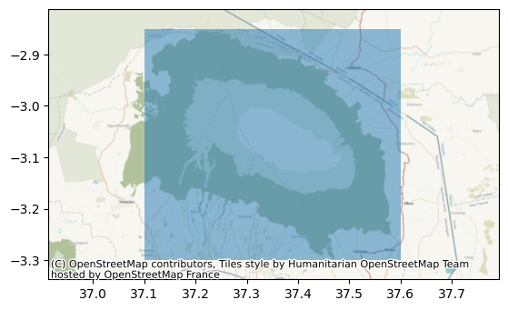

# Common raster operations

# Creating a raster mosaic with `rioxarray`

Merging raster files


```python
import xarray as xr 
import os 
import rioxarray as rxr 
from rioxarray.merge import merge_datasets
```


```python
bucket = "https://a3s.fi/swift/v1/AUTH_0914d8aff9684df589041a759b549fc2/PythonGIS"

# Generate urls for the elevation files
urls = [
    os.path.join(bucket, "elevation/kilimanjaro/ASTGTMV003_S03E036_dem.tif"),
    os.path.join(bucket, "elevation/kilimanjaro/ASTGTMV003_S03E037_dem.tif"),
    os.path.join(bucket, "elevation/kilimanjaro/ASTGTMV003_S04E036_dem.tif"),
    os.path.join(bucket, "elevation/kilimanjaro/ASTGTMV003_S04E037_dem.tif"),
]

# Read the files
datasets = [
    xr.open_dataset(url, engine="rasterio").squeeze("band", drop=True) for url in urls
]
```


```python
print(datasets[0])
```

    <xarray.Dataset> Size: 52MB
    Dimensions:      (x: 3601, y: 3601)
    Coordinates:
      * x            (x) float64 29kB 36.0 36.0 36.0 36.0 ... 37.0 37.0 37.0 37.0
      * y            (y) float64 29kB -2.0 -2.0 -2.001 -2.001 ... -2.999 -3.0 -3.0
        spatial_ref  int64 8B ...
    Data variables:
        band_data    (y, x) float32 52MB ...


```python
fig, axes = plt.subplots(2, 2, figsize=(16, 16))

# Plot the tiles to see how they look separately
datasets[0]["band_data"].plot(ax=axes[0][0], vmax=5900, add_colorbar=False)
datasets[1]["band_data"].plot(ax=axes[0][1], vmax=5900, add_colorbar=False)
datasets[2]["band_data"].plot(ax=axes[1][0], vmax=5900, add_colorbar=False)
datasets[3]["band_data"].plot(ax=axes[1][1], vmax=5900, add_colorbar=False)
```


    <matplotlib.collections.QuadMesh at 0x7f99d2f3c4a0>


    

    


>combine the four into a mosaic


```python
mosaic = merge_datasets(datasets)
mosaic = mosaic.rename({"band_data":"elevation"})
```

    /nix/store/dabb6lrwhq8gr8gpjhqysim6wpwgj9yl-python3-3.12.7-env/lib/python3.12/site-packages/IPython/core/interactiveshell.py:3577: SerializationWarning: saving variable None with floating point data as an integer dtype without any _FillValue to use for NaNs
      exec(code_obj, self.user_global_ns, self.user_ns)


```python
mosaic["elevation"].plot(figsize=(12,12))
```


    <matplotlib.collections.QuadMesh at 0x7f99a943dbb0>


    

    


# Clipping rasters

>Create GeoDataFrame with bounding box for clipping


```python
import geopandas as gpd 
from shapely import box 
import contextily as ctx

minx = 37.1
miny = -3.3
maxx = 37.6
maxy = -2.85

geom = box(minx, miny, maxx, maxy)
clipping_gdf = gpd.GeoDataFrame({"geometry": [geom]}, index=[0], crs="epsg:4326")

ax = clipping_gdf.plot(alpha=0.5)
ctx.add_basemap(ax, crs=clipping_gdf.crs, reset_extent=False);
```


    

    


>Clip the mosaic


```python
kilimanjaro = mosaic.rio.clip(clipping_gdf.geometry, 
                              crs=mosaic.elevation.rio.crs)
kilimanjaro["elevation"].plot()
```


    <matplotlib.collections.QuadMesh at 0x7f99990642f0>


    

    


```python
print(kilimanjaro)
```

    <xarray.Dataset> Size: 12MB
    Dimensions:      (x: 1800, y: 1620)
    Coordinates:
      * x            (x) float64 14kB 37.1 37.1 37.1 37.1 ... 37.6 37.6 37.6 37.6
      * y            (y) float64 13kB -2.85 -2.85 -2.851 ... -3.299 -3.299 -3.3
        spatial_ref  int64 8B 0
    Data variables:
        elevation    (y, x) float32 12MB 1.581e+03 1.581e+03 ... 1.295e+03 1.294e+03


```python

```
