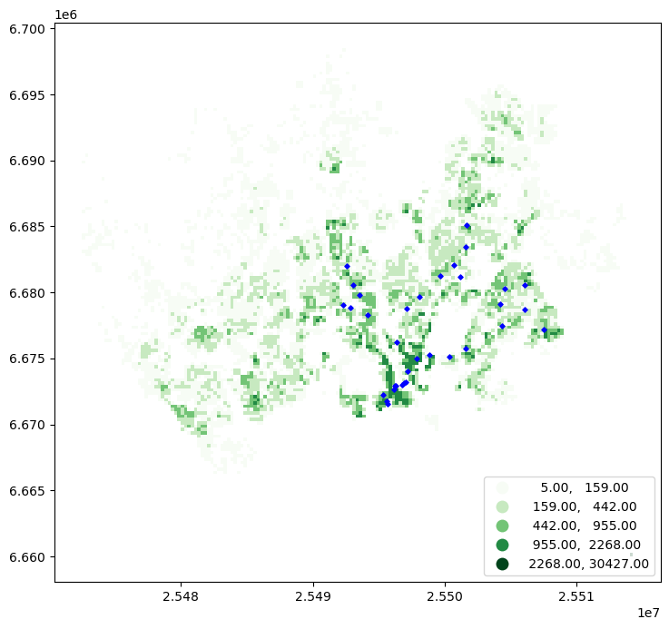
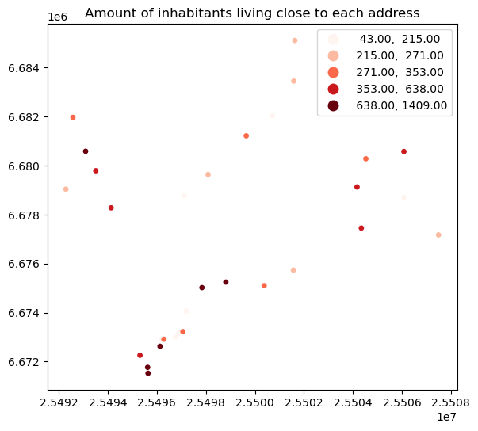

# Spatial Join

Combining information between data layers.

Options: 
- Spatial predicates determine the relationship
  - `within`
  - `intersects` (default)
  - `contains`
  - `covered_by`
  - `crosses`
  - `overlaps`
  - `touches`
  - etc.
- Join type to determine what data is selected
  - inner (default)
  - left outer
  - right outer


# Spatial join in Python

Join geocoded addresses with a population grid


```python
import geopandas as gpd 

addr_fp = "data/ch6/Helsinki/addresses.shp"
addresses = gpd.read_file(addr_fp)
print(addresses.head(2))
```

                                                 address    id  \
    0  Ruoholahti, 14, Itämerenkatu, Ruoholahti, Läns...  1000   
    1  Kamppi, 1, Kampinkuja, Kamppi, Eteläinen suurp...  1001   
    
                                           addr                   geometry  
    0  Itämerenkatu 14, 00101 Helsinki, Finland   POINT (24.91556 60.1632)  
    1     Kampinkuja 1, 00100 Helsinki, Finland  POINT (24.93166 60.16905)  


```python
pop_grid_fp = "data/ch6/Helsinki/Population_grid_2021_HSY.gpkg"
pop_grid = gpd.read_file(pop_grid_fp)
print(pop_grid.head(2))
```

                               id  inhabitants  occupancy_rate  \
    0  Vaestotietoruudukko_2021.1            5           50.60   
    1  Vaestotietoruudukko_2021.2            7           36.71   
    
                                                geometry  
    0  POLYGON ((25472499.995 6689749.005, 25472499.9...  
    1  POLYGON ((25472499.995 6685998.998, 25472499.9...  


```python
pop_grid.shape
```


    (5853, 4)


## Prepare for the join

- Ensure idential CRS
- Visualize the data


```python
print(f"{addresses.crs.name=}")
print(f"{pop_grid.crs.name=}")
```

    addresses.crs.name='WGS 84'
    pop_grid.crs.name='ETRS89 / GK25FIN'


```python
addresses.crs == pop_grid.crs
```


    False


> Reproject


```python
addresses = addresses.to_crs(crs=pop_grid.crs)
addresses.crs == pop_grid.crs
```


    True


> Visualize

How are the inhabitants distributed over the region? Do the addresses intersect with the grid?


```python
print(pop_grid.columns)
```

    Index(['id', 'inhabitants', 'occupancy_rate', 'geometry'], dtype='object')


```python
%matplotlib inline
import matplotlib.pyplot as plt 

ax = pop_grid.plot(
    column = "inhabitants", 
    cmap = "Greens", 
    scheme="naturalbreaks", 
    k=5, 
    legend=True, 
    legend_kwds={"loc": "lower right"}, 
    figsize=(10,8)
)

ax = addresses.plot(ax=ax, color="blue", markersize=7, marker="D");
```


    

    


# Join the layers


```python
join = addresses.sjoin(
    pop_grid, 
    predicate="within", 
    how="inner"
)
print(join.head(2))
print(f"{join.columns=}")
print(f"{join.shape=}")
```

                                                 address  id_left  \
    0  Ruoholahti, 14, Itämerenkatu, Ruoholahti, Läns...     1000   
    1  Kamppi, 1, Kampinkuja, Kamppi, Eteläinen suurp...     1001   
    
                                           addr                          geometry  \
    0  Itämerenkatu 14, 00101 Helsinki, Finland  POINT (25495311.608 6672258.695)   
    1     Kampinkuja 1, 00100 Helsinki, Finland  POINT (25496206.216 6672909.016)   
    
       index_right                       id_right  inhabitants  occupancy_rate  
    0         3262  Vaestotietoruudukko_2021.3263          505           14.01  
    1         3381  Vaestotietoruudukko_2021.3382          172           27.67  
    join.columns=Index(['address', 'id_left', 'addr', 'geometry', 'index_right', 'id_right',
           'inhabitants', 'occupancy_rate'],
          dtype='object')
    join.shape=(31, 8)


```python
print(join.head(2))
```

                                                 address  id_left  \
    0  Ruoholahti, 14, Itämerenkatu, Ruoholahti, Läns...     1000   
    1  Kamppi, 1, Kampinkuja, Kamppi, Eteläinen suurp...     1001   
    
                                           addr                          geometry  \
    0  Itämerenkatu 14, 00101 Helsinki, Finland  POINT (25495311.608 6672258.695)   
    1     Kampinkuja 1, 00100 Helsinki, Finland  POINT (25496206.216 6672909.016)   
    
       index_right                       id_right  inhabitants  occupancy_rate  
    0         3262  Vaestotietoruudukko_2021.3263          505           14.01  
    1         3381  Vaestotietoruudukko_2021.3382          172           27.67  


```python
ax = join.plot(
    column="inhabitants", 
    cmap="Reds", 
    markersize=15, 
    scheme="quantiles", 
    legend=True, 
    figsize=(10,6)
)
ax.set_title("Amount of inhabitants living close to each address");
```


    

    


> Check for lost data


```python
len(addresses) - len(join)
```


    3


> This interactive map will not show in my notes


```python
#m = pop_grid.explore(
#    color="blue", 
#    style_kwds=dict(color="blue", stroke=False)
#)
#addresses.explore(m=m, color="red")
```

Some points are outside of polygons.


```python
import pandas as pd 
pd.set_option("display.max_rows", 7)
```


```python
left_join = addresses.sjoin(pop_grid, predicate="within", how="left")
print(left_join.head(6))
```

                                                 address  id_left  \
    0  Ruoholahti, 14, Itämerenkatu, Ruoholahti, Läns...     1000   
    1  Kamppi, 1, Kampinkuja, Kamppi, Eteläinen suurp...     1001   
    2  Bangkok9, 8, Kaivokatu, Keskusta, Kluuvi, Etel...     1002   
    3  Hermannin rantatie, Verkkosaari, Kalasatama, S...     1003   
    4  9, Tyynenmerenkatu, Jätkäsaari, Länsisatama, E...     1005   
    5  18, Kontulantie, Kontula, Mellunkylä, Itäinen ...     1006   
    
                                                addr  \
    0       Itämerenkatu 14, 00101 Helsinki, Finland   
    1          Kampinkuja 1, 00100 Helsinki, Finland   
    2           Kaivokatu 8, 00101 Helsinki, Finland   
    3  Hermannin rantatie 1, 00580 Helsinki, Finland   
    4     Tyynenmerenkatu 9, 00220 Helsinki, Finland   
    5        Kontulantie 18, 00940 Helsinki, Finland   
    
                               geometry  index_right  \
    0  POINT (25495311.608 6672258.695)       3262.0   
    1  POINT (25496206.216 6672909.016)       3381.0   
    2  POINT (25496762.723 6673010.538)       3504.0   
    3  POINT (25498815.415 6675246.744)       3845.0   
    4  POINT (25495641.151 6671525.076)       3310.0   
    5  POINT (25504528.607 6680282.118)       5058.0   
    
                            id_right  inhabitants  occupancy_rate  
    0  Vaestotietoruudukko_2021.3263        505.0           14.01  
    1  Vaestotietoruudukko_2021.3382        172.0           27.67  
    2  Vaestotietoruudukko_2021.3505         43.0           61.44  
    3  Vaestotietoruudukko_2021.3846        757.0           33.98  
    4  Vaestotietoruudukko_2021.3311       1402.0           29.76  
    5  Vaestotietoruudukko_2021.5059        283.0           20.51  


```python
left_join.shape
```


    (34, 8)


> Which addresses aren't in the polygons?


```python
print(left_join.loc[left_join["inhabitants"].isnull()])
```

                                                  address  id_left  \
    9   Sodexo, 5, Atomitie, Strömberg, Pitäjänmäen te...     1010   
    18  6, Ratapihantie, Itä-Pasila, Pasila, Keskinen ...     1019   
    21  Tattariharjuntie, Ala-Malmi, Malmi, Koillinen ...     1022   
    
                                             addr  \
    9         Atomitie 5, 00370 Helsinki, Finland   
    18    Ratapihantie 6, 00101 Helsinki, Finland   
    21  Tattariharjuntie, 00700 Helsinki, Finland   
    
                                geometry  index_right id_right  inhabitants  \
    9   POINT (25492851.783 6678869.234)          NaN      NaN          NaN   
    18     POINT (25496358.8 6676198.28)          NaN      NaN          NaN   
    21  POINT (25501142.787 6681208.443)          NaN      NaN          NaN   
    
        occupancy_rate  
    9              NaN  
    18             NaN  
    21             NaN  


```python

```
