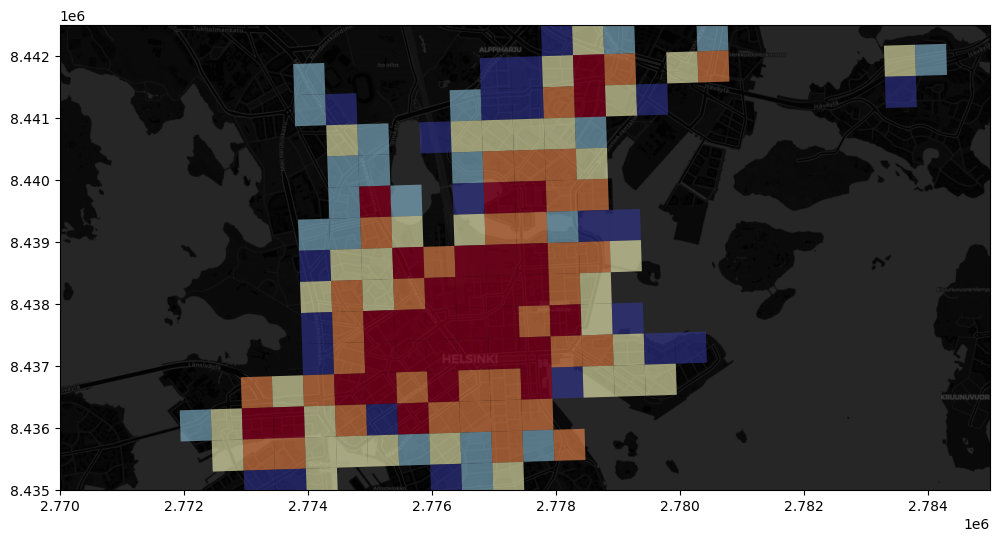

# Static Maps


```python
import geopandas as gpd 
from pyproj import CRS
```


```python
%matplotlib inline
import matplotlib.pyplot as plt 
import contextily as ctx
import plotly.express as px
```


```python
grid_fp = "data/ch8/TravelTimes_to_5975375_RailwayStation.shp"
roads_fp = "data/ch8/roads.shp"
metro_fp = "data/ch8/metro.shp"

grid = gpd.read_file(grid_fp)
roads = gpd.read_file(roads_fp)
metro = gpd.read_file(metro_fp)

print(roads.crs, metro.crs, grid.crs)
```

    EPSG:2392 EPSG:2392 EPSG:3067


>Check the name of the crs


```python
print(f"Roads crs: {CRS(roads.crs).name}")
print(f"Metro crs: {CRS(metro.crs).name}")
print(f"Grid crs: {CRS(grid.crs).name}")
```

    Roads crs: KKJ / Finland zone 2
    Metro crs: KKJ / Finland zone 2
    Grid crs: ETRS89 / TM35FIN(E,N)


```python
roads = roads.to_crs(crs=grid.crs)
metro = metro.to_crs(crs=grid.crs)
roads.crs == metro.crs == grid.crs
```


    True


```python
fig = px.choropleth_map()
```


```python
ax = grid.plot(column="car_r_t", 
               scheme='quantiles', 
               linewidth=0.03,
               k=9, cmap="Spectral", 
               alpha=0.9, 
               figsize=(12,8))
roads.plot(ax=ax, color="grey", linewidth=2)
metro.plot(ax=ax, color="cyan", linewidth=2.5)

plt.tight_layout()
plt.savefig("images/static_map.png", dpi=300)
plt.show()
```


    

    


```python
fix, ax = plt.subplots(figsize=(6,4))

grid.plot(
    ax=ax, 
    column="car_r_t", 
    cmap="Spectral", 
    legend=True,
    legend_kwds={"label": "Travel time (mins"}, 
    linewidth=0.5, 
    alpha=0.8
)

plt.tight_layout();
```


    

    


# Map legend for classification


```python
fig, ax = plt.subplots(figsize=(10, 5))

# Visualize the travel times into 9 classes using "Quantiles" classification scheme
grid.plot(
    ax=ax,
    column="car_r_t",
    linewidth=0.03,
    cmap="Spectral",
    scheme="quantiles",
    k=9,
    legend=True,
)

# Re-position the legend and set a title
ax.get_legend().set_bbox_to_anchor((1.3, 1))
ax.get_legend().set_title("Travel time (min)")

# Remove the empty white-space around the axes
plt.tight_layout()
```


    

    


# Adding basemap

remember to match crs


```python
print(grid.crs)
```

    EPSG:3067


>convert to Web Mercator EPSG:3857


```python
data = grid.to_crs(3857)
```


```python
print(data.crs)
```

    EPSG:3857


```python
print(data.head(2))
```

       car_m_d  car_m_t  car_r_d  car_r_t  from_id  pt_m_d  pt_m_t  pt_m_tt  \
    0    32297       43    32260       48  5785640   32616     116      147   
    1    32508       43    32471       49  5785641   32822     119      145   
    
       pt_r_d  pt_r_t  pt_r_tt    to_id  walk_d  walk_t  \
    0   32616     108      139  5975375   32164     459   
    1   32822     111      133  5975375   29547     422   
    
                                                geometry  
    0  POLYGON ((2767221.646 8489079.101, 2766716.966...  
    1  POLYGON ((2767726.329 8489095.521, 2767221.646...  


```python
fig, ax = plt.subplots(figsize=(12,8))

data.plot(
    ax=ax,
    column="pt_r_t", 
    cmap="RdYlBu", 
    linewidth=0.3, 
    scheme="quantiles", 
    k=9, 
    alpha=0.6,
)
ctx.add_basemap(ax);
```


    

    


# Data source providers


```python
dir(ctx.providers)
```


    ['AzureMaps',
     'BaseMapDE',
     'BasemapAT',
     'CartoDB',
     'CyclOSM',
     'Esri',
     'FreeMapSK',
     'Gaode',
     'GeoportailFrance',
     'HERE',
     'HEREv3',
     'HikeBike',
     'Jawg',
     'JusticeMap',
     'MapBox',
     'MapTiler',
     'MapTilesAPI',
     'MtbMap',
     'NASAGIBS',
     'NLS',
     'OPNVKarte',
     'OneMapSG',
     'OpenAIP',
     'OpenFireMap',
     'OpenRailwayMap',
     'OpenSeaMap',
     'OpenSnowMap',
     'OpenStreetMap',
     'OpenTopoMap',
     'OpenWeatherMap',
     'OrdnanceSurvey',
     'SafeCast',
     'Stadia',
     'Strava',
     'SwissFederalGeoportal',
     'Thunderforest',
     'TomTom',
     'TopPlusOpen',
     'USGS',
     'WaymarkedTrails',
     'nlmaps']


```python
fig, ax = plt.subplots(figsize=(12,8))

data.plot(
    ax=ax,
    column="pt_r_t", 
    cmap="RdYlBu", 
    linewidth=0.3, 
    scheme="quantiles", 
    k=9, 
    alpha=0.6,
)
ctx.add_basemap(ax, source=ctx.providers.CartoDB.PositronOnlyLabels);
```


    

    


```python
# Control figure size in here
fig, ax = plt.subplots(figsize=(12, 8))

# Plot the data
data.plot(
    ax=ax,
    column="pt_r_t",
    cmap="RdYlBu",
    linewidth=0,
    scheme="quantiles",
    k=9,
    alpha=0.6,
)

# Add basemap with basic OpenStreetMap visualization
ctx.add_basemap(ax, source=ctx.providers.OpenStreetMap.Mapnik)
```


    

    


```python
# Control figure size in here
fig, ax = plt.subplots(figsize=(12, 8))

# Subset the data to seel only grid squares near the destination
subset = data.loc[(data["pt_r_t"] >= 0) & (data["pt_r_t"] <= 15)]

# Plot the data from subset
subset.plot(
    ax=ax,
    column="pt_r_t",
    cmap="RdYlBu",
    linewidth=0,
    scheme="quantiles",
    k=5,
    alpha=0.6,
)

# Add basemap with `OSM_A` style
ctx.add_basemap(ax, source=ctx.providers.OpenStreetMap.Mapnik);
```


    

    


>Change zoom level 
>- defaults to auto
>- can set from 1-19, higher being more detailed
>- can lose too much detail


```python
# Control figure size in here
fig, ax = plt.subplots(figsize=(12, 8))

# Plot the data from subset
subset.plot(
    ax=ax,
    column="pt_r_t",
    cmap="RdYlBu",
    linewidth=0,
    scheme="quantiles",
    k=5,
    alpha=0.6,
)

# Add basemap with `OSM_A` style using zoom level of 11
ctx.add_basemap(ax, zoom=11, source=ctx.providers.OpenStreetMap.Mapnik)
```


    

    


```python
# Control figure size in here
fig, ax = plt.subplots(figsize=(12, 8))

# Plot the data from subset
subset.plot(
    ax=ax,
    column="pt_r_t",
    cmap="RdYlBu",
    linewidth=0,
    scheme="quantiles",
    k=5,
    alpha=0.6,
)

# Add basemap with `OSM_A` style using zoom level of 11
ctx.add_basemap(ax, zoom=11, source=ctx.providers.OpenStreetMap.HOT);
```


    

    


>Clipping


```python
credits = "Travel time data by Tenkanen & Toivonen (2020), Map Data © OpenStreetMap contributors"
```


```python
# Control figure size in here
fig, ax = plt.subplots(figsize=(12, 8))

# Plot the data
data.plot(
    ax=ax,
    column="pt_r_t",
    cmap="RdYlBu",
    linewidth=0,
    scheme="quantiles",
    k=9,
    alpha=0.6,
)

# Add basemap with `OSM_A` style using zoom level of 11
# Modify the attribution
ctx.add_basemap(
    ax, zoom=11, attribution=credits, source=ctx.providers.OpenStreetMap.Mapnik
)

# Crop the figure
ax.set_xlim(2760000, 2800000)
ax.set_ylim(8430000, 8470000);
```


    

    


# CartoDB

[Reference](https://github.com/CartoDB/basemap-styles#1-web-raster-basemaps)

'https://{s}.basemaps.cartocdn.com/{style}/{z}/{x}/{y}{scale}.png' where:

    {s}: one of the available subdomains, either [a,b,c,d]

    {z} : Zoom level. We support from 0 to 20 zoom levels in OSM tiling system.

    {x},{y}: Tile coordinates in OSM tiling system

    {scale}: OPTIONAL “@2x” for double resolution tiles

    {style}: Map style, possible value is one of:
        light_all,
        dark_all,
        light_nolabels,
        light_only_labels,
        dark_nolabels,
        dark_only_labels,
        rastertiles/voyager,
        rastertiles/voyager_nolabels,
        rastertiles/voyager_only_labels,
        rastertiles/voyager_labels_under


```python
cdb_url = "https://a.basemaps.cartocdn.com/%s/{z}/{x}/{y}.png" % style
```


```python
def cdb_plot(data, style):
    url = "https://a.basemaps.cartocdn.com/" + style + "/{z}/{x}/{y}.png"
    fig, ax = plt.subplots(figsize=(12,8))

    data.plot(
        ax=ax,
        column="pt_r_t",
        cmap="RdYlBu",
        linewidth=0,
        scheme="quantiles",
        k=5,
        alpha=0.6,
    )
    ctx.add_basemap(ax, zoom=14, attribution="", source=url)
    ax.set_xlim(2770000, 2785000)
    ax.set_ylim(8435000, 8442500)
```


```python
style = "rastertiles/voyager"
cdb_plot(subset, style)
```


    

    


```python
style = "dark_all"
cdb_plot(subset, style)
```


    

    


# Data reclassification

>Classification based on travel time
>
>Find apartments less than 30 minutes from work and less than
>1000 € per month

    Use classification schemes from the PySAL mapclassify library to classify travel times into multiple classes.

    Create a custom classifier to classify travel times and distances in order to find out good locations to buy an apartment with these conditions:

        good public transport accessibility to city center

        bit further away from city center where the prices are presumably lower


>Clasification Schemes

    Box_Plot
    Equal_Interval
    Fisher_Jenks
    Fisher_Jenks_Sampled
    HeadTail_Breaks
    Jenks_Caspall
    Jenks_Caspall_Forced
    Jenks_Caspall_Sampled
    Max_P_Classifier
    Maximum_Breaks
    Natural_Breaks
    Quantiles
    Percentiles
    Std_Mean
    User_Defined


```python
import geopandas as gpd 
acc = data.copy()
print(acc.head())
```

       car_m_d  car_m_t  car_r_d  car_r_t  from_id  pt_m_d  pt_m_t  pt_m_tt  \
    0    32297       43    32260       48  5785640   32616     116      147   
    1    32508       43    32471       49  5785641   32822     119      145   
    2    30133       50    31872       56  5785642   32940     121      146   
    3    32690       54    34429       60  5785643   33233     125      150   
    4    31872       42    31834       48  5787544   32127     109      126   
    
       pt_r_d  pt_r_t  pt_r_tt    to_id  walk_d  walk_t  \
    0   32616     108      139  5975375   32164     459   
    1   32822     111      133  5975375   29547     422   
    2   32940     113      133  5975375   29626     423   
    3   33233     117      144  5975375   29919     427   
    4   32127     101      121  5975375   31674     452   
    
                                                geometry  
    0  POLYGON ((2767221.646 8489079.101, 2766716.966...  
    1  POLYGON ((2767726.329 8489095.521, 2767221.646...  
    2  POLYGON ((2768231.014 8489111.905, 2767726.329...  
    3  POLYGON ((2768735.702 8489128.255, 2768231.014...  
    4  POLYGON ((2765724.126 8488524.148, 2765219.488...  


`pt_r_tt` is time to the city center 
`walk_d` is distance by roads to the center
`NoData` is -1


```python
acc = acc.loc[acc["pt_r_tt"] >= 0]
```


```python
import matplotlib.pyplot as plt

def accPlot(data,column):
    data.plot(
        column=column, 
        scheme="Natural_Breaks",
        k=9, 
        cmap="RdYlBu", 
        linewidth=0, 
        legend=True
    )
    plt.tight_layout()

accPlot(acc, "pt_r_tt")
```


    

    


```python
accPlot(acc, "walk_d")
```


    

    


# Applying Classifiers


```python
import mapclassify
```


```python
mapclassify.NaturalBreaks(y=acc["pt_r_tt"], k=9)
```


    NaturalBreaks
    
        Interval       Count
    ------------------------
    [  0.00,  30.00] |   837
    ( 30.00,  42.00] |  2088
    ( 42.00,  53.00] |  2545
    ( 53.00,  63.00] |  1932
    ( 63.00,  74.00] |  1581
    ( 74.00,  87.00] |  1737
    ( 87.00, 102.00] |  1209
    (102.00, 125.00] |   865
    (125.00, 199.00] |   226


```python
mapclassify.Quantiles(y=acc["pt_r_tt"])
```


    Quantiles
    
        Interval       Count
    ------------------------
    [  0.00,  41.00] |  2674
    ( 41.00,  52.00] |  2576
    ( 52.00,  66.00] |  2623
    ( 66.00,  85.00] |  2616
    ( 85.00, 199.00] |  2531


```python
classifier = mapclassify.NaturalBreaks(y=acc["pt_r_tt"], k=9)
type(classifier)
```


    mapclassify.classifiers.NaturalBreaks


```python
classifier.bins
```


    array([ 31.,  43.,  54.,  66.,  77.,  89., 103., 125., 199.])


>The classifier must be initialized with `make()`


```python
classifier = mapclassify.NaturalBreaks.make(k=9)
```


```python
type(classifier)
```


    function


```python
classifications = acc[["pt_r_tt"]].apply(classifier)

print(classifications.head())
```

       pt_r_tt
    0        8
    1        8
    2        8
    3        8
    4        7


```python
classifications.shape
```


    (13020, 1)


```python
type(classifications)
```


    pandas.core.frame.DataFrame


```python
acc["nb_pt_r_tt"] = acc[["pt_r_tt"]].apply(classifier)
print(acc[["pt_r_tt", "nb_pt_r_tt"]].head())
```

       pt_r_tt  nb_pt_r_tt
    0      139           8
    1      133           8
    2      133           8
    3      144           8
    4      121           7


```python
acc.plot(column="nb_pt_r_tt", linewidth=0, legend=True)
plt.tight_layout();
```


    

    


```python

```
